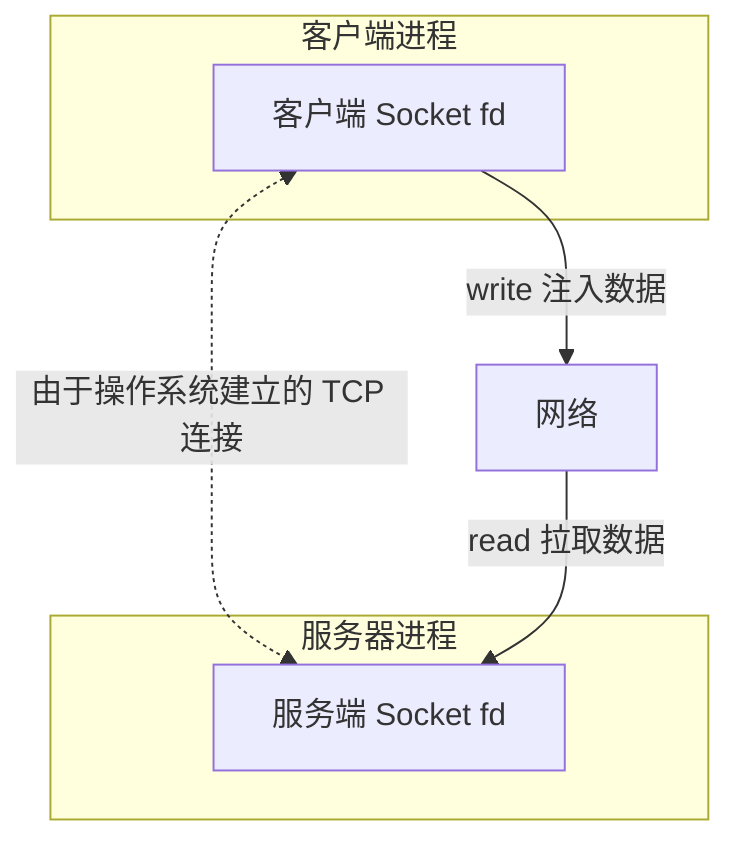
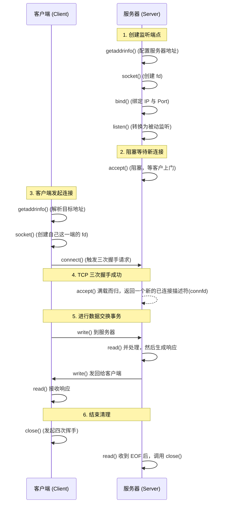

## 目录
- [[#什么是套接字接口（Sockets Interface）]]
- [[#套接字地址结构]]
- [[#套接字函数：核心流程解析]]
  - [[#socket 函数]]
  - [[#connect 函数 (客户端)]]
  - [[#bind 函数 (服务器)]]
  - [[#listen 函数 (服务器)]]
  - [[#accept 函数 (服务器)]]
- [[#主机和服务的转换：getaddrinfo]]
- [[#套接字接口的辅助函数（CSAPP提供）]]
- [[#💡 架构师视角映射]]
- [[#🔭 深挖指南]]

---

## 什么是套接字接口（Sockets Interface）

**套接字接口是一组系统级别的函数，它们和传统的 Unix I/O 函数结合起来，用以创建所有的网络应用。**

对于 Unix 内核来说，**套接字（Socket）就是通信的端点（Endpoint）**。
在应用程序的眼里，套接字就是一个具有相应描述符的打开文件（这也是一切皆文件哲学的体现）。



---

## 套接字地址结构

在 C 语言中传递套接字地址结构有一个非常恼人的历史遗留设计。
当时 C 语言还没有 `void *` 这种通用指针，网络开发者为了设计接受任意特定协议架构（如 IPv4、IPv6 等）的函数，定义了一个**通用的套接字地址结构** `sockaddr`，并要求所有具体协议都强制转换 (cast) 过去的这个通用结构体会作为函数的参数。

```c
// 通用的套接字地址结构 (给 bind, connect 等函数强制转换用的)
struct sockaddr {
    uint16_t  sa_family;    // 协议族类型 (如 AF_INET, AF_INET6)
    char      sa_data[14];  // 地址数据 (不透明的字节)
};

// 特定于 IPv4 的套接字地址结构 (程序员填充这个)
struct sockaddr_in {
    uint16_t        sin_family;  // 地址族 (始终是 AF_INET)
    uint16_t        sin_port;    // 16位端口号 (网络字节序！)
    struct in_addr  sin_addr;    // 32位IP地址 (网络字节序！)
    unsigned char   sin_zero[8]; // 填充成和 sockaddr 一样大
};
```

> 类比：`struct sockaddr` 就是一个泛型的`Object`参数，而 `struct sockaddr_in` 是一把实打实的“家用钥匙”（具有专门齿痕）。由于接口被设计接收`Object`，我们每次传递家用钥匙时，必须打上类型强转的外衣 `(struct sockaddr *) &serveraddr`。

---

## 套接字函数：核心流程解析

下面这张图是**网络编程中最最核心的心智模型**。不论是 C 的 Linux 原生 API、Java 的 NIO，还是 Python 的 asyncio，背后的逻辑一模一样！



### socket 函数
创建套接字描述符：
```c
int clientfd = socket(AF_INET, SOCK_STREAM, 0); 
```
`AF_INET` 表示 IPv4。`SOCK_STREAM` 表示这是 TCP 连接端点。此时返回的是一个孤立的活动态描述符，它还不能直接读写。

### connect 函数 (客户端)
```c
int connect(int clientfd, const struct sockaddr *addr, socklen_t addrlen);
```
在底层，它会触发到远端服务器的**TCP 三次握手 (Three-way handshake)**！如果成功，`clientfd` 就变成了可以被读写的连接管道。

### bind 函数 (服务器)
```c
int bind(int sockfd, const struct sockaddr *addr, socklen_t addrlen);
```
内核："你想用哪个端口监听？"
服务器程序员："把我的 `sockfd` 和特定的 `(IP的结构体 : 端口的数值)` 锚定在一起"。

### listen 函数 (服务器)
```c
int listen(int sockfd, int backlog);
```
内核默认将 socket 视为“主动发起连接”的客户端 socket。调用 `listen` 会将其状态转化为**监听套接字（Listening Socket）**，这样它能够接收来自客户端的连接请求。
`backlog` 告诉内核："在我调用 accept 把它拿走前，最多允许有几个连接请求排队等着"。

### accept 函数 (服务器)
这是网络服务器中最难理解的概念：**监听描述符与已连接描述符的区别**。

```c
int accept(int listenfd, struct sockaddr *addr, int *addrlen);
// 成功时返回 非负连接文件描述符 (connfd)
```

1. **监听描述符（listenfd）**：是在服务器生命周期中只创建一次的一扇"大门"，永远存在，它负责接收呼叫等待。
2. **已连接描述符（connfd）**：当 accept 发现"大门"积攒了一对成功的 TCP 三次握手记录，就会专门为了这个客户端创建一条一比一的"私密电话线"。处理完这个客户端的需求，这根电话线（connfd）就会 close 掉丢弃。

> 类比：你是一家大酒店的老板。`listenfd` 就是在大门口拉客的大堂经理。有客人（客户端）来了，大堂经理把客人领进门，然后召唤来一名**专员**带客人去包厢服务（创建一个 `connfd` 服务他）。带走后，大堂经理 `listenfd` 立刻倒回酒店门口，继续等待接下个客人。
> CS 术语：这种设计允许多个客户端并发对服务器建构读写连接，而这多条并行的 `connfd` 可以全靠唯一的一个用来引流的 `listenfd` 生成。

---

## 主机和服务的转换：getaddrinfo

现代网络编程不推荐手动填充 sockaddr，也不推荐用旧函数（`gethostbyname`）。POSIX 提供了可重入、同时支持 IPv4/IPv6，并将 DNS 和 服务名称结合的超级函数：**`getaddrinfo`**。

```c
// 此函数极其复杂，将主机名(如 google.com)与服务名(如 http或80)翻译为用于 socket/connect/bind 的地址结构！
int getaddrinfo(const char *host, const char *service, 
                const struct addrinfo *hints, struct addrinfo **result);
```
它能够遍历查找地址链表直到找到能成功连接的那一条，非常强大，使得我们写出的网络代码对底层协议做到与 IPv4/IPv6 解耦无关。但使用过于繁琐（在 Java 世界基本被 URL 类包装取代）。

---

## 套接字接口的辅助函数（CSAPP提供）

由于原始库函数包含太多的指针传递与内存分配检查错误，《深入理解计算机系统》封装了极具参考价值的辅助函数：

* **`open_clientfd(char *hostname, char *port)`**：自动帮助客户端完成 `getaddrinfo -> socket -> connect`，将建立好的有效客户端描述符作为结果返回。
* **`open_listenfd(char *port)`**：不仅执行 `getaddrinfo -> socket -> bind -> listen`，还包含处理地址复用选项 (`SO_REUSEADDR`) 的进阶问题。

---

## 💡 架构师视角映射

> [!info] 与 Java 后端的联系

**Java 阻塞式 I/O (BIO) 完全等价的对应关系**：
```java
// Java: ServerSocket() == C: socket() + bind() + listen()
ServerSocket serverSocket = new ServerSocket(8080); 

while(true) {
    // Java: accept() == C: accept()，这会阻塞线程直到客户端上门
    Socket connSocket = serverSocket.accept();  
    
    // 开辟新线程处理这个 connSocket (代表那个 connfd 私密电话线)
    new Thread(new Worker(connSocket)).start(); 
}
```

**SO_REUSEADDR（端口被占用的幕后黑手）**：
- CSAPP 强调了 `setsockopt` 中的 `SO_REUSEADDR` 控制位。
- 很多时候我们在 Windows/Linux 上重启 Spring Boot 服务时遇到过 `Address already in use: bind`。原因在于 TCP 的 四次挥手 后有一个 **TIME_WAIT** 状态会持续长达两分钟锁定端口。
- 开启 `SO_REUSEADDR` 是工业级服务器程序的标配，允许立即重新绑定这个端口。

**为什么 C 语言网络开发痛苦**：
- 在上面的交互图中，`C_Socket -> S_Socket` 的数据交换过程中夹杂了字节序列化、不足值 Short Count、TCP 分包黏包边界等大量细节。而这些在 Tomcat 和 Spring 家族都作为 Http Servlet API/Request 被封装成了对象，架构师不需要操作这层 Socket，但必须必须深刻洞悉底层是一层层流向并交由协议处理。

---

## 🔭 深挖指南

> [!tip] 核心知识点与延伸阅读
>
> **本节最重要的三点**：
> 1. **核心序列与生命周期**：客户端 (socket -> connect) 和 服务器 (socket -> bind -> listen -> accept) 。
> 2. **监听描述符与已连接描述符严格区分** (大堂经理 vs 专职服务员)。
> 3. **底层的 C 地址结构强制类型转换是网络编程繁琐的主因**。
>
> **深挖路径**：
> - 熟记并反复理解那一副“客户端与服务器 Socket API 交互图”，这比理解内存还重要。
> - *深入剖析：多路复用。为什么 Node.js / Nginx 不需要每个连接开一个多线程去处理 connfd？* 这涉及 `select` / `epoll` 调用（CSAPP 第 12 章 并发编程 会作为进阶解析此进阶版机制）。

---
