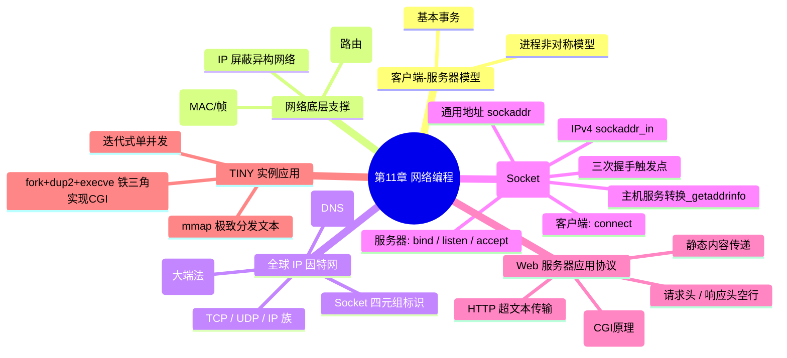

## 目录
- [[#知识全景图]]
- [[#核心概念速查表]]
- [[#系统调用速查]]
- [[#💡 架构师视角映射]]
- [[#🔭 章节回顾路径]]

---

## 知识全景图



---

## 核心概念速查表

| 概念 | 核心要点 |
|------|---------|
| 客户端与服务器 | 本质上都是独立的系统进程。网络交互是对系统资源提供请求服务的过程。 |
| 网络字节序 | 因特网通信统一规定网络大端法。程序依靠 `htons/htonl` 函数强制翻译适配不同机器内核架构。 |
| TCP 套接字四元组 | `(源IP, 源端口, 目标IP, 目标端口)`，依靠它作为全网唯一确定一条链接。 |
| socket 函数流（服务端）| 获取地址 -> `socket()`获取大门 -> `bind()`锚定地址端口 -> `listen()`变成等待接入状态 -> `accept()`发生响应分配接待员。 |
| 监听描述符 vs 已连接 | `listenfd` 服务器生命周期长存且单一，接客用的。 `connfd` 随着客户发起通讯瞬间由 `accept` 创建，用完被 `close` 掉。 |
| CGI 原型 | 服务器解析到运行程序，使用 `fork` 建分离进程，通过修改环境变量，运用 `dup2` 重定向显示流，并 `execve` 顶掉空间执行的究极绝技缝合。 |

---

## 系统调用速查

```c
字节序转换:
  htonl / htons        → 主机序转变为大端网络字节序 (IP, Prot结构体填充之前)
  ntohl / ntohs        → 从网络抓到的字符序变成本机适用整数序。

地址转换:
  inet_pton / ntop     → 字符串式IP(点分十进制) 与 整数式底层地址网络转换。
  getaddrinfo          → (极其强大) DNS寻址以及构造支持IPV4/V6无缝结合的方法链条建立准备工具。

Socket 函数:
  socket               → 创建套接字文件描述符 (仅仅是建立，尚未连接)
  connect              → (仅客户端) 向服务器触发 TCP 三次握手建立！
  bind                 → (仅服务器) 把 socket 和服务器本机的 IP Port 相关联结构绑定起来！
  listen               → (仅服务器) 使得 socket 能接受连接，不再主动发声！
  accept               → (仅服务器) 阻塞卡死直到三次握手有人请求到了，返回这个客户端一对一通讯的新 fd！
```

---

## 💡 架构师视角映射

> [!info] 第十一章知识在 Java 后端开发中的全映射

**1. "Tomcat 到底在干啥？" 一秒解密它的本质工作流：**
一切基于 JVM 的 MVC/Tomcat/Jetty 服务器内核，都在底层走本章节最标准的这套 `listen -> accept -> 读HTTP解析头部 -> is_static判断 -> (动态通过各种 Handler 函数调 / 静态发磁盘文件) -> flush response` 的流程。当理解 TINY 这个缩微版之后，你就彻底解构了它神秘的面纱；因为无论多复杂的框架无非是在 `is_static` 分支后面拓展出一千几百个分支的 Java 反射设计！

**2. 为什么 Nginx 比原生 Tomcat 快那么多？突破性能瓶颈！**
看了 11.6 对 TINY `mmap()` 的解读就明白！Nginx 处理静态资源是把操作交给 OS 层级利用 `sendfile` 与 `mmap` 的特性直写。而 Tomcat 是将请求拉入 Java 堆内再反射给 Servlet 再做文件 IO，经历 JVM 用户态与内核态转换。由此得出架构设计精髓：**静态资源坚决扔给 CDN 或者 Nginx 等边缘代理反转**，绝不可让 Java 这种重型装甲来扛静态图片等 I/O 活。

**3. 连接耗尽与微服务血案 (TIME_WAIT)：**
在微服务中如果某个被高频调用的模块使用的是 HTTP （例如 RestTemplate 的粗劣封装且没开 Keep-Alive）。这就等于每天调用数万次客户端 `socket -> connect -> close` 的代码块。这会在操作系统底层短时间留下茫茫多的等待销毁套接字从而把可用 `临时端口 (Ephemeral Ports)` 用光，打爆机器的整个网络通道抛开 `Cannot assign requested address` 错误。了解了 Socket 底层生命周期，我们就必须从上层应用代码层级去加入连接共享资源池（如 PoolingHttpClientConnectionManager）。

---

## 🔭 章节回顾路径

> [!tip] 复习优先级与深挖建议
>
> **面试高频及必须深耕考点**：
> 1. Socket API 的全套顺序逻辑与交互。（特别是 bind，listen，accept 哪个用来返回已连接的文件描述符！） → 见 [[11.4 套接字接口]]
> 2. TCP 可靠性与 HTTP 报文基本格式构成。 
>
> **与其他章节的深度联系**：
> - `[复习回溯]` CGI 的内核调度与系统应用，深刻复习 第8章（异常控制流中关于 fork 信号量的知识）和 第10章 (`dup2`描述符替换知识)。
> - `[前瞻突破]` 我们现在编写的网络依然具有大缺陷：比如阻塞死卡。请迈入 第12章 并发编程，那才是现在服务端工业级的基础：引出事件驱动。
>
> **推荐的延伸阅读领域**：
> - 绝对推荐的后端神书第一位：《Unix 网络编程》第一卷(套接字联网 API)。只有研读此书配合 Java NIO，你才会打通任督二脉看懂 Netty 源码。
> - 网络细节解析：《TCP/IP 详解卷 一 协议》。

---
