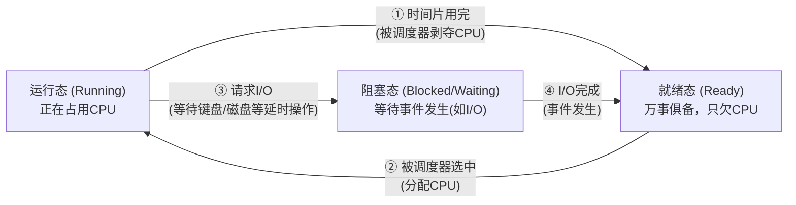

## 目录
- [[#进程模型]]
- [[#进程的创建与终止]]
- [[#进程的层次结构]]
- [[#进程状态与转换]]
- [[#进程控制块（PCB）]]
- [[#💡 架构师视角映射]]
- [[#🔍 深挖指南]]

---

## 进程模型

> [!question] 什么是进程？
> 现代计算机同时运行着无数个程序：浏览器、微信、IDE、后台服务。单核 CPU 一次只能执行一条指令，怎么做到"同时"运行？
> 答案是：**伪并行（Pseudoparallelism）** —— CPU 在多个程序之间飞速切换，让人产生"同时"的错觉

**进程（Process）** 是操作系统对**正在运行的程序**的抽象。
一个进程就是一个正在执行的程序的**实例**，包括：
1. **程序代码**（文本段）
2. **当前活动**（程序计数器 PC、寄存器内容）
3. **数据段**（全局变量）
4. **堆**（动态分配的内存）
5. **栈**（局部变量、函数调用的返回地址）


> 类比：**程序**就像是一个菜谱（写在纸上的指令），**进程**就像是厨师正在照着菜谱做菜的整个活动过程。菜谱是死的，做菜是活的；同一个菜谱可以有多个厨师同时做（多个进程运行同一个程序）
> CS 术语：进程是资源分配的**基本单位**

---

## 进程的创建与终止

### 进程的创建

导致进程创建的 4 种主要事件：
1. **系统初始化**（如 Linux 启动时的 `init` / `systemd` 进程）
2. **正在运行的进程执行了创建进程的系统调用**（如 UNIX 的 `fork()`)
3. **用户请求创建一个新进程**（双击图标、在终端输入命令）
4. **批处理作业初始化**

> [!info] UNIX 进程创建两步走：fork() + exec()
> 1. `pid = fork()`：父进程克隆出一个完全一样的子进程（连下一条指令都一样）
>    - 返回值处理：向父进程返回子进程的 PID，向子进程返回 0
> 2. `exec()`：子进程调用 `exec()` 用全新的程序替换掉自己的内存空间，开始执行新程序
>
> 为什么分两步？这样子进程可以继承父进程的环境变量、打开的文件描述符（如标准输入输出），然后 `exec` 虽然替换了内存，但保留了这些资源（典型应用：Shell 重定向）

### 进程的终止

导致进程终止的 4 种主要事件：
1. **正常退出**（自愿）：如程序的 `return 0` 或 `exit()`
2. **出错退出**（自愿）：编译器找不到源文件主动退出
3. **严重错误**（非自愿）：如除以零、段错误（访问非法内存）
4. **被其他进程杀死**（非自愿）：如 UNIX 的 `kill` 命令（发送信号）

---

## 进程的层次结构

```
UNIX 的进程树:

        init (PID=1)
       ┌──┴──┐
    sshd   login
     │       │
    bash   bash
     │       │
    ls       vim

Windows 的进程模型:
- 没有层次结构（没有严格的父子关系）
- 只有"句柄（Handle）"：父进程创建子进程后得到一个句柄，可以用来控制子进程。但句柄可以传递给其他进程 → 树形结构被打破
```

> [!tip] 孤儿进程 与 僵尸进程（UNIX 术语）
> - **孤儿进程**：父进程先死了，子进程还在运行。孤儿进程会被 `init`（PID 1）收养
> - **僵尸进程（Zombie）**：子进程死了，但父进程还没调用 `wait()` 获取它的退出状态。子进程的资源已释放，但还在进程表中占个坑（显示为 `Z` 状态）

---

## 进程状态与转换

进程在生命周期中会在三种基本状态之间切换：



> 类比：
> **运行态**：你在窗口前面办业务（占用 CPU）
> **就绪态**：你在队伍里排队，手里资料都准备好了（一切就绪），就等叫号（等 CPU）
> **阻塞态**：你办到一半发现少了个证件，只能去旁边等别人送过来（等 I/O 结果），这时候哪怕叫你号你也办不了

> [!warning] 状态转换的单向性
> 注意图中的箭头：**阻塞态不能直接转到运行态！** I/O 完成后，进程只是具备了运行条件，必须先回到"就绪队列"排队，等调度器选中才能运行

---

## 进程控制块（PCB）

操作系统如何管理那么多进程？靠维护一张**进程表（Process Table）**。
表中的每一项叫做**进程控制块（Process Control Block, PCB）** / 进程描述符。

```
PCB 中包含的信息（进程的"档案"）:

1. 进程管理相关:
   - 寄存器内容（PC、通用寄存器、状态字等）→ 用于上下文切换
   - 进程状态（运行/就绪/阻塞）
   - PID（进程标识符）
   - 优先级、调度参数

2. 存储管理相关:
   - 页表指针（指向该进程的页表）
   - 代码段、数据段、堆栈的位置

3. 文件管理相关:
   - 根目录、当前工作目录
   - 已打开的文件描述符表
   - 用户ID（UID）、组ID（GID）
```

### 上下文切换（Context Switch）

当进程 A 切换到进程 B 时，OS 必须：
1. **保存**进程 A 的硬件状态（把 CPU 寄存器的值寸入 A 的 PCB 中）
2. **恢复**进程 B 的硬件状态（从 B 的 PCB 中把值加载进 CPU 寄存器）
3. 切换内存映射（修改 MMU 和 TLB，指向 B 的页表）

> [!failure] 上下文切换的代价
> 上下文切换是**非常昂贵**的操作。除了保存/恢复寄存器的开销，最致命的是 **TLB 刷新和 Cache Miss**：换了新进程，之前缓存在 CPU L1/L2 里的数据和指令都没用了，全要从内存重新加载，导致切回后的几万条指令执行极其缓慢

---

## 💡 架构师视角映射

| 操作系统概念 | Java 后端映射 |
|------------|-------------|
| 进程 = 资源分配单位 | 一个运行的 JVM 就是一个操作系统的进程。在微服务架构中，一个 Spring Boot 实例就是一个独立进程 |
| 运行/就绪/阻塞状态 | Java 线程的生命周期状态：`RUNNABLE` (运行/就绪合并)，`BLOCKED` (锁阻塞)，`WAITING` (等待唤醒) |
| 上下文切换开销 | Java 并发编程为何要避免过多线程？为了减少上下文切换导致的 CPU 抖动；这也是 Virtual Thread（协程）诞生的核心原因 |
| PCB (进程控制块) | K8s 的 Pod 抽象；或 JVM 的 `java.lang.Thread` 对象内部维护的状态信息 |
| fork() + exec() | Docker 容器的启动：在已有 Namespace 的基础上替换可执行文件环境 |

---

## 🔍 深挖指南

> [!note] 核心要点
> 1. 进程是正在运行的程序的抽象，是资源分配的基本单位
> 2. 状态机的流转（运行↔就绪，运行→阻塞→就绪）是理解系统调度的核心
> 3. PCB 是操作系统的"账本"，上下文切换是昂贵但在多任务系统中必须付出的代价

- Linux 中的 PCB 结构长什么样？ → 参考内核源码 `include/linux/sched.h` 中的 `task_struct` 结构体（这是一个庞然大物！）
- fork() 和 exec() 的具体使用与陷阱 → 参考《UNIX 环境高级编程》(APUE) 第 8 章 "进程控制"
- 上下文切换的底层硬件指令级别实现 → 原书 2.1.8 节关于中断处理和调度的部分
