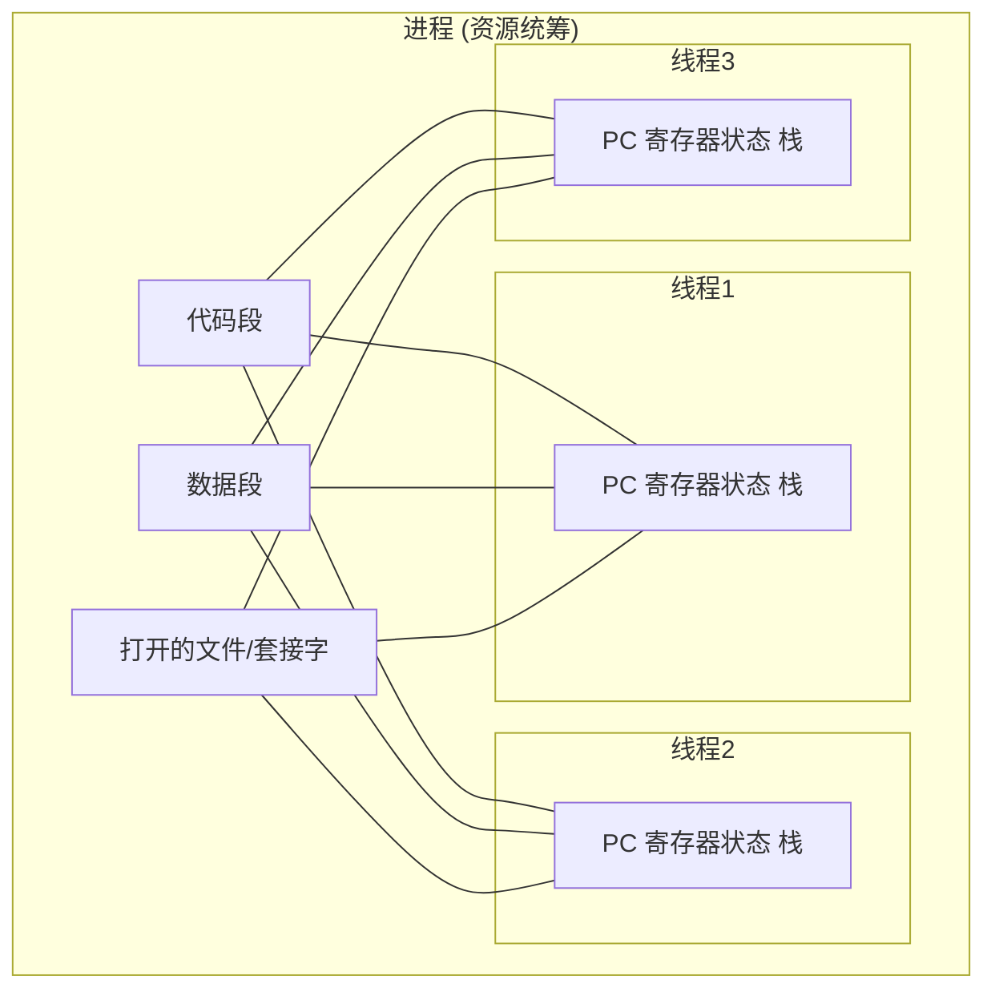

## 目录
- [[#为什么需要线程？]]
- [[#线程模型与共享资源]]
- [[#POSIX 线程（Pthreads）]]
- [[#线程的实现策略]]
	- [[#在用户空间中实现线程]]
	- [[#在内核中实现线程]]
	- [[#混合实现（多路复用）]]
- [[#💡 架构师视角映射]]
- [[#🔍 深挖指南]]

---

## 为什么需要线程？

> [!question] 进程的短板
> 进程之间有**严格的内存隔离**（独立的代码、数据、堆栈）
> 如果一个程序需要在同一个数据空间里并发执行多项任务（比如：一边读键盘，一边算表格，一边偷偷自动保存），用多个进程来实现会极其困难且低效（因为要用 IPC 传来传去，而且进程创建/切换开销大）

这时候需要一种能在**同一地址空间**内准并行执行的多个控制流 → **线程（Thread）**，它也被称为**轻量级进程（LWP）**。

使用线程的三大理由：
1. **共享数据更容易**：同一进程下的线程天然共享全局变量、打开的文件等
2. **创建和销毁更轻量（快 10~100 倍）**：不需要复制页表、不需要分配新的物理内存等
3. **性能提升（I/O 重叠 / 多核并行）**：一个线程阻塞（如等磁盘），其他线程可以继续干活；多核 CPU 上还能真正同时运行不同的线程

> 类比：**进程就像是一家公司**（独立的地址空间），**线程就像是公司里的打工人**。
> - 一家公司必须至少有一个员工（主线程）
> - 多招一个员工（创线程）比再开一家分公司（创进程）容易得多
> - 员工之间可以自由借用公司的打印机和会议室（共享内存），但也因此可能抢夺资源发生冲突（竞态条件）

---

## 线程模型与共享资源

| 在进程模型中 | 在线程模型中（同进程的所有线程共享） | 在线程模型中（每个线程独有） |
|-------------|------------------------------------|----------------------------|
| 进程 ID      | 地址空间，全局变量                    | 线程 ID，程序计数器（PC）    |
| 地址空间     | 打开的文件，子进程，寄存器             | 寄存器，栈，状态（就绪/运行） |
| 打开的文件   | 信号与信号处理程序                    |     |

> [!warning] 每个线程独有的核心：栈
> 线程既然要在同一代码空间独立执行，就必须要有**自己的调用栈（Stack）**用于保存局部变量和函数返回地址。否则在函数层层调用时，线程之间会互相覆盖对方的数据

---

## POSIX 线程（Pthreads）

IEEE 发布的标准：Pthreads (IEEE 1003.1c) 定义了 UNIX 系统上 C/C++ 线程调用的 API。

| Pthreads API 调用 | 说明 |
|------------------|------|
| `pthread_create` | 创建一个新线程 |
| `pthread_exit`   | 结束当前调用线程 |
| `pthread_join`   | 阻塞等待指定线程退出（类似 `Thread.join()`） |
| `pthread_yield`  | 放弃 CPU 并进入就绪态（类似 `Thread.yield()`） |
| `pthread_attr_init` | 创建并初始化一个线程的属性结构 |
| `pthread_attr_destroy` | 销毁一个线程属性结构 |

> 这是几乎所有 UNIX 系统（Linux, macOS 等）的底层线程标准，Java 的 `Thread` 类底层在 Linux 上就是调用的这些 Pthread API。

---

## 线程的实现策略

线程主要可以在**用户空间**、**内核空间**或**两者的混合**中实现。

### 在用户空间中实现线程
把所有线程管理工作（创建、销毁、调度）都放在用户态的一个**线程库（Thread Library）**里。
> 操作系统内核完全不知道这些线程的存在，内核眼里只有一个单线程的进程！

- **优点**：
    - 切线程**极快**：无需陷入内核（不需要 Trap 或 Syscall），只要保存几个寄存器
    - 可定制调度算法：你的程序自己决定怎么调度
    - 内存开销小：线程表在进程的堆内存里
- **致命缺点**：
    - **一个阻塞，全家阻塞**：如果一个线程发起阻塞式 I/O（如等待键盘），内核会把整个进程挂起。其他想干活的线程都没法跑！
    - 不能利用多核：内核只看到一个进程，只会把它分给一个 CPU 核心

> 类比：公司自己内部排班制（用户级）。老板决定员工A干一点，再去叫员工B干一点。但是，如果员工A去拿个快递陷入了无限期等待（阻塞 I/O），整个公司（进程）就停摆了，因为物业（内核）认为这个公司正在等快递。

### 在内核中实现线程
把所有线程管理工作交给操作系统内核，内核里有一个**内核线程表（Kernel Thread Table）**。

- **优点**：
    - **真正并发/多核支持**：一个线程阻塞了，内核可以调度同进程的其他线程去跑
    - 容错好：线程死锁等情况内核能介入
- **缺点**：
    - **非常昂贵**：创建、销毁、上下文切换**全部需要陷入内核模式**，代价比用户级高几个数量级
    - 占用内核资源：内核需要为每个线程维护表项（这是系统级资源限制）

> 现代操作系统（Windows、Linux 等主流版本）**默认采用内核级线程（1:1 模型）**，因为现在的 CPU 变快了，代价可以承受，且 I/O 阻塞的问题太致命。

### 混合实现（多路复用）
多路复用器（Multiplexer）方案：结合两者优点（也叫 M:N 模型或两级模型）
- 内核支持一定数量的内核线程（提供并发和多核能力）
- 用户空间库在这些内核线程上复用（多路复用）成百上千个用户级线程

> [!tip] 这就是近几年爆火的“协程（Coroutine/Goroutine/Virtual Thread）”设计思路！
> Go 语言的 Goroutine、Java 21 的 `VirtualThread` 本质上就是这种 **M 个用户线程 : N 个内核线程** 的多路复用模型，极大降低了大规模并发下的线程切换开销。

---

## 💡 架构师视角映射

| 操作系统概念 | Java 后端映射 |
|------------|-------------|
| 线程独有栈空间 | JVM 的每个 `Thread` 都有自己独立的虚拟机栈，用于存局部变量 `int`, 对象的引用等 |
| 内核级线程映射 | `new Thread().start()` 底层在 Linux 上是用 `clone()` 系统调用创建的一个 OS 级线程（1:1 模型），其开销巨大，所以需要**线程池（ThreadPoolExecutor）** 来复用 |
| 混合实现 / M:N 调度 | Java 21 推出的 **虚拟线程（Virtual Thread、Project Loom）**。底层是用 `ForkJoinPool` 管理少量的 OS 载体线程（Carrier Thread），在上面调度成千上万个轻量级的虚拟线程 |
| pthread_join | `Thread.join()` / `CountDownLatch` / `CompletableFuture.allOf()` |
| 导致整个进程崩溃 | Java 中的一个线程抛出未捕获异常（如 OOM），可能导致整个 JVM 挂掉（如果是致命错误）；但普通的 NullPointerException 通常只会终结那个线程，不会影响整个 JVM（由 Java 运行时隔离了） |

---

## 🔍 深挖指南

> [!note] 核心要点
> 1. 线程为了打破进程的高墙，实现轻量级并发和数据共享。
> 2. 每个线程独有 PC 和栈，但共享同进程的内存地址和其他资源。
> 3. 内核级线程（1:1）支持真正的阻塞分离和多核，但开销大；用户级线程（M:1 或 M:N）切换极快，是高性能并发引擎的源泉。

- 如果想知道 Linux 具体是如何实现线程的？→ 参考原书 2.2.8 节，Linux 把所有线程都叫做 Task，用 `clone()` 决定同个 Task 之间共享多少资源（从而淡化了进程和线程的边界）
- Java Virtual Thread 底层调度源码浅析 → 建议翻阅 JDK 21 的 `java.lang.VirtualThread` 和 `CarrierThread` 的实现架构
- POSIX 线程实战 → 翻阅《UNIX环境高级编程》（APUE）第11章 "线程" 和 第12章 "线程控制"
