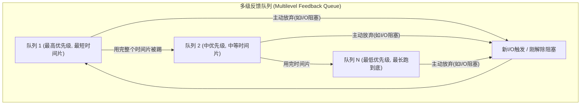

## 目录
- [[#调度的时机与目标]]
- [[#批处理系统中的调度（吞吐量优先）]]
	- [[#先来先服务（FCFS）]]
	- [[#最短作业优先（SJF）]]
	- [[#最短剩余时间优先（SRTN）]]
- [[#交互式系统中的调度（响应时间优先）]]
	- [[#时间片轮转（Round-Robin）]]
	- [[#优先级调度（Priority）]]
	- [[#多级反馈队列（CTSS）]]
	- [[#最短进程优先（SPF）]]
	- [[#保证调度与彩票调度]]
- [[#实时系统中的调度]]
- [[#线程调度策略]]
- [[#💡 架构师视角映射]]
- [[#🔍 深挖指南]]

---

## 调度的时机与目标

当计算机有多个就绪的进程/线程在竞争 CPU 时，**调度器（Scheduler）** 需要选择一个让它运行。使用的规则称为**调度算法（Scheduling Algorithm）**。

> [!important] 计算密集型 vs I/O密集型
> **计算密集型（CPU-bound）**：绝大多数时间在使用 CPU 算力（如视频渲染、AI训练）。
> **I/O密集型（I/O-bound）**：绝大多数时间在等待 I/O 完成（如 Web服务器读写数据库、等待用户输入字符）。
>
> 随着 CPU 越来越快，绝大多数进程变得 I/O 密集。**好调度的金律**：当一个 I/O 密集的进程想要 CPU 时，立刻给它，因为它只要极短的计算后就会再次发起 I/O（让出 CPU）并发起后台硬件传输，以保持极高的总体并行度！

**在什么时候调度？**
1. 创建新进程后（选父还是子？）
2. 进程退出时（挑下一个）
3. 进程阻塞时（等待 I/O/锁等）
4. **发生 I/O 中断时**（可能是某个原本阻塞的极其重要的高优进程现在 I/O 好了）

**不同系统的终极目标不同**：
- **批处理系统**：最大化吞吐量、CPU利用率、周转时间。
- **交互系统**：最小化响应时间、保证公平性。
- **实时系统**：满足截止时间要求。

---

## 批处理系统中的调度（吞吐量优先）

这类系统没有用户坐在显示器前等待，只有排队任务（例如银行账单日结算批处理）。

### 先来先服务（FCFS）
- **策略**：一条队列排到死，不抢占。
- **优点**：地球人都懂，超简单。
- **缺点**：1 个需要算 10 分钟的 CPU 进程如果在最前面，后面 100 个只需要算 1 毫秒的短进程都得干等 10 分钟（**护航效应**）。极度不公平。

### 最短作业优先（SJF）
- **前提**：你必须提前知道每个作业运行多长。
- **策略**：从等候队列中挑出运行时间最短的那个。
- **优点**：数学证明，这能给出**全局最小的平均等待时间**！
- **缺点**：如果你不知道它要跑多久呢？（这在交互系统里是个大问题）

### 最短剩余时间优先（SRTN）
- **SJF 的抢占式版本**。如果新来的短作业需要的时间比当前正在运行的长作业剩下的时间还要短，直接踢掉运行中的（抢占它）。

---

## 交互式系统中的调度（响应时间优先）

你每天用的 PC、手机、服务器后台都是交互式系统。绝不能让任何一个进程霸占 CPU 不走！

### 时间片轮转（Round-Robin）
最古老、最简单、最公平的算法。
- **策略**：给每个就绪进程分配一个**时间片（Quantum，如 20ms）**。时间一到，强制剥夺 CPU，放到就绪队列末尾。
- **两难**：
    - 切得太短（1ms）？→ 上下文切换太频繁（切换一次可能需要 0.1ms），浪费了极大算力在管理开销上。
    - 切得太长（1000ms）？→ 响应极其拉垮！你在键盘敲一下字母键盘要等 1 秒才出来！

### 优先级调度（Priority）
时间片轮转的致命弱点是假定所有人平等。但你的系统里**鼠标移动**的优先级显然比屏幕后面的**Windows Update 下载进度条**优先级高 100 倍！
- **策略**：分成多个优先级队列。高优先级排前面。同一队里做时间片轮转。
- **饥饿问题（Starvation）**：低优先级的进程可能永远无法运行。
- **解法（老化 Aging）**：运行它，它的优先级就随时间片逐步降低；排队久了，优先级随时间逐渐升高。

### 多级反馈队列（CTSS）
（如上图：**调度器圣杯**）自动区分 I/O 和 CPU 密集型进程。
- **策略**：如果你总是用不完自己的时间片就去请求 I/O，说明你是交互进程（如键盘/鼠标打字），把你放在最高优队列（切你极快，让你立刻满足）！
- 如果你霸着 CPU 拼命把整个时间片全跑完（如死循环或者视频编码），调度器会自动不断将你的优先级**降格**到深渊，最后去最底层的超长时间片轮转队列。

### 保证调度与彩票调度
- **彩票调度（Lottery）**：给进程发彩票。调度器每次随机抽一张。发出去的彩票张数就是获取 CPU 时间的数学期望。
> 可以将彩票转让：高优的视频解码渲染进程把彩票捐给子进程让它帮忙读磁盘。

---

## 实时系统中的调度

多媒体（音视频播放）、航空火控系统、医疗监护仪绝不允许晚点！
- **硬实时（Hard Real-Time）**：错过截止时间整个系统直接毁灭（如导弹姿态控制器）。
- **软实时（Soft Real-Time）**：偶尔错过没关系，画质略降但依然可用（如手机刷短视频丢一帧）。

为了满足实时，其调度器极其严格，所有任务必须在执行前向调度器**预先提交截止时间和计算所需的 CPU 时间**，系统可以**拒载（Admission Control）**超出算力的大量任务。

---

## 线程调度策略

既然我们有了内核级线程和用户级线程，调度的层次就不一样了。

| 调度级别 | 用户级线程 (User-level Threads) | 内核级线程 (Kernel-level Threads) |
|--------|------------------------------|--------------------------------|
| 何人挑选？ | 进程内部跑在用户态的自己的**运行时线程库调度器** | 操作系统**内核**的系统大调度器 |
| 怎么剥夺？ | 通常很难强行剥夺，大都是**协作式挂起（yield）** | 内核通过时钟硬件中断**强制抢占强制挂起** |
| 代价如何？ | 极低（几十条机器指令保存个寄存器就行） | 极高（完整上下文切换，陷入内核、刷 TLB，Cache 失效）|
| 其他区别 | 如果一个用户线程由于调 `read()` 陷入阻塞，整个大进程包括内部那些好好的线程将被内核无情挂起。| 内核单独阻塞该线程，让本进程其他线程继续爽。|

---

## 💡 架构师视角映射

| 操作系统概念 | Java 后端映射 |
|------------|-------------|
| 优先级调度饥饿 | Java `Thread.setPriority()` 不靠谱！JVM 的优先级受制于底层各种 OS 的支持规则差异（Linux 有 140 级，Windows 更少，而且 Windows 会随时动态调整。所以最好不要依赖这玩意去保证谁先执行，用锁或信号量约束！ |
| 计算与I/O密集 | 为什么要对线程池（ThreadPool）调优？ CPU 密集型开核心数+1个线程就够了。但 I/O 密集型（比如一直要打 HTTP 接口、调 Redis 的后端），那可能得开 CPU 核心数 \times 5 到 10 个线程，不然算力全被等网络包闲空了。|
| 先来先服务（FCFS / FIFO） | 典型的如消息队列 RMQ/Kafka 中的消费模型；`ReentrantLock` 这个重量级锁的排队其实就是底层的 CLH 先进先出队列！ |
| 协作式用户态调度 (Yield) | Java 21 中的 **Virtual Thread（虚拟线程）** 遇到阻塞或耗时操作时，会调挂起将载体（Carrier Thread OS级别）释放，主动**出让（yield）**。这是在底层的 JVM 和用户态调度器控制的！ |

---

## 🔍 深挖指南

> [!note] 核心要点
> 1. 最关键的区别在于批处理、交互式和实时系统追求完全不同的终极目标。
> 2. 时间片轮转和多级反馈队列是全部现代交互操作系统的算法基石。
> 3. I/O 密集型永远由于短暂使用 CPU 应被赋予高优奖励，以便最大化总线并行！

- 如果你对 Linux 的完全公平调度器 CFS 感兴趣，它巧妙使用了红黑树维护每一个进程的“虚拟运行时间（vruntime）”来选拔，翻看《深入理解Linux内核》的调度专栏。
- 如果想深入学习 Go 的 GMP 用户态混合调度机制如何结合工作窃取（Work Stealing）算法？去查阅 Go source `runtime/proc.go`。
