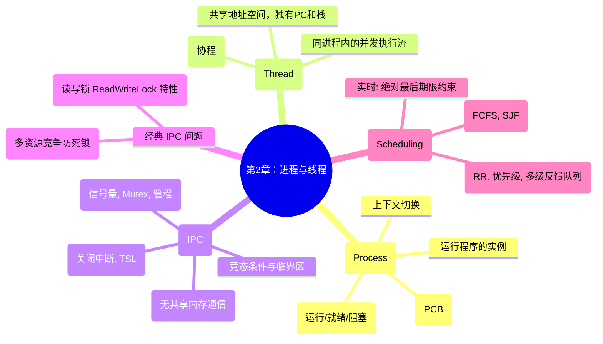

## 目录
- [[#哲学家就餐问题]]
- [[#读者-写者问题]]
- [[#第二章总结]]
- [[#💡 架构师视角映射]]
- [[#🔍 深挖指南]]

---

## 哲学家就餐问题

由 Dijkstra 在 1965 年提出的同步问题模型，用来测试各种互斥原语的表达能力。

**问题描述**：
5 个哲学家围坐在圆桌前，每两人之间有一根筷子（共 5 根）。
哲学家只做两件事：**思考（Thinking）** 和 **进餐（Eating）**。
进餐时，必须同时拿到**左边和右边的两根筷子**。如果不空闲，就一直等。吃完后，放下两根筷子继续思考。

```
错误的初步方案：

void philosopher(int i) {
    while (true) {
        think();
        take_fork(i);          // 拿左边的筷子
        take_fork((i+1) % 5);  // 拿右边的筷子
        eat();                 // 进餐
        put_fork(i);           // 放下左边的筷子
        put_fork((i+1) % 5);   // 放下右边的筷子
    }
}
```

> [!failure] 致命的死锁（Deadlock）
> 假设所有 5 个哲学家**同时**拿起左边的筷子（`take_fork(i)` 成功）。
> 当他们试图拿右边的筷子时，发现全被占用了。所有人都在等右边的筷子，所有人都不肯放下左边的筷子。
> **结果：所有人都饿死（Starvation）！**
> 这是典型的资源死锁（四个必要条件全满足：互斥、占有并等待、非抢占、循环等待）。

**Dijkstra 的完美解法（使用状态数组与信号量）**：
不单独锁筷子，而是将"拿两根筷子"作为一个原子操作，结合哲学家的三种状态（思考、饥饿、进餐）。

```c
#define N 5
#define LEFT (i+N-1)%N
#define RIGHT (i+1)%N
#define THINKING 0
#define HUNGRY 1
#define EATING 2

int state[N];           // 记录每个人的状态
Semaphore mutex = 1;    // 保护 state 数组的临界区
Semaphore s[N] = {0};   // 每个哲学家一个信号量，0表示阻塞等吃

void philosopher(int i) {
    while (true) {
        think();
        take_forks(i);  // 尝试拿两根筷子（否则阻塞）
        eat();
        put_forks(i);   // 放下筷子，看看邻居能不能吃
    }
}

void take_forks(int i) {
    down(&mutex);       // 锁住状态数组
    state[i] = HUNGRY;
    test(i);            // 尝试拿筷子
    up(&mutex);
    down(&s[i]);        // 如果 test 成功，s[i]在此前已up(变1)，这里减回0刚好通过
                        // 如果 test 失败，这里(变-1)阻塞自己，等别人用完唤醒
}

void put_forks(int i) {
    down(&mutex);
    state[i] = THINKING;
    test(LEFT);         // 看看左邻居能不能吃，能的话唤醒他
    test(RIGHT);        // 看看右邻居能不能吃，能的话唤醒他
    up(&mutex);
}

void test(int i) {
    if (state[i] == HUNGRY && state[LEFT] != EATING && state[RIGHT] != EATING) {
        state[i] = EATING; // 满足条件：自己饿了，且左右都没在吃
        up(&s[i]);         // 唤醒（哪怕只给当前刚进入饥饿并且可以拿的人）
    }
}
```

> [!tip] 哲学家问题的现实意义
> 筷子 = I/O 设备或数据库记录锁
> 哲学家 = 竞争这些资源的进程/线程
> 这揭示了多资源分配的死锁风险：如果资源必须以特定顺序申请，或者无法同时获取全部所需资源，就会出大问题。

---

## 读者-写者问题

**问题描述**：
一个数据库（或文件），有多个并发进程想要读取（Readers），也有多个并发进程想要修改（Writers）。
- 允许多个读者**同时读**（读不破坏数据）。
- 写者必须**独占**访问（不能和其他写者或读者同时操作）。

**读者优先模型（Readers-Preference）**：
只要至少有一个读者还在读，新来的读者就可以直接加入读取。写者哪怕等了很久，也必须等到所有读者全部离开。

```c
Semaphore mutex = 1; // 控制 rc 计数器的修改互斥
Semaphore db = 1;    // 控制整个数据库的互斥（写者专用锁，给第一个读者申请）
int rc = 0;          // 记录当前活跃的读者数量

void reader() {
    while (true) {
        down(&mutex);      // 申请修改计数的锁
        rc++;
        if (rc == 1)       // 如果我是第一个读者！
            down(&db);     // 那我去抢下数据库的通行证！
        up(&mutex);        // 解开计数器的锁，让下一名读者进来

        read_data();       // 【并发读区！N名读者在此狂欢！】

        down(&mutex);      // 申请修改计数的锁
        rc--;
        if (rc == 0)       // 如果我是最后一个读者！
            up(&db);       // 那由我来归还数据库的通行证！
        up(&mutex);
    }
}

void writer() {
    while (true) {
        down(&db);         // 等待数据库通行证（没人读也没人写才能拿到）
        write_data();      // 【独占写区】
        up(&db);           // 归还通行证
    }
}
```

> [!warning] 读者优先的缺陷
> 这可能导致**写者饥饿（Writer Starvation）**。如果源源不断的读者涌入（比如高并发网站查文章），那么 `rc` 永远降不到 0，数据库的锁一直被读者持有，写者（比如后台刷新配置的线程）永远进不去！

*（也有“写者优先”、“公平竞争”的各种变种设计，往往通过再增加调度信号量队列实现）*

---

## 第二章总结



| 并发模型演进 | 核心问题 | 现代解决思路 |
|------------|---------|------------|
| 早期单任务 | 慢 I/O 导致 CPU 空转 | 引入多道程序与中断 |
| 进程 | 需要极其厚重的全盘拷贝创建开销 | 引入内存共享的线程 |
| 线程死锁 | 面条盘一样的临界区逻辑 | Java自带管程/Golang管道通信 |
| 线程切换昂贵 | 内核级上下文切换破坏 TLB 快表 | 引入纯用户态协程/虚拟线程 |

---

## 💡 架构师视角映射

| 操作系统概念 | Java 后端映射 |
|------------|-------------|
| 读者写者问题 | 彻底对应了 JDK 中的 `ReadWriteLock` (如 `ReentrantReadWriteLock`)！只要没有 Write 锁被独占，无数个 Read 都可以 `lock()`。但如果是 `StampedLock`，甚至提供了一种“乐观读”从而进一步榨干 CPU 数据缓存，连修改 `rc` 这个共享变量（会导致整个多核 CPU 的缓存行失效刷新到主存以达成一致性）的代价都省去了。 |
| 哲学家资源死锁 | 业务中多见于数据库多表更新的诡异场景。解决方案必须要求：所有服务如果要请求互相竞争的排他数据表锁、行锁时，**必须按固定统一顺序获取！**。如永远先拿表 A 的锁，再拿表 B 的锁，就不会环形死锁。|

---

## 🔍 深挖指南

> [!note] 核心要点
> 1. 经典 IPC 问题抽象了现实系统编程中最棘手的竞态环境（防死锁和防饥饿）。
> 2. 读多写少的高并发环境中，利用“读者写者模式”可以成百上千倍提升吞吐量。

- 那些在工程中解决写者饥饿的方案演进，建议阅读《Java并发编程的艺术》中关于 `ReentrantReadWriteLock.WriteLock` 的锁降级以及抢占插队公平策略解析。
- 高级 IPC 经典考题如：睡眠理发师（The Sleeping Barber Problem）问题也可以一并在原书学习，强化对于“有界容纳和信号量清空”的理解。
