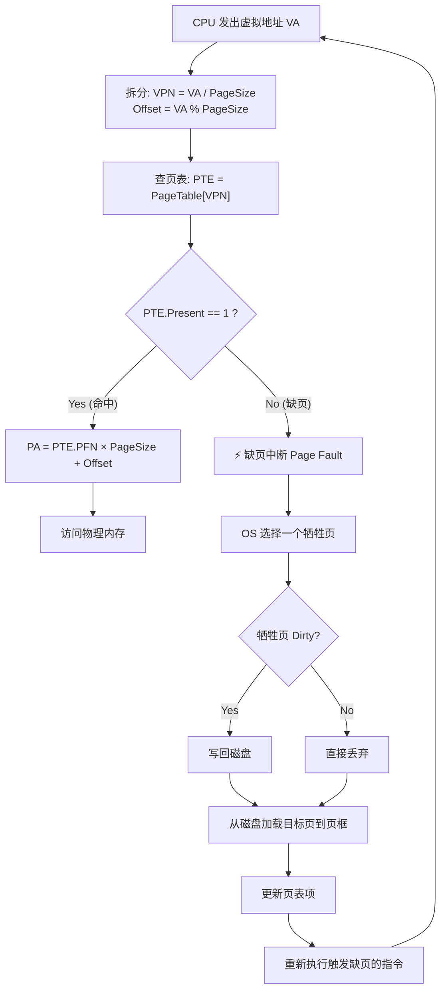

## 目录
- [[#分页的基本思想]]
	- [[#页表（Page Table）]]
	- [[#页表项结构]]
- [[#MMU 地址翻译过程]]
- [[#加速分页：TLB]]
- [[#大页表问题的解决方案]]
	- [[#多级页表]]
	- [[#倒排页表]]
- [[#💡 架构师视角映射]]
- [[#🔍 深挖指南]]

---

## 分页的基本思想

> [!question] 交换技术的问题在哪？
> 交换技术将**整个进程**换入换出 → 如果进程很大（例如 1GB），交换一次就需要大量磁盘 I/O
> 能不能只将进程**正在使用的一小部分**放在内存中？→ 这就是**虚拟内存（Virtual Memory）** 的核心思想

**虚拟内存**的核心：将进程的虚拟地址空间划分为固定大小的**页（Page）**，将物理内存划分为相同大小的**页框（Page Frame）**。程序运行时，只需要将当前使用的页加载到内存中。

```
虚拟地址空间（64KB）         物理内存（32KB）
┌──────────────┐ 页号        ┌──────────────┐ 页框号
│  虚拟页 15    │  15         │              │
│  虚拟页 14    │  14         │  页框 7       │  7
│  虚拟页 13    │  13         │  页框 6       │  6
│  虚拟页 12    │  12         │  页框 5       │  5
│  虚拟页 11    │  11         │  页框 4       │  4
│  虚拟页 10    │  10         │  页框 3       │  3
│  虚拟页 9     │  9          │  页框 2       │  2
│  虚拟页 8     │  8          │  页框 1       │  1
│  虚拟页 7     │  7          │  页框 0       │  0
│  虚拟页 6     │  6          └──────────────┘
│  虚拟页 5     │  5
│  虚拟页 4     │  4          页表（每个进程一张）:
│  虚拟页 3     │  3          ┌────┬──────┬───┐
│  虚拟页 2     │  2          │页号│在内存?│页框│
│  虚拟页 1     │  1          ├────┼──────┼───┤
│  虚拟页 0     │  0          │ 0  │  ✅  │ 2  │
└──────────────┘              │ 1  │  ✅  │ 1  │
                              │ 2  │  ❌  │ -  │ ← 在磁盘上
虚拟空间 > 物理内存            │ 3  │  ✅  │ 6  │
这就是虚拟内存的意义            │... │ ...  │... │
                              └────┴──────┴───┘
```

> 类比：虚拟内存就像一个图书馆的"预约借书系统"。图书馆（物理内存）的书架只能放 1000 本书，但书库（磁盘）里有 10 万本。你在系统里可以看到全部 10 万本书的目录（虚拟地址空间），但实际书架上只放着你最需要的那些（加载到物理内存的页）。当你需要一本不在书架上的书时，图书管理员（操作系统）会去书库拿来放到书架上，同时可能把一本没人在看的书放回去（页替换）
> CS 术语：**虚拟内存（Virtual Memory）** 通过**按需分页（Demand Paging）** 实现了对物理内存的解耦——程序的逻辑地址空间大小不受物理内存限制

### 页表（Page Table）

页表是虚拟内存系统的核心数据结构，负责将**虚拟页号（VPN）** 映射到**物理页框号（PFN）**。

```
虚拟地址的结构（以 16 位地址、4KB 页为例）:

15 14 13 12 | 11 10 9 8 7 6 5 4 3 2 1 0
   页号(VPN) |        页内偏移(Offset)
   (4 bits)  |          (12 bits)

虚拟地址 = 页号 × 页大小 + 偏移量
例: 虚拟地址 8196 = 页号2 × 4096 + 偏移4
```

### 页表项结构

```
典型的页表项（Page Table Entry, PTE）:

┌─────────┬───┬───┬──────┬───┬───┬──────────┐
│ 页框号   │ C │ M │  R   │ P │V/I│ 保护位   │
│(PFN)    │   │   │      │   │   │(RWX)    │
└─────────┴───┴───┴──────┴───┴───┴──────────┘
  │         │   │    │     │   │     │
  │         │   │    │     │   │     └─ 读/写/执行权限
  │         │   │    │     │   └─ 有效/无效位（Valid bit）
  │         │   │    │     └─ 存在位：页是否在物理内存中
  │         │   │    └─ 访问位（Referenced）：最近是否被访问过
  │         │   └─ 修改位（Modified/Dirty）：页是否被写过
  │         └─ 缓存禁止位：映射到 I/O 设备时禁止缓存
  └─ 物理页框号
```

> [!info] 关键标志位
> - **存在位（Present/Valid, P）**：该页是否在物理内存中。P=0 时访问触发**缺页中断（Page Fault）**
> - **修改位（Modified/Dirty, M）**：该页被载入后是否被写过。换出时 M=1 的页需要写回磁盘，M=0 的页可以直接丢弃（因为磁盘上还有副本）
> - **访问位（Referenced, R）**：最近是否被访问过。页替换算法利用此位判断页的"热度"
> - **保护位（Protection）**：控制读/写/执行权限。例如代码段设为只读+可执行

---

## MMU 地址翻译过程

**内存管理单元（Memory Management Unit, MMU）** 是 CPU 中的硬件模块，负责将虚拟地址翻译为物理地址。



> [!warning] 缺页中断的代价
> 磁盘访问延迟约 **10ms**，而内存访问约 **100ns** → 两者差距约 **10 万倍**
> 即使缺页率只有 0.001%（千次访问才缺一次页），平均访问时间也会显著增加
> 所以**页替换算法**极其关键——目标是最小化缺页率

---

## 加速分页：TLB

每次内存访问都要查页表，而页表本身也存在内存中 → 一次内存访问变成了至少**两次**内存访问（查页表 + 真正访问）。

**转换检测缓冲区（Translation Lookaside Buffer, TLB）** 是解决方案——一个位于 MMU 内部的高速缓存，缓存最近使用过的页表项。

```
TLB 的工作流程：

             虚拟地址
                │
                ▼
        ┌──────────────┐
        │   TLB 查找    │ (并行比较所有条目，硬件级速度)
        └──────┬───────┘
               │
        ┌──────┴──────┐
     命中(Hit)      未命中(Miss)
        │               │
        ▼               ▼
   直接得到PFN      查页表(内存访问)
   → 极快(1周期)    → 更新TLB
                    → 如果TLB满则替换一条
                    → 若页不在内存则→缺页中断

TLB 条目示例:
┌──────┬──────┬───┬───┬──────────┐
│ VPN  │ PFN  │ M │ R │ 保护位    │
├──────┼──────┼───┼───┼──────────┤
│  140 │  31  │ 1 │ 1 │ RW       │
│  20  │  38  │ 1 │ 1 │ RO       │
│  130 │  29  │ 0 │ 1 │ RW       │
│ ...  │ ...  │...│...│ ...      │
└──────┴──────┴───┴───┴──────────┘
```

> 类比：TLB 就像你手机上的"收藏/书签"。虽然所有网页都可以通过搜索引擎（页表）找到，但你最常访问的几个网页直接放在收藏夹里，一点就能打开，不需要每次都去搜索。TLB 就是页表的"收藏夹"
> CS 术语：TLB 利用了程序的**时间局部性（Temporal Locality）** 和**空间局部性（Spatial Locality）**。典型的 TLB 有 64~1024 条目，命中率可达 **99%** 以上

> [!tip] 软件 TLB 管理 vs 硬件 TLB 管理
> - **硬件管理 TLB**（如 x86）：TLB miss 时，MMU 硬件自动查页表并填充 TLB，CPU 无需介入
> - **软件管理 TLB**（如 MIPS、SPARC）：TLB miss 触发异常，由操作系统代码查页表并填充 TLB

---

## 大页表问题的解决方案

> [!failure] 页表太大了！
> 以 32 位地址空间、4KB 页为例：
> - 虚拟页数 = 2³² / 2¹² = 2²⁰ = **1,048,576 个页**
> - 每个页表项 4 字节 → 页表大小 = 4MB
> - **每个进程都需要一张这样的页表** → 100 个进程就是 400MB 仅用于存储页表
> - 64 位系统更恐怖：2⁵² 个页 → 页表大小以 PB 计算

### 多级页表

**解决思路**：不要一次性创建整张页表，只为**实际使用的地址范围**创建页表项。

```
二级页表结构（32位地址、4KB页）:

虚拟地址:
┌──────────┬──────────┬──────────────┐
│  PT1(10) │  PT2(10) │ Offset(12)   │
│ 一级索引  │ 二级索引  │   页内偏移    │
└──────────┴──────────┴──────────────┘

                 一级页表                     二级页表
              ┌──────────┐
        0     │  ──────────────→ ┌──────────┐
        1     │  NULL     │      │ PTE 0    │
        2     │  ──────────────→ │ PTE 1    │
        3     │  NULL     │      │ ...      │
        ...   │  NULL     │      │ PTE 1023 │
       1023   │  NULL     │      └──────────┘
              └──────────┘
               (始终存在)     (只有有映射时才分配)

节省内存的原因：
- 一级页表: 1024 × 4B = 4KB（始终存在）
- 二级页表: 只为有映射的范围分配（假设只有3个区域有映射）
  → 3 × 4KB = 12KB
- 总共: 4KB + 12KB = 16KB  远小于 4MB!
```


> 类比：多级页表就像"省-市-区"的地址体系。整个中国的地址不可能用一张平铺的大表列完，太浪费纸了。但如果先按省分（一级页表），每个省再按市分（二级页表），每个市再按区分——大部分"省"下面只有几个"市"有人住，没人住的那些根本不需要建表
> CS 术语：**多级页表（Multi-Level Page Table）** 通过**层次化索引**将页表空间从 O(N) 优化为按需分配

### 倒排页表

另一种解决思路：不为每个虚拟页建一个条目，而是为每个**物理页框**建一个条目。

```
倒排页表：

物理页框号    进程ID    虚拟页号
┌──────────┬────────┬──────────┐
│    0     │  P42   │   12     │
│    1     │  P42   │   1      │
│    2     │  P17   │   331    │
│    3     │  P42   │   0      │
│   ...    │  ...   │   ...    │
└──────────┴────────┴──────────┘

条目数 = 物理页框数（固定），而不是虚拟页数

查找: 给定 (PID, VPN) → 搜索整张表找到匹配项 → 对应的行号就是 PFN
问题: 线性搜索太慢 → 用哈希表加速
```

> [!info] 倒排页表的适用场景
> - 当物理内存远小于虚拟地址空间时（如 64 位系统），倒排页表可以大幅节省空间
> - 代价是查找时不能直接用 VPN 作为索引，需要搜索或哈希 → 增加了 TLB miss 的代价
> - 典型使用者：IBM PowerPC、IA-64（Itanium）

---

## 💡 架构师视角映射

| 操作系统概念 | Java 后端映射 |
|------------|-------------|
| 虚拟内存 → 按需分页 | JVM 的**懒加载**思想：类不到用时不加载；Spring Bean 默认延迟初始化 |
| 页表 → VPN 到 PFN 的映射 | HashMap 的 key → bucket 映射；DNS 域名解析（域名 → IP） |
| TLB → 高频映射缓存 | Redis 作为 MySQL 的"TLB"：热数据缓存在 Redis，命中则直接返回，未命中才查 MySQL |
| 缺页中断 → 从磁盘加载 | Redis Cache Miss → 从 MySQL 加载数据 → 写入 Redis 缓存（与 TLB fill 流程一致） |
| 多级页表 → 层次化索引 | B+Tree 索引：根节点 → 内部节点 → 叶子节点 → 数据。只加载需要的路径 |
| 倒排页表 → 物理视角的索引 | Elasticsearch 的**倒排索引**：按词项（物理）索引文档（虚拟），与倒排页表异曲同工 |
| 页大小选择 | MySQL InnoDB 的页大小默认 16KB（可配置），与 OS 页大小类似的权衡 |

> [!tip] CSAPP 第 9 章的联系
> 如果你已经读过 [[CSAPP 第 9 章]] 的虚拟内存部分，MOS 第 3.3 节可以作为补充——MOS 更强调"操作系统如何管理页表和 TLB"，而 CSAPP 更侧重"程序员如何理解地址翻译和缓存"

---

## 🔍 深挖指南

> [!note] 核心要点
> 1. 虚拟内存 = 分页 + 按需加载 → 程序可以使用比物理内存大得多的地址空间
> 2. 页表将虚拟地址映射到物理地址，缺页中断时从磁盘加载
> 3. TLB 是页表的硬件缓存，命中率极高，是分页性能的关键
> 4. 多级页表解决了页表过大的问题（空间换时间 → 层次化按需分配）

- 关于地址翻译的完整硬件流程 → 参考 CSAPP 第 9.6 节 [[9.6 地址翻译]]
- TLB 的组织方式（全相联 vs 组相联）→ 参考 CSAPP 第 6 章（缓存层次结构）
- Linux 采用的四级页表结构 → 参考 《Understanding the Linux Kernel》第 2 章
- x86-64 的分页机制和 CR3 寄存器 → 参考 Intel 手册 Volume 3A, Chapter 4 "Paging"
