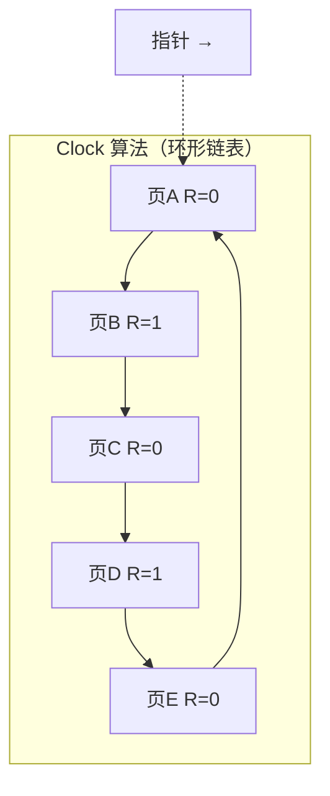
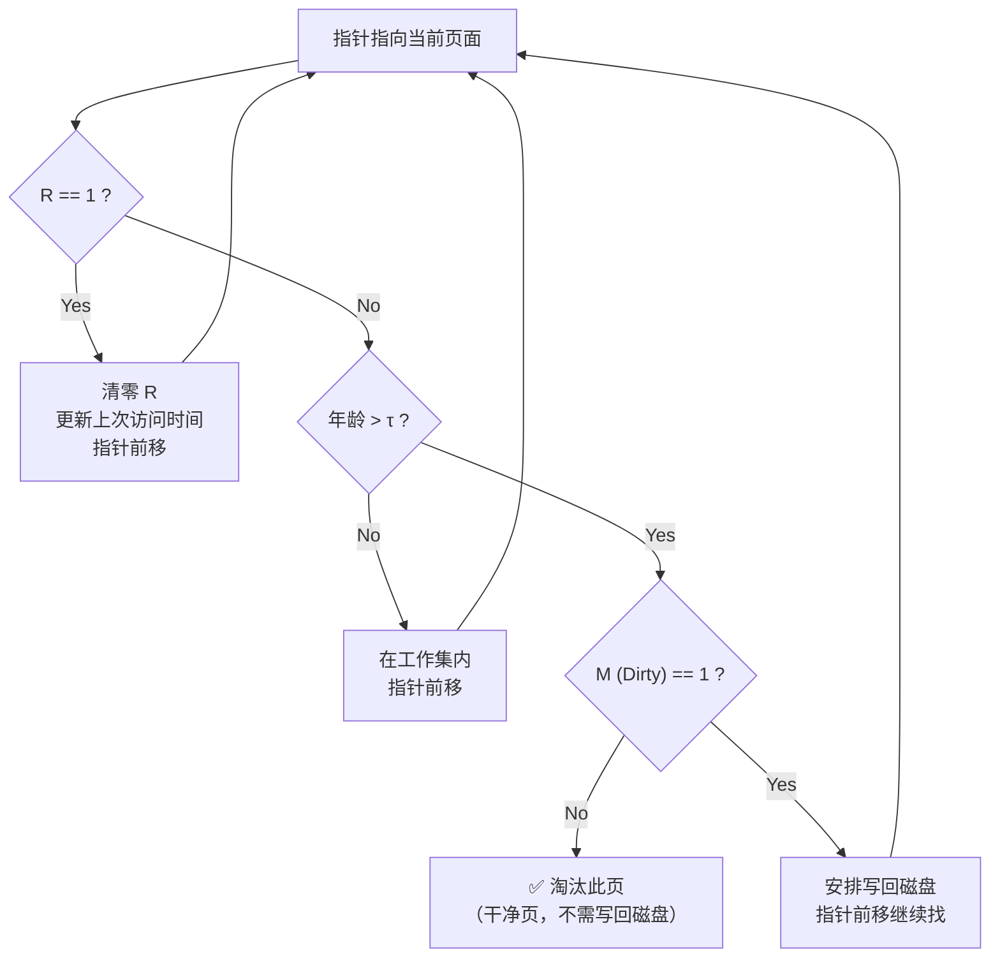

## 目录
- [[#页面置换的必要性]]
- [[#最优页面置换算法（OPT）]]
- [[#最近未使用算法（NRU）]]
- [[#先进先出算法（FIFO）]]
- [[#第二次机会算法（Second Chance）]]
- [[#时钟算法（Clock）]]
- [[#最近最少使用算法（LRU）]]
- [[#工作集算法（Working Set）]]
- [[#WSClock 算法]]
- [[#算法总结与对比]]
- [[#💡 架构师视角映射]]
- [[#🔍 深挖指南]]

---

## 页面置换的必要性

当发生**缺页中断**且物理内存已满时，操作系统必须选择一个页面**换出（Evict）** 以腾出空间。选择哪个页面换出——这就是**页面置换算法**要回答的核心问题。

> 类比：冰箱（内存）满了，你又买了新菜（新页面需要加载）。你必须从冰箱里拿出一些东西（换出一个页面）。拿什么？过期的优先扔（最久未使用），还是拿出最先放进的（FIFO），还是拿最少用的？不同策略就是不同的置换算法
> CS 术语：**页面置换算法（Page Replacement Algorithm）** 的目标是最小化**缺页率（Page Fault Rate）**

---

## 最优页面置换算法（OPT）

**策略**：换出**未来最长时间不会被使用**的页面。

```
示例：物理内存 4 页框，访问序列：0 1 2 3 0 1 4 0 1 2 3 4

时刻:  0   1   2   3   4   5   6   7   8   9  10  11
访问:  0   1   2   3   0   1   4   0   1   2   3   4
     ┌───┬───┬───┬───┬───┬───┬───┬───┬───┬───┬───┬───┐
 f0  │ 0 │ 0 │ 0 │ 0 │ 0 │ 0 │ 0 │ 0 │ 0 │ 2 │ 2 │ 2 │
 f1  │   │ 1 │ 1 │ 1 │ 1 │ 1 │ 1 │ 1 │ 1 │ 1 │ 3 │ 3 │
 f2  │   │   │ 2 │ 2 │ 2 │ 2 │ 4 │ 4 │ 4 │ 4 │ 4 │ 4 │
 f3  │   │   │   │ 3 │ 3 │ 3 │ 3 │ 3 │ 3 │ 3 │ 3 │ 3 │
     └───┴───┴───┴───┴───┴───┴───┴───┴───┴───┴───┴───┘
缺页:  ✗   ✗   ✗   ✗               ✗           ✗   ✗
                                     ↑ 换出2，因为2在未来最晚被再次访问
总缺页次数: 7
```

> [!warning] OPT 是理论最优但不可实现
> 因为操作系统不可能知道未来的访问序列
> OPT 的价值在于作为**基准线（Benchmark）**——用来衡量其他算法的好坏

---

## 最近未使用算法（NRU）

**策略**：利用页表项中的 **R（Referenced）位**和 **M（Modified）位**，将页面分为 4 类，优先置换低类页面。

```
NRU 分类：

类别   R   M
 0     0   0   最近未被访问，未被修改 → 最佳淘汰候选
 1     0   1   最近未被访问，已被修改 → 发生过写入但最近不活跃
 2     1   0   最近被访问，未被修改 → 活跃但未写入
 3     1   1   最近被访问，已被修改 → 活跃且已写入 → 最不应被淘汰

操作系统定期（如每个时钟中断）清零所有 R 位
→ 只有在上一个时钟周期内被访问的页，R 位才为 1
```

> [!tip] NRU 的优缺点
> **优点**：实现简单、开销小，容易理解
> **缺点**：分类太粗糙，同一类中随机选择可能不是最优

---

## 先进先出算法（FIFO）

**策略**：维护一个队列，最早进入内存的页面最先被换出。

```
FIFO 示例：3 页框，访问序列 0 1 2 3 0 1 4 0 1 2 3 4

时刻:  0   1   2   3   4   5   6   7   8   9  10  11
访问:  0   1   2   3   0   1   4   0   1   2   3   4
     ┌───┬───┬───┬───┬───┬───┬───┬───┬───┬───┬───┬───┐
 f0  │ 0 │ 0 │ 0 │ 3 │ 3 │ 3 │ 4 │ 4 │ 4 │ 2 │ 2 │ 2 │
 f1  │   │ 1 │ 1 │ 1 │ 0 │ 0 │ 0 │ 0 │ 0 │ 0 │ 3 │ 3 │
 f2  │   │   │ 2 │ 2 │ 2 │ 1 │ 1 │ 1 │ 1 │ 1 │ 1 │ 4 │
     └───┴───┴───┴───┴───┴───┴───┴───┴───┴───┴───┴───┘
缺页:  ✗   ✗   ✗   ✗   ✗   ✗   ✗               ✗   ✗   ✗
总缺页次数: 10
```

> [!failure] Belady 异常（Belady's Anomaly）
> 使用 FIFO 时，**增加页框数反而可能导致缺页次数增加**！这是 FIFO 算法特有的反直觉现象
> 例如：访问序列 1,2,3,4,1,2,5,1,2,3,4,5
> - 3 页框：9 次缺页
> - 4 页框：10 次缺页（更多！）

---

## 第二次机会算法（Second Chance）

**改进 FIFO**：在换出最旧页面前，检查其 R 位。如果 R=1，说明最近被用过，给它"第二次机会"——清除 R 位，将其移到队尾当作新进入的页面。

```
第二次机会算法过程：

FIFO 队列（最旧 → 最新）:
┌───┬───┬───┬───┬───┬───┐
│ A │ B │ C │ D │ E │ F │
│R=1│R=0│R=1│R=1│R=0│R=1│
└───┴───┴───┴───┴───┴───┘
 ↑ 检查最旧的 A

A: R=1 → 清零 R，移到队尾 → 给第二次机会
┌───┬───┬───┬───┬───┬───┐
│ B │ C │ D │ E │ F │ A │
│R=0│R=1│R=1│R=0│R=1│R=0│
└───┴───┴───┴───┴───┴───┘
 ↑ 检查 B

B: R=0 → 淘汰 B ✓
```

---

## 时钟算法（Clock）

**时钟算法**是第二次机会算法的高效实现——不需要真的移动链表节点，而是用一个**环形链表 + 指针**模拟。



```
时钟算法扫描过程：

指针当前指向 A:
Step 1: A, R=0 → 淘汰 A ✓ → 完毕

如果 A 的 R=1:
Step 1: A, R=1 → 清零 R → 指针前移
Step 2: B, R=1 → 清零 R → 指针前移
Step 3: C, R=0 → 淘汰 C ✓
```

> [!tip] 时钟算法的工程价值
> 时钟算法是实际操作系统中最常用的页面置换算法之一
> Linux 内核使用的是**双指针时钟算法**的变种（活跃/非活跃链表）
> 优点：O(1) 空间（相比 LRU 的严格实现），近似 LRU 效果

---

## 最近最少使用算法（LRU）

**策略**：换出**最近最长时间未被访问**的页面。基于假设：过去经常使用的页面，未来也很可能被使用（时间局部性）。

```
LRU 示例：3 页框，访问序列 0 1 2 3 0 1 4

时刻:  0   1   2   3   4   5   6
访问:  0   1   2   3   0   1   4
     ┌───┬───┬───┬───┬───┬───┬───┐
 f0  │ 0 │ 0 │ 0 │ 3 │ 3 │ 3 │ 4 │
 f1  │   │ 1 │ 1 │ 1 │ 0 │ 0 │ 0 │
 f2  │   │   │ 2 │ 2 │ 2 │ 1 │ 1 │
     └───┴───┴───┴───┴───┴───┴───┘
                  ↑ 淘汰0(最久未用)
                       ↑ 淘汰2(最久未用)
                            ↑ 淘汰3(最久未用)
```

> [!info] LRU 的实现方式
>
> **方式一：硬件计数器**
> 每个页表项有一个计数器，每次内存访问时递增某个全局计数器并写入对应页表项
> 置换时选择计数器值最小的 → 即最久未访问的
> **缺点**：每次内存访问都要写页表 → 开销大
>
> **方式二：矩阵法**
> 维护 n×n 位矩阵，访问页 k 时：先将第 k 行全置 1，再将第 k 列全置 0
> 行的二进制值最小的页就是 LRU 页
>
> **方式三：链表（软件）**
> 维护按访问时间排序的链表，每次访问将对应页移到队首
> 置换时淘汰队尾 → 这正是 **LinkedHashMap** 的原理！

---

## 工作集算法（Working Set）

> [!question] 什么是抖动（Thrashing）？
> 当进程的页面频繁被换入换出，CPU 大部分时间花在处理缺页中断而非执行指令 → **抖动**
> 原因：分配给进程的页框太少，不够容纳其**工作集**

**工作集（Working Set）**：过去 **τ** 个时间单位内，进程实际使用的页面集合，记为 W(k, τ)。

```
工作集的概念：

时间窗口 τ = 5
访问序列: ... 2 6 1 5 7 7 7 7 5 1 6 2 3 4 ...
                            ↑ 当前时刻
          └─────────────┘
          过去 τ=5 次引用: {7, 5, 1}
          → 工作集 W = {1, 5, 7}，大小 = 3

操作系统应至少给该进程分配 3 个页框
如果分配 < 3 个 → 频繁缺页 → 抖动
```

**工作集页面置换算法**：在缺页时，扫描所有页面，淘汰不在工作集中的页面（最后访问时间 > τ）。

```
工作集置换算法：当前虚拟时间 = 2204, τ = 400

页面  R位  上次访问时间  年龄=当前时间-上次访问
 A     1     2084       120    → R=1，在工作集内，更新时间，继续
 B     0     1980       224    → 在工作集内(224<400)，但未访问
 C     0     1213       991    → 不在工作集(991>400)→ 淘汰候选!
 D     1     2014       190    → R=1，在工作集内，更新时间
 E     0     1560       644    → 不在工作集(644>400)→ 候选

淘汰: C (年龄最大的不在工作集中的页面)
```

---

## WSClock 算法

**WSClock = 工作集 + 时钟算法**，是实际系统中最受推崇的页面置换算法之一。



---

## 算法总结与对比

| 算法 | 核心思想 | 优点 | 缺点 | 实际使用 |
|------|---------|------|------|---------|
| **OPT** | 淘汰未来最久不用的 | 理论最优 | 不可实现 | 仅作基准 |
| **NRU** | 按 R/M 位分 4 类淘汰 | 简单高效 | 粒度太粗 | 少见 |
| **FIFO** | 最早进入的最先出 | 实现最简单 | Belady 异常 | 很少单独使用 |
| **Second Chance** | FIFO + R 位检查 | 比 FIFO 好 | 链表移动开销 | 被 Clock 替代 |
| **Clock** | 环形链表 + 指针扫描 | 高效近似 LRU | 近似不精确 | ✅ **广泛使用** |
| **LRU** | 淘汰最近最久未用的 | 效果好 | 精确实现代价大 | 近似实现广泛 |
| **工作集** | 淘汰工作集外的页 | 预防抖动 | 扫描开销大 | 概念有用 |
| **WSClock** | 工作集 + 时钟 | 效果好、高效 | 实现略复杂 | ✅ **广泛使用** |

---

## 💡 架构师视角映射

| 操作系统概念 | Java 后端映射 |
|------------|-------------|
| LRU 页面置换 | Redis 的 `allkeys-lru` 淘汰策略；Guava / Caffeine Cache 的 LRU 驱逐 |
| FIFO 页面置换 | 消息队列（RabbitMQ / Kafka）的消费顺序；简单缓存的过期策略 |
| 工作集 → 防止抖动 | JVM GC 调优：如果新生代 GC 频率过高（类似抖动），需要增大新生代空间（增大"工作集"） |
| 时钟算法（近似 LRU） | Redis 的近似 LRU 实现：不维护严格 LRU 链表，而是随机采样 + 比较，类似时钟扫描 |
| OPT 作为 Benchmark | 在性能调优中，先算出理论最优值，再看实际方案离最优有多远 |

> [!tip] LinkedHashMap 实现 LRU
> ```java
> // Java 的 LinkedHashMap 天然支持 LRU！
> Map<K, V> lruCache = new LinkedHashMap<>(capacity, 0.75f, true) {
>     @Override
>     protected boolean removeEldestEntry(Map.Entry eldest) {
>         return size() > capacity;  // 超出容量时移除最久未访问的
>     }
> };
> ```
> 参数 `accessOrder=true` 让每次 `get()` 都将元素移到队尾 → 队首就是 LRU 元素

---

## 🔍 深挖指南

> [!note] 核心要点
> 1. OPT 不可实现但作为基准线，LRU 效果最好但实现代价大
> 2. Clock 算法和 WSClock 是实际系统的主流选择——在效果和开销间取得了最佳平衡
> 3. 工作集概念对理解抖动和内存分配策略至关重要

- LRU 的硬件实现细节 → 原书 3.4.6 节
- Linux 的页面回收机制（活跃/非活跃链表）→ 参考 《Understanding the Linux Kernel》第 17 章
- Redis 近似 LRU 实现原理 → 参考 Redis 源代码 `evict.c` 和官方文档 "Using Redis as an LRU cache"
- Java Caffeine Cache 的 W-TinyLFU 算法 → 比 LRU 更优秀的现代缓存策略
