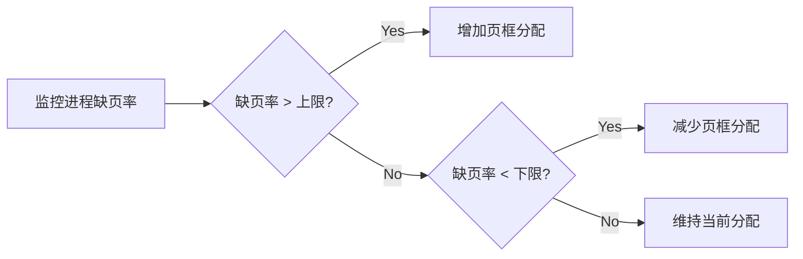
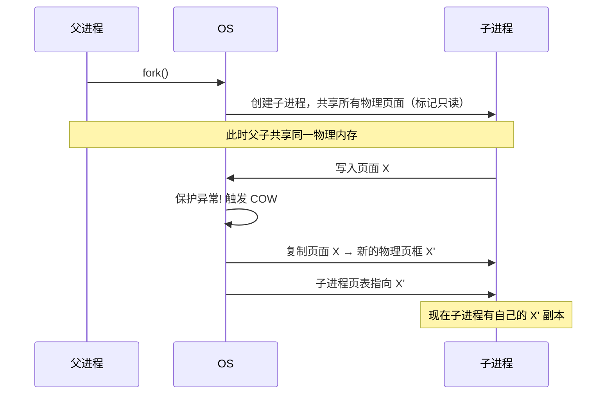

## 目录
- [[#局部分配与全局分配]]
- [[#页面大小的选择]]
- [[#调页策略]]
- [[#内存映射文件]]
- [[#共享页面]]
- [[#清除策略与页面守护进程]]
- [[#💡 架构师视角映射]]
- [[#🔍 深挖指南]]

---

## 局部分配与全局分配

当发生缺页需要置换时，是只在**当前进程的页框**中选择牺牲页（局部），还是在**所有进程的页框**中选择（全局）？

```
局部置换 vs 全局置换：

局部置换：                              全局置换：
进程A有5个页框，只在自己的5个中选牺牲     在所有进程的页框中选
┌───┬───┬───┬───┬───┐                 ┌───┬───┬───┬───┬───┬───┬───┬───┐
│A1 │A2 │A3 │A4 │A5 │                 │A1 │A2 │A3 │B1 │B2 │B3 │C1 │C2 │
└───┴───┴───┴───┴───┘                 └───┴───┴───┴───┴───┴───┴───┴───┘
        ↑ 只从这里选                           ↑ 全部可选，可能选到B或C的页

全局算法通常效果更好 → 因为它能动态调节每个进程的页框数
```

> [!info] 全局分配的页框调节策略：PFF（Page Fault Frequency）
> - 监控每个进程的**缺页率**
> - 缺页率太高 → 分配更多页框（该进程需要更大的工作集）
> - 缺页率太低 → 收回一些页框（该进程占了太多内存）
> - 类似于 PID 控制器的负反馈调节



---

## 页面大小的选择

页面大小是一个重要的设计参数，通常为 **4KB、2MB（大页）或 1GB（巨页）**。

| 因素 | 小页面（如 4KB） | 大页面（如 2MB） |
|------|----------------|----------------|
| **内部碎片** | 小（平均浪费 半页） | 大（平均浪费 1MB） |
| **页表大小** | 大（需要更多页表项） | 小（页表项少） |
| **TLB 覆盖** | 差（4KB × 64条 = 256KB） | 好（2MB × 64条 = 128MB） |
| **磁盘 I/O** | 传输量小但寻道次数多 | 一次传输大块，摊薄寻道开销 |
| **精度** | 高（工作集匹配精确） | 低（可能加载不需要的数据） |

> [!tip] 现代系统的做法
> 大多数系统同时支持多种页面大小：
> - 普通应用：使用 **4KB 页**
> - 数据库 / JVM 大堆 / HPC：使用 **2MB 大页（Huge Pages）** 减少 TLB miss
> - Linux: 通过 `hugetlbfs` 或 **Transparent Huge Pages (THP)** 支持大页

---

## 调页策略

**何时将页面加载到内存？**

```
两种策略：

请求调页（Demand Paging）:
  进程启动时内存中没有任何页面
  每次缺页才加载对应的页 → 按需加载
  优点: 不浪费内存
  缺点: 进程启动时大量缺页（冷启动）

预调页（Prepaging）:
  在进程启动或缺页时，预测并提前加载
  可能会同时加载相邻的几个页面
  优点: 减少缺页次数
  缺点: 预测不准则浪费内存和I/O带宽
```

> 类比：请求调页就像"用到什么查什么"的学习方式——需要知识点了才翻书。预调页像"提前预习下一章"——可能用到也可能用不到，但省去了等待时间
> CS 术语：**请求调页（Demand Paging）** 符合懒加载原则，**预调页（Prepaging）** 利用空间局部性进行预取

---

## 内存映射文件

**内存映射文件（Memory-Mapped Files）** 将文件直接映射到进程的虚拟地址空间，访问内存就等于访问文件。

```
内存映射文件机制：

进程的虚拟地址空间:
┌──────────────┐
│   栈         │
├──────────────┤
│              │
│  映射区域     │ ← file.dat 被映射到这里
│  虚拟页 100-110│   读写这些虚拟地址 = 读写文件
│              │
├──────────────┤
│   堆         │
├──────────────┤
│   代码段      │
└──────────────┘

过程：
1. 调用 mmap(file.dat) → OS 在页表中建立映射
2. 访问映射区域中的虚拟地址 → 缺页中断
3. OS 从磁盘读取文件对应部分到物理页框
4. 修改映射区域 → 脏页最终被写回文件

优势：避免了 read()/write() 系统调用的复制开销
```

> [!tip] mmap 的应用
> - **数据库引擎**（如 MongoDB 的旧存储引擎 MMAPv1）直接映射数据文件
> - **JVM 的 FileChannel.map()** 对应 POSIX 的 `mmap()`
> - **共享内存通信**：两个进程映射同一文件 → 零拷贝的进程间通信
> - **Kafka** 使用 mmap 进行日志文件读写，实现高吞吐

---

## 共享页面

多个进程运行相同的程序时（如多个 Chrome 标签页），**代码段**可以共享同一份物理页面。

```
共享页面：

进程A的页表:          物理内存:           进程B的页表:
┌────┬─────┐         ┌──────────┐       ┌────┬─────┐
│VP0 │→ PF2│──────→  │ 共享代码  │ ←──── │VP0 │→ PF2│ 代码页：共享
│VP1 │→ PF5│         │  (只读)  │       │VP1 │→ PF8│ 数据页：各自独立
│VP2 │→ PF7│         ├──────────┤       │VP2 │→ PF9│
└────┴─────┘         │ A的数据   │       └────┴─────┘
                     ├──────────┤
                     │ B的数据   │
                     └──────────┘
```

> [!info] 写时复制（Copy-On-Write, COW）
> `fork()` 时不复制父进程的所有页面，而是让子进程与父进程共享同一物理页面（设为只读）
> 当任一进程尝试**写入**共享页面时 → **触发保护异常** → OS 此时才真正复制该页面
> 这极大减少了 fork() 的开销（大多数页面可能永远不会被写入）



---

## 清除策略与页面守护进程

操作系统需要维护一定数量的空闲页框，以便在缺页时能快速响应。

```
页面守护进程（Page Daemon）:

                    空闲页框池
                   ┌──────────┐
                   │          │
  高水位 ──────────│──────────│ ← 空闲页框充足，守护进程休眠
                   │  空闲页   │
                   │  空闲页   │
  低水位 ──────────│──────────│ ← 低于此线，唤醒守护进程
                   │          │     开始回收页面直到达到高水位
                   └──────────┘

好处：缺页时总有空闲页框可用，不需要实时做置换
类比：水池（空闲页框）+ 自动补水系统（守护进程）
     水位低了自动补水，而不是等到干了才去找水
```

---

## 💡 架构师视角映射

| 操作系统概念 | Java 后端映射 |
|------------|-------------|
| 局部 vs 全局分配 | JVM 的 TLAB（线程本地分配缓冲区）= 局部分配；老年代 GC = 全局回收 |
| PFF 缺页率调节 | 类似于 Kubernetes HPA（Pod 自动伸缩）：CPU 利用率高 → 增加 Pod 数；低 → 缩减 |
| 大页 | JVM 的 `-XX:+UseLargePages`：数据库和大堆 Java 应用推荐开启，可减少 TLB miss |
| 预调页 | MySQL InnoDB 的**预读（Read-Ahead）**：顺序访问模式下预先加载下一段数据页 |
| mmap 内存映射 | Java NIO 的 `FileChannel.map()` / `MappedByteBuffer`；RocketMQ 的消息存储 |
| COW 写时复制 | JDK 的 `CopyOnWriteArrayList`：读多写少场景下，写时才复制底层数组 |
| 页面守护进程 | JVM 的后台 GC 线程（如 G1 的 Concurrent Marking）：后台回收，减少 STW |

---

## 🔍 深挖指南

> [!note] 核心要点
> 1. 全局置换通常优于局部置换，配合 PFF 动态调节效果更好
> 2. 页面大小的选择是内部碎片、页表大小、TLB 效率间的权衡
> 3. 内存映射文件和 COW 是现代 OS 的重要优化手段，在 Java 后端有广泛对应

- Linux 的大页机制详解 → 参考 kernel.org 文档 "hugetlbpage"
- mmap 在高性能 I/O 中的应用 → 参考 《UNIX 环境高级编程》（APUE）第 14 章
- COW 在 fork 中的实现 → 参考 CSAPP 第 9 章 "fork 函数再探"
- Java NIO MappedByteBuffer 实战 → 参考《Netty 实战》第 12 章
