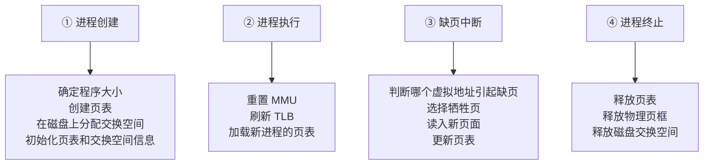

## 目录
- [[#操作系统在分页中的角色]]
- [[#缺页中断处理流程]]
- [[#指令备份问题]]
- [[#锁页（Page Locking）]]
- [[#💡 架构师视角映射]]
- [[#🔍 深挖指南]]

---

## 操作系统在分页中的角色

操作系统在以下四个关键时刻需要介入分页管理：



---

## 缺页中断处理流程

缺页中断是分页系统中最复杂的操作之一，涉及硬件和操作系统的密切配合。

```
缺页中断完整处理流程（13步）:

① 硬件陷入内核，保存 PC 到栈中
② 保存通用寄存器和其他易失状态
③ OS 确定是哪个虚拟页面引起缺页（从特殊寄存器或分析指令）
④ OS 检查虚拟地址是否合法，访问权限是否正确
   → 非法地址/权限不足 → 发送信号杀死进程（段错误 SIGSEGV）
   → 合法 → 继续
⑤ OS 选择一个空闲页框（或用置换算法选择牺牲页）
⑥ 如果牺牲页是脏页（M=1）→ 安排写回磁盘
   → 此时进程被挂起，OS 可以调度其他进程运行
⑦ 磁盘写完成后，OS 将需要的页从磁盘加载到空闲页框
   → 加载期间进程仍然挂起
⑧ 磁盘读完成 → 中断通知 OS
⑨ OS 更新页表：新页框号、P=1、R=0、M=0
⑩ 将引起缺页的指令恢复到"准备重新执行"的状态
⑪ 调度引起缺页的进程
⑫ 恢复保存的寄存器和程序状态
⑬ 重新执行引起缺页的指令 → 这次 TLB/页表命中 ✅
```

> [!warning] 两次磁盘 I/O
> 最坏情况下一次缺页需要**两次磁盘 I/O**（写回脏页 + 读入新页）
> 磁盘 I/O 约 10ms → 一次缺页可能耗时 20ms
> 而一次内存访问约 100ns → 缺页代价约为正常访问的 **20 万倍**

---

## 指令备份问题

> [!failure] 指令执行到一半怎么办？
> 某些复杂指令（如 x86 的 `MOVE` 可以带自增寻址模式）在执行过程中可能修改了多个寄存器，然后才触发缺页
> 指令需要"从头重新执行"→ 但中间状态已经被修改了！

```
问题示例（CISC 指令集）:

MOV.L  (A0)+, (A1)+     // 从[A0]复制到[A1]，A0和A1都+4

执行过程:
1. 读取 [A0] 的内容         ← 成功
2. A0 += 4                  ← A0 已经被修改!
3. 写入到 [A1]              ← 缺页中断!
4. A1 += 4                  ← 还没执行到

问题: 重新执行时，A0 已经 +4 了，再执行会变成 +8

解决方案:
- 方案1: CPU 设计者在指令前保存所有可能修改的寄存器的快照（微码ROM）
- 方案2: CPU 在指令执行前将指令的所有副作用记录到特殊寄存器中
         OS 可以通过这些信息"回退"到指令执行前的状态
```

> 类比：这就像你在做多步运算时被突然打断（缺页），想从头再做一遍，但你发现中间步骤已经把草稿纸上的数字擦掉了——你需要一个备份才能恢复
> CS 术语：这涉及**精确异常（Precise Exception）** 的概念——从异常恢复时，CPU 必须能够回到一个一致的状态。RISC 指令集（如 ARM、RISC-V）因为指令简单，通常更容易实现精确异常

---

## 锁页（Page Locking）

> [!warning] DMA 与页面置换的冲突
> 当一个进程发起 I/O 操作（如从磁盘读数据到内存缓冲区），DMA 控制器会直接将数据写入指定的物理页框
> 如果在 DMA 传输期间，该页框被页面置换算法选中淘汰并分配给了另一个进程 → **DMA 会把数据写到错误的进程的内存中！**

```
问题场景：

进程A: read(fd, buffer, size)  // DMA 正在往 buffer 所在的物理页框写数据
OS: 页面置换！选中了 buffer 的页框 → 分配给进程B
DMA: 继续往该物理页框写入 → 但现在它属于进程B了！→ 数据损坏

解决方案: 锁页（Pinning）
- 正在进行 I/O 的页面被标记为"锁定"（Pinned）
- 页面置换算法不会选中被锁定的页面
- I/O 完成后解锁
```

> [!tip] 锁页在 Java 中的对应
> - JVM 的 **JNI（Java Native Interface）** 中的 `GetPrimitiveArrayCritical()` 会锁定数组不被 GC 移动
> - Netty 的 **DirectByteBuffer** 分配的堆外内存默认不受 GC 管理，类似"锁定"
> - `-XX:+AlwaysPreTouch` 参数让 JVM 启动时就将所有堆内存页面"摸"一遍 → 避免运行时缺页

---

## 💡 架构师视角映射

| 操作系统概念 | Java 后端映射 |
|------------|-------------|
| 缺页中断处理（13步流水线） | 类比 Spring 请求处理流水线：Filter → DispatcherServlet → Handler → View → Response |
| 两次磁盘 I/O 的代价 | 数据库事务的 Redo Log + Binlog 双写；跨网络远程调用的 RTT 开销 |
| 指令备份与精确异常 | 事务的原子性（Atomicity）：要么全做要么全不做；Spring 的 `@Transactional` 回滚 |
| 锁页（Pinning） | JVM 的 `pin` 操作（JDK 21 Virtual Thread 中 pinned thread 问题）；MySQL Buffer Pool 页面固定 |
| DMA 绕过 CPU | Java NIO 的 **零拷贝（Zero-Copy）**：`FileChannel.transferTo()` 让数据不经过用户空间 |

---

## 🔍 深挖指南

> [!note] 核心要点
> 1. 缺页中断处理是操作系统最复杂的流程之一，涉及硬件陷入、磁盘 I/O、页表更新、进程调度
> 2. 指令备份问题在 CISC 架构上尤为棘手，RISC 架构天然更容易处理
> 3. 锁页是保证 DMA 安全的关键机制

- 精确异常与非精确异常的区别 → 参考 Hennessy & Patterson 《计算机体系结构：量化研究方法》 第 C 附录
- Linux 缺页处理的源码分析 → 参考 `mm/memory.c` 中的 `do_page_fault()` 和 `handle_mm_fault()`
- DMA 与零拷贝在性能优化中的应用 → 参考 《UNIX 网络编程》和 Kafka 关于 `sendfile()` 系统调用的设计
