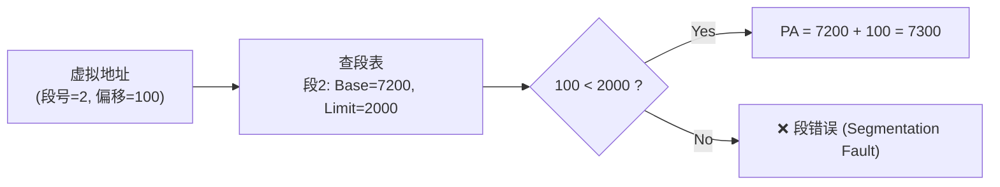
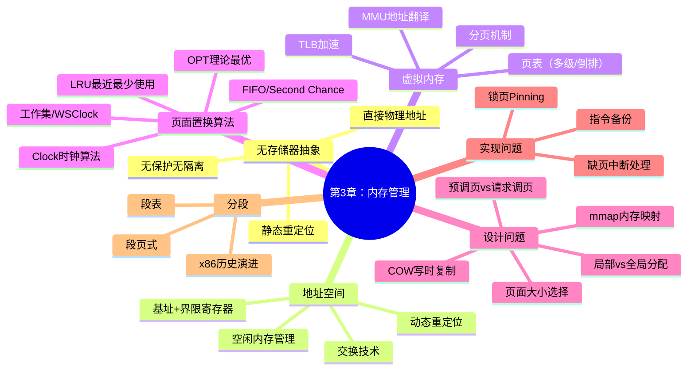

## 目录
- [[#为什么需要分段？]]
- [[#分段的实现]]
- [[#段页式（Segmentation with Paging）]]
- [[#Intel x86 的段页式]]
- [[#第三章总结]]
- [[#💡 架构师视角映射]]
- [[#🔍 深挖指南]]

---

## 为什么需要分段？

> [!question] 分页不够好吗？
> 分页将虚拟地址空间视为**一维线性**的 → 但程序逻辑上有多个独立的部分：代码段、数据段、堆、栈等
> 如果程序中的某个段需要增长（如符号表），而它的后面紧挨着另一个段，就会出问题

```
分页的一维空间问题：

虚拟地址空间（一维）：
0 ──────────────────────────── MAX
│ 代码 │ 常量 │ 堆 →    │   │ ← 栈 │

如果堆需要增长但碰到了常量段 → 无法增长！

分段的二维空间：
每个段独立编址，各自有自己的地址空间

段0（代码）:   0 ────────── 12K
段1（常量）:   0 ────── 8K
段2（堆）  :   0 ────────────── 16K → 可以独立增长到 20K
段3（符号表）: 0 ──── 4K → 可以独立增长到 10K
段4（栈）  :   0 ────────── 12K
```

> 类比：分页像一本书的连续页码——所有内容从第 1 页到第 N 页顺序排列。分段像一个文件柜——每个抽屉（段）独立存储不同类型的文件（代码、数据、栈），每个抽屉可以独立扩容，而不影响其他抽屉
> CS 术语：**分段（Segmentation）** 为每个逻辑单元提供独立的地址空间，支持**独立增长**和**独立保护**

**分段的优势**：
1. 每个段可以**独立增长/收缩**，不影响其他段
2. 每个段可以有**独立的保护属性**（代码段只读+可执行，数据段读写）
3. 段可以在进程间**共享**（如共享库的代码段）
4. 段可以**独立编译和链接**

---

## 分段的实现

```
段表（Segment Table）：

┌─────┬──────────┬────────┬──────────┐
│段号  │ 基址(Base)│ 长度   │ 保护位   │
├─────┼──────────┼────────┼──────────┤
│  0  │  2400    │  1000  │ R-X      │ ← 代码段
│  1  │  5800    │  500   │ R--      │ ← 常量段
│  2  │  7200    │  2000  │ RW-      │ ← 堆
│  3  │  4300    │  400   │ RW-      │ ← 符号表
│  4  │  1200    │  1200  │ RW-      │ ← 栈
└─────┴──────────┴────────┴──────────┘

虚拟地址 = (段号, 段内偏移)
物理地址 = 段表[段号].Base + 偏移
条件: 偏移 < 段表[段号].长度，否则段错误
```



> [!warning] 分段的缺点：外部碎片
> 段的大小不固定 → 在物理内存中会产生**外部碎片（External Fragmentation）**
> 这与 [[3.2 地址空间与交换技术#内存紧缩]] 中讨论的碎片问题相同
> 解决方案 → 结合分页，即**段页式**

---

## 段页式（Segmentation with Paging）

**段页式**结合了分段和分页的优点：
- **分段**提供逻辑上的独立性（独立增长、保护、共享）
- **分页**消除外部碎片（段内再分页，每页固定大小）

```
段页式的地址翻译：

虚拟地址:
┌──────────┬──────────┬──────────────┐
│  段号     │  页号     │  页内偏移     │
│(Segment) │ (Page)   │  (Offset)    │
└──────────┴──────────┴──────────────┘

翻译过程:
  段号 → 段表 → 获得该段的页表基址
  页号 → 页表 → 获得物理页框号
  物理地址 = 页框号 × 页大小 + 页内偏移
```


---

## Intel x86 的段页式

> [!info] x86 的分段历史
> Intel 8086（16位）首先引入了分段机制（16位段寄存器 + 16位偏移 → 20位物理地址）
> 80386 引入了分页机制，形成了**段页式**的两层地址翻译
> 现代 x86-64 在 64 位长模式（Long Mode）下基本**弃用**了分段（段基址固定为 0），只保留分页

```
x86 保护模式下的地址翻译:

          段选择子(Selector)              线性地址
逻辑地址 ──────────────→ 分段单元 ─────────────→ 分页单元 ──→ 物理地址
(段:偏移)                  │                         │
                    ┌──────┘                   ┌─────┘
                    ▼                          ▼
              GDT/LDT 段描述符         CR3 → 页目录 → 页表 → 页框
              获取段基址+限长            二级分页
              线性地址 = 基址+偏移

现代 x86-64:
  段基址全部设为 0 → 逻辑地址 = 线性地址 → 只走分页
  分段机制仅用于特权级检查（Ring 0/3）
```

---

## 第三章总结



| 内存管理技术 | 核心思想 | 是否仍在使用 |
|------------|---------|------------|
| 无抽象（裸物理地址） | 程序直接操作物理地址 | ❌ 嵌入式极简系统 |
| 基址+界限寄存器 | 简单硬件保护 | ❌ 被分页取代 |
| 交换（Swapping） | 整个进程换入换出 | ⚠️ 有限使用（Linux swap） |
| 分页（Paging） | 固定大小页，虚实映射 | ✅ **核心机制** |
| 分段（Segmentation） | 逻辑段独立编址 | ⚠️ x86-64 几乎弃用 |
| 段页式 | 分段 + 分页结合 | ⚠️ x86 保护模式 |
| 虚拟内存 | 按需分页 + 页面置换 | ✅ **现代 OS 基础** |

> [!tip] 内存管理的演进路线
> 无抽象 → 基址/界限 → 分段 → 分页 → 虚拟内存 → 大页/透明大页
> 每一步都是为了解决上一步遗留的问题：保护、碎片、效率、灵活性

---

## 💡 架构师视角映射

| 操作系统概念 | Java 后端映射 |
|------------|-------------|
| 分段 → 逻辑分区 | JVM 内存区域划分：堆、栈、方法区、PC 寄存器 → 每个区域独立管理 |
| 段表 | JVM 的**运行时常量池**就是一种"段表"——记录了每个类的符号引用、常量的位置 |
| 段页式 = 分段 + 分页 | MySQL InnoDB 的**表空间（Segment）+ 页（Page）** 架构 → 表空间分段管理，段内分页 |
| 外部碎片 | JVM CMS 收集器的碎片问题 → G1 通过固定 Region 大小（类似分页）消除碎片 |
| 保护属性（RWX） | Java 安全模型：SecurityManager + Policy 文件定义不同代码的权限（类似段保护） |

---

## 🔍 深挖指南

> [!note] 核心要点
> 1. 分段提供了逻辑上的组织和保护，但产生外部碎片
> 2. 段页式结合两者优点，是 x86 保护模式的基础
> 3. 现代 x86-64 基本弃用分段，只靠分页 → 反映了分页机制的胜利

- x86 保护模式的完整段页式地址翻译 → 参考 Intel 手册 Volume 3A, Chapter 3 "Protected-Mode Memory Management"
- GDT/LDT 段描述符结构 → 原书 3.7.4 节和 CSAPP 第 9 章附录
- Linux 如何（不）使用分段 → 参考 《Understanding the Linux Kernel》第 2 章 "Memory Addressing"
- InnoDB 的段/页/区架构 → 参考《MySQL 是怎样运行的》第 9 章 "InnoDB 的表空间"
