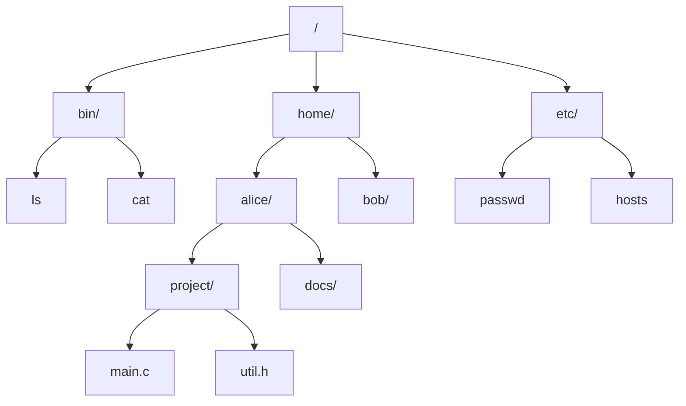
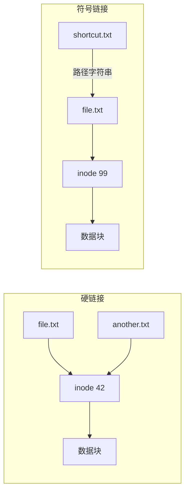

## 目录
- [[#一级目录系统]]
- [[#层次目录系统]]
- [[#路径名]]
- [[#目录操作]]
- [[#链接（Link）]]
- [[#💡 架构师视角映射]]
- [[#🔍 深挖指南]]

---

## 一级目录系统

最简单的目录结构：整个系统只有**一个目录**，所有文件都放在里面。

```
一级目录（单层）:

根目录:
┌────────┬────────┬────────┬────────┬────────┐
│ cat.c  │ dog.c  │ data   │ test   │ main.c │
└────────┴────────┴────────┴────────┴────────┘

问题:
- 文件数量多时难以管理
- 不同用户文件名可能冲突
- 无法按逻辑分组组织文件

类似于把所有文件都丢在桌面上——找什么都费劲
```

---

## 层次目录系统

引入**树形目录结构**——允许用户创建子目录来分类管理文件。

```
层次目录（树形）:

                    /（根目录）
                ┌────┼────┐
               /    /      \
            bin   home      etc
            │    ┌──┴──┐     │
           ls   alice  bob  passwd
                │      │
            ┌──┼──┐   docs
           .c  .h  img  │
                       resume.pdf
```



> 类比：层次目录就像把文件整理到不同的抽屉柜里——每个抽屉（目录）里还可以有更小的分格（子目录）。你不需要记住每个文件具体在哪，只需要知道它在哪个抽屉的哪个分格
> CS 术语：层次目录形成一棵**目录树（Directory Tree）**，每个节点是一个目录或文件，根节点是**根目录（Root Directory）**

---

## 路径名

```
两种路径名:

① 绝对路径名（Absolute Path）:
   从根目录开始的完整路径
   UNIX:    /home/alice/project/main.c
   Windows: C:\Users\alice\project\main.c

② 相对路径名（Relative Path）:
   从当前工作目录（CWD）开始的路径
   如果 CWD = /home/alice:
   project/main.c      → /home/alice/project/main.c
   ../bob/docs/         → /home/bob/docs/

特殊目录项:
   .   → 当前目录（本目录自身）
   ..  → 父目录（上一级目录）
```

> [!info] 工作目录（Working Directory / CWD）
> 每个进程都有一个**当前工作目录**
> 相对路径就是基于这个目录来解析的
> `cd` 命令改变的就是 shell 进程的工作目录
>
> Java 中：`System.getProperty("user.dir")` 获取 JVM 进程的工作目录

---

## 目录操作

| 操作 | 系统调用 | 说明 |
|------|---------|------|
| 创建目录 | `mkdir()` | 创建空目录（自动包含 `.` 和 `..`） |
| 删除目录 | `rmdir()` | 只能删除空目录 |
| 打开目录 | `opendir()` | 读取目录内容前必须先打开 |
| 读取目录 | `readdir()` | 返回目录中的下一个条目 |
| 关闭目录 | `closedir()` | 释放内部资源 |
| 重命名 | `rename()` | 修改目录名 |
| 链接 | `link()` | 创建硬链接 |
| 解除链接 | `unlink()` | 删除目录项（文件引用计数-1） |

> [!warning] UNIX 中 "删除文件" 的真相
> UNIX 中没有严格意义上的 "delete" 系统调用
> `unlink()` 实际上是**删除一个目录项**（断开一个名字与文件的链接）
> 只有当文件的**链接计数（link count）降为 0** 且**没有进程打开该文件**时，文件数据才会真正被释放
> 
> 这就是为什么删除正在被进程读写的文件后，该进程仍能正常访问——因为文件的 inode 还在

---

## 链接（Link）

### 硬链接（Hard Link）

```
硬链接：多个目录项指向同一个 inode

创建前:
目录A:  file.txt → inode 42 (link count = 1)

$ ln file.txt another_name.txt

创建后:
目录A:  file.txt        → inode 42 (link count = 2)
目录A:  another_name.txt → inode 42 (link count = 2)
                            │
                            ▼
                     ┌──────────────┐
                     │   inode 42   │
                     │  数据块指针   │──→ 实际数据
                     │  link count=2│
                     └──────────────┘

删除 file.txt → link count=1 → 文件仍然存在
删除 another_name.txt → link count=0 → 文件数据被释放
```

### 符号链接（Symbolic/Soft Link）

```
符号链接：一个特殊文件，内容是另一个文件的路径名

$ ln -s /home/alice/file.txt /home/bob/shortcut.txt

shortcut.txt:
┌──────────────────────────────────┐
│ 文件内容: "/home/alice/file.txt" │  ← 存的是路径字符串
└──────────────────────────────────┘

访问 shortcut.txt → OS 读取其内容 → 得到路径 → 找到真正的文件

问题: 如果原文件被删除 → 符号链接变成"悬空链接（Dangling Link）"
```



> [!info] 硬链接 vs 符号链接
> | 特性 | 硬链接 | 符号链接 |
> |------|--------|---------|
> | 跨文件系统 | ❌ 不可以 | ✅ 可以 |
> | 链接目录 | ❌ 通常不可以 | ✅ 可以 |
> | 原文件删除 | 不受影响 | ❌ 悬空链接 |
> | 实现方式 | 多个目录项→同一 inode | 特殊文件存路径 |
> | 磁盘开销 | 仅增加目录项 | 额外消耗一个 inode |
> | 性能 | 与原文件相同 | 多一次路径解析 |

---

## 💡 架构师视角映射

| 操作系统概念 | Java 后端映射 |
|------------|-------------|
| 目录树结构 | Java 包结构（`com.example.service`）→ 本质就是目录层次 |
| 绝对路径 vs 相对路径 | Spring 的 classpath 路径解析；Maven 项目的 `basedir` |
| 工作目录 CWD | Spring Boot 的工作目录；Docker 的 `WORKDIR` 指令 |
| 硬链接 → 共享 inode | Java 中多个引用变量指向同一个对象 → 引用计数 → GC 回收 |
| 符号链接 → 间接引用 | Spring 的 `@Autowired` 依赖注入 → 间接引用 Bean；DNS CNAME 记录 |
| `unlink` + 引用计数 | JVM GC 的可达性分析：当对象的引用计数归零（或不可达）→ 回收 |
| 目录项 = (文件名, inode号) | HashMap 的 Entry = (key, value)；DNS 记录 = (域名, IP) |

---

## 🔍 深挖指南

> [!note] 核心要点
> 1. 目录是将文件名映射到文件实体（inode）的数据结构
> 2. 层次目录（树形结构）是现代文件系统的标准组织方式
> 3. 硬链接共享 inode 数据，符号链接存储路径字符串——两种链接机制各有优劣

- UNIX 文件系统的 inode 和目录项结构 → 原书 4.3 节 [[4.3 文件系统的实现]]
- Linux 的 VFS（虚拟文件系统）如何统一不同文件系统 → 参考 《Understanding the Linux Kernel》第 12 章
- 硬链接和符号链接的实战 → 参考 《UNIX 环境高级编程》（APUE）第 4 章 "文件和目录"
- Java 的 `Files.createLink()` 和 `Files.createSymbolicLink()` → JDK 文档 `java.nio.file.Files`
