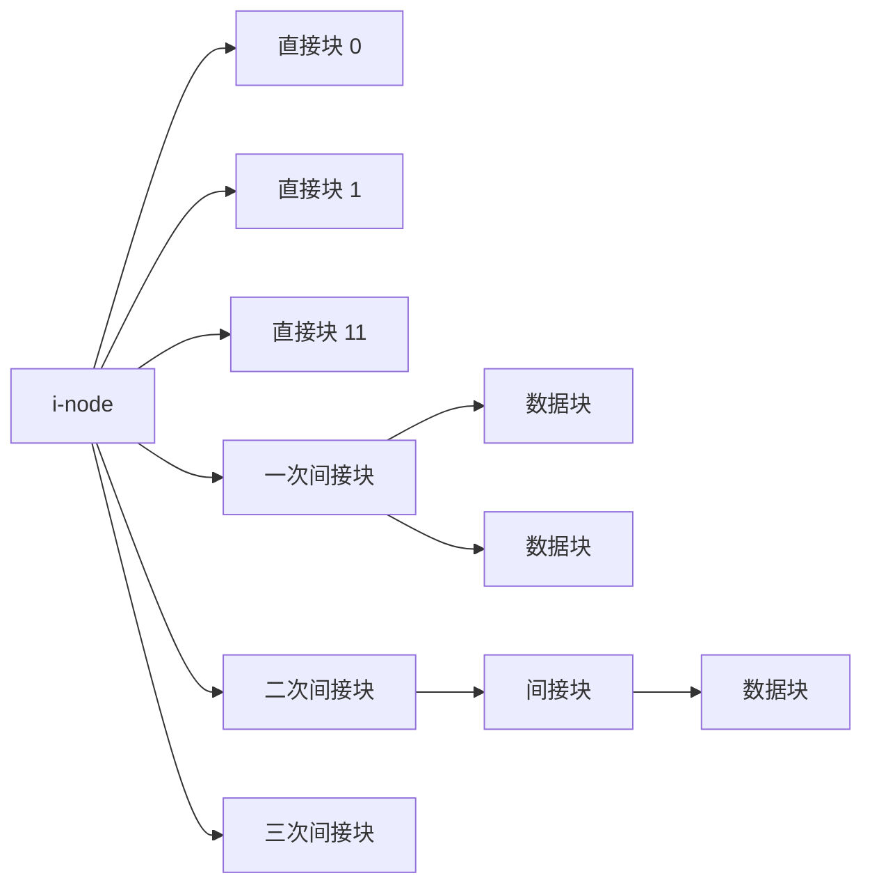
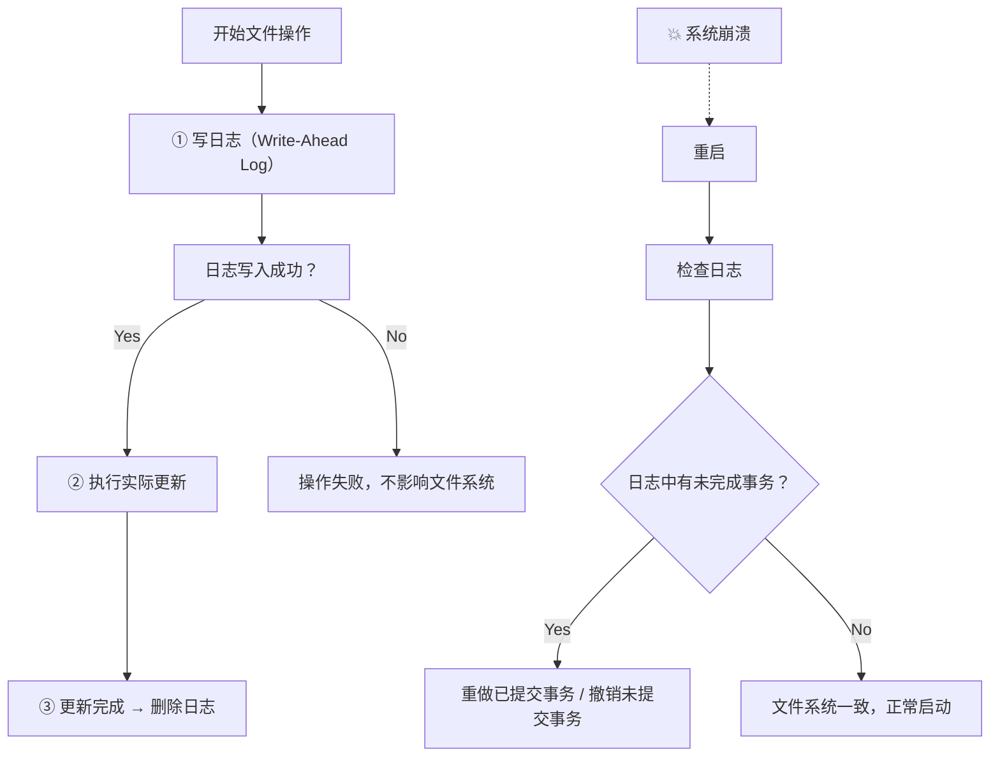
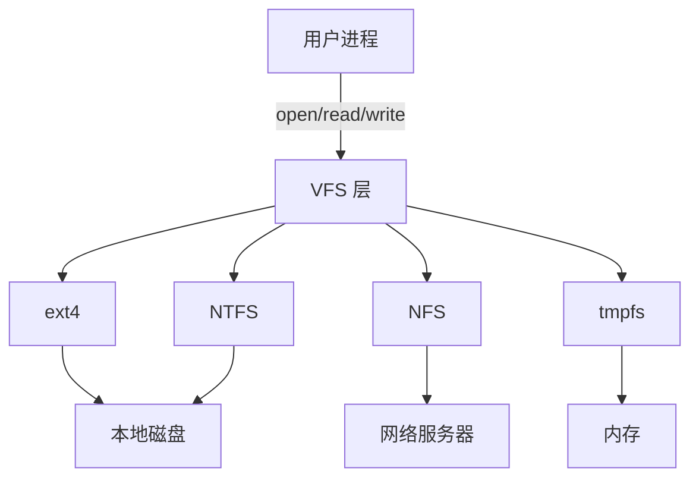

## 目录
- [[#文件系统的磁盘布局]]
- [[#文件的实现——磁盘块分配策略]]
	- [[#连续分配]]
	- [[#链表分配]]
	- [[#FAT（文件分配表）]]
	- [[#索引节点（i-node）]]
- [[#目录的实现]]
- [[#共享文件的实现]]
- [[#日志文件系统]]
- [[#虚拟文件系统（VFS）]]
- [[#💡 架构师视角映射]]
- [[#🔍 深挖指南]]

---

## 文件系统的磁盘布局

```
典型磁盘布局:

一块磁盘:
┌────────────────────────────────────────────────┐
│ 分区1              │ 分区2          │ 分区3     │
└────────────────────────────────────────────────┘

     MBR                   磁盘分区表
      │                       │
      ▼                       ▼
┌─────┬───────────────────────────────────────┐
│ MBR │ 分区表 │    分区1    │    分区2    │...│
└─────┴────────┴────────────┴────────────┴───┘

一个分区的内部结构:
┌──────┬──────┬────────┬────────┬─────────────────┐
│引导块│超级块 │空闲空间 │ i-node │      数据块      │
│Boot  │Super │管理信息 │  表    │    Data Blocks   │
│Block │Block │(位图等) │        │                  │
└──────┴──────┴────────┴────────┴─────────────────┘
  │       │       │         │           │
  │       │       │         │           └── 实际存储文件数据的地方
  │       │       │         └── 每个文件一个inode，存储文件元数据
  │       │       └── 跟踪哪些磁盘块是空闲的（位图或空闲链表）
  │       └── 文件系统的关键参数（魔数、块数量、块大小等）
  └── 包含引导代码，用于启动操作系统
```

> [!info] 超级块（Superblock）
> 超级块包含文件系统的"身份证信息"——
> - 文件系统类型的**魔数**
> - 文件系统中的**数据块总数**
> - **块大小**
> - **空闲块数**
> - **空闲 inode 数**
> - 其他关键参数
> 
> 超级块损坏 = 整个文件系统不可读 → 所以文件系统通常在多处保存超级块的副本

---

## 文件的实现——磁盘块分配策略

文件系统的核心问题之一：**如何跟踪文件使用了哪些磁盘块？**

### 连续分配

**策略**：每个文件占用磁盘上**连续的一组块**。目录项中只需记录**起始块号**和**块数**。

```
连续分配:

磁盘块:
│ 0 │ 1 │ 2 │ 3 │ 4 │ 5 │ 6 │ 7 │ 8 │ 9 │10 │11 │12 │13 │14 │
├───┼───┼───┼───┼───┼───┼───┼───┼───┼───┼───┼───┼───┼───┼───┤
│   │ A │ A │ A │ A │   │ B │ B │   │   │ C │ C │ C │   │   │

文件A: 起始块=1, 长度=4 → 块 1,2,3,4
文件B: 起始块=6, 长度=2 → 块 6,7
文件C: 起始块=10,长度=3 → 块 10,11,12
```

> [!tip] 连续分配的优缺点
> **优点**：
> - 实现极简单：目录项只需 (起始块, 长度) 两个字段
> - **随机访问高效**：第 k 块 = 起始块 + k
> - **顺序读取最快**：磁头不需要移动（都在连续区域）
> 
> **缺点**：
> - **外部碎片**：文件删除后留下"空洞"，新文件可能放不下
> - **文件大小必须预知**：创建时就要确定大小
> - **文件无法增长**：除非后面恰好有空闲块
>
> **适用场景**：CD-ROM / DVD（只读，文件大小已知），SSD（碎片影响小）

### 链表分配

**策略**：每个磁盘块的开头几个字节存储**下一块的块号**，形成链表。

```
链表分配:

目录项: file.txt → 起始块=4

块4         块7         块2         块10
┌─────────┐ ┌─────────┐ ┌─────────┐ ┌─────────┐
│ next: 7 │→│ next: 2 │→│next: 10 │→│next: -1 │ (-1=结束)
│ 数据     │ │ 数据     │ │ 数据     │ │ 数据     │
│ ...     │ │ ...     │ │ ...     │ │ ...     │
└─────────┘ └─────────┘ └─────────┘ └─────────┘
```

> [!failure] 链表分配的严重问题
> 1. **随机访问极慢**：要读第 N 块，必须从头遍历 N 次链表（磁盘 I/O！）
> 2. **每块存指针浪费空间**：假设块 1KB、指针 4B → 每块实际可用 1020B → 不是 2 的幂次！
>    这破坏了"读一块 = 读 2ⁿ 字节"的整洁性

### FAT（文件分配表）

**策略**：将所有链表指针从磁盘块中取出，集中放在一张表（FAT）中，**常驻内存**。

```
FAT（File Allocation Table）:

目录项: file.txt → 起始块=4

FAT 表（在内存中）:            磁盘数据块:
┌──────┬────────┐
│ 块号  │ 下一块  │              ┌─────────┐
├──────┼────────┤         块0: │ (空闲)   │
│  0   │ FREE   │              ├─────────┤
│  1   │ FREE   │         块1: │ (空闲)   │
│  2   │  10    │  ──→         ├─────────┤
│  3   │ FREE   │         块2: │ 文件数据  │ ← 第3块
│  4   │   7    │  ──→         ├─────────┤
│  5   │ FREE   │         块3: │ (空闲)   │
│  6   │ FREE   │              ├─────────┤
│  7   │   2    │  ──→    块4: │ 文件数据  │ ← 第1块（起始）
│  8   │ FREE   │              ├─────────┤
│  9   │ FREE   │         ...
│ 10   │  EOF   │  ──→    块7: │ 文件数据  │ ← 第2块
└──────┴────────┘              ├─────────┤
                          块10:│ 文件数据  │ ← 第4块（最后）
链路: 4 → 7 → 2 → 10(EOF)     └─────────┘

关键优势: FAT 表常驻内存 → 遍历链表不需要磁盘 I/O！
随机访问: 在内存中沿 FAT 链遍历，找到第N块的块号后直接读磁盘
```

> [!warning] FAT 的缺点
> FAT 表大小 = 磁盘块数 × 表项大小
> 对于 200GB 磁盘、1KB 块：2 亿个块 × 4B = **800MB** 的 FAT 表需要常驻内存！
> 这在大磁盘时代不可接受 → FAT 主要用于 U 盘等小容量设备（FAT32 最大支持 2TB，块大小受限）

> 类比：连续分配像一排停车位，必须连着停；链表分配像停车场的车位散着停，每个车位的标牌指向"下一辆车在哪"；FAT 就像停车场入口处有一张大地图，标注了每辆车的位置链路
> CS 术语：FAT 将链表的**指针域**从数据块中剥离到独立的表中，实现了**索引与数据分离**

### 索引节点（i-node）

**策略**：每个文件有一个 **i-node（索引节点）**，里面记录了文件属性和所有磁盘块的地址。

```
i-node 结构（以 UNIX 为例）:

┌──────────────────────────┐
│         i-node            │
├──────────────────────────┤
│ 文件类型、权限、大小       │
│ 所有者、时间戳            │
│ 链接计数                  │
├──────────────────────────┤
│ 直接块指针 0  → 块 23     │ ← 前 12 个块直接寻址
│ 直接块指针 1  → 块 41     │
│ ...                      │
│ 直接块指针 11 → 块 88     │
├──────────────────────────┤
│ 一次间接指针   → 间接块    │ ← 指向一个"指针块"
│                  ├→ 块 102│     可寻址 256 个块
│                  ├→ 块 103│     (假设块4KB,指针4B)
│                  └→ ...   │     = 4KB/4B = 1024块
├──────────────────────────┤
│ 二次间接指针   → 间接块    │ ← 指向"指针块的指针块"
│                  ├→ 间接块 │     可寻址 1024²块
│                  │  ├→ ...│     = 1,048,576 块
├──────────────────────────┤
│ 三次间接指针   → ...      │ ← 可寻址 1024³ 块
│                           │     = 约 10 亿块
└──────────────────────────┘
```



> [!tip] i-node 的精妙设计
> - **小文件**（< 48KB，12 个直接块）：**无需间接寻址**，一次 I/O 就能找到任意块 → 极快
> - **中等文件**（< 4MB+）：只需一次间接寻址
> - **大文件**（< 4GB+）：需要二次/三次间接寻址
> - 绝大多数文件都是小文件 → i-node 的设计完美匹配了文件大小的实际分布
>
> 对比 FAT：i-node 只在**打开文件时**加载到内存，而 FAT 需要**整张表**常驻内存

---

## 目录的实现

**目录在磁盘上就是一个特殊的文件**，其内容是一组**目录项（Directory Entry）**。

```
方案一：目录项中直接存放文件属性

目录文件的内容:
┌────────────────────────────────────────┐
│  "file1.txt" │ 属性 │ 磁盘块地址...    │ 目录项1
├────────────────────────────────────────┤
│  "file2.txt" │ 属性 │ 磁盘块地址...    │ 目录项2
├────────────────────────────────────────┤
│  ...                                   │
└────────────────────────────────────────┘
Windows 的 FAT / NTFS 采用类似方案

方案二：目录项只存文件名 + inode号

目录文件的内容:
┌──────────┬──────────┐
│ 文件名    │ inode号  │
├──────────┼──────────┤
│ file1.txt│   42     │ → 到 inode 表查 inode 42 获取文件属性
│ file2.txt│   73     │
│ .        │   15     │ ← 本目录自身
│ ..       │    2     │ ← 父目录
└──────────┴──────────┘
UNIX/Linux 采用此方案 → 文件属性全部存在 inode 中
```

> [!info] 长文件名的处理
> 早期系统限制文件名长度（如 FAT 的 8.3 格式）
> 现代系统支持长文件名（255 字符），实现方式：
> - **方案1**：目录项固定 255 字节 → 浪费空间
> - **方案2**：目录项可变长度 + 长度前缀 → 节省空间但管理复杂
> - **方案3**：目录项中存放指向堆区的指针，文件名集中存放在堆中

---

## 共享文件的实现

当多个目录需要共享同一个文件时（如 [[4.2 目录#链接（Link）]]），有两种实现方式：

```
方案一：硬链接 → 共享 inode

目录A:                        目录B:
┌──────────┬──────┐          ┌──────────┬──────┐
│ file.txt │ i=42 │          │ link.txt │ i=42 │  ← 同一个 inode
└──────────┴──────┘          └──────────┴──────┘
                                    │
                    inode 42: link_count = 2

方案二：符号链接 → 创建新文件

目录A:                        目录B:
┌──────────┬──────┐          ┌──────────┬──────┐
│ file.txt │ i=42 │          │ link.txt │ i=99 │  ← 新 inode
└──────────┴──────┘          └──────────┴──────┘
                                    │
                    inode 99: 文件内容 = "/A/file.txt"
```

---

## 日志文件系统

> [!failure] 崩溃一致性问题
> 如果系统在文件操作过程中崩溃（如创建文件需要更新 inode、位图、目录项），可能只完成了部分操作
> → 文件系统处于**不一致状态**
> 
> 例如：inode 已分配但目录项未写入 → 磁盘空间泄漏
> 解决方案1：重启后运行 `fsck`（全盘扫描修复）→ 极慢
> 解决方案2：**日志文件系统（Journaling File System）**

```
日志文件系统的工作流程:

                    日志区域（Log Area）
                   ┌───────────────────────┐
Step 1: 写日志     │ 操作: 创建 file.txt    │
(Write-Ahead      │ - 分配 inode 42        │
 Logging)         │ - 更新位图 bit 42=1    │
                  │ - 在目录中添加条目      │
                  │ [BEGIN]...[COMMIT]     │
                  └───────────────────────┘
                           │
Step 2: 执行操作            ▼
                  修改 inode 表 → 修改位图 → 修改目录
                           │
Step 3: 删除日志            ▼
                  操作全部完成 → 删除日志记录

如果在 Step 2 中崩溃:
→ 重启后检查日志 → 发现未完成的事务 → 重做（Redo）或撤销（Undo）
→ 恢复到一致状态，无需全盘扫描！
```



> 类比：日志文件系统就像银行转账——在实际操作前先在"账本"（日志）上记录要做的事情。如果操作中间断电了，重新启动后查看账本就知道做到哪一步了，可以继续完成或撤销
> CS 术语：日志文件系统采用了数据库的 **WAL（Write-Ahead Logging）** 技术，保证了**崩溃一致性（Crash Consistency）**

> [!tip] 常见日志文件系统
> | 文件系统 | 操作系统 | 日志类型 |
> |---------|---------|---------|
> | ext3/ext4 | Linux | 支持三种模式：journal/ordered/writeback |
> | XFS | Linux | 元数据日志 |
> | NTFS | Windows | 元数据日志 |
> | ZFS | Solaris/FreeBSD | COW（不使用传统日志） |
> | Btrfs | Linux | COW + B-Tree |

---

## 虚拟文件系统（VFS）

现代操作系统需要同时支持多种文件系统（ext4、NTFS、NFS、tmpfs 等），**VFS** 提供了统一的接口。



```
VFS 的四个核心对象:

┌──────────────┬──────────────────────────────────┐
│ VFS 对象      │ 说明                              │
├──────────────┼──────────────────────────────────┤
│ superblock   │ 代表一个已挂载的文件系统             │
│ inode        │ 代表一个文件（元数据）               │
│ dentry       │ 代表一个目录项（路径组件）            │
│ file         │ 代表一个进程打开的文件               │
└──────────────┴──────────────────────────────────┘

每个具体文件系统只需"实现"这些对象的操作即可
→ 类似于面向接口编程中的"接口与实现"
```

> [!tip] VFS = 接口/抽象类
> VFS 定义了 `read()`、`write()`、`open()` 等虚函数
> ext4 实现了 ext4 版本的 `read()`
> NTFS 实现了 NTFS 版本的 `read()`
> 上层调用统一的 VFS 接口，VFS 根据文件所在的文件系统**动态派发**到对应实现
> 
> 这就是**多态（Polymorphism）** 在操作系统内核中的经典应用

---

## 💡 架构师视角映射

| 操作系统概念 | Java 后端映射 |
|------------|-------------|
| 磁盘布局：超级块 + inode表 + 数据块 | MySQL InnoDB：**系统表空间** + **数据字典** + **数据/索引页** |
| 连续分配 | 数组存储：随机访问 O(1)，但插入/扩容代价大 → `ArrayList` |
| 链表分配 | 链表存储：插入 O(1)，但随机访问 O(n) → `LinkedList` |
| FAT 表 | 类似于 HashMap 的桶数组 → 集中管理索引信息 |
| i-node 多级索引 | **B+Tree 索引**：叶节点存数据指针，内部节点存索引 → 多级寻址 |
| i-node 直接块 + 间接块 | MySQL 的自适应哈希索引（AHI）：热数据直接哈希定位（类似直接块），冷数据走 B+Tree（类似间接块） |
| 日志文件系统（WAL） | MySQL 的 **Redo Log（重做日志）** → 先写日志再写数据页 → 保证崩溃恢复 |
| VFS 统一接口 | Spring 的 **Resource** 抽象：`ClassPathResource`、`FileSystemResource`、`UrlResource` 统一读取接口 |
| VFS 多态派发 | Java 的**接口 + 多态**：`DataSource` 接口 → HikariCP / Druid / C3P0 不同实现 |

> [!info] InnoDB 与文件系统的对话
> InnoDB 的 `ibdata1`（系统表空间）就是一个基于文件系统之上的"二级文件系统"：
> - **段（Segment）** ≈ 文件系统的段
> - **区（Extent，1MB）** ≈ 一组连续磁盘块
> - **页（Page，16KB）** ≈ 一个磁盘块
> InnoDB 自己管理这些页的分配和回收，绕过了 OS 的文件系统页管理

---

## 🔍 深挖指南

> [!note] 核心要点
> 1. **磁盘块分配**是文件系统的灵魂——连续/链表/FAT/inode 各有适用场景
> 2. **i-node** 是 UNIX 文件系统的核心数据结构：通过多级索引优雅支持从小文件到大文件
> 3. **日志文件系统**用 WAL 解决了崩溃一致性问题，与数据库的 Redo Log 原理一致
> 4. **VFS** 用面向对象的思想统一了不同文件系统的接口

- i-node 的详细磁盘结构 → 参考《UNIX 环境高级编程》第 4 章 和 ext4 的 inode 定义
- 日志文件系统的三种模式（data/ordered/writeback） → 原书 4.3.5 节 + `man mount` 查看 ext4 选项
- VFS 的内核源码 → `fs/` 目录下的 `inode.c`、`super.c`、`namei.c`
- MySQL Redo Log 与文件系统日志的对比 → 参考《MySQL 是怎样运行的》第 19-20 章
- B+Tree 索引与 i-node 多级索引的异同 → 参考 CSAPP 第 6 章（存储器层次结构）
