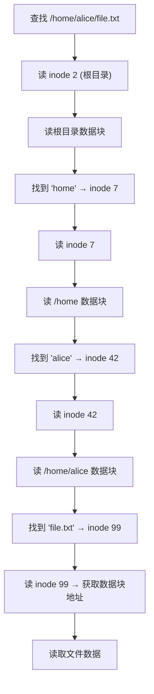
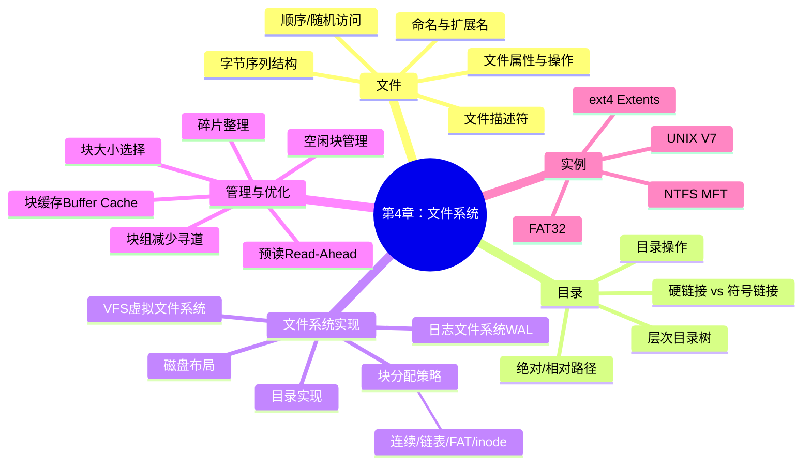

## 目录
- [[#UNIX V7 文件系统]]
- [[#ext4 文件系统]]
- [[#FAT 文件系统]]
- [[#NTFS 文件系统]]
- [[#第四章总结]]
- [[#💡 架构师视角映射]]
- [[#🔍 深挖指南]]

---

## UNIX V7 文件系统

UNIX V7 是理解现代文件系统的经典起点——它奠定了 ext 系列文件系统的基础。

```
UNIX V7 文件系统结构:

磁盘分区:
┌──────┬───────┬──────────┬─────────────────────┐
│ 引导块│ 超级块 │ i-node 区 │       数据块区        │
│      │       │          │                     │
│ 512B │ 1 块  │ i-node   │     文件数据          │
│      │       │ 表       │     + 目录数据        │
└──────┴───────┴──────────┴─────────────────────┘

查找 /home/alice/file.txt 的完整过程:

Step 1: 读取根目录的 inode（inode 1 或 2，固定位置）
Step 2: 从根 inode 获取数据块 → 读取根目录内容
        ┌─────────┬──────┐
        │  "home"  │ i=7  │ ← 找到 "home" 对应 inode 7
        │  "etc"   │ i=5  │
        │  "bin"   │ i=3  │
        └─────────┴──────┘
Step 3: 读取 inode 7 → 获取 /home 目录的数据块
Step 4: 在 /home 目录中找 "alice"
        ┌─────────┬──────┐
        │ "alice"  │ i=42 │ ← 找到 inode 42
        │ "bob"    │ i=55 │
        └─────────┴──────┘
Step 5: 读取 inode 42 → 获取 /home/alice 目录的数据块
Step 6: 在 /home/alice 中找 "file.txt"
        ┌────────────┬──────┐
        │ "file.txt"  │ i=99 │ ← 找到 inode 99
        └────────────┴──────┘
Step 7: 读取 inode 99 → 获取文件的数据块地址 → 读取数据

路径解析 = 逐级查找目录 → 每一级都需要一次 inode 读取 + 一次数据块读取
```



---

## ext4 文件系统

ext4 是 Linux 目前最主流的文件系统，从 ext2/ext3 一路演进而来。

```
ext4 的块组（Block Group）结构:

磁盘分区:
┌──────┬──────────┬──────────┬──────────┬──────────┐
│引导块 │  块组 0   │  块组 1   │  块组 2   │   ...    │
└──────┴──────────┴──────────┴──────────┴──────────┘

每个块组内部:
┌──────┬─────────┬─────────┬────────┬────────────────┐
│超级块 │块组描述符│数据块位图│inode位图│inode表│数据块   │
│(备份) │  表     │         │        │      │          │
└──────┴─────────┴─────────┴────────┴──────┴──────────┘
```

> [!info] ext4 的关键特性
>
> | 特性 | 说明 |
> |------|------|
> | **Extents** | 替代传统的间接块指针。一个 extent 描述一段连续块 (start, length) → 大幅减少元数据 |
> | **延迟分配** | 写入时先缓存，延迟到刷盘时才分配块 → 文件系统能更好地选择连续区域 → 减少碎片 |
> | **日志** | 支持 journal/ordered/writeback 三种日志模式（详见 [[4.3 文件系统的实现#日志文件系统]]） |
> | **大文件/大文件系统** | 最大支持 1EB 文件系统、16TB 单文件 |
> | **目录索引** | 使用 HTree（基于 B-Tree 的哈希树）加速大目录的查找 |
> | **多块分配** | 一次性分配多个块 → 减少位图操作次数 |
> | **在线碎片整理** | 支持 `e4defrag` 在线整理碎片 |

```
ext4 Extent 结构（替代间接块指针）:

传统 i-node（12 个直接块 + 3 级间接块）:
  小文件: 12个指针 → 最多48KB
  大文件: 需要多级间接块 → 大量元数据

ext4 Extent:
  ┌────────────────────────────────┐
  │  起始逻辑块号  │ 起始物理块号  │ 长度 │
  ├────────────────────────────────┤
  │      0        │    1000       │  500 │  → 块1000-1499
  │     500       │    3000       │  200 │  → 块3000-3199
  │     700       │    5000       │  300 │  → 块5000-5299
  └────────────────────────────────┘

  一个 extent 就能描述 500 个连续块
  传统方式需要 500 个指针！
  
  如果 extent 太多 → 使用 extent tree（B-Tree 结构存储 extents）
```

---

## FAT 文件系统

```
FAT 家族演进:

FAT12 → FAT16 → FAT32 → exFAT
 │        │        │        │
 └── 12位块号  16位块号  28位块号  更大支持
     软盘     早期硬盘  U盘/SD卡  大容量SD卡

FAT32 限制:
- 最大文件: 4GB（32位文件大小字段）
- 最大分区: 2TB（受限于块大小选择）
- 不支持权限、日志、硬链接

优势:
- 极其简单 → 所有操作系统都支持
- 几乎所有设备都能读 → U盘、SD卡、嵌入式设备的首选
```

> [!tip] 为什么 U 盘默认是 FAT32？
> 因为 FAT32 是**唯一一个被所有主流操作系统（Windows/macOS/Linux）、
> 所有嵌入式设备（相机/游戏机/车载系统）** 原生支持的文件系统
> 如果用 NTFS → macOS 默认只读
> 如果用 ext4 → Windows 不认

---

## NTFS 文件系统

**NTFS（New Technology File System）** 是 Windows NT 系列的核心文件系统。

```
NTFS 核心概念: 一切皆文件

NTFS 中连文件系统的元数据都被当作"文件"存储:

MFT（主文件表 / Master File Table）:
┌──────┬──────────────────────────────────┐
│ 条目  │ 说明                              │
├──────┼──────────────────────────────────┤
│  0   │ $MFT → MFT 自身                  │
│  1   │ $MFTMirr → MFT 的备份             │
│  2   │ $LogFile → 日志文件               │
│  3   │ $Volume → 卷信息                  │
│  4   │ $AttrDef → 属性定义               │
│  5   │ . → 根目录                        │
│  6   │ $Bitmap → 卷位图                  │
│  7   │ $Boot → 引导扇区                  │
│ 8-15 │ 其他系统元数据文件                  │
│ 16+  │ 用户文件和目录                     │
└──────┴──────────────────────────────────┘

每个 MFT 条目约 1KB，包含文件的所有属性（文件名、时间戳、数据等）
小文件（<900字节）可以完全存储在 MFT 条目内！→ "常驻属性"
```

> [!info] NTFS 的核心特性
>
> | 特性 | 说明 |
> |------|------|
> | **MFT** | 每个文件/目录一个 MFT 条目 → 类似 UNIX inode，但更自描述 |
> | **日志** | 元数据日志 → 保证崩溃一致性 |
> | **ACL 权限** | 比 UNIX rwx 更精细的访问控制列表 |
> | **压缩** | 文件级透明压缩 |
> | **加密** | EFS（加密文件系统）→ 文件级加密 |
> | **稀疏文件** | 支持大文件中的"空洞" → 不占磁盘空间 |
> | **B+Tree 目录** | 大目录使用 B+Tree 索引 → 查找快 |
> | **Unicode** | 文件名存储为 Unicode（UTF-16LE） |

---

## 第四章总结



| 文件系统 | 块分配 | 日志 | 最大文件 | 适用场景 |
|---------|--------|------|---------|---------|
| ext4 | Extent + B-Tree | ✅ | 16TB | Linux 主力 |
| XFS | Extent + B+Tree | ✅ | 8EB | 大文件/高 I/O |
| FAT32 | FAT 表 | ❌ | 4GB | U 盘/SD 卡 |
| NTFS | MFT + Run | ✅ | 16EB | Windows 主力 |
| ZFS | COW + Merkle Tree | ✅ | 16EB | 企业存储 |
| Btrfs | COW + B-Tree | ✅ | 16EB | Linux 新一代 |

> [!tip] 文件系统的核心设计权衡
> 
> | 维度 | 一端 | 另一端 |
> |------|------|--------|
> | 块大小 | 小块 → 空间利用高，性能低 | 大块 → 性能高，浪费空间 |
> | 块分配 | 连续 → 快但有碎片 | 间接/extent → 灵活但复杂 |
> | 一致性 | 写穿 → 安全但慢 | 写回 → 快但有丢数据风险 |
> | 元数据 | 就地更新+日志 | COW（ZFS/Btrfs）→ 无需日志 |
> | 目录索引 | 线性扫描 → 简单 | B-Tree/HTree → 快但复杂 |

---

## 💡 架构师视角映射

| 操作系统概念 | Java 后端映射 |
|------------|-------------|
| FAT → 简单通用 | H2 内存数据库 → 简单、所有 Java 应用都能用，但不适合生产 |
| ext4 → Linux 主力 | MySQL/PostgreSQL → 主流关系型数据库，功能全面 |
| NTFS → 企业级特性 | Oracle DB → 企业级，支持加密、压缩、高级权限 |
| ZFS/Btrfs → 新一代 COW | CockroachDB / TiDB → 新一代分布式数据库 |
| Extent → 连续块描述 | MySQL 的区（Extent = 64 页 = 1MB）→ 连续分配减少碎片 |
| MFT 常驻属性 | MySQL 的行溢出（Row Overflow）：小数据存在行内，大数据存在外部页 |
| VFS 路径解析 | Spring MVC 的 URL 路径解析：`/api/user/123` → 逐级解析路由 |

---

## 🔍 深挖指南

> [!note] 核心要点
> 1. UNIX V7 的 inode + 目录结构奠定了现代文件系统的基础
> 2. ext4 用 Extent 替代间接块指针，配合延迟分配和日志 → Linux 最主流文件系统
> 3. FAT 胜在简单和通用性，NTFS 胜在企业级特性
> 4. 新一代文件系统（ZFS/Btrfs）用 COW 替代就地更新+日志

- ext4 源码和 Extent 实现 → Linux 内核 `fs/ext4/`
- NTFS 内部结构 → 参考 Brian Carrier 《File System Forensic Analysis》
- ZFS 的 COW 和 Merkle Tree → 参考 Oracle 的 ZFS 白皮书
- 文件系统与数据库存储引擎的对比 → 参考 Alex Petrov 《Database Internals》 Part 1
- Linux I/O 栈全景 → 参考 Brendan Gregg 的 《BPF Performance Tools》 Chapter 8
