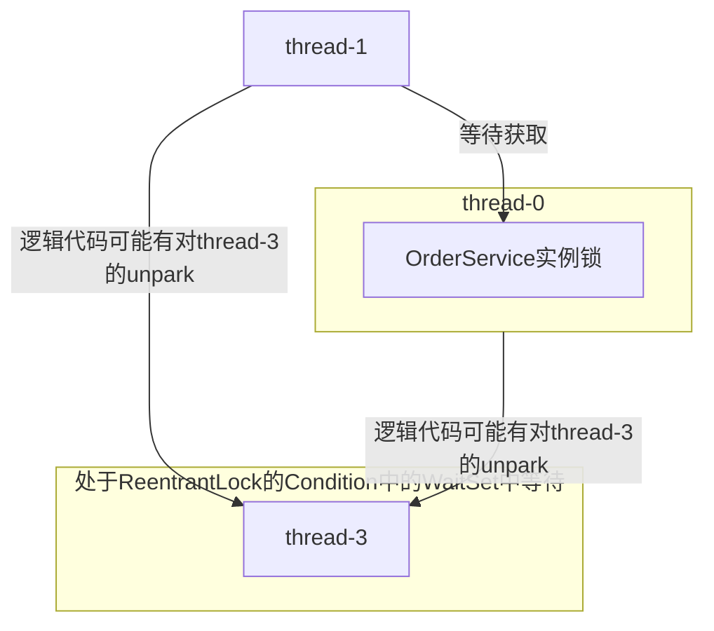

### Part A

1. 答：
    - `thread-3`处于`WAITING`状态，在OS层面是处于条件等待队列中；它在等待别人用`unpark()`来唤醒它
    - `thread-1`处于`BLOCKED`状态，在OS层面是处于阻塞等待队列，它在等`thread-0`释放它需要的锁`<0x00000000d6e01f28>`
    - `thread-0`处于`RUNNABLE`状态，在OS层面是处于运行状态，拿着`<0x00000000d6e01f28>`这把锁
    
> 在这里做一个推断，`com.example.OrderService`是一个单例
> 然后在`thread-0`和`thread-1`都是调用了同一个方法名的方法
> 不过行数不同，我感觉可能是因为是重载方法？不太清楚，我感觉是这样（因为我平时都是`OrderServiceImpl.java`中才会实现逻辑）
> （不一定是`synchronized`，也可能是`ReentrantLock`，我这里只是作为一个展示，说明是锁住了什么对象而已）
```java
// 在 OrderService.java 中
public synchronized <返回值> processOrder(<参数>) {
    // ...
}
```

> [!info] 补充
> 其实我没有很懂为什么会“卡死”
> - 第一种推测（我个人更倾向于这个，因为题目说是高并发）
>   - 如果是请求高并发导致程序变慢到”卡死“的程度，那我就只能说是这个函数的锁粒度不够细，是因为锁粒度太粗了，导致并发量不够高，顶不住并发量导致的；
> - 第二种推测
>   - 就是如下图的关系



2. 答：
    - 底层的区别就是`WAITING`是主动停下的，`BLOCKED`是被动停下的；
    - 从 JVM 对象头（锁的对象头）的角度来说
        - 如果使用`park()`的时候，对象头如果不是重量级锁，会被占有线程主动申请，然后原`Owner`会自己进入到`WaitSet`中
        - 如果是`synchronized`（可能也是别的）导致的锁竞争，则是由与`Owner`竞争的线程来为这个对象头申请`Monitor`，然后把自己放入到`EntryList`
    - 从`Monitor`的角度来说
        - `Waiting(parking)`会在`WaitSet`等待别人唤醒，然后进入`EntryList`
        - `BLOCKED(on object monitor)`会在`EntryList`随时成为`Owner`
    - 从`AQS`角度来说
        - `Wating(parking)`是可以让`state++`的一种行为，因为它是让出锁，主动进入等待队列`CLH Queue`；
        - `BLOCKED(on object monitor)`是因为`state==0`而无法分配“服务窗口”（CPU核心计算位）来执行命令，而进入到`ObjectCondition`队列里面，来等待获取锁；

3. 答：其实我感觉如果是`thread-0`拿着锁了，那`thread.interrupt()`只是协助结束线程，并不是直接打断，除非线程是调用`ReentrantLock`的`LockInterruptable()`但是还没拿到锁的状态，这个时候才可以被打断；
    - 不管是`synchronized`还是`ReentrantLock`两种，其实如果拿到锁了都其实我感觉区别不大，依旧是通知`thread-0`“你该结束工作，释放锁了”，而且`thread-0`中要有处理打断之后的善后逻辑，并且主动释放锁才可以
    - 只要是`thread-0`收到信号，进行善后工作并且释放锁之后，才会到`thread-1`拿到锁，然后进行工作
    - 关于`thread-3`，这个得等别人唤醒，如果说`thread-0`/`thread-1`中有相应的唤醒逻辑，这个才会继续，否则我感觉还是在等别人`unpark(thread-3)`的`Waiting(parking)`


---

### Part B

1. 答：
    - 一个是在`waitForData()`中的`if`是有bug；一个是`notifyDataReady()`中的`notify()`
    - 因为`if()`和`notify()`，其实唤醒是随机的
    > [!info] 场景假设
    > 用户A和用户B都发情申请，来获取对应的数据
    > 然后后台处理的时候，准备了用户A的数据，然后在`notify()`的时候，唤醒到了用户B的`waitForData()`线程
    > 然后其实不会进行第二次判断`if(!dataReady)`，会直接进入逻辑代码并开始执行了

2. 答：
- 简单粗暴的改法：
```java
public class OrderProcessor {
    private final Object lock = new Object();
    private volatile boolean dataReady = false;

    public void waitForData() {
        synchronized (lock) {
            while (!dataReady) {    // 可以避免只有单次检查
                lock.wait();
            }
            // 处理数据...
        }
    }

    public void notifyDataReady() {
        synchronized (lock) {
            dataReady = true;
            lock.notifyAll();   // 唤醒全部线程
        }
    }
}
```

- 更高级的改法：精确唤醒
    - 其实就是使用`ReentrantLock`中的`Condition`来作为锁
    - 利用`Condition.await()`和`Condition.signal()`来解锁
    - 不过要做个`HashTable<User, Condition>`来做精确唤醒

3. 答：我没打开MySQL的源码来查看，我随便说一个吧（我猜的）
    - 在`Double Write`机制下
        - 从`Double Write Log`写入到真正的表空间之前，需要检查是否准备好数据了，否则就等从`Buffer Pool`中写到`Double Write Log`，然后再唤醒其对应的刷盘线程，然后从`Double Write Log`写到表空间里面