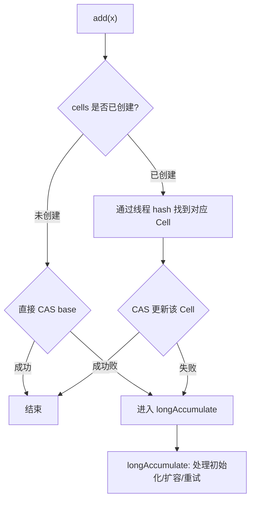
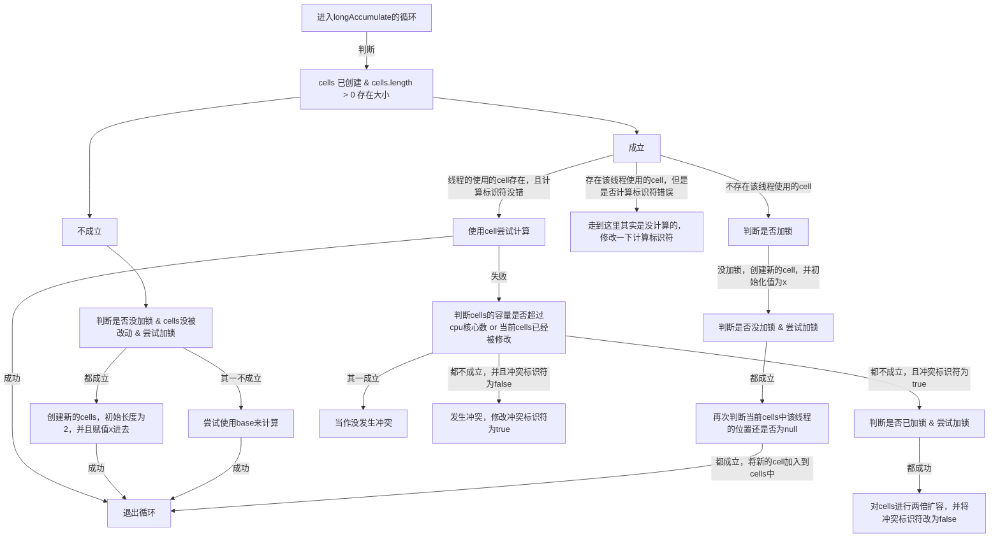

### Part 1
- 答：
    - 因为`config`对象可能已经被赋值了指针地址，但是那个地址的对象还没被初始化，所以直接返回了一个`null`没被初始化的对象
    - 我们可以截取一部分字节码指令来回答
    ```txt
    11: getstatic      // Field INSTANCE
    14: ifnonnull
    17: new            // class
    20: dup            // purpose to init the object
    21: invokespecial  // Method "<init>"
    24: putstatic      // Field INSTANCE (INSTANCE = address to the new)
    ```
    - 主要问题就是因为 17 ~ 24 这部分可以发生指令重排序，就是说它不一定是按照顺序来执行的，有可能是 17 -> 24 -> 20 -> 21 这样，如果是这样的话，另外一个线程如果`return instance`在当前线程执行完 24 之后，执行完 20 之前，就会拿到 `null` 对象；
    ```mermaid
    flowchart TD
        A[检查是否为null]
        subgraph B[赋值＋初始化]
            B1[创建新对象]
            B2[复制一份对象地址]
            B3[对新对象进行初始化]
            C[给变量赋值上对应地址]
        end
        D[返回对象]

        A --> |是null|B
        A --> |非null|D
        B --> D
    ```
    - 线程B如果在我刚刚说的时间点进入`if`判断，就会导致返回null节点；最大问题就是`21`和`24`发生重排序的时候，会产生`null`指针问题
    - 其实是发生了“写后读”，机器指令会变成如下：
    ```txt
    11: getstatic      // Field INSTANCE
    【LoadLoad】【LoadStore】
    14: ifnonnull
    17: new            // class
    20: dup            // purpose to init the object
    21: invokespecial  // Method "<init>"
    【StoreStore】
    24: putstatic      // Field INSTANCE (INSTANCE = address to the new)
    【StoreLoad】
    ```
    > 即为 24 前面的指令不能排序到 24 后面，这样就可以保证了`可见性`

---

### Part 2
1. 答：
    - 缓存结构图
    ```mermaid
    flowchart TD
        subgraph CORE1[CPU核心1]
            A1[运算区]
            B1[一、二级缓存区]
        end
        subgraph CORE2[CPU核心2]
            A2[运算区]
            B2[一、二级缓存区]
        end
        C[主缓存区【三级缓存】]

        B1 <--> C
        B2 <--> C
        A1 <--> B1
        A2 <--> B2
    ```
    - 安全问题时序图
    ```mermaid
    sequenceDiagram
        participant CPU1 as 核心1
        participant Cache as 主缓存
        participant CPU2 as 核心2

        %% 发生故障的流程
        CPU1 ->> Cache: 读取count变量到缓存区
        Cache -->> CPU1: 给予`count=0`变量
        CPU1 -> CPU1: 使得count++
        CPU1 -> CPU1: 令缓存区有count=1
        CPU2 ->> Cache: 读取count变量
        Cache -->> CPU2: 给予`count=0`变量
        CPU2 -> CPU2: 使得count++
        CPU2 -> CPU2: 令缓存区有count=1
        CPU1 ->> Cache: 更新count的值为1
        CPU2 ->> Cache: 更新count的值为1
    ```
    > 实际上最后正确的结果是 2
2. 答：
    - “总线风暴”时序图（简图）
    ```mermaid
    sequenceDiagram
        participant CPU1 as 核心1
        participant Cache as 总线
        participant CPU2 as 核心2

        %% 风暴流程
        CPU1 ->> Cache: 读取含有count变量的行到缓存区（E）
        Cache -->> CPU1: 给予包含`count=0`变量的行
        CPU1 ->> Cache: 申请修改count变量（M）
        Cache -->> CPU2: 使其缓存区中的count变量失效（I）
        CPU1 -> CPU1: 使得count++
        CPU1 -> CPU1: 令缓存区有count=1
        CPU2 ->> Cache: 读取含有count变量的行到缓存区（E）
        Cache -->> CPU2: 给予包含`count=0`变量的行
        CPU2 ->> Cache: 申请修改count变量（M）
        Cache -->> CPU1: 使其缓存区中的count变量失效（I）
        CPU2 -> CPU2: 使得count++
        CPU2 -> CPU2: 令缓存区有count=1
        CPU1 ->> Cache: 重新读取含有count变量的行到缓存区（E）
        Cache -->> CPU1: 给予包含`count=0`变量的行
        CPU1 ->> Cache: 申请修改count变量（M）
        Cache -->> CPU2: 使其缓存区中的count变量失效（I）
        CPU1 -> CPU1: 使得count++
    ```
    > 如此反复，这个只是简化了，实际上会有更多的cpu来读取，情况竞争会更加严重

3. 答：
    - `LongAdder`的`base`字段相当于`AtomicLong`中的`base`，而`Cell[]`则是发生竞争时，会尝试扩容的机制，使得不同CPU的核心占用不同的数据行，避免产生总线风暴
    - 低并发下，基本上`base`就可以解决问题；高并发下，由于会发生竞争，进入`longAccumulate()`方法，就会创建`Cell[]`数组，并使得初始化长度为2，但是不一定赋值初始化全部槽位，用到才会进行初始化
    - 因为用了才能防止行级伪共享，因为在 64 字节的缓存行中，一个`long`类型只会占用 8 字节，所以在数组中内存地址连续的情况，会导致多个`Cell`变量在同一个缓存行中；如果不加入该注解，缓存行会导一行有多个变量；如下图
    ```mermaid
    flowchart TD
        subgraph G1["不加入@Contented注解"]
            A1["变量1、变量2、变量3、变量4、变量5、变量6、变量7、变量8"]
        end
        subgraph G2["加入@Contented注解"]
            B1["变量1"]
            B2["变量2"]
            B3["变量3"]
        end
    ```
    > 不加入注解会导致修改变量1和变量2的时候，读取同一个缓存行，同样会导致小型“总线风暴”
    > 因为 MESI 协议是以`缓存行`为基本单位的

4. 答：
    - 不容置疑，直接结论，肯定是更慢，因为导致了“总线风暴”，大家都去争抢竞争一个CAS，特别是高压测试的2000个虚拟线程，尽管有`pause`指令做缓冲，但是依旧是直接爆炸了

---

### 极客挑战 1
- null

---

### 极客挑战 2
1. 扩容的触发条件是，CAS自旋几次发生竞争之后才会发生扩容，因为里面有两个变量，一个是标记是否发生竞争，一个是标记是否完成计算；最大 size 是由 CPU 核心数来决定的；
2. 有点不想打字了，这是我之前读源码的时候写的图

#### add 方法流程



#### longAccumulate 方法的三种情况

> > 因为`cells`扩容之后并不会马上初始化所有的`cell`，所以才会存在`cell`为空的情况
> - 一些变量的信息
> 	- `x` - 为需要累加的值
> 	- `base` - 这个类自带的存值变量
> 
> > 其余没有指向`END`且没有下一步的都会进入下一轮循环