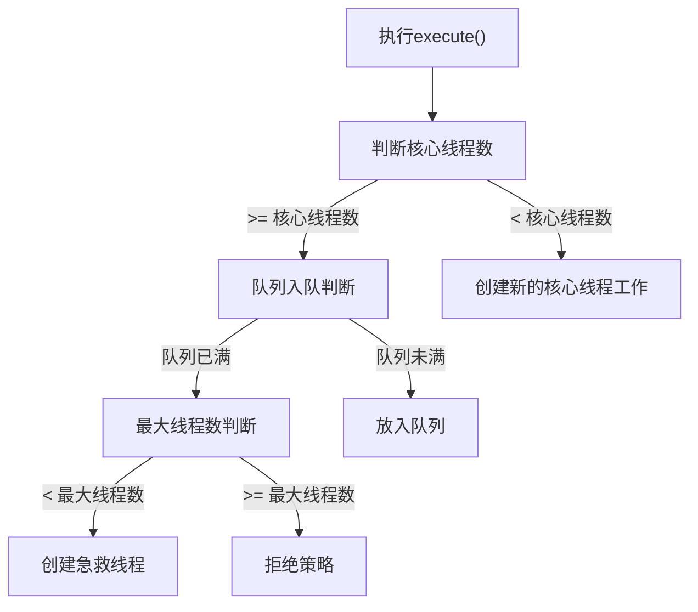
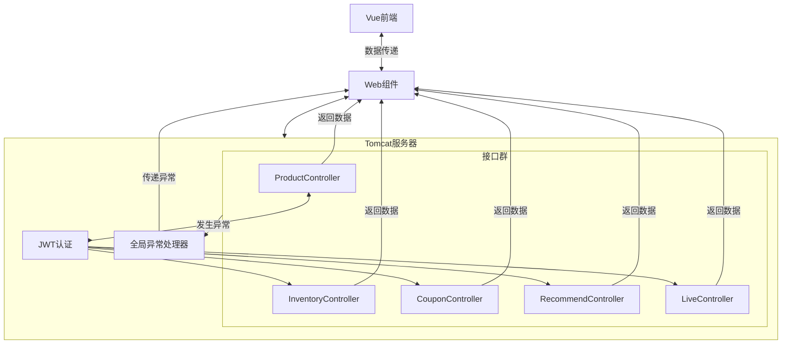
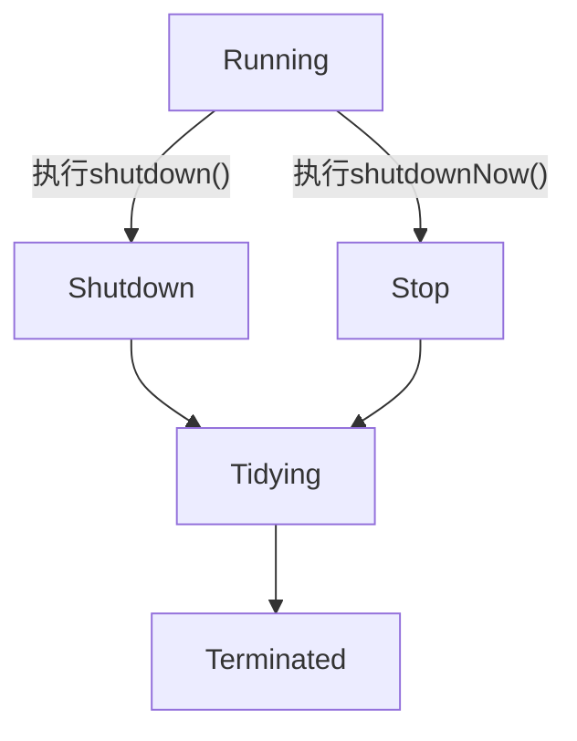
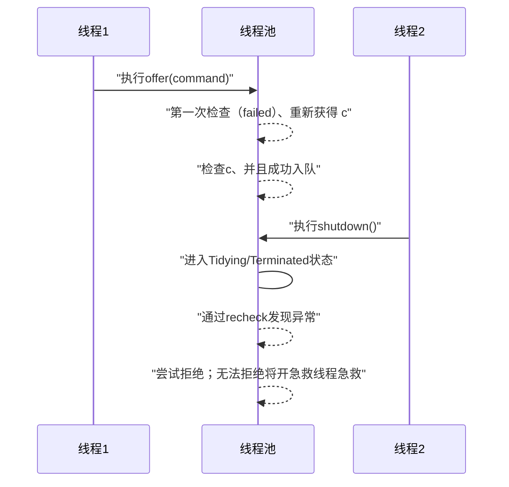

### Part 1
1. *路由逻辑*流程图


2. 答：
    - 按照正常情况，初始`1000`个令牌，后续每秒补充`500`个，总共会有`11000`个；如果是按照测压数据中的延迟到`27`秒，那就是有`13500 + 1000 = 14500`个令牌被处理
    - 按照我的配置，队列最多缓冲 3000 个任务
    - 这个`500ms`内，线程池里面执行中的任务还在最大等待时间`2000ms`中等待（即为阻塞）结果
    - 因为满了队列满了之后，有 3000 个任务排队执行，还需要 6s 才可以执行完毕这些请求，所以后面`6s`内大部分的请求都会无效，相当于每秒都会完成500个任务，然后又装满500个任务

3. 答：
    - 这个对核心线程无效，这个只是说明是急救线程没有任务时的最大存活时间；可以调用这个函数`allowCoreThreadTimeOut(true)`，即为允许核心线程也有定时生命周期；

4. 答：如果使用这个的话并不会导致大量异常，反而是延长执行时间，原因也很简单，因为这个方法创建出来的线程池用的任务队列时无界的，后面进来的任务全都会被丢到任务队列里面等待执行，但是会有很严重的风险，OOM内存溢出的话，反而还不如抛出大量异常；

#### 后续分析之后改进的版本
```java
import io.jsonwebtoken.Jwts;
import io.jsonwebtoken.SignatureAlgorithm;
import lombok.Getter;
import lombok.extern.slf4j.Slf4j;

import java.util.*;
import java.util.concurrent.*;

@Slf4j
public class CurrentLimiter {

    public static class JwtTokenGenerator {
        private static final Random RD = new Random();  // Random generator UserId
        private static final String SECRET = "TestMyLimiter";
        private static final long KEEP_ALIVE_TIME = 6000;   // 1 minute

        public static String generateToken() {
            HashMap<String, Object> claims = new HashMap<>();
            claims.put("userId", RD.nextInt(10000));

            String token = Jwts.builder()
                    .signWith(SignatureAlgorithm.HS256, SECRET)
                    .setClaims(claims)
                    .setExpiration(new Date(System.currentTimeMillis() + KEEP_ALIVE_TIME))
                    .compact();

            return token;
        }
    }

    private static final long MAX_WAIT_TIME = 400; // default wait 2 seconds
    private static final int CORE_SIZE = 26;    // My CPU cores 32~64
    private static final int MAX_SIZE = 31;
    private static final long KEEP_ALIVE_TIME = 6000;
    private static final int MAX_TOKENS = 1000;         // token max size
    private static final int RECOVERY_NUM = 500;        // token recovery number
    private static final int MAX_TASK_SIZE = 500;
    private static final ScheduledExecutorService scheduler = Executors.newScheduledThreadPool(2);
    private static final ThreadPoolExecutor threadPool = new ThreadPoolExecutor(
            CORE_SIZE,
            MAX_SIZE,
            KEEP_ALIVE_TIME,
            TimeUnit.MILLISECONDS,
            new LinkedBlockingQueue<Runnable>(MAX_TASK_SIZE),
            (Runnable r, ThreadPoolExecutor executor) -> {
                try {
                    // 尝试在 0.5 秒内将任务放入队列
                    boolean success = executor.getQueue().offer(r, 500, TimeUnit.MILLISECONDS);

                    if (!success) {
                        // 如果等待后依然失败，抛出拒绝执行异常
                        throw new RejectedExecutionException("Task rejected after waiting 1 second for queue space.");
                    }
                } catch (InterruptedException e) {
                    // 如果等待过程中线程被中断，恢复中断状态并抛出异常
                    Thread.currentThread().interrupt();
                    throw new RejectedExecutionException("Task interrupted while waiting for queue space.", e);
                }
            }
    );

    private static final Semaphore tokenPool = new Semaphore(MAX_TOKENS);

    @Getter
    private static long successRecoveryCount = 0;

    static {
        scheduler.scheduleAtFixedRate(() -> {
            int recoveryNum = Math.min(MAX_TOKENS - tokenPool.availablePermits(), RECOVERY_NUM);
            tokenPool.release(recoveryNum);
            successRecoveryCount += recoveryNum;
        }, 0, 1, TimeUnit.SECONDS);
    }


    public static String tryGetToken() {
        Future<String> result = threadPool.submit(() -> {
            long begin = System.currentTimeMillis();
            long passTime;
            while (!tokenPool.tryAcquire(1)) {
                passTime = System.currentTimeMillis() - begin;
                if (passTime > MAX_WAIT_TIME) {
                    return null;    // timeout, return null
                }
            }
            return JwtTokenGenerator.generateToken();
        });

        try {
            return result.get();
        } catch (InterruptedException |  ExecutionException e) {
            return null;
        }
    }
}
```
- 测压数据
```txt
========== 开始热身 (Warm-up) ==========
所有线程就绪，开始压测...
测试持续时间: 3.06 秒
并发线程数: 100
总请求数: 2230
----------------------------------------
成功获取 Token 数: 2100
未获取到 (返回 null) 数: 130
异常崩溃数: 0
----------------------------------------
总 QPS (吞吐量): 728.28 req/s
成功 QPS: 685.83 req/s
错误率: 5.83%
期间内后台令牌桶恢复成功的量：1500

========== 开始第一轮压力测试 (Stress Test) ==========
所有线程就绪，开始压测...
测试持续时间: 11.00 秒
并发线程数: 1000
总请求数: 14465
----------------------------------------
成功获取 Token 数: 5900
未获取到 (返回 null) 数: 682
异常崩溃数: 7883
----------------------------------------
总 QPS (吞吐量): 1314.88 req/s
成功 QPS: 536.31 req/s
错误率: 59.21%
期间内后台令牌桶恢复成功的量：5500

========== 开始高压力测试 (Stress Test) ==========
所有线程就绪，开始压测...
测试持续时间: 20.99 秒
并发线程数: 4000
总请求数: 147717
----------------------------------------
成功获取 Token 数: 10500
未获取到 (返回 null) 数: 1302
异常崩溃数: 135915
----------------------------------------
总 QPS (吞吐量): 7036.82 req/s
成功 QPS: 500.19 req/s
错误率: 92.89%
期间内后台令牌桶恢复成功的量：10500
```
> 测试了好几次，这次是基本恢复多少就用多少`token`
> 让之前的`token`残留的现象得到了较好的修复
> 所以我打算加入了超高压测试

```txt
========== 开始热身 (Warm-up) ==========
所有线程就绪，开始压测...
测试持续时间: 3.07 秒
并发线程数: 100
总请求数: 2230
----------------------------------------
成功获取 Token 数: 2100
未获取到 (返回 null) 数: 130
异常崩溃数: 0
----------------------------------------
总 QPS (吞吐量): 726.38 req/s
成功 QPS: 684.04 req/s
错误率: 5.83%
期间内后台令牌桶恢复成功的量：1500

========== 开始第一轮压力测试 (Stress Test) ==========
所有线程就绪，开始压测...
测试持续时间: 10.99 秒
并发线程数: 1000
总请求数: 14721
----------------------------------------
成功获取 Token 数: 5900
未获取到 (返回 null) 数: 682
异常崩溃数: 8139
----------------------------------------
总 QPS (吞吐量): 1339.12 req/s
成功 QPS: 536.71 req/s
错误率: 59.92%
期间内后台令牌桶恢复成功的量：5500

========== 开始高压力测试 (Stress Test) ==========
所有线程就绪，开始压测...
测试持续时间: 10.98 秒
并发线程数: 4000
总请求数: 74127
----------------------------------------
成功获取 Token 数: 5500
未获取到 (返回 null) 数: 682
异常崩溃数: 67945
----------------------------------------
总 QPS (吞吐量): 6750.48 req/s
成功 QPS: 500.87 req/s
错误率: 92.58%
期间内后台令牌桶恢复成功的量：5500

========== 开始高压力测试 (Stress Test) ==========
所有线程就绪，开始压测...
测试持续时间: 11.00 秒
并发线程数: 10000
总请求数: 193799
----------------------------------------
成功获取 Token 数: 5500
未获取到 (返回 null) 数: 682
异常崩溃数: 187617
----------------------------------------
总 QPS (吞吐量): 17611.69 req/s
成功 QPS: 499.82 req/s
错误率: 97.16%
期间内后台令牌桶恢复成功的量：5500
```
> 10000个线程也没炸，似乎好像新的参数很不错

---

### Part 2
- 具体实现
```java
import java.util.concurrent.CompletableFuture;

public class Demo {
    private static class WebInfo {
        private String productBaseInfo;
        private String inventoryNumber;
        private String userCoupon;
        private String recommendList;
        private String liveStatus;

        @Override
        public String toString() {
            return "WebInfo{" +
                    "productBaseInfo='" + productBaseInfo + '\'' +
                    ", inventoryNumber='" + inventoryNumber + '\'' +
                    ", userCoupon='" + userCoupon + '\'' +
                    ", recommendList='" + recommendList + '\'' +
                    ", liveStatus='" + liveStatus + '\'' +
                    '}';
        }
    }

    private final static ProductService productService = new ProductService();
    private final static InventoryService inventoryService = new InventoryService();
    private final static CouponService couponService = new CouponService();
    private final static RecommendService recommendService = new RecommendService();
    private final static LiveService liveService = new LiveService();

    private static final CompletableFuture<String> productBaseInfoFuture =
            CompletableFuture.supplyAsync(productService::getProductBaseInfo);
    private static final CompletableFuture<String> inventoryNumberFuture =
            CompletableFuture.supplyAsync(inventoryService::getInventoryNumber);
    private static final CompletableFuture<String> userCouponFuture =
            CompletableFuture.supplyAsync(couponService::getUserCoupon);
    private static final CompletableFuture<String> recommendListFuture =
            CompletableFuture.supplyAsync(recommendService::getRecommendList);
    private static final CompletableFuture<String> liveStatusFuture =
            CompletableFuture.supplyAsync(liveService::getLiveStatus);

    private static final long MAX_WAIT_TIME = 300L;

    public static WebInfo getWebInfo() {
        WebInfo webInfo = new WebInfo();
        try {
            webInfo.productBaseInfo = productBaseInfoFuture.get(MAX_WAIT_TIME, TimeUnit.MILLISECONDS);
        } catch (InterruptedException | ExecutionException | TimeoutException e) {
            // 正常就是抛出异常给全局异常处理器来处理；
            // 或者是返回 null 给前端，前端自己处理
            System.err.println("获取产品基础信息超时");
        }

        try {
            webInfo.inventoryNumber = inventoryNumberFuture.get(MAX_WAIT_TIME, TimeUnit.MILLISECONDS);
        } catch (InterruptedException | ExecutionException | TimeoutException e) {
            System.err.println("获取库存信息超时");
        }

        try {
            webInfo.userCoupon = userCouponFuture.get(MAX_WAIT_TIME, TimeUnit.MILLISECONDS);
        } catch (InterruptedException | ExecutionException | TimeoutException e) {
            System.err.println("获取用户优惠券超时");
        }

        try {
            webInfo.recommendList = recommendListFuture.get(MAX_WAIT_TIME, TimeUnit.MILLISECONDS);
        } catch (InterruptedException | ExecutionException | TimeoutException e) {
            System.err.println("获取推荐列表超时");
        }

        try {
            webInfo.liveStatus = liveStatusFuture.get(MAX_WAIT_TIME, TimeUnit.MILLISECONDS);
        } catch (InterruptedException | ExecutionException | TimeoutException e) {
            System.err.println("获取推荐列表超时");
        }

        return webInfo;
    }

    public static void main(String[] args) {
        long passedTime = System.currentTimeMillis();
        WebInfo webInfo = getWebInfo();
        System.out.println("耗时：" + (System.currentTimeMillis() - passedTime));
        System.out.println(webInfo);

        System.exit(0);
    }
}

class ProductService {
    private static final long MAX_WAIT_TIME = 50L;
    public String getProductBaseInfo() {
        try {
            Thread.sleep(MAX_WAIT_TIME);
        } catch (InterruptedException e) {
            e.fillInStackTrace();
        }
        return "productBaseInfo";
    }
}

class InventoryService {
    private static final long MAX_WAIT_TIME = 80L;
    public String getInventoryNumber() {
        try {
            Thread.sleep(MAX_WAIT_TIME);
        } catch (InterruptedException e) {
            e.fillInStackTrace();
        }
        return "InventoryNumber";
    }
}

class CouponService {
    private static final long MAX_WAIT_TIME = 120L;
    public String getUserCoupon() {
        try {
            Thread.sleep(MAX_WAIT_TIME);
        } catch (InterruptedException e) {
            e.fillInStackTrace();
        }
        return "UserCoupon";
    }
}

class RecommendService {
    private static final long MAX_WAIT_TIME = 200L;
    public String getRecommendList() {
        try {
            Thread.sleep(MAX_WAIT_TIME);
        } catch (InterruptedException e) {
            e.fillInStackTrace();
        }
        return "RecommendList";
    }
}

class LiveService {
    private static final long MAX_WAIT_TIME = 30L;
    public String getLiveStatus() {
        try {
            Thread.sleep(MAX_WAIT_TIME);
        } catch (InterruptedException e) {
            e.fillInStackTrace();
        }
        return "LiveStatus";
    }
}
```
- 输出结果
```txt
耗时：212
WebInfo{productBaseInfo='productBaseInfo', inventoryNumber='InventoryNumber', userCoupon='UserCoupon', recommendList='RecommendList', liveStatus='LiveStatus'}
```

- 默认实现线程池为`newCachedThreadPool`；默认线程池都存在OOM问题（就现在实现的这个，会无限制的创建短线程，如果请求过多，会导致OOM问题），其实应该自己`new ThreadPoolExecutor(...)`自己手动指定参数；

- 其实我这里可以补充一下，正常来说就是前端Vue工程里面会设置获取超时时间的，所以这个后端其实不用管，只需要把这个慢业务的记录记录到操作表就行了，方便后续优化；

> 默认`Controller`后面会去自动找`Service`然后连接`DTO`获取数据，如果是热点数据就用`Redis`缓存一下

---

### 极客挑战 1
- 转换路径


- 将两个信息合并在同一个整数里面，可以减少一次`CAS`原子操作；如果在多线程下就可以减少一半，大大减少了“总线风暴”的可能性

---

### 极客挑战 2
- 防止刚进入队列，线程池关闭了的情况；如果没有这个，在`c = ctl.get()`之后，如果线程池就被`shutdown()`了（我去看了阻塞队列的`offer()`，我发现这个应该是不会检测线程池的状态的）进入到了`Tidying`或者`Terminated`，这个时候又成功将这个任务入队，就会导致不执行，而这里的检查同时还防止了`recheck`也是刚好被卡时机，所以会开一个新的急救线程来防止任务永不执行（这个线程会有存活时间，一段时间没有任务，可能是执行完这个“边界”任务，也可能是创建出来之后挂着，反正最后会被回收）；
