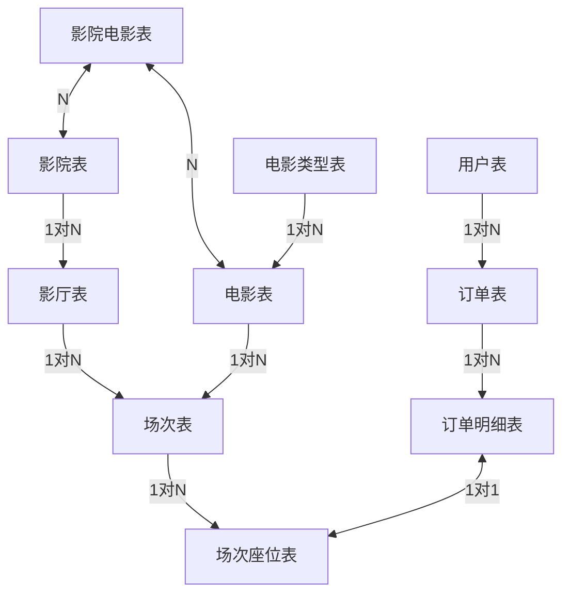

> 首先说一个问题，我打算结合Java的应用层来完成业务逻辑的开发，我有点不适应全部都用MySQL的sql语句完成；
> 我更习惯是结合Java的持久层和逻辑层来抒写逻辑

---

## 影院系统

### 表设计问题

#### 表关系梳理


#### 表字段设计
- 先大致列出来表要带有什么信息
    - theaters: id, name
    - theater_moive_relationship: id, theater_id, moive_id
    - halls：id, type, theater_id, position
    - schedule：id, hall_id, moive_id, begin_time, duration
    - moives：id, moive_no, name, type
    - moive_types: id, name
    - schedule_seats：id, scheadule_id, position, status, price
    - order_items：id, order_id, seat_id, unit_price
    - ticket_orders：id, order_no, user_id, schedule_id, status, create_at, pay_at, amount
    - users：id, username, password

> - 这里我就只思考主线了，就暂时不考虑用户vip，还有沙发、情侣座，优惠券，特殊场什么的了，就先把基本的核心业务功能完善了

#### 建表代码

- 影院表
```sql
create table theaters (
    id bigint not null auto_increment comment '主键',
    name varchar(30) not null comment '影院名字',
    primary key id,
    index idx_theater_name (name)
) comment '影院表' engine=InnoDB;
```
> - 对于影院名字用`varchar(30)`，这个长度考虑了比如`Xxx影院（Yyy分店）`
> - 其实可以对影院名称建立索引，因为看电影的时候肯定会会搜索影院名字的，而且大部分时候都是前缀匹配搜索；其实可以通过查看表的数据统计情况来截取字符串来建立索引；这里就假设截取前6位能保持空间和区分度综合最高吧；


- 影厅表
```sql
create table halls (
    id bigint not null auto_increment comment '主键',
    type_id tinyint not null default 1 comment '影厅类型：1-普通2D场....',
    theater_id bigint not null comment '影院id',
    position tinyint not null default 1 comment '影院的影厅编号',
    primary key id,
    index idx_theater_type_position (theater_id, type_id, position),
) comment '影厅表' engine=InnoDB;
```
> - 我个人认为影厅类型使用`tinyint`是因为最多不可能超过128种吧，在我认知中，感觉就只有几种
> - 影院的影厅编号，应该不可能一个影院会有128个影厅及以上的，每个影院至少一家，那剩下的最极端也就121个影厅
> - 索引`idx_theater_type`建立，如果说存在查找影厅类型这样的业务逻辑，那么肯定是先选影院再选影厅类型，那这个联合索引就刚好是可以用得上的


- 电影类型表
```sql
create table moive_types (
    id bigint not null auto_increment comment '主键',
    name varchar(10) not null comment '类型名称',
    primary key id
) comment '电影类型表' engine=InnoDB;
```
> - `name`字段长度通常都是四个字，正常来说10个字符以内足够搞定了


- 电影表
```sql
create table moives (
    id bigint not null auto_increment comment '主键',
    moive_no varchar(9) unique not null comment '电影编号：(#Xxxxxxxx)',
    name varchar(20) not null comment '电影名称',
    moive_type_id bigint not null comment '电影类型',
    create_at DATE not null comment '上映时间',
    duration bigint not null comment '电影时长（单位：秒）',
    info text comment '电影信息',
    primary key id,
    unique index idx_moive_no (moive_no),
    index idx_type_name (moive_type_id, name),
    index idx_moive_name (name)
) comment '电影表' engine=InnoDB;
```
> - 电影编号中的`x`代表0~9数字
> - 可以根据电影编号来查找电影
> - `idx_type_name`和`idx_moive_name`两个索引，可以通过名字前缀模糊匹配，可以通过类型筛选，也可以两个一起筛选，这个是比较常见的筛选方式


- 影院电影关系表
```sql
create table theater_moive_relationship (
    id bigint not null auto_increment comment '主键',
    theater_id bigint not null comment '影院id',
    moive_id bigint not null comment '电影id',
    moive_name varchar(20) not null comment '电影名称'
    primary key id,
    index idx_moivename_theater (moive_name, theater_id)
) comment '影院电影关系表' engine=InnoDB;
```
> 这个联合索引是设计给一般情况的，大部分时候用户都会搜索电影名称，来获取电影会在哪家影院上映，然后再去选票；


- 场次表
```sql
create table schedules (
    id bigint not null auto_increment comment '主键',
    hall_id bigint not null comment '影厅id',
    moive_id bigint not null comment '电影id',
    theater_id bigint not null comment '影院id',
    begin_time DATETIME not null comment '开映时间',
    duration bigint not null comment '电影时长（单位：秒）',
    primary key id,
    index idx_theater_moive_begin_hall (theater_id, moive_id, begin_time, hall_id)
) comment '场次表' engine=InnoDB;
```
> - 不建结束时间的列是因为有开始时间和电影时长之后就可以算出来
> - 这个索引我是参考猫眼的，猫眼里面是选了影院、电影、日期之后，才会出现排场；然后联合`begin_time`是因为，场次其实是会按照时间进行排序的，所以这个刚好可以防止`using filesort`


- 用户表
```sql
create table users (
    id bigint not null auto_increment comment '主键',
    username varchar(11) not null comment '用户名',
    password varchar(50) not null comment '密码',
    primary key id,
    index idx_username (username)
) comment '用户表' engine=InnoDB;
```
> - 建立用户名索引，是我想到了后台有可能会通过用户名来模糊搜索，当然加不加都可以，因为可以不影响我们的主线任务
> - 用户密码用密文存储，我没记错MD5加密之后是50位，如果不确定，到时候可以查一下资料，我这里就按照我的记忆来


- 订单表
```sql
create table ticket_orders (
    id bigint not null auto_increment comment '主键',
    order_no varchar(20) unique not null comment '订单编号', 
    user_id bigint not null comment '用户id',
    schedule_id bigint not null comment '场次id',
    status tinyint not null comment '订单状态：1-待支付...',
    create_at DATETIME not null comment '创建时间',
    pay_at DATETIME comment '支付时间：未支付为NULL',
    total_amount decimal(9,2) not null comment '总金额',
    primary key id,
    unique index idx_order_no (order_no),
    index idx_create_status (create_id, status),
    index idx_user_status_create_schedule_amount (user_id, status, create_at, schedule_id, total_amount)
) comment '影票订单表' engine=InnoDB;
```
> - 订单编号唯一索引是可以通过订单编号来搜索订单
> - 联合索引`idx_create_status`：给系统执行定时任务时，排查超时订单使用的
> - 联合索引`idx_user_status_create_schedule_amount`：一般是用户来查自己的订单详细，然后肯定会传用户id，然后可以通过选定时间范围来进行查询；那么排序又要怎么处理呢？如果说用户没有规定订单状态（非等值匹配），那么肯定是需要`using filesort`的，那么我们可以在Java层做一些手脚，因为通过用户id过滤的话，一般情况下，用户的订单量还是没有很多很多的数据行的情况，极端情况出现的时候再处理即可；联合索引中其余的字段，用来防止回表用的；


- 订单明细表
```sql
create table order_items (
    id bigint not null auto_increment comment '主键',
    order_id bigint not null comment '订单id',
    seat_id bigint not null comment '座位id',
    unit_price decimal(9,2) not null comment '座位单价',
    primary key id,
    index idx_order_seat_price (order_id, seat_id, unit_price)
) comment '订单明细表' engine=InnoDB;
```
> - 联合索引的设计，提供被订单表驱动联查的时候使用，同时防止回表


- 场次座位表
```sql
create table schedule_seats (
    id bigint not null auto_increment comment '主键',
    schedule_id bigint not null comment '场次id',
    position tinyint not null comment '场次座位编号',
    status tinyint not null default 1 comment '座位状态：1-可售,2-锁定,3-已售',
    price decimal(9,2) not null comment '座位单价',
    primary key id,
    index idx_schedule_position_status_price (schedule_id, position, status, price)
) comment '场次座位表' engine=InnoDB;
```
> - 联合索引设计是根据猫眼的设计，点击场次之后才会看见场次对应的座位状态表，同时会根据位置进行排序；同时这个索引基本就是使用索引覆盖的形式，不会进行回表；


> - 统一说明`decimal(9,2)`，7个整数位，2个小数位，这个对应现实生活中，比如`WeChat`，`Alipay`等常用支付平台等，通用是使用两位小数，而且买电影票，IMAX包场也很难突破100w这个数字，在价格上来说；尽管是推出超级至尊VIP场，1000块钱一张，也基本不会超过100w；

---

### 核心业务
> 允许我擅作主张，这里我会先解决核心业务的性能，因为索引设计的目的就是优化性能，同时结合一部分Java层的伪代码/代码来形成完整逻辑，但是不会使用中间件
> 在开始之前，由于我打算在抢票系统采用悲观锁，因为绝对不能超卖的原因，所以我个人感觉是有可能产生死锁的情况的，所以要在全局异常捕获器中写一个抓取被当作死锁处理时，给前端抛出`系统繁忙，请稍后重试！`的提醒
> 对于Java层与MySQL的传输，基于网络IO，这个很慢，所以批量插入是使用XML文件的`foreach`标签来完成批量插入的；同时加入检测插入量的前置逻辑代码，防止超过了MySQL的连接器中规定参数`max_allowed_packet`

- **后台管理排场**
    - 通过名字搜索影院（使用到`idx_theater_name`索引） -- 确定要排场的影院
    - 此时可以通过`idx_theater_type_position`这个索引来查找并获取对应影院所有影厅的基本信息 -- 支持使用类型进行二次过滤和防止回表查找`position`这个影厅编号
    - 这里我感觉选取电影，应该是用名字搜索，所以创建了`idx_movie_name`索引用来快速搜素，感觉排场人员大概率会需要查看电影所有的信息，所以这里我没有让它使用索引覆盖，而是通过回表来获取所有信息
    - 根据目前所有的信息是可以构建出一个基本的场次信息了
    ```java
    // 接下来就是一个简单的Java-Service层
    @Service
    public class ScheduleServiceImpl implements ScheduleService {
        /**
         * Scheduling time of the moive
         */
        @Transaction
        public void schedule(ScheduleInfoDTO scheduleInfo) {
            // 1. 创建实体类先获取基本信息
            // 2. 检查一下数据量有没有超标，超标就采用循环批量
            // 3. 采用批量插入操作 -- 方便排场人员一下子选定了好几个排场，一下子排好（记得回传自动生成的id）
            // insert into schedules (....) values (<foreach>);

            // 可选：检查一下影院中是否放映此电影；就是影院电影关系表中是否存在逻辑；

            // 4. 检查批量插入是否成功，不成功直接报错并回滚
            // 5. 给每个排好场的场次id安排120个座位号
            // 6. 依旧是检测批量插入的数据量，超标采取循环批量策略
            // 7. 采用批量插入策略 -- (记得初始化座位装填为可选)
            // insert into schedule_seats (....) values (<foreach>);

            // 8. 检查是否插入成功，不成功直接报错并回滚
        }
    }
    ```
    > 有点懒得写详细代码了，不然时间有点长
    > 如果要让健壮性更好，其实可以在`1`的位置，加入对基本信息的排查，比如是数据库否存在这个影厅、电影等等什么的，防止前端使用非客户端，使用第三方API工具发送的请求，导致错误数据
    > 至于为什么是可选呢？因为其实我感觉可以把一天安排好的排场之后，在的每天定时某个时间再更新到数据，比如利用SpringTask框架来实现，然后同时将这些排好的数据写到一个临时表中，到了时间再写入到主数据库；其实也可以是当场就进行检查和更新，不过这样感觉会重复检查很多次；


- **用户购票信息**⭐
    - 用户进入影票选购系统之后，一般都是先通过电影名字搜素电影，然后得到影院的列表；这个时候会用到`idx_moviename_theater`索引
    - 选定影院之后，就可以查看排场了；利用`idx_theater_moive_begin_hall`索引，通过影院和电影筛选并根据时间排序之后，这个索引会使用**索引覆盖**来得到影厅id，这样可以在Java的Service层通过影厅id来二次查询获得影厅的信息
    - 选定好场次之后，前端可以传递场次id来查询场次的座位信息；使用`idx_schedule_position_status_price`索引
    - 选定好座位之后进行下单，接下来就是正片了；
    - 我们先分析一下情况：
    ```md
    > 按照实际场景来说呢，我们默认A先B后的原则来分情况，大致可以分为以下两种：
    > 假设A选了1，2座位，B选了2，3座位
    - 第一种：A处于处理中，B进来
        - A在处理中，如果B进来了
        - 如果使用乐观锁策略，那么将会可能出现A处理中，B也可以处理这个数据行，那很可能导致超卖现象（两个订单中出现同一个座位号）
        - 如果使用悲观锁策略，A在处理过程中，B是无法拿到锁的，可以防止同时修改的现象发生

    - 第二种：A处于处理完毕，B进来了
        - 这个时候先查询检查的话，使用哪种策略都一样
    
    ---

    我们通过分析，可以先暂定使用悲观锁，如果要确定的话，得引入适应性问题，就是如果不只是A、B两个，当出现C、D....等时是否可行
    当然这个问题很简单，当然是可行的
    所以我们最后选取是**悲观锁策略**
    ```
    - 这里我们让前端传递座位id给我们，这样做悲观锁的行锁并发性能不会有很大影响
    ```java
    // 对于提交订单这一块我们采用悲观锁来防止同一位置出现在不同订单的情况
    @Transaction
    public void submitOrder(SubmitOrderDTO submitOrderDTO) {
        // 查询座位状态（同时尝试上锁） "select status from schedule_seats where id in (<foreach> for update nowait)"
        ArrayList<Integer> statusList = scheduleSeatMapper.getStatusByIdsForUpdateNowait(submitOrderDTO.getSeatIds());
        // 检查一下是否全部都是可售状态
        if (!(statusList.stream().allMatch(status -> status == 1))) 
            throw new SeatIsNotAccessException("当前位置不可售，请检查！"); // 给前端抛出被锁定的异常

        // 修改座位状态信息信息 -- "update shcedule_seats set status = 2 where id in (<foreach>)"
        Integer result = scheduleSeatMapper.setStatusByIds(submitOrderDTO.getSeatIds());
        isChangeSuccessfully(result);
                    
        // 获取用户信息
        Long userId = ThreadLocalContext.get();
        if (userId == null) throw new AuthenticationException("登录信息异常，请重新登录！");

        // 创建订单编号 -- 这里刚好够20位
        String ticketOrderNumber = String.format("%10d", userId) + "#" + System.currentTimeMillis()/1000;

        // 创建订单实体类并插入数据库
        TicketOrder ticketOrder = TicketOrder.builder().....  // 补全完事
        result = ticketOrderMapper.insert(ticketOrder); // useGenerateKey = true, keyProperty = id
        isChangeSuccessfully(result);

        // 开始创建订单详细内容
        ArrayList<OrderItem> itemList = new ArrayList();
        submitOrderDTO.getSeatIds().foreach(item -> {
            item.setOrderId(ticketOrder.getId());
            // 其余逻辑...(可以在循环外面采用一次性批量查询的方式获取位置的单价即可)
            itemList.add(item);
        })

        // 批量插入
        result = orderItemMapper.insertBatch(itemList);
        isChangeSuccessfully(result, itemList.size() - 1);
    }

    private boolean isChangeSuccessfully(Integer effectLineNumber) {
        return isChangeSuccessfully(effectLineNumber, 0);   // 默认有效影响行数为 1 行
    }

    private boolean isChangeSuccessfully(Integer effectLineNumber, Integer needEffectNumber) {
        if (effectLineNumber == null || effectLineNumber <= needEffectNumber) {
            log.error("While modifying the database, a situation occurred where the number of rows was affected to 0!");    // 采用英文是因为部署到 Linux 之后，日志无法显示中文，追踪的时候可以追踪到    
            throw new DataBaseModifyException("系统错误，请稍后重试！");
        }
    }
    ```
    > 至于支付成功之后的回调函数，就是修改订单和订单细节的问题了

- **关于处理超时订单的问题**
    - 可以利用`Spring Task`来进行*每分钟*进行检查，这个时候`idx_create_status`索引就起效了
    - 先通过查询获取被超时订单锁定的座位id
    - 然后去在`schedule_seats`中将状态修改为“可售”
    - 进而修改订单状态
    - 关于订单详细的问题，其实我感觉删不删都可以
    ```java
    public void orderTimeoutHandle() {
        // 1. 利用时间和状态筛选并获取超时订单的id列表
        // -> 批量修改订单的状态为“已取消”
        
        // 2. 利用id列表去循环
        for{
            // 3. 通过订单id来获取订单详细的列表
            // 4. 通过订单详细列表来获取座位的id列表
            // 5. 通过座位的id列表来批量修改座位的状态
        }
    }
    ```

> 接下来是个人猜想吧

- **关于深分页的问题**
    - 虽然我没学习分库分表，但是按照我目前的知识
    - 我认为其实可以是在`Spring Task`中安排每日将60天前的数据安排到冷库去

---

