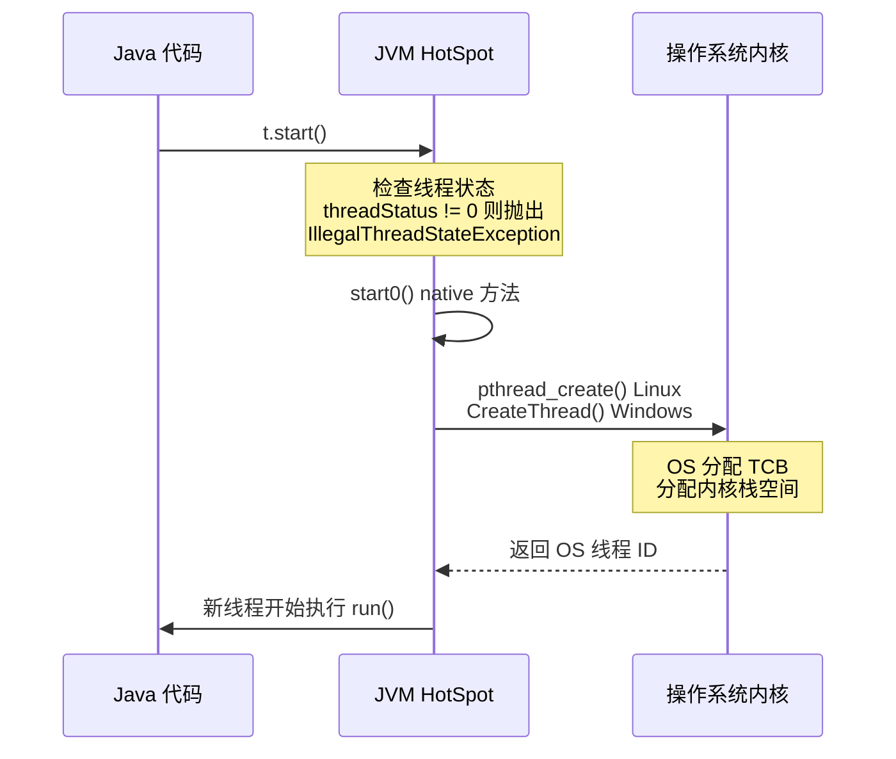
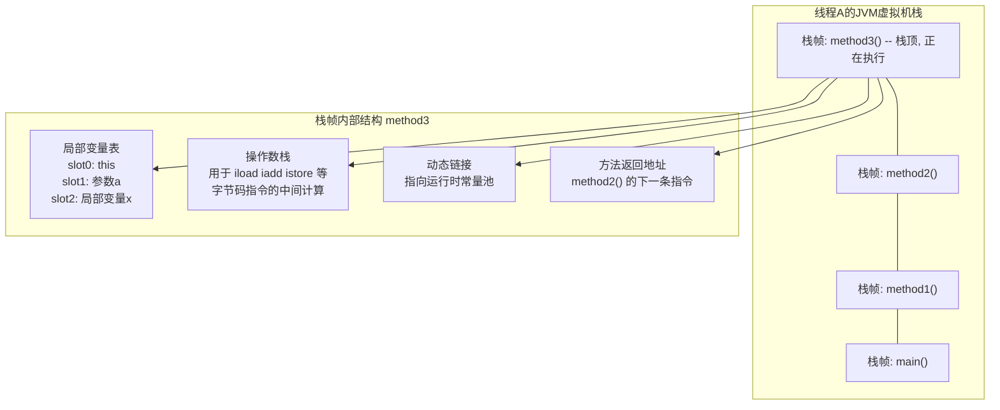
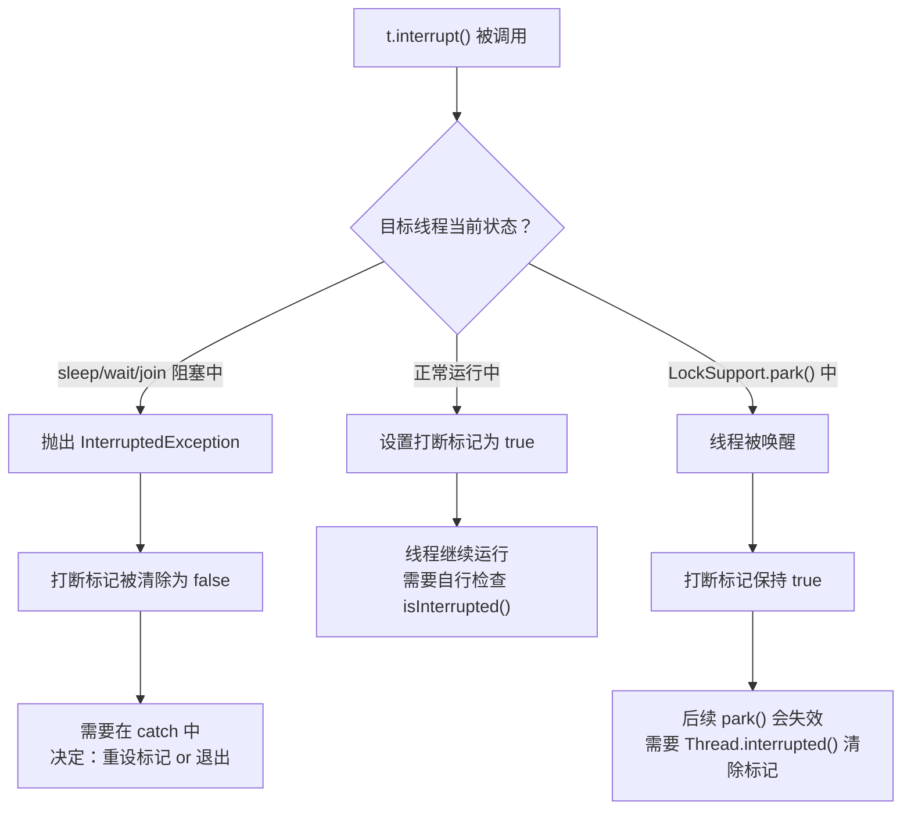
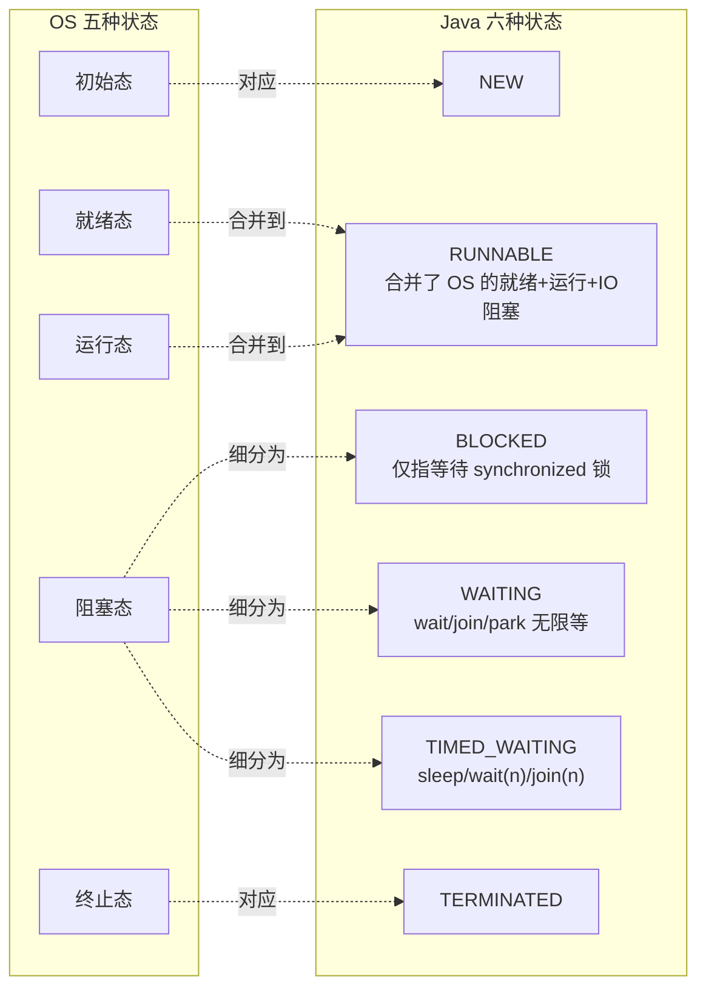

## 目录
- [[#第二章：基本概念与应用]]
	- [[#进程与线程]]
	- [[#并行与并发]]
	- [[#线程应用实践]]
- [[#第三章：线程基础]]
	- [[#创建线程的三种方式与原理]]
	- [[#线程运行原理与底层剖析]]
	- [[#线程常见核心方法]]
		- [[#start() vs run()]]
		- [[#sleep 系列]]
		- [[#yield vs sleep]]
		- [[#join 系列]]
		- [[#interrupt 系列]]
		- [[#守护线程与过时方法]]
	- [[#设计模式探讨]]
	- [[#线程状态生命周期]]
	- [[#综合练习]]

---

## 第二章：基本概念与应用

### 进程与线程

#### 进程（Process）
- 进程是操作系统进行**资源分配**的基本单位
- 每个进程拥有独立的内存空间（代码段、数据段、堆、栈等）
- 进程之间相互隔离，通过 IPC（进程间通信）交换数据
- 一个进程包含至少一个线程

> [!note] OS 补充：进程控制块（PCB, Process Control Block）
> 操作系统为每个进程维护一个 **PCB** 数据结构，记录了：
> - 进程状态（就绪/运行/阻塞）
> - 程序计数器（PC）：下一条要执行的指令地址
> - CPU 寄存器快照
> - 内存管理信息（页表基地址等）
> - 文件描述符表
>
> 类比：PCB 就像一个员工的**人事档案**，OS 是 HR，每次调度时需要翻档案来做上下文切换。CS 专业术语叫 **进程上下文（Process Context）**。


#### 线程（Thread）
- 线程是操作系统进行**调度执行**的基本单位
- 同一进程下的多个线程**共享**进程的堆内存和方法区资源
- 每个线程拥有独立的**程序计数器（PC）、虚拟机栈（本地方法栈）**
- Java 中每启动一个 `main` 方法，都会同时启动垃圾回收线程等多个后台线程

> [!note] OS 补充：线程控制块（TCB, Thread Control Block）
> 与 PCB 对应，操作系统为每个线程维护一个 **TCB**，但 TCB 比 PCB 轻量得多：
> - 只需保存：PC、寄存器快照、栈指针（SP）、线程状态
> - **不需要**保存内存映射、文件描述符（这些在进程级别共享）
>
> 这正是为什么**线程上下文切换比进程切换快**：进程切换要换页表（TLB 失效），线程切换不用。

```
进程与线程的资源共享关系：

+--------- 进程（共享区域）----------------------------+
|  堆（Heap）  |  方法区（Metaspace）  |  文件句柄      |  <-- 所有线程共享
+----------------------------------------------------+
| 线程1          | 线程2           | 线程3            |
| +-----------+  | +-----------+  | +-----------+   |
| | PC(私有)  |  | | PC(私有)  |   | | PC(私有)  |    |  <-- 每个线程
| | JVM栈     |  | | JVM栈     |   | | JVM栈     |   |      独立
| | 本地方法栈 |  | | 本地方法栈 |   | | 本地方法栈 |   |
| +-----------+  | +-----------+  | +-----------+   |
+---------------------------------------------------+
```

> [!warning] 资源开销对比
> 创建一个进程的开销远大于创建一个线程（涉及独立内存空间的分配与释放）。
> 这也是为什么 Java 中提倡使用**线程池**而不是频繁 `new Thread`：线程的创建与销毁本身有代价，线程池通过复用线程来摊薄这个成本。
>
> **具体开销对比**：
> 
> | 操作 | 进程 | 线程 |
> |------|------|------|
> | 创建时间 | 较长（需分配独立地址空间、页表） | 较短（共享进程地址空间） |
> | 内存占用 | 独立堆+栈+代码段（MB 级） | 仅需独立栈空间（默认 1MB/线程） |
> | 上下文切换 | 慢（需切换页表，TLB 刷新） | 快（只换 PC、寄存器、栈指针） |
> | 通信方式 | IPC（管道/共享内存/Socket） | 直接读写共享内存（需同步） |

> [!tip] 关联思考
> - JVM 本身作为一个进程运行，而 JVM 内部又有多个线程（GC 线程、JIT 编译线程、主线程等）
> - 在后续 JVM 学习中可以思考：为什么 GC 发生时要 Stop-The-World（STW），它与"线程暂停"机制深度相关

> [!tip] 延伸阅读
> - 《Java 并发编程的艺术》第 4 章 4.1 **线程简介**：详细介绍了线程与进程的关系、Java 线程模型
> - 《深入理解 Java 虚拟机（第 3 版）》第 12 章 12.4 **Java 与线程**：讲解了内核线程、用户线程、1:1 映射模型
> - 《操作系统概念（恐龙书）》第 4 章 **线程与并发**：OS 层面对线程的完整定义

---

### 并行与并发

#### 并发（Concurrent）
- 在**单核** CPU 下，多个线程**交替执行**（时间片轮转）
- 从宏观上看好像是"同时"运行，实质是快速交替
- 操作系统的调度器负责决定何时让哪个线程占用 CPU

> [!note] OS 补充：时间片与调度算法
> **时间片轮转调度（Round-Robin, RR）** 是最经典的并发调度策略：
> - OS 给每个线程分配一小段 CPU 时间（称为**时间片 / Time Quantum**，通常 1~100ms）
> - 时间片用完 → 触发**时钟中断（Timer Interrupt）** → OS 保存当前线程上下文 → 调度下一个线程
>
> 类比：**时间片调度就像银行叫号系统**。每个客户（线程）到柜台（CPU）办业务，定时器响了（时间片到了）就必须暂停、回排队区（就绪队列 Ready Queue），让下一位客户上来办。虽然每次只有一个人在办，但因为切换速度极快，看起来好像很多人"同时"被服务。
> CS 术语：**抢占式调度（Preemptive Scheduling）**，即 OS 可以强行打断正在运行的线程。

#### 并行（Parallel）
- 在**多核** CPU 下，多个线程物理意义上同时在不同的 CPU 核心上运行
- 是真正的"同时执行"

```
时间线（甘特图视角）：

单核 CPU — 并发（时间片轮转，交替执行）:
时间:  t0    t1    t2    t3    t4    t5    t6
CPU:  [线程A][线程B][线程A][线程C][线程B][线程A]...
       ^          ^     上下文切换（Context Switch）发生在每个交界处

多核 CPU — 并行 + 并发（真正同时 + 核内交替）:
时间:  t0    t1    t2    t3    t4
核心1: [线程A][线程A][线程D][线程A]  <- 线程A和D在核心1上交替（并发）
核心2: [线程B][线程B][线程B][线程B]  <- 线程B独占核心2（理想情况）
核心3: [线程C][线程C][线程C][线程C]  <- 线程C独占核心3
              ^ 核心1与核心2之间是并行（物理上同时执行）
```

> [!question] 电商高并发场景思考
> 在处理电商秒杀请求时，我们所说的"高并发"是并行还是并发？
> 答：**两者都有**。在多核服务器（如 32 核）上，多个请求线程既有真正的并行（不同核同时运行），也有并发竞争（单核的时间片切换）。
> 提升系统吞吐量的关键：合理分配 I/O 密集型任务给更多线程（I/O 等待期间让出 CPU），而 CPU 密集型任务的线程数不宜超过 CPU 核心数。
>
> **经验公式**：
> - **CPU 密集型**：线程数 = `CPU 核心数 + 1`
> - **IO 密集型**：线程数 = `CPU 核心数 * 2`（或更多，取决于 IO 等待比例）
> - 更精确的计算：`线程数 = CPU 核心数 * (1 + IO等待时间 / CPU计算时间)`

> [!tip] 延伸阅读
> - 《操作系统概念（恐龙书）》第 5 章 **CPU 调度**：详细介绍 FCFS、SJF、RR、优先级调度等算法
> - 《Java 并发编程的艺术》第 1 章 1.2 **并发编程的挑战**：分析上下文切换的开销及减少策略

---

### 线程应用实践

#### 异步调用（Async）
- 同步：调用方需要等待结果返回才能继续执行
- 异步：调用方发起请求后立即返回，由其他线程在后台处理
- 典型应用：异步发送邮件/短信、异步写日志

```java
// 同步调用 - 阻塞主线程
sendEmailSync(user);  // 等邮件发送完才往下走

// 异步调用 - 新线程处理，主线程继续
new Thread(() -> sendEmail(user)).start();
System.out.println("下单成功");  // 不等邮件发完就返回
```

```
同步 vs 异步 调用时序对比：

【同步调用】                      【异步调用】
主线程                            主线程         工作线程
  |                                 |
  +-- sendEmail() --+               +-- new Thread --> sendEmail()
  |   （阻塞等待）   |               |   （立即返回）      |
  |                 |               +-- println("成功")   |
  |  <-- 邮件发完 --+               |                    |
  +-- println("成功")               |   （主线程继续干    |
  v                                v    别的事情）       v 邮件发完
```

> [!note] OS 补充：同步/异步 vs 阻塞/非阻塞
> 这两对概念容易混淆，但维度不同：
> - **同步/异步**：描述**调用方是否需要主动等结果**
>   - 同步：调用方自己轮询或阻塞等结果
>   - 异步：被调用方**主动通知**调用方（回调/事件）
> - **阻塞/非阻塞**：描述**调用方等待期间能不能做别的事**
>   - 阻塞：线程挂起，不占 CPU
>   - 非阻塞：立即返回，线程可以做别的
>
> 类比：你去餐厅点餐。
> **同步阻塞** = 你在柜台站着等饭（什么都不干）；
> **同步非阻塞** = 你点完后反复去看取餐口有没有好（CS 术语：**轮询 Polling**）；
> **异步非阻塞** = 你拿了个呼叫器坐下刷手机，饭好了它会响（CS 术语：**回调 Callback / 事件通知**）。

> [!tip] 结合中间件的异步设计
> 在实际后端开发中，纯粹的 `new Thread` 做异步并不可靠（没有异常兜底、无法监控）。
> 更推荐的实践：
> 1. **线程池** + `submit(Callable)` -> 可以拿到 `Future` 结果
> 2. **消息队列**（如 RocketMQ、RabbitMQ）-> 异步任务解耦，更适合跨服务异步
> 3. **`CompletableFuture`** -> JDK 8 的异步编排 API，可链式组合多个异步任务

#### 提升效率（多核并行）
- **场景**：将一个大任务拆分为多个子任务，交给多个线程并行计算，最后汇总结果
- 典型应用：大文件分段读取、分布式计算的本地 Map 阶段

```java
// 示例：将 1~10000 的求和任务拆成两段并行计算
// 线程1: 1~5000
// 线程2: 5001~10000
// 主线程汇总两个结果
```

> [!warning] 注意
> 效率提升的前提是**多核 CPU** 环境下。若是单核，多线程反而因为上下文切换开销更慢。
> 此外，对于**IO 密集型**任务（读写磁盘、网络请求），即使单核多线程也有效率提升，因为 IO 等待期间 CPU 可以切换去执行其他线程的计算工作。
>
> 为什么 IO 等待期间 CPU 可以切换？
> ```
> IO 密集型任务中线程的切换过程：
> 线程A: [计算][发起IO请求 -> 等IO -> IO完成][计算]...
>         ^ 占用 CPU      ^ 不占 CPU（阻塞）    ^ 占用 CPU
>                         ^ 此时 CPU 空闲，OS 会把 CPU 分配给线程B
> 线程B:               [计算][发起IO]        [计算]...
> ```
> 所以 IO 密集型任务的线程数可以超过核心数，因为大部分时间线程在等 IO，不占 CPU。

---

## 第三章：线程基础

### 创建线程的三种方式与原理

#### 方法1：继承 Thread 类
```java
// 方法1：继承 Thread，重写 run()
Thread t1 = new Thread() {
    @Override
    public void run() {
        System.out.println("Method 1: extend Thread — " + Thread.currentThread().getName());
    }
};
t1.setName("Thread-1");
t1.start();
```

#### 方法2：实现 Runnable 接口（推荐）
```java
// 方法2：实现 Runnable 接口（把"任务"和"线程"解耦）
Runnable task = new Runnable() {
    @Override
    public void run() {
        System.out.println("Method 2: implement Runnable — " + Thread.currentThread().getName());
    }
};
Thread t2 = new Thread(task, "Thread-2");
t2.start();

// Lambda 简化（Runnable 是函数式接口）
Thread t3 = new Thread(() -> {
    System.out.println("Lambda — " + Thread.currentThread().getName());
}, "Thread-3");
t3.start();
```

#### 方法3：Callable + FutureTask（可拿返回值）
```java
// 方法3：Callable 接口，允许有返回值，并可抛出受检异常
FutureTask<Integer> futureTask = new FutureTask<>(new Callable<Integer>() {
    @Override
    public Integer call() throws Exception {
        System.out.println("Method 3: Callable — " + Thread.currentThread().getName());
        Thread.sleep(1000);
        return 100;  // 有返回值
    }
});
Thread t4 = new Thread(futureTask, "Thread-4");
t4.start();

// 主线程阻塞等待结果（FutureTask 实现了 Future 接口）
Integer result = futureTask.get();  // 会阻塞，直到 call() 执行完毕
System.out.println("计算结果：" + result);
```

#### 方法1 vs 方法2 的底层原理
- `Thread` 类本身也实现了 `Runnable` 接口
- 当调用 `t.start()` 时，JVM 会在底层通过 `native` 方法创建一个 OS 线程
- 然后 OS 线程启动后会调用 Java 线程的 `run()` 方法
- **方法1** 重写了 `Thread.run()`；**方法2** 则是将 `Runnable` 存入 `Thread.target` 字段，`Thread.run()` 会调用 `target.run()`

> [!note] JVM 补充：`Thread.start()` 底层到底发生了什么？
> Java 线程的创建涉及**三层调用链**，从 Java 到 JVM 到 OS：



> [!note] JVM 补充：1:1 线程模型
> HotSpot JVM 使用的是 **1:1 线程模型**（也称为**内核级线程 Kernel-Level Thread**）：
> - 每一个 Java `Thread` 对应一个 **OS 原生线程**（Native Thread）
> - 线程调度完全由 OS 内核负责，JVM 不做用户态调度
>
> 类比：每个 Java Thread 都有一个 **OS 级别的"身份证"**，OS 调度器直接管理它们的执行顺序。
> CS 术语：**内核级线程（KLT, Kernel-Level Thread）** 与 **用户级线程（ULT, User-Level Thread）** 是 OS 中两种线程实现模型。
>
> ```
> 1:1 模型（HotSpot JVM）:          M:N 模型（Go / JDK21 VirtualThread）:
> 
> Java Thread 1 <--> OS Thread 1    VirtualThread 1 --+
> Java Thread 2 <--> OS Thread 2    VirtualThread 2 --+--> OS Thread 1
> Java Thread 3 <--> OS Thread 3    VirtualThread 3 --+
>                                   VirtualThread 4 --+
> 每个 Java 线程都占一个               VirtualThread 5 --+--> OS Thread 2
> OS 线程（较重）                     VirtualThread 6 --+
>                                   多个虚拟线程共享少量 OS 线程（更轻）
> ```
>
> 这和 Golang 的 **M:N 模型**（多个 goroutine 映射到少量 OS 线程）不同；Java 的虚拟线程 Virtual Thread（JDK 21+, Project Loom）才开始引入 M:N 模型。

> [!info] 为什么推荐方法2（Runnable）？
> - **解耦**："任务"（Runnable）和"执行器"（Thread）分离，Runnable 实例可以提交给线程池、ForkJoin 等
> - **避免继承限制**：Java 单继承，继承了 Thread 就无法再继承其他业务类
> - **方法3（Callable）** 的优势在于能拿到返回值、能向调用方传播异常（通过 `Future.get()` 抛出 `ExecutionException`）

> [!tip] 延伸阅读
> - 《Java 并发编程的艺术》第 4 章 4.1 **线程简介** ~ 4.2 **启动与终止线程**：详细讲解 `start()` 的底层实现和线程安全启动
> - 《深入理解 Java 虚拟机（第 3 版）》第 12 章 12.4.1 **内核线程实现**：解析 1:1 模型和 HotSpot 的实现细节

---

### 线程运行原理与底层剖析

#### 管理进程
##### Windows
- 使用命令窗口来执行命令
	- `tasklist` -- 查看进程
	- `taskkill` -- 杀死进程
	> `tasklist | findstr java`可以找到所有Java相关的进程

##### Linux
- 命令列表
	- `ps -fe` -- 查看进程
	- `kill` -- 杀死进程
	> `ps -fe | grep java` 可以查看所有Java相关的进程

##### Java
- 命令列表
	- `jsp` -- `jdk`中自带的查看Java进程中所有**进程**的命令
	- `jstack <PID>` -- 查看某个进程中所有进程的信息
	- `jconsole` -- 可以远程控制Java进程
	> 这个`jconsole`需要设定好参数之后启动的进程的可以被远程控制

#### JVM 栈帧（Stack Frame）
- **每个线程**拥有自己的**JVM 虚拟机栈**（Java Virtual Machine Stack）
- 每调用一次方法，就会压入一个**栈帧（Stack Frame）**到该线程的栈中
- 栈帧包含：
  - **局部变量表**（Local Variable Table）：存放方法的参数和局部变量
  - **操作数栈**（Operand Stack）：JVM 指令的执行工作区
  - **动态链接**：指向运行时常量池中方法的引用
  - **方法返回地址**：记录调用者的 PC 值，用于方法返回后的跳转



```
线程A的栈:              线程B的栈:
+-------------+         +-------------+
|  method3()  | <-- top |  methodX()  | <-- top
+-------------+         +-------------+
|  method2()  |         |  main()     |
+-------------+         +-------------+
|  method1()  |
+-------------+
|   main()    |
+-------------+
```

> [!tip] Debug 技巧
> 在 IDE 中多线程 Debug 时，可以在"Frames"面板切换不同线程，查看各自的调用栈，这就是对应的 JVM 栈帧结构。

> - 更多细节可以看 -> [[JVM与CPU之间栈帧区别]]

#### 程序计数器（PC Register）
- 每个线程私有，用于记录**当前线程正在执行的字节码指令地址**
- 当 CPU 时间片耗尽发生上下文切换时，PC 中保存的地址就是"断点"，下次重新获得 CPU 时从这里继续执行
- 这也是为什么程序计数器是**唯一不会发生 OOM** 的内存区域

> [!note] JVM 补充：为什么 PC 不会 OOM？
> 类比：PC 就像你看书时**夹的书签**，永远只需要一个小标记记住"读到哪一页"（CS 术语：**指令地址**）。
> 无论方法多复杂，PC 只需要存一个固定大小的地址值，所以不存在内存不够的情况。
> 注意：**当线程执行 native 方法时，PC 的值为 undefined**（因为 native 代码不在 JVM 字节码范围内）。

#### 上下文切换（Context Switch）
- **触发时机**：时间片耗尽、线程阻塞（sleep/wait/IO）、更高优先级线程抢占
- **切换代价**：需要保存当前线程的 PC、寄存器快照、局部变量等现场到 TCB（线程控制块），然后恢复目标线程的现场
- CPU 密集型任务：线程数过多 -> 频繁上下文切换 -> 性能下降

```
上下文切换的详细过程（线程A -> 线程B）：

线程A 正在运行                       线程B 等待调度
     |                                   |
     v                                   |
[时间片到 / sleep / IO阻塞]              |
     |                                   |
     v                                   |
===== 进入内核态（Kernel Mode）=====      |
     |                                   |
  保存线程A的现场到 TCB_A:               |
  - PC (程序计数器)                      |
  - 寄存器 (EAX, EBX, ESP...)            |
  - 栈指针 (Stack Pointer)               |
     |                                   |
  从 TCB_B 恢复线程B的现场:              |
  - 恢复 PC                              |
  - 恢复寄存器                           |
  - 恢复栈指针                           |
     |                                   |
===== 回到用户态（User Mode）=====       |
     |                                   v
     |                           线程B 从上次暂停的位置继续执行
```

> [!failure] 上下文切换的代价
> 频繁的上下文切换会消耗大量的 CPU 时间（保存/恢复 PC、寄存器、内核栈等状态）。
> 
> 类比：就像你同时看三本书，每过 5 分钟必须换一本。每次切换都要**记住当前页码、做的笔记**（保存上下文），再**翻开另一本书找到上次读到的地方**（恢复上下文）。来回切换本身不产生"阅读进度"，纯属额外开销。CS 术语：**上下文切换开销（Context Switch Overhead）**。
>
> **实践原则**：
> - **CPU 密集型**：线程数 = CPU 核心数（如 8 核配 8 线程），避免频繁切换
> - **IO 密集型**：线程数可以更多（如 2 * CPU 核心数），因为 IO 等待期间线程不占 CPU
> - 可通过 `Runtime.getRuntime().availableProcessors()` 获取 CPU 核心数
> - 可通过 Linux 命令 `vmstat 1` 中的 `cs`（Context Switches）列来监控每秒上下文切换次数

---

### 线程常见核心方法

#### 基本方法
- `int getPriority()` -- 获取线程优先级
- `void setPriority(int)` -- 设置线程优先级
- `Thread.State getState()` -- 获取线程状态
- `static Thread currentThread()` -- 获取当前线程的实例对象
- `boolean isAlive()` -- 判断线程是否存活

#### start() vs run()

| 方法 | 行为 | 产生的线程 |
|------|------|----------|
| `t.start()` | 启动一个**新线程**，异步执行 `run()` | 会产生新线程 |
| `t.run()` | 在**当前线程**直接调用 `run()` 方法 | 不产生新线程，就是普通方法调用 |

```java
Thread t = new Thread(() -> {
    System.out.println(Thread.currentThread().getName());
}, "myThread");

t.run();    // 输出 "main"（在主线程中直接执行）
t.start();  // 输出 "myThread"（在新线程中执行）
```

> [!warning] 注意
> `start()` 只能调用一次！对同一个 Thread 对象二次调用 `start()` 会抛出 `IllegalThreadStateException`。

---

#### sleep 系列

##### `Thread.sleep(long millis)`
- 使当前线程进入 `TIMED_WAITING` 状态，让出 CPU，但**不释放锁**
- 睡眠时间结束后，线程从 `TIMED_WAITING` 回到 `RUNNABLE`，等待 CPU 调度
- 可被 `interrupt()` 打断，打断后抛出 `InterruptedException` 并**清除打断标记**

> [!note] OS 补充：sleep 在 OS 层面做了什么？
> 当你调用 `Thread.sleep(1000)` 时，底层发生了这些事情：
> ```
> Java Thread.sleep(1000)
>   -> JVM native 调用
>     -> OS 系统调用（nanosleep / SleepEx）
>       -> OS 将线程从「运行队列」移到「等待队列」（不占 CPU）
>       -> OS 设置一个定时器（Timer），1000ms 后触发
>       -> 定时器到期 -> OS 将线程移回「就绪队列」
>       -> 等到 CPU 时间片分配到该线程 -> 继续执行
> ```
> **关键细节**：sleep 不释放锁是因为锁的状态记录在 JVM 的 Monitor 对象中，sleep 只影响 OS 层面的调度，不改变 Monitor 的持有关系。
> 这也是 `sleep()` 和 `wait()` 的核心区别之一（`wait()` 会释放锁）。

```java
// 推荐写法：使用 TimeUnit 替代魔法数字，增强可读性
TimeUnit.SECONDS.sleep(1);      // 睡 1 秒
TimeUnit.MILLISECONDS.sleep(500); // 睡 500 毫秒

// 不推荐：可读性差
Thread.sleep(1000);  // 1000 到底是秒还是毫秒？
```

##### 打断睡眠的 sleep
```java
Thread t = new Thread(() -> {
    try {
        Thread.sleep(5000);
    } catch (InterruptedException e) {
        // sleep 被打断后，打断标记被自动清除（isInterrupted() 返回 false）
        System.out.println("被打断，打断标记：" + Thread.currentThread().isInterrupted()); // false
    }
});
t.start();
Thread.sleep(500);
t.interrupt();  // 打断 t 的 sleep
```

##### sleep 的应用：防止空转（busy-wait）
```java
// 错误做法：while(true) 空循环会把 CPU 拉满
while (条件不满足) { /* 空循环，CPU 100% */ }

// 正确做法：sleep 让出 CPU，降低资源消耗
while (条件不满足) {
    Thread.sleep(50);  // 每次等 50ms 再检查
}
```

---

#### yield vs sleep

| 特性 | `yield()` | `sleep()` |
|------|-----------|-----------|
| 作用 | 让出 CPU，提示调度器可以重新调度 | 让出 CPU，睡眠指定时长 |
| 状态变化 | `RUNNABLE` → `RUNNABLE`（可能立即重新调度） | `RUNNABLE` → `TIMED_WAITING` |
| 保证 | **不保证**一定让出 CPU（OS 调度器可能忽略） | **保证**至少等待指定时长 |
| 用途 | 提示性、让其他线程有机会运行 | 精确等待 |
| 线程优先级 | 影响 yield 后竞争，高优先级线程更容易被调度 | — |

---

#### join 系列

`join()` 的本质是**让主线程等待子线程执行完毕**（同步等待）

```java
Thread t1 = new Thread(() -> {
    Thread.sleep(1000);
    result = 10;
}, "t1");

t1.start();
// t1.join(); // 若不 join，主线程可能在 t1 算完之前就读到 result=0
t1.join();  // 主线程在此阻塞，直到 t1 执行完毕
System.out.println("result = " + result);  // 10（正确）
```

**限时 join**：`join(long millis)` — 最多等 millis 毫秒
```java
t1.join(500);  // 最多等 500ms，超了继续往下走（无论 t1 是否结束）
```

> [!info] join 的底层原理
> `join()` 内部使用了 `wait()` 实现（Object 监视器机制）：
> - 调用 `t1.join()` 相当于在 t1 对象的 `synchronized` 块内调用 `t1.wait()`
> - 当 t1 线程执行结束时，JVM 会自动调用 `t1.notifyAll()` 来唤醒所有在 `t1` 上等待的线程
> 
> >  - 那如果说`t1.notifyAll()`在`t1.join()`之前，会报错吗？
> >
> > 其实不会，因为`join()`中等待前会有`if(isAlive())`判断，如果已经结束，线程“死”了，就不会进入等待了

---

#### interrupt 系列

##### 打断阻塞状态的线程（sleep / wait / join）
```java
Thread t = new Thread(() -> {
    System.out.println("开始睡觉...");
    try {
        Thread.sleep(5000);
    } catch (InterruptedException e) {
        System.out.println("被打断！打断标记：" + Thread.currentThread().isInterrupted()); // false
        // 注意：InterruptedException 抛出后，打断标记会被自动清除
    }
});
t.start();
t.interrupt();
```

##### 打断正常运行的线程（不抛异常，只设标记）
```java
Thread t = new Thread(() -> {
    while (true) {
        if (Thread.currentThread().isInterrupted()) {
            System.out.println("检测到打断标记，退出循环");
            break;
        }
        // 正常业务逻辑...
    }
});
t.start();
Thread.sleep(100);
t.interrupt();  // 只设置打断标记（isInterrupted = true），不抛异常
```

##### 打断 park
- `LockSupport.park()` 会使线程暂停，`interrupt()` 可以打断它
- 打断 `park` 后，线程恢复运行，**打断标记保持为 `true`**（不会被清除）
- 如果打断标记为 `true`，则后续的 `park()` 调用会失效（直接继续运行）

```java
Thread t = new Thread(() -> {
    LockSupport.park();  // 在此暂停
    System.out.println("park 被打断，标记：" + Thread.currentThread().isInterrupted()); // true
    LockSupport.park();  // 由于标记为 true，这里不会再 park（失效）
    System.out.println("这里也会立即执行");
});
t.start();
t.interrupt();
```

> [!warning] `isInterrupted()` vs `Thread.interrupted()`
> | 方法 | 功能 | 是否清除标记 |
> |------|------|------------|
> | `t.isInterrupted()` | 查询 t 的打断标记 | **不清除** |
> | `Thread.interrupted()` | 查询当前线程打断标记 | **会清除**（重置为 false）|

> [!note] OS 补充：Java interrupt 与 OS 信号的类比
> Java 的 interrupt 机制设计理念和 Unix/Linux 的**信号（Signal）机制**有相似之处：
>
> | Java | Unix/Linux | 行为 |
> |------|------------|------|
> | `t.interrupt()` | `kill -SIGTERM <pid>` | **协作式停止**：只是发送"请求停止"的信号，目标自行决定何时/如何停止 |
> | `t.stop()`（已废弃） | `kill -SIGKILL <pid>` | **强制终止**：立即杀死，不给清理机会，可能导致状态不一致 |
> | `InterruptedException` | 信号处理函数 | 目标线程/进程收到信号后的响应机制 |
>
> 关键理念：**优雅停止应该是协作式的**（Cooperative），而不是强制式的（Preemptive Kill）。
> CS 术语：**协作式中断（Cooperative Interruption）**。



---

#### 守护线程与过时方法

##### 守护线程（Daemon Thread）
- 非守护线程（用户线程）存活时，JVM 不会退出
- 当所有**非守护线程**执行完毕后，JVM 会强制结束所有**守护线程**并退出
- 典型守护线程：GC 线程、Finalizer 线程

```java
Thread daemon = new Thread(() -> {
    while (true) {
        System.out.println("守护线程运行中...");
        Thread.sleep(100);
    }
});
daemon.setDaemon(true);  // 必须在 start() 之前设置！
daemon.start();

Thread.sleep(500);
System.out.println("主线程结束");
// 主线程（非守护线程）结束后，JVM 退出，守护线程被强制终止
```

> [!tip] 应用场景
> 守护线程适合做**后台服务性任务**，如心跳检测、定时统计上报、内存监控等。这些任务不应该阻止 JVM 正常退出。

##### 过时方法（不要使用）

| 方法 | 废弃原因 |
|------|---------|
| `stop()` | 强制终止线程，不释放锁，可能导致数据不一致 |
| `suspend()` | 挂起线程但不释放锁，容易造成死锁 |
| `resume()` | 配合 `suspend()` 使用，同样危险 |

> [!failure] 为什么不能用 `stop()`？
> `stop()` 会在线程任意位置抛出 `ThreadDeath` 异常，这意味着 **synchronized 块内部**的操作也可能被强行中断：
> - 假设线程正在修改 `账户A -= 100` 还没执行 `账户B += 100`，此时被 stop，数据就不一致了
> - 正确方案是**两阶段终止模式**（见下文设计模式章节）

---

### 设计模式探讨

#### 两阶段终止（Two-Phase Termination）

**核心思想**：在"第一阶段"发送停止信号，让目标线程在"第二阶段"自行检测信号并做好收尾工作后退出。

**使用 `interrupt` 实现**：

```java
class MonitorThread {
    private Thread monitor;

    public void start() {
        monitor = new Thread(() -> {
            while (true) {
                Thread current = Thread.currentThread();
                if (current.isInterrupted()) {
                    // 第二阶段：收尾工作（释放资源、保存状态等）
                    System.out.println("执行收尾操作...");
                    break;
                }
                try {
                    Thread.sleep(1000);  // 正常监控业务
                    System.out.println("正在监控...");
                } catch (InterruptedException e) {
                    // sleep 抛出 InterruptedException 后会清除打断标记
                    // 需要重新设置，让下一次循环能够检测到
                    current.interrupt();
                }
            }
        }, "monitor");
        monitor.start();
    }

    public void stop() {
        // 第一阶段：发送停止信号
        monitor.interrupt();
    }
}
```

**流程图解析**：
```
while(true)
    ↓
isInterrupted? ──yes──→ 收尾 → break
    ↓ no
执行监控任务
    ↓
sleep(1000)
  ├── 正常醒来 → 继续循环
  └── 被 interrupt 打断 → 抛出 InterruptedException → 重设打断标记 → 继续循环
```

> [!info] 优雅停机
> 两阶段终止模式在微服务架构中非常广泛：
> - Spring Boot 的优雅停机（`server.shutdown=graceful`）：收到 SIGTERM 信号后，先拒绝新请求（第一阶段），等正在处理的请求完成后再关闭（第二阶段）
> - 这防止了"请求一半时服务就挂了"的问题，保证了事务完整性
> > [!failure] 如果是直接使用`stop()`方法终止线程，如果线程被杀死时线程拿了共享资源锁，那么就会导致后续别的线程都无法获取该资源的锁

> [!note] OS 补充：两阶段终止 vs OS 信号处理
> 两阶段终止模式在 OS 中有直接对应：
> ```
> OS 的优雅关机流程（systemd / init）：
> 
> 第一阶段: kill -SIGTERM <pid>
>   → 进程注册的 Signal Handler（信号处理函数）被触发
>   → 进程开始做清理：关闭文件、断开连接、刷新缓存
> 
> 等待超时（通常 30 秒）...
> 
> 如果进程还没退出:
> 第二阶段: kill -SIGKILL <pid>（操作系统强制终止）
> ```
>
> 在 JVM 中，类似的机制是 **Shutdown Hook**：
> ```java
> Runtime.getRuntime().addShutdownHook(new Thread(() -> {
>     System.out.println("JVM 正在关闭，执行清理...");
>     // 关闭连接池、刷新缓存等
> }));
> ```
> JVM 收到 SIGTERM 后，会执行所有注册的 Shutdown Hook，然后正常退出。

> [!tip] 延伸阅读
> - 《Java 并发编程的艺术》第 4 章 4.2.3 **安全地终止线程**：详细介绍了 interrupt + 标志位的终止策略
> - 《Java 并发编程实战》第 7 章 **取消与关闭**：系统性讲解了线程安全的停止方式

---

### 线程状态生命周期

#### 操作系统层面（五种状态）

```
         +-----------------------------+
         v                             |
[初始态] -> [就绪态] -> [运行态] -> [终止态]
                ^          |
                +--[阻塞态]-+
```

| 状态 | 含义 |
|------|------|
| 初始态 | 线程对象创建，尚未分配 OS 资源 |
| 就绪态 | 等待 CPU 时间片（Runnable，在 Run Queue 中） |
| 运行态 | 正在 CPU 上执行 |
| 阻塞态 | 等待 IO、锁等，不在 Run Queue 中 |
| 终止态 | 执行完毕，线程资源被回收 |

#### Java API 层面（六种状态）
Java 的 `Thread.State` 枚举对 OS 五种状态进行了细化：

```java
public enum State {
    NEW,           // 线程对象已创建，还未调用 start()
    RUNNABLE,      // 已调用 start()，正在运行或等待 CPU（包含 OS 的就绪+运行）
    BLOCKED,       // 等待进入 synchronized 块（等锁）
    WAITING,       // 无限期等待（wait()、join()、park()）
    TIMED_WAITING, // 有时限等待（sleep(n)、wait(n)、join(n)、parkNanos(n)）
    TERMINATED     // 线程执行完毕
}
```

> [!note] JVM 补充：OS 五状态 vs Java 六状态 对照
> Java 对 OS 的状态模型做了**合并与细分**：



> 关键区别：
> - OS 的**就绪态 + 运行态** 在 Java 中合并为 `RUNNABLE`（Java 无法区分线程是在 CPU 上跑还是在等时间片）
> - OS 的**阻塞态** 在 Java 中根据原因细分为 `BLOCKED`、`WAITING`、`TIMED_WAITING` 三种
> - Java 的 `RUNNABLE` 甚至包含了 OS 的 IO 阻塞（因为 JVM 感知不到 JNI/OS 级别的 IO 阻塞）

**状态转换图**：
```
NEW --start()--> RUNNABLE
                      |  <--- 获取锁 / IO完成
                      v  ---> 等待锁（synchronized）
                  BLOCKED
                      
RUNNABLE --wait()/join()/park()--> WAITING
WAITING --notify()/interrupt()--> RUNNABLE

RUNNABLE --sleep(n)/wait(n)/join(n)--> TIMED_WAITING
TIMED_WAITING --超时/唤醒/打断--> RUNNABLE

RUNNABLE --run()结束--> TERMINATED
```

> [!question] 状态转换细节分析
> **Q：当线程调用了阻塞型 IO（如 `socket.read()`）时，Java `Thread.State` 显示什么？**
>
> **A：显示 `RUNNABLE`**。
> 这是 Java 与 OS 的**语义差异**：Java 将"等待 IO"归入了 `RUNNABLE`，而 OS 层面该线程其实处于阻塞态（不占 CPU）。
> 这样设计的原因是：Java 无法精确感知所有 JNI/OS 级别的阻塞，索性统一分类，简化状态模型。

> [!tip] 状态判断的实际应用
> 在 `jstack` 线程 dump 中，可以看到常见的状态组合：
> - `BLOCKED`：大量线程等待同一把锁 → 锁竞争过于激烈，考虑减小临界区
> - `WAITING`（wait on lock）：wait/notify 使用，注意是否有线程被遗漏唤醒
> - `TIMED_WAITING`（sleeping）：大量 sleep 可能是业务代码频繁 sleep 等待

> [!tip] 延伸阅读
> - 《Java 并发编程的艺术》第 4 章 4.1.4 **线程的状态**：详细解释了 Java 线程的 6 种状态转换及 `jstack` 工具的使用方式
> - 《深入理解 Java 虚拟机（第 3 版）》第 12 章 12.4.2 **Java 线程调度与状态转换**：从 JVM 底层解释了 RUNNABLE 合并 OS 就绪/运行的原因

---

### 综合练习

#### 统筹问题（烧水泡茶）
**场景**：烧水需要 5 分钟，洗茶叶需要 1 分钟，如何最高效地烧好一壶茶？

**串行方案**（低效，6 分钟）：
```
主线程：烧水(5min) → 洗茶叶(1min) → 泡茶
```

**并行方案**（高效，5 分钟）：
```java
Thread boilWater = new Thread(() -> {
    System.out.println("开始烧水...");
    Thread.sleep(5 * 1000);  // 模拟 5 分钟
    System.out.println("水烧好了");
}, "烧水线程");

Thread washTea = new Thread(() -> {
    System.out.println("开始洗茶叶...");
    Thread.sleep(1 * 1000);  // 模拟 1 分钟
    System.out.println("茶叶洗好了");
}, "洗茶叶线程");

boilWater.start();
washTea.start();

boilWater.join();  // 等水烧好
washTea.join();    // 等茶叶洗好（此时可能已经结束）

System.out.println("开始泡茶！总耗时约 5 分钟");
```

> [!tip] 统筹思想的映射
> 这个例子映射了实际开发中的**并发编排**场景：
> - 接口A和接口B没有依赖关系时，使用 `CompletableFuture.allOf()` 并行调用，总耗时 = max(A耗时, B耗时)
> - 而不是串行调用，总耗时 = A耗时 + B耗时

---