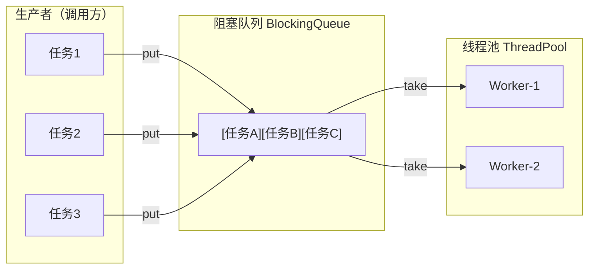
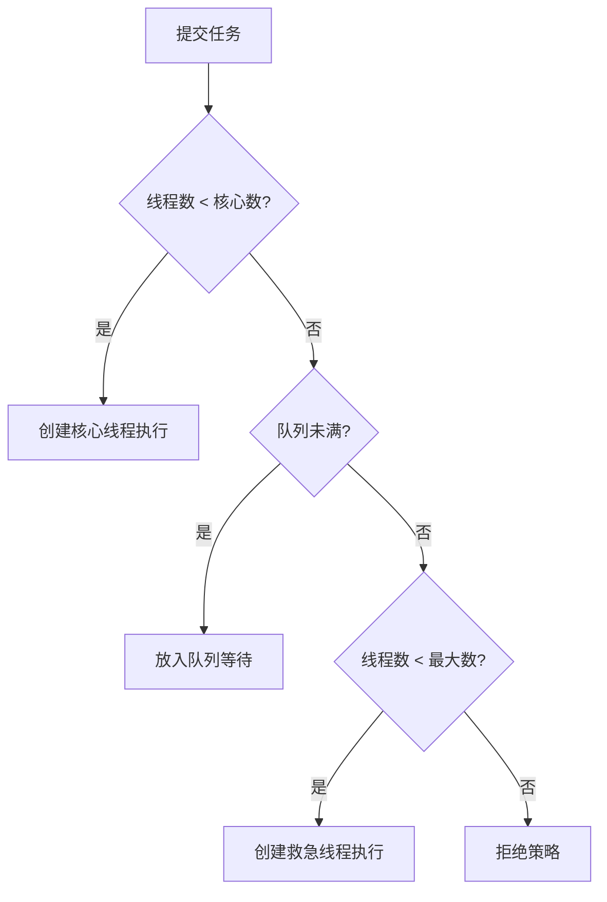
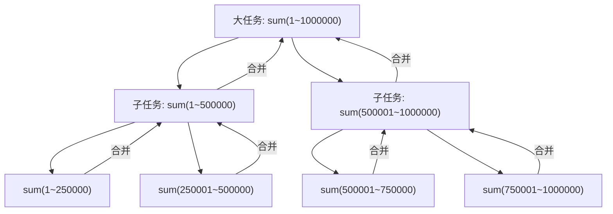
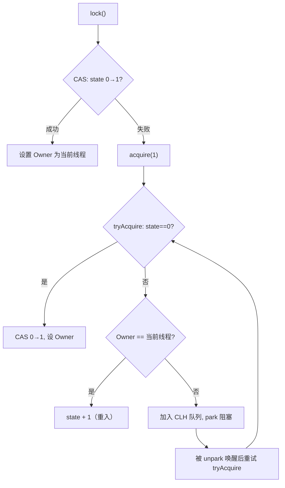
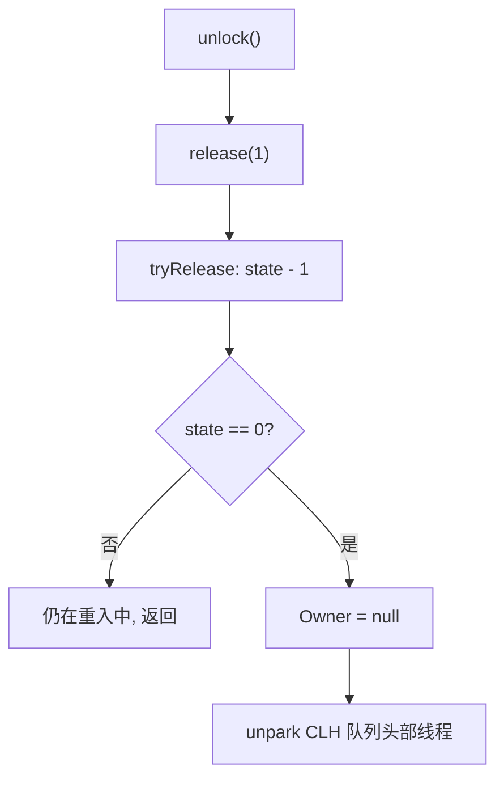
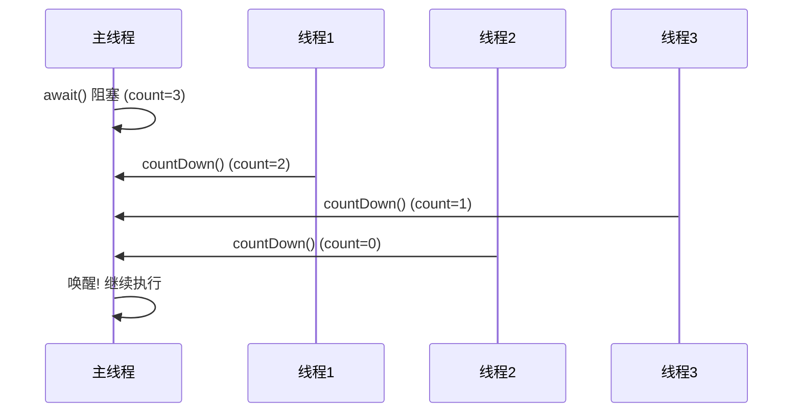
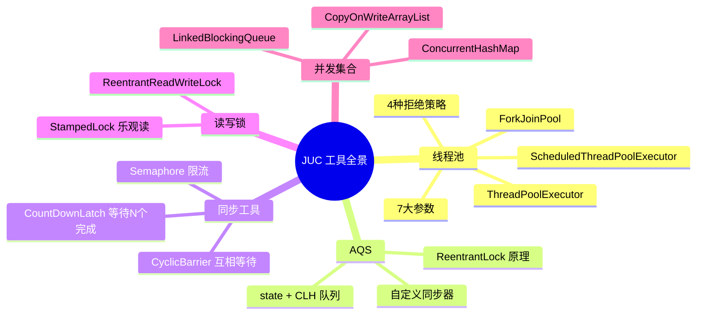

## 目录
- [[#自定义线程池]]
- [[#ThreadPoolExecutor]]
	- [[#池状态与构造方法]]
	- [[#常见线程池工厂方法]]
	- [[#提交与停止]]
	- [[#线程池大小设计]]
- [[#设计模式 — 工作线程]]
- [[#定时任务]]
- [[#Tomcat 线程池]]
- [[#ForkJoin 框架]]
- [[#AQS（AbstractQueuedSynchronizer）]]
	- [[#AQS 概述与自定义锁]]
	- [[#ReentrantLock 原理]]
- [[#读写锁]]
	- [[#ReentrantReadWriteLock]]
	- [[#StampedLock]]
- [[#Semaphore 信号量]]
- [[#CountDownLatch 倒计时门闩]]
- [[#CyclicBarrier 循环栅栏]]
- [[#线程安全集合]]
	- [[#ConcurrentHashMap]]
	- [[#LinkedBlockingQueue]]
	- [[#CopyOnWriteArrayList]]

---

## 自定义线程池

### 整体架构



> 类比：线程池就像一个**快递分拣中心**。快递（任务）进入传送带（阻塞队列），分拣员（Worker 线程）从传送带上拿快递处理。分拣员数量固定，不会每来一个快递就雇一个人
> CS 术语：**线程池（Thread Pool）** 是生产者-消费者模式的经典应用，通过复用线程来摊薄线程创建/销毁的开销

### 阻塞队列实现

```java
class BlockingQueue<T> {
    private final LinkedList<T> queue = new LinkedList<>();
    private final int capacity;
    private final ReentrantLock lock = new ReentrantLock();
    private final Condition fullWait = lock.newCondition();   // 队满等待
    private final Condition emptyWait = lock.newCondition();  // 队空等待

    public BlockingQueue(int capacity) { this.capacity = capacity; }

    // 带超时的取任务
    public T poll(long timeout, TimeUnit unit) {
        lock.lock();
        try {
            long nanos = unit.toNanos(timeout);
            while (queue.isEmpty()) {
                if (nanos <= 0) return null;
                nanos = emptyWait.awaitNanos(nanos);  // 等待并返回剩余时间
            }
            T t = queue.removeFirst();
            fullWait.signal();  // 唤醒等待入队的线程
            return t;
        } finally { lock.unlock(); }
    }

    // 带超时的放任务
    public boolean offer(T task, long timeout, TimeUnit unit) {
        lock.lock();
        try {
            long nanos = unit.toNanos(timeout);
            while (queue.size() == capacity) {
                if (nanos <= 0) return false;
                nanos = fullWait.awaitNanos(nanos);
            }
            queue.addLast(task);
            emptyWait.signal();
            return true;
        } finally { lock.unlock(); }
    }
}
```

### 拒绝策略

当队列满且线程都在忙时，新任务怎么处理？

```java
@FunctionalInterface
interface RejectPolicy<T> {
    void reject(BlockingQueue<T> queue, T task);
}

// 策略1: 阻塞等待（死等）
(queue, task) -> queue.put(task);

// 策略2: 超时等待
(queue, task) -> queue.offer(task, 1, TimeUnit.SECONDS);

// 策略3: 抛出异常
(queue, task) -> { throw new RejectedExecutionException("队列已满"); };

// 策略4: 调用者自己执行
(queue, task) -> task.run();  // 由提交任务的线程自己跑

// 策略5: 直接丢弃
(queue, task) -> { /* 什么也不做 */ };
```

---

## ThreadPoolExecutor

### 池状态与构造方法

```
线程池状态（用一个 int 的高3位表示）:

RUNNING(-1)  → 正常运行，接受新任务，处理队列任务
SHUTDOWN(0)  → 不接受新任务，但处理队列中剩余任务
STOP(1)      → 不接受新任务，不处理队列任务，中断正在执行的任务
TIDYING(2)   → 所有任务终止，workerCount=0
TERMINATED(3)→ terminated() 方法执行完毕

状态转换:
RUNNING → shutdown() → SHUTDOWN → 队列空且线程终止 → TIDYING → TERMINATED
RUNNING → shutdownNow() → STOP → 线程终止 → TIDYING → TERMINATED
```

#### 七大核心参数

```java
public ThreadPoolExecutor(
    int corePoolSize,         // 核心线程数（常驻）
    int maximumPoolSize,      // 最大线程数（核心+救急线程）
    long keepAliveTime,       // 救急线程的存活时间
    TimeUnit unit,            // 存活时间单位
    BlockingQueue<Runnable> workQueue,  // 阻塞队列
    ThreadFactory threadFactory,        // 线程工厂
    RejectedExecutionHandler handler    // 拒绝策略
)
```

```
任务提交流程:

新任务到达
    ↓
当前线程数 < corePoolSize? ──yes──→ 创建核心线程执行
    ↓ no
队列未满? ──yes──→ 放入阻塞队列
    ↓ no
当前线程数 < maximumPoolSize? ──yes──→ 创建救急线程执行
    ↓ no
执行拒绝策略
```



> [!warning] 核心线程 vs 救急线程
> - **核心线程**：长期存活，即使空闲也不回收（除非设置 `allowCoreThreadTimeOut`）
> - **救急线程**：超过 `keepAliveTime` 空闲后被回收
> - 类比：核心线程 = 正式员工（长期合同）；救急线程 = 临时工（忙完就走）

### 常见线程池工厂方法

| 工厂方法 | 核心数 | 最大数 | 队列 | 适用场景 |
|---------|--------|--------|------|---------|
| `newFixedThreadPool(n)` | n | n | 无界 `LinkedBlockingQueue` | 固定并发数的任务 |
| `newCachedThreadPool()` | 0 | `Integer.MAX_VALUE` | `SynchronousQueue` | 大量短生命周期任务 |
| `newSingleThreadExecutor()` | 1 | 1 | 无界 `LinkedBlockingQueue` | 顺序执行任务 |

> [!failure] 阿里规范：禁止使用 Executors 创建线程池
> - `newFixedThreadPool` / `newSingleThreadExecutor`：队列无界 → 任务堆积 → **OOM**
> - `newCachedThreadPool`：线程数无上限 → 线程暴涨 → **OOM**
> - 推荐用 `new ThreadPoolExecutor(...)` 手动指定参数

### 提交与停止

```java
// submit: 可以拿到返回值
Future<String> future = pool.submit(() -> { return "result"; });
String result = future.get();  // 阻塞等待结果

// invokeAll: 提交多个任务，等待全部完成
List<Future<String>> futures = pool.invokeAll(taskList);

// invokeAny: 提交多个任务，返回最先完成的结果
String fastest = pool.invokeAny(taskList);

// 停止
pool.shutdown();     // 温柔：不接受新任务，等待已有任务执行完
pool.shutdownNow();  // 强硬：尝试中断所有正在执行的任务，返回未执行的任务列表
```

### 线程池大小设计

| 任务类型 | 推荐线程数 | 原因 |
|---------|-----------|------|
| **CPU 密集型** | N+1（N=CPU核心数） | CPU 一直在算，线程太多反而增加上下文切换 |
| **IO 密集型** | 2N 或 N/(1-阻塞率) | IO 等待时线程不占 CPU，多线程提高利用率 |

> [!info] 经验公式
> 线程数 = CPU 核心数 × 期望 CPU 利用率 × (1 + W/C)
> 其中 W = 线程等待时间，C = 线程计算时间
> `Runtime.getRuntime().availableProcessors()` 获取核心数

---

## 设计模式 — 工作线程

### 饥饿问题

当一个线程池**同时处理两种有依赖关系的任务**时，可能死锁：

```
线程池（2个线程）:

任务A（点餐）→ 提交任务B（做菜）到同一个线程池
Worker-1: 执行任务A → 等待任务B完成
Worker-2: 执行任务A → 等待任务B完成
任务B（做菜）: 在队列中等待 → 但没有空闲线程 → 死等！
→ 死锁（饥饿型死锁）
```

**解决方案**：不同类型的任务使用**不同的线程池**

```java
ExecutorService orderPool = Executors.newFixedThreadPool(2);  // 点餐池
ExecutorService cookPool  = Executors.newFixedThreadPool(2);  // 做菜池

orderPool.submit(() -> {
    Future<String> dish = cookPool.submit(() -> "红烧肉");  // 提交到做菜池
    return dish.get();  // 不会饥饿，因为做菜池有独立的线程
});
```

---

## 定时任务

```java
ScheduledExecutorService scheduler = Executors.newScheduledThreadPool(2);

// 延时执行（3秒后执行一次）
scheduler.schedule(() -> System.out.println("delayed"), 3, TimeUnit.SECONDS);

// 固定速率（每2秒执行，不管上次是否完成）
scheduler.scheduleAtFixedRate(() -> { ... }, 0, 2, TimeUnit.SECONDS);

// 固定延迟（上次执行完毕后等2秒再执行）
scheduler.scheduleWithFixedDelay(() -> { ... }, 0, 2, TimeUnit.SECONDS);
```

> [!tip] Timer 的缺点
> `java.util.Timer` 是单线程的：一个任务抛出异常 → 整个 Timer 终止
> `ScheduledThreadPoolExecutor` 多线程执行，一个任务异常不影响其他任务

---

## Tomcat 线程池

```
Tomcat 线程模型:

    客户端请求
        ↓
    Acceptor 线程（1个）→ 接收连接
        ↓
    Poller 线程（NIO）→ 监听 IO 事件
        ↓
    Worker 线程池 → 处理业务逻辑
    ├── maxThreads (最大200)
    ├── minSpareThreads (最小10)
    └── acceptCount (队列长度100)
```

> [!info] Tomcat 线程池 vs JDK 线程池的区别
> Tomcat 自定义了 `TaskQueue`：当核心线程满时，**先尝试创建新线程**，而不是先放队列
> 因为 Web 场景下响应延迟比队列利用率更重要——用户等不起

---

## ForkJoin 框架

**适用场景**：可以**递归拆分**的大任务（分治算法）



```java
class SumTask extends RecursiveTask<Long> {
    private final long begin, end;
    static final long THRESHOLD = 10000;

    SumTask(long begin, long end) { this.begin = begin; this.end = end; }

    @Override
    protected Long compute() {
        if (end - begin <= THRESHOLD) {
            long sum = 0;
            for (long i = begin; i <= end; i++) sum += i;
            return sum;
        }
        long mid = (begin + end) / 2;
        SumTask left  = new SumTask(begin, mid);
        SumTask right = new SumTask(mid + 1, end);
        left.fork();    // 提交到 ForkJoin 线程池
        right.fork();
        return left.join() + right.join();  // 合并结果
    }
}

ForkJoinPool pool = new ForkJoinPool();
Long result = pool.invoke(new SumTask(1, 1000000));
```

> [!info] 工作窃取（Work Stealing）
> ForkJoinPool 中每个线程有自己的**双端队列（Deque）**
> 当一个线程的队列空了，它会从其他线程的队列**尾部偷取**任务执行
> → 提高 CPU 利用率，减少线程空闲
> CS 术语：**Work-Stealing Algorithm**，是 ForkJoin 的核心调度策略

---

## AQS（AbstractQueuedSynchronizer）

### AQS 概述

AQS 是 JUC 中**大部分同步器的基础框架**（ReentrantLock、Semaphore、CountDownLatch 等都基于它）。

```
AQS 核心结构:

┌─────────────────────────────────────────────┐
│  volatile int state   ← 同步状态             │
│                                              │
│  Node head ←→ Node ←→ Node ←→ Node (tail)   │
│  (CLH 等待队列，双向链表)                      │
│                                              │
│  ConditionObject → Node → Node               │
│  (条件等待队列，单向链表)                      │
└─────────────────────────────────────────────┘
```

- **state**：表示同步状态（0=未锁定，1=已锁定，>1=重入次数）
- **CLH 队列**：获取锁失败的线程在此排队等待
- **ConditionObject**：`Condition.await()` 的等待队列

> [!tip] 类比
> AQS 就像一个排队叫号系统的底层框架：
> - **state** = 当前服务窗口的状态（空闲/占用）
> - **CLH 队列** = 取号排队的人
> - 不同的同步器（ReentrantLock、Semaphore 等）就是基于这个框架定制的不同排队规则
> CS 术语：AQS 使用了 **CLH 锁队列**的变种（Craig, Landin, and Hagersten Lock），是一种基于链表的公平自旋锁

### 自定义锁（基于 AQS）

```java
class MyLock implements Lock {
    private final Sync sync = new Sync();

    // 自定义 AQS 实现
    static class Sync extends AbstractQueuedSynchronizer {
        @Override
        protected boolean tryAcquire(int arg) {
            if (compareAndSetState(0, 1)) {  // CAS: 0→1
                setExclusiveOwnerThread(Thread.currentThread());
                return true;
            }
            return false;
        }

        @Override
        protected boolean tryRelease(int arg) {
            setExclusiveOwnerThread(null);
            setState(0);  // volatile 写，保证可见性
            return true;
        }

        @Override
        protected boolean isHeldExclusively() {
            return getState() == 1;
        }

        Condition newCondition() { return new ConditionObject(); }
    }

    public void lock()    { sync.acquire(1); }
    public void unlock()  { sync.release(1); }
    // ... 其他 Lock 接口方法
}
```

### ReentrantLock 原理

#### 加锁流程（非公平锁）



#### 解锁流程



#### 公平锁 vs 非公平锁的区别

```java
// 非公平锁（默认）: tryAcquire 时直接 CAS 抢锁
if (compareAndSetState(0, 1)) { ... }  // 新来的线程可以插队

// 公平锁: tryAcquire 先检查队列中有没有等待更久的线程
if (!hasQueuedPredecessors() && compareAndSetState(0, 1)) { ... }
// hasQueuedPredecessors() = true 说明有人排在前面，不能插队
```

---

## 读写锁

### ReentrantReadWriteLock

**核心思想**：读读不互斥，读写互斥，写写互斥

```
互斥关系矩阵:
        读锁    写锁
读锁    ✅兼容   ❌互斥
写锁    ❌互斥   ❌互斥
```

```java
ReentrantReadWriteLock rw = new ReentrantReadWriteLock();
ReentrantReadWriteLock.ReadLock readLock = rw.readLock();
ReentrantReadWriteLock.WriteLock writeLock = rw.writeLock();

// 读操作（多线程可并发）
readLock.lock();
try { return data; }
finally { readLock.unlock(); }

// 写操作（独占）
writeLock.lock();
try { data = newValue; }
finally { writeLock.unlock(); }
```

> [!info] 读写锁用一个 state 表示两种状态
> AQS 的 `state`（32位 int）被拆成高低 16 位：
> - **高 16 位**：读锁持有次数
> - **低 16 位**：写锁重入次数
> ```
> state = 0x 0003 0001
>             ↑       ↑
>          读锁3次  写锁1次
> ```

**应用：读写缓存**
```java
class Cache {
    private Map<String, Object> map = new HashMap<>();
    private ReentrantReadWriteLock rw = new ReentrantReadWriteLock();

    public Object get(String key) {
        rw.readLock().lock();
        try { return map.get(key); }
        finally { rw.readLock().unlock(); }
    }

    public void put(String key, Object value) {
        rw.writeLock().lock();
        try { map.put(key, value); }
        finally { rw.writeLock().unlock(); }
    }
}
```

> [!warning] 注意事项
> - 不支持锁升级：持有读锁时不能再获取写锁（会死锁）
> - 支持锁降级：持有写锁时可以再获取读锁，然后释放写锁

### StampedLock

JDK 8 引入，比读写锁多了**乐观读**：

```java
StampedLock lock = new StampedLock();

// 乐观读（不加锁！只获取一个 stamp）
long stamp = lock.tryOptimisticRead();
int x = this.x, y = this.y;  // 读取数据
if (!lock.validate(stamp)) {  // 检查期间是否有写操作
    // stamp 失效 → 升级为悲观读
    stamp = lock.readLock();
    try { x = this.x; y = this.y; }
    finally { lock.unlockRead(stamp); }
}

// 写锁
long stamp = lock.writeLock();
try { this.x = 10; this.y = 20; }
finally { lock.unlockWrite(stamp); }
```

> [!tip] StampedLock vs ReentrantReadWriteLock
> StampedLock 的乐观读**不阻塞写线程**，适合读多写少的场景
> 但 StampedLock **不可重入**且**不支持 Condition**

---

## Semaphore 信号量

**核心思想**：控制同时访问某资源的**线程数量**（限流）

> 类比：停车场出入口的计数器——总共 3 个车位，进一辆 -1，出一辆 +1，计数为 0 时后面的车等着
> CS 术语：**信号量（Semaphore）** 是 Dijkstra 提出的经典同步原语，P 操作 = acquire，V 操作 = release

```java
Semaphore sem = new Semaphore(3);  // 3 个许可

sem.acquire();  // 获取许可（没有则阻塞）—— P 操作
try {
    // 最多 3 个线程同时执行此代码
    accessDatabase();
} finally {
    sem.release();  // 释放许可 —— V 操作
}
```

```
内部原理（基于 AQS）:
state = 3（初始许可数）

acquire(): state - 1 (CAS), 若 state < 0 → 进入 AQS 等待队列
release(): state + 1 (CAS) → 唤醒等待队列中的线程
```

---

## CountDownLatch 倒计时门闩

**核心思想**：一个线程等待**N 个其他线程**完成工作后再继续

> 类比：运动会赛跑，裁判（主线程）等所有选手（子线程）都到达终点后，才宣布比赛结束
> CS 术语：**倒计时锁存器** — 初始化计数器为 N，每个完成的线程调用 `countDown()` 将计数 -1，主线程 `await()` 阻塞直到计数为 0

```java
CountDownLatch latch = new CountDownLatch(3);

for (int i = 0; i < 3; i++) {
    new Thread(() -> {
        doWork();
        latch.countDown();  // 完成后 -1
    }).start();
}

latch.await();  // 主线程阻塞，直到 count=0
System.out.println("全部完成！");
```



> [!warning] CountDownLatch 是**一次性**的
> 计数器归零后不能重置。如果需要循环使用，请用 `CyclicBarrier`

---

## CyclicBarrier 循环栅栏

**核心思想**：让一组线程**互相等待**，全部到达屏障点后一起继续

> 与 CountDownLatch 的区别：
> - CountDownLatch：N 个线程做事，1 个线程等它们完成（一次性）
> - CyclicBarrier：N 个线程互相等待对方到达，然后一起出发（可循环复用）

```java
CyclicBarrier barrier = new CyclicBarrier(3, () -> {
    System.out.println("所有线程到达栅栏，开始下一轮！");  // 到齐后执行
});

for (int i = 0; i < 3; i++) {
    new Thread(() -> {
        System.out.println(Thread.currentThread().getName() + " 准备完毕");
        barrier.await();  // 等待所有线程到达
        System.out.println(Thread.currentThread().getName() + " 开始执行");
    }).start();
}
```

---

## 线程安全集合

### ConcurrentHashMap

#### JDK 7 实现（分段锁）

```
Segment 数组（默认16段）:
┌──────┬──────┬──────┬──────┐
│Seg-0 │Seg-1 │Seg-2 │ ...  │
│(Lock)│(Lock)│(Lock)│      │
└──┬───┴──┬───┴──┬───┴──────┘
   ↓      ↓      ↓
 [链表]  [链表]  [链表]    ← 每段是一个小 HashMap

不同 Segment 之间无锁竞争 → 最大并发度 = Segment 数量
```

#### JDK 8 实现（CAS + synchronized）

```
Node 数组 + 链表/红黑树:
┌──────┬──────┬──────┬──────┬──────┐
│null  │Node  │null  │Node  │ ...  │
└──────┴──┬───┴──────┴──┬───┴──────┘
          ↓             ↓
        链表           红黑树
      (len<8)        (len>=8)

put 操作:
① 计算 hash，定位到桶位置
② 桶为空 → CAS 放入新 Node（无锁）
③ 桶不为空 → synchronized(桶头节点) → 链表/红黑树插入
④ 链表长度 ≥ 8 → 转红黑树（treeifyBin）
```

> [!info] 为什么 JDK 8 放弃了分段锁？
> 1. **锁粒度更细**：CAS + 对桶头 synchronized → 只锁一个桶，不是一整段
> 2. **内存更省**：不需要 Segment 对象数组
> 3. **查询更快**：链表转红黑树，O(n) → O(log n)

#### 常见错误用法

```java
// ❌ 错误：get + put 不是原子操作
ConcurrentHashMap<String, Integer> map = new ConcurrentHashMap<>();
Integer count = map.get("key");
if (count == null) {
    map.put("key", 1);   // 两个线程可能同时执行到这里
} else {
    map.put("key", count + 1);
}

// ✅ 正确：使用 computeIfAbsent / compute 原子操作
map.computeIfAbsent("key", k -> new LongAdder()).increment();
map.compute("key", (k, v) -> v == null ? 1 : v + 1);
```

### LinkedBlockingQueue

```
双锁结构:

                 putLock                    takeLock
                    ↓                          ↓
入队（尾部）→  [node] ←→ [node] ←→ [node]  ← 出队（头部）

- 入队用 putLock（ReentrantLock）
- 出队用 takeLock（ReentrantLock）
- 两把锁互不干扰 → 入队和出队可以并发执行
```

> [!tip] 对比 ArrayBlockingQueue
> | 特性 | LinkedBlockingQueue | ArrayBlockingQueue |
> |------|--------------------|--------------------|
> | 底层 | 链表 | 数组 |
> | 锁 | **两把锁**（读写分离） | 一把锁 |
> | 并发 | 入队出队可并发 | 入队出队互斥 |
> | 内存 | 每次入队 new Node | 预分配数组，但需指定容量 |
> | GC | Node 对象频繁创建回收 | 无额外对象分配 |

### CopyOnWriteArrayList

**核心思想**：写时复制——修改时创建底层数组的副本，读操作无需加锁

```java
// 写操作（加锁 + 复制）
public boolean add(E e) {
    synchronized (lock) {
        Object[] old = getArray();
        Object[] newArr = Arrays.copyOf(old, old.length + 1);
        newArr[old.length] = e;
        setArray(newArr);  // 原子地替换数组引用
        return true;
    }
}

// 读操作（无锁，直接读）
public E get(int index) {
    return (E) getArray()[index];  // 无同步开销
}
```

> [!warning] 适用场景
> - **读多写少**：读无锁，写有锁+复制 → 适合配置列表、观察者列表等
> - **不适合频繁写入**：每次写都复制整个数组 → 内存开销大
> - 迭代器是**弱一致性**的：迭代期间的修改不会反映在当前迭代器中

---

## 第八章小结



| 工具 | 一句话总结 |
|------|-----------|
| ThreadPoolExecutor | 线程复用 + 任务队列 + 拒绝策略 |
| ForkJoinPool | 分治算法 + 工作窃取 |
| AQS | JUC 同步器的底层框架（state + CLH） |
| ReentrantLock | 可重入/可打断/可超时/公平/多条件变量 |
| ReadWriteLock | 读读兼容，读写互斥，写写互斥 |
| Semaphore | 控制并发数量（限流） |
| CountDownLatch | 等待 N 个事件完成（一次性） |
| CyclicBarrier | N 个线程互相等待（可循环） |
| ConcurrentHashMap | CAS + synchronized，桶级别锁 |
| LinkedBlockingQueue | 双锁（读写分离），入队出队并发 |
| CopyOnWriteArrayList | 写时复制，读无锁 |

---
