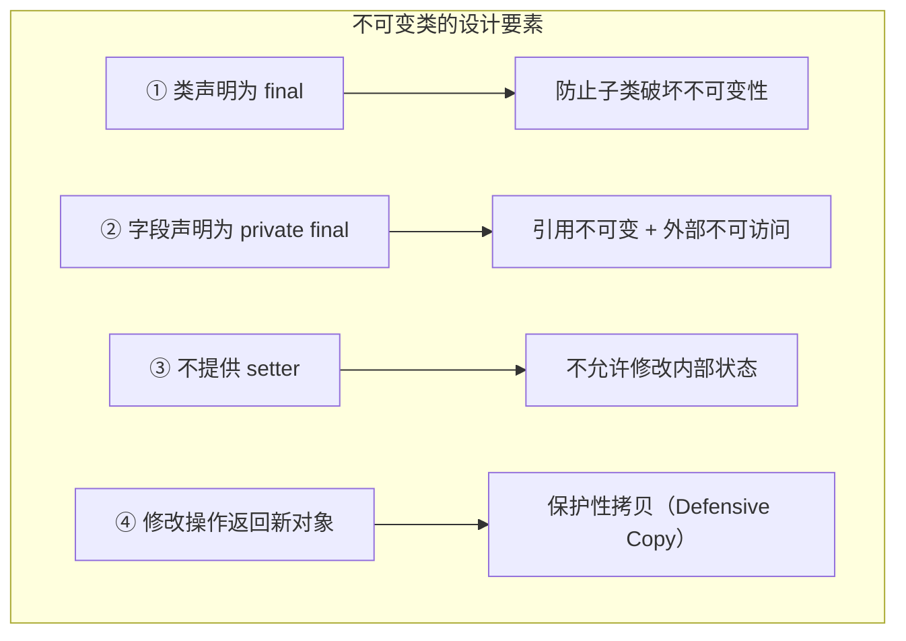
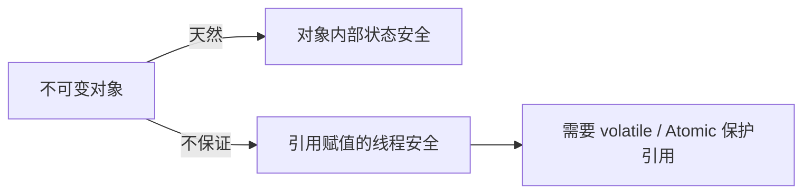
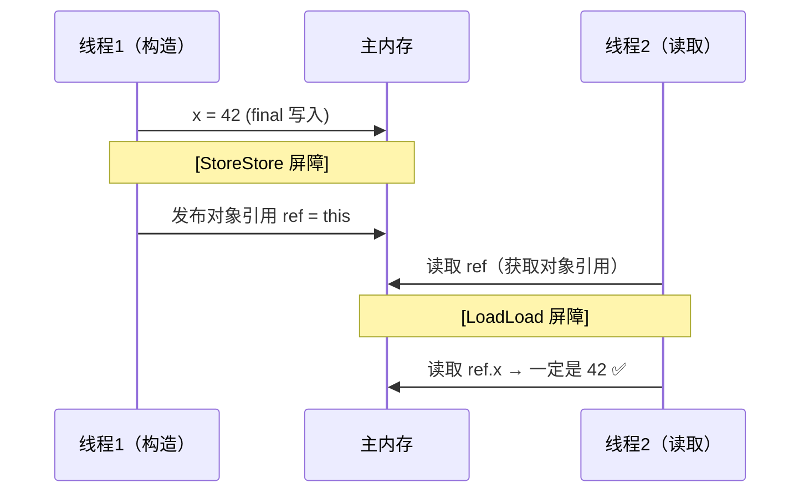
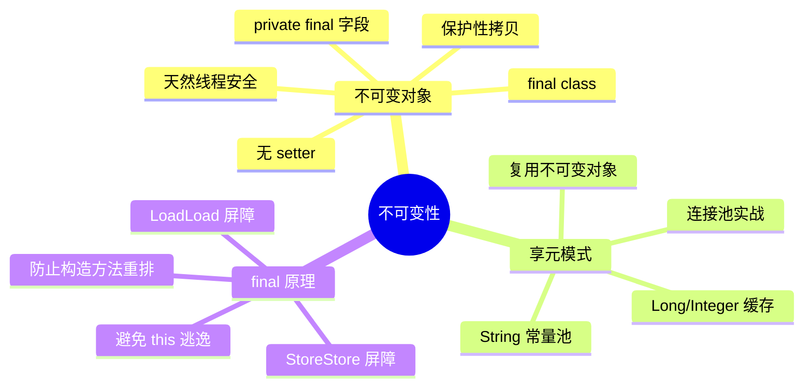

## 目录
- [[#不可变对象与线程安全]]
	- [[#问题引入：可变日期的危险]]
	- [[#不可变对象的使用]]
	- [[#不可变对象的设计原理]]
- [[#享元模式（Flyweight Pattern）]]
	- [[#JDK 中的享元模式体现]]
	- [[#不可变 ≠ 线程安全辨析]]
	- [[#自定义连接池（享元模式实战）]]
- [[#final 的底层原理]]
- [[#第七章小结]]

---

## 不可变对象与线程安全

### 问题引入：可变日期的危险

```java
SimpleDateFormat sdf = new SimpleDateFormat("yyyy-MM-dd");

// 多线程共享同一个 SimpleDateFormat
for (int i = 0; i < 10; i++) {
    new Thread(() -> {
        try {
            sdf.parse("2026-03-18");  // 可能抛出 NumberFormatException
        } catch (Exception e) {
            e.printStackTrace();
        }
    }).start();
}
```

> [!failure] 为什么 SimpleDateFormat 不是线程安全的？
> `SimpleDateFormat` 内部使用了**可变的 `Calendar` 对象**来解析日期
> 多个线程同时调用 `parse()`，会并发修改同一个 Calendar 的内部状态 → 数据竞争

**解决方案1**：每次都创建新实例（浪费内存）
**解决方案2**：加 `synchronized`（降低吞吐）
**解决方案3**：使用**不可变**的 `DateTimeFormatter`（JDK 8，推荐）

```java
// DateTimeFormatter 是不可变类，天然线程安全
DateTimeFormatter dtf = DateTimeFormatter.ofPattern("yyyy-MM-dd");

for (int i = 0; i < 10; i++) {
    new Thread(() -> {
        LocalDate date = dtf.parse("2026-03-18", LocalDate::from);  // 安全!
    }).start();
}
```

### 不可变对象的使用

**不可变对象（Immutable Object）**：一旦创建，其状态就不能被修改的对象。

JDK 中常见的不可变类：

| 类 | 说明 |
|---|------|
| `String` | 字符串一旦创建不可修改，"修改"操作返回新对象 |
| `Integer` / `Long` 等包装类 | 值不可变，共享缓存实例 |
| `BigDecimal` / `BigInteger` | 不可变的精确计算类 |
| `LocalDate` / `LocalDateTime` | JDK 8 时间 API，不可变 |
| `Collections.unmodifiableList()` | 包装原有集合为不可修改的视图 |

> [!tip] 为什么不可变 = 线程安全？
> 如果对象的状态永远不变，就不存在"多线程竞争修改"的问题
> 任何线程在任意时刻读到的都是同一个状态 → **无需同步，天然安全**
>
> 类比：一张打印好的纸质地图（不可变）可以被任意多人同时看，谁看都不影响别人；但一个可编辑的在线地图（可变），多人同时编辑就会冲突
> CS 术语：不可变对象天然满足 **线程安全性（Thread Safety）**，无需额外的同步措施

### 不可变对象的设计原理

以 `String` 为例分析其不可变设计：

```java
public final class String {                    // 1. final class：不可被继承
    private final char value[];                // 2. final 字段：引用不可变
    // 3. 没有提供 setter 方法
    // 4. 所有"修改"操作都返回新对象

    public String substring(int beginIndex) {
        return new String(value, beginIndex, value.length - beginIndex);
        // ↑ 返回新 String，不修改原对象
    }
}
```



> [!warning] 为什么要声明 `final class`？
> 如果 String 不是 final，子类可以 override 方法来修改内部状态：
> ```java
> // 假设 String 不是 final
> class MutableString extends String {
>     @Override
>     public String substring(int i) {
>         // 子类：直接修改 value 数组，破坏不可变性！
>     }
> }
> ```
> final class 从根源上杜绝了这种"继承破坏"的可能

> [!info] JVM 知识 —— 保护性拷贝的代价
> 不可变设计的代价是：每次"修改"都要创建新对象 → **产生大量临时对象** → GC 压力增大
> 这也是为什么字符串频繁拼接推荐用 `StringBuilder`（可变，非线程安全）或 `StringBuffer`（可变，线程安全）
> JVM 的 **逃逸分析 + 标量替换** 可以在一定程度上缓解这个问题（将短生命周期对象分配在栈上）

---

## 享元模式（Flyweight Pattern）

### 核心思想

**享元模式**：通过**复用已有对象**来减少对象的创建，节省内存。前提是被复用的对象必须是**不可变的**。

> 类比：图书馆的书就是"享元"——同一本书可以被多人借阅（共享），但没有人能涂改书的内容（不可变）。如果每个读者都买一本新书（new 对象），就太浪费了
> CS 术语：**享元模式（Flyweight Pattern）** 属于结构型设计模式，核心是将对象的**内在状态（不变部分）** 共享，**外在状态（可变部分）** 由调用方维护

### JDK 中的享元模式体现

#### Long 缓存池
```java
Long a = Long.valueOf(100);
Long b = Long.valueOf(100);
System.out.println(a == b);  // true（复用缓存对象）

Long c = Long.valueOf(200);
Long d = Long.valueOf(200);
System.out.println(c == d);  // false（超出缓存范围，新建对象）
```

```java
// Long.valueOf 源码
public static Long valueOf(long l) {
    if (l >= -128 && l <= 127) {
        return LongCache.cache[(int)l + 128];  // 命中缓存 → 复用
    }
    return new Long(l);  // 超出范围 → 新建
}
```

```
Long 缓存池结构:

LongCache.cache[]:
index:  [0]    [1]   ... [128]  [129] ... [255]
value:  -128   -127  ...   0      1   ...  127
         ↑                  ↑                ↑
      Long.valueOf(-128)  valueOf(0)   valueOf(127)
      都返回同一个缓存对象（享元）
```

#### 其他 JDK 享元实例

| 类 | 缓存范围 | 说明 |
|---|---------|------|
| `Byte` | -128 ~ 127 | 全部缓存 |
| `Short` | -128 ~ 127 | |
| `Integer` | -128 ~ 127（可配置上限） | `-XX:AutoBoxCacheMax` |
| `Long` | -128 ~ 127 | |
| `Character` | 0 ~ 127 | |
| `Boolean` | `TRUE` / `FALSE` | 只有两个实例 |
| `String` 常量池 | 编译期确定的字符串 | `intern()` 手动入池 |

> [!question] 为什么 Float 和 Double 没有缓存？
> 因为浮点数在 [-128, 127] 范围内有**无穷多个值**（连续的），不像整数那样是有限个离散值，无法预先缓存

### 不可变 ≠ 线程安全辨析

> [!warning] 重要区别
> - **不可变对象本身**是线程安全的（状态不变，不会竞争）
> - 但**持有不可变对象的引用**不一定是线程安全的！

```java
// 不可变对象本身安全
String s = "hello";  // String 是不可变的

// 但引用的赋值操作不是原子的！
// 多线程同时修改引用 s，会出问题
Thread t1 = new Thread(() -> s = "world");   // 修改引用
Thread t2 = new Thread(() -> System.out.println(s)); // 读引用
// t2 可能看到 "hello" 也可能看到 "world" → 可见性问题
```



### 自定义连接池（享元模式实战）

**需求**：实现一个简单的数据库连接池，固定数量的连接被多个线程共享复用。

```java
class ConnectionPool {
    private final int poolSize;
    private final Connection[] connections;
    private final AtomicIntegerArray states;  // 0=空闲, 1=使用中

    public ConnectionPool(int poolSize) {
        this.poolSize = poolSize;
        this.connections = new Connection[poolSize];
        this.states = new AtomicIntegerArray(new int[poolSize]); // 全部初始化为0
        for (int i = 0; i < poolSize; i++) {
            connections[i] = new MockConnection("连接-" + i);
        }
    }

    // 获取连接（享元获取）
    public Connection borrow() {
        while (true) {
            for (int i = 0; i < poolSize; i++) {
                if (states.get(i) == 0) {
                    if (states.compareAndSet(i, 0, 1)) {  // CAS 标记为使用中
                        return connections[i];
                    }
                }
            }
            // 所有连接都在使用中 → 等待
            synchronized (this) {
                try { this.wait(); } catch (InterruptedException e) { e.printStackTrace(); }
            }
        }
    }

    // 归还连接
    public void returnConn(Connection conn) {
        for (int i = 0; i < poolSize; i++) {
            if (connections[i] == conn) {
                states.set(i, 0);  // 标记为空闲
                synchronized (this) {
                    this.notifyAll();  // 唤醒等待的线程
                }
                break;
            }
        }
    }
}
```

```
连接池运行时状态:

states:       [1]  [1]  [0]  [0]  [1]
connections:  [C0] [C1] [C2] [C3] [C4]
               ↑         ↑    ↑
            线程A使用   空闲  空闲  线程B使用

线程C请求连接 → 遍历 states → 找到 index=2 → CAS(0→1) ✅ → 返回 C2
线程D请求连接 → 找到 index=3 → CAS(0→1) ✅ → 返回 C3
线程E请求连接 → 遍历发现全部为1 → wait() 等待
线程A归还 C0 → states[0]=0 → notifyAll() → 线程E被唤醒 → 获取 C0
```

> [!tip] 享元模式的核心价值
> - 连接对象（Connection）是**重量级资源**（TCP 连接、认证握手等），创建代价大
> - 通过池化复用，减少创建/销毁的开销
> - HikariCP、Druid 等生产级连接池都是这个思想的工业级实现
>
> 进一步扩展：线程池（ThreadPoolExecutor）也是享元思想——复用 Worker 线程，避免频繁创建销毁

---

## final 的底层原理

### final 字段的内存语义

JVM 对 `final` 字段的写入有特殊的内存保证：

```java
public class FinalExample {
    final int x;
    int y;

    public FinalExample() {
        x = 42;  // final 字段的写入
        y = 100; // 普通字段的写入
    }
}
```

> [!info] JVM 规范对 final 的保证
> **写 final 字段时**：JVM 会在 final 字段写入与构造方法返回之间插入 **StoreStore 屏障**
> ```
> x = 42;              // 写 final 字段
> [StoreStore 屏障]    // 保证 x=42 一定在构造方法返回前完成
> // 构造方法返回（对象引用发布）
> ```
>
> **读 final 字段时**：JVM 会在读对象引用和读 final 字段之间插入 **LoadLoad 屏障**
> ```
> FinalExample obj = ref;  // 读对象引用
> [LoadLoad 屏障]          // 保证先拿到引用，再读 final 字段
> int a = obj.x;           // 读 final 字段（一定能看到构造方法中写入的值）
> ```

**效果**：只要对象的引用不在构造方法中"溢出"（this 逃逸），其他线程通过该引用读到的 final 字段一定是构造方法中初始化后的值。



> [!warning] this 逃逸的危险
> 如果在构造方法中将 `this` 泄露给了其他线程（如启动一个线程并传入 this），其他线程可能在对象构造完成前就访问它
> → 即使是 final 字段也可能看到默认值（0 / null）
>
> ```java
> // 错误示范：this 逃逸
> public class Bad {
>     final int x;
>     public Bad() {
>         new Thread(() -> System.out.println(this.x)).start(); // 可能输出 0！
>         x = 42;
>     }
> }
> ```

---

## 第七章小结



| 概念 | 核心要点 |
|------|---------|
| 不可变对象 | 创建后状态不变 → 天然线程安全 → 无需同步 |
| 不可变设计 | `final class` + `private final` 字段 + 无 setter + 保护性拷贝 |
| 享元模式 | 复用不可变对象，减少创建开销（池化思想） |
| JDK 享元 | Integer/Long 缓存池、String 常量池、Boolean 两实例 |
| final 原理 | 通过 StoreStore/LoadLoad 屏障保证构造完成后才可见 |

> [!tip] 并发安全的三条路径
> 回顾第四章到第七章，线程安全的保障手段总结为三条路径：
> 1. **互斥同步**（第四章）：`synchronized` / `ReentrantLock` → 悲观锁
> 2. **非阻塞同步**（第六章）：CAS / `Atomic` 类 → 乐观锁
> 3. **无同步方案**（第七章）：不可变对象 / 线程本地变量（ThreadLocal）→ 从根本上消除共享

---
