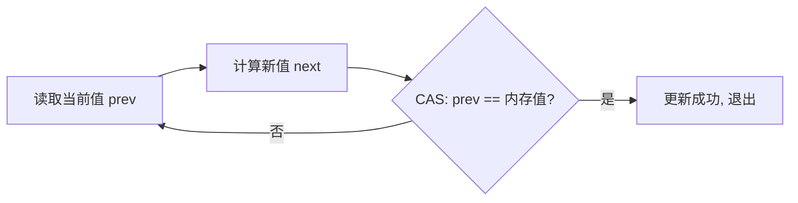
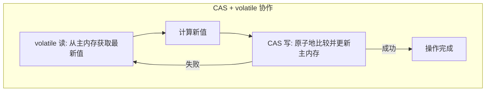
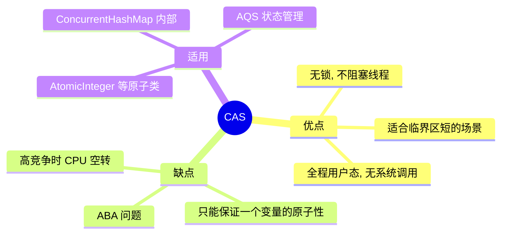
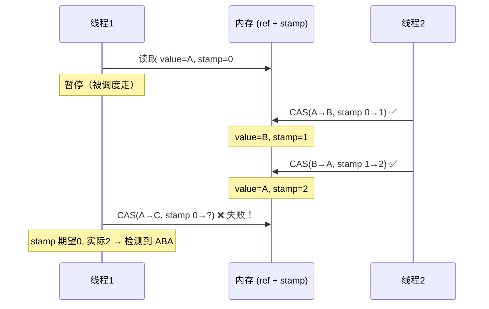
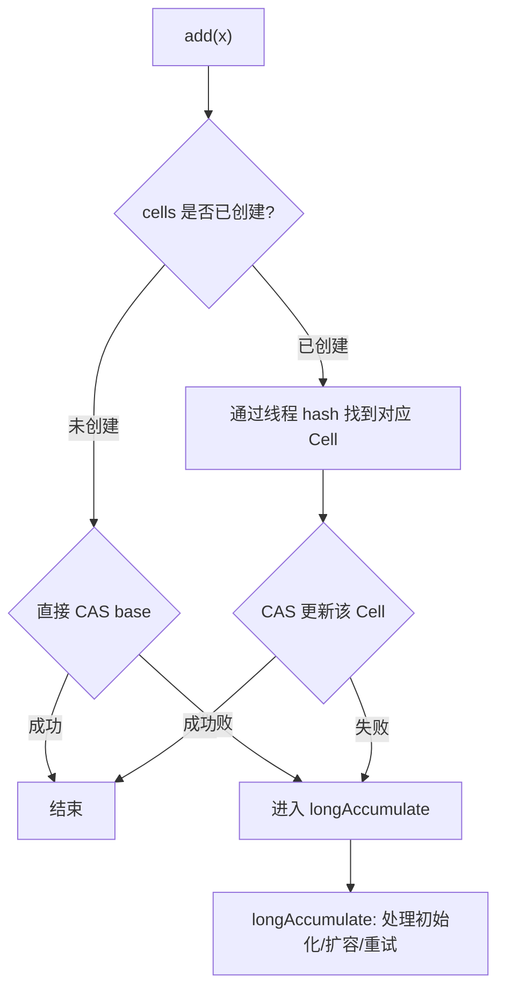
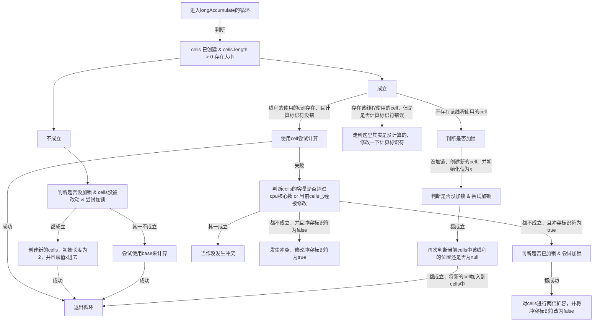
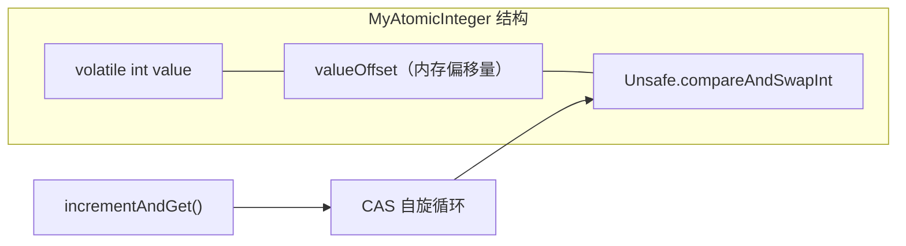

## 目录
- [[#共享资源保护：加锁 vs 无锁]]
- [[#CAS 机制详解]]
	- [[#CAS 工作方式]]
	- [[#CAS 与 volatile 的配合]]
	- [[#CAS 效率分析]]
	- [[#CAS 特点总结]]
- [[#原子整数]]
	- [[#AtomicInteger 基本用法]]
	- [[#updateAndGet 自定义更新]]
	- [[#updateAndGet 原理（CAS 自旋）]]
- [[#原子引用]]
	- [[#AtomicReference]]
	- [[#ABA 问题]]
	- [[#AtomicStampedReference（版本号解决 ABA）]]
	- [[#AtomicMarkableReference（标记解决 ABA）]]
- [[#原子数组]]
- [[#原子更新器]]
- [[#原子累加器]]
	- [[#LongAdder 原理]]
	- [[#LongAdder 源码分析]]
- [[#Unsafe 类]]

---

## 共享资源保护：加锁 vs 无锁

### 加锁方式（悲观锁思想）
```java
// synchronized 保护共享变量
private int balance;

public synchronized void withdraw(int amount) {
    balance -= amount;
}
```
- 思想：假设一定会有竞争 → 先加锁再操作 → **悲观锁（Pessimistic Locking）**
- 代价：线程阻塞/唤醒需要**用户态与内核态切换**（系统调用开销）

### 无锁方式（乐观锁思想）
```java
// CAS 保护共享变量
private AtomicInteger balance = new AtomicInteger(1000);

public void withdraw(int amount) {
    while (true) {
        int prev = balance.get();         // 读取当前值
        int next = prev - amount;         // 计算新值
        if (balance.compareAndSet(prev, next)) {  // CAS 尝试更新
            break;  // 成功则退出
        }
        // 失败说明被其他线程修改了 → 重试（自旋）
    }
}
```
- 思想：假设大多数时候没有竞争 → 直接操作，失败了再重试 → **乐观锁（Optimistic Locking）**
- 优势：不阻塞线程，全程在**用户态**完成



> [!tip] 类比理解
> **悲观锁**像是去银行柜台办业务：不管有没有人，先取号排队等叫号（加锁等待），确保同时只有一个人在窗口操作
> **乐观锁**像是在超市自助结账：直接扫码结账，如果系统提示"库存冲突"就重新扫一次（CAS 重试），大多数时候一次就成功了
>
> CS 术语：悲观锁通过 **互斥（Mutual Exclusion）** 阻塞竞争者；乐观锁通过 **比较并交换（Compare-And-Swap）** 无阻塞重试

---

## CAS 机制详解

### CAS 工作方式

CAS（Compare And Swap）是一个 **CPU 级别的原子指令**，包含三个操作数：

```
CAS(V, Expected, New)

V        — 内存地址（变量的实际值）
Expected — 期望值（线程上次读到的值）
New      — 新值（要写入的值）

执行逻辑：
if (V 的当前值 == Expected) {
    V = New;     // 原子地更新
    return true; // 成功
} else {
    return false; // 失败（被其他线程改过了）
}
```

```
CAS 操作示意图（多线程竞争）:

        主内存: balance = 100
              ┌──────────┐
              │  100     │
              └──┬───┬───┘
                 │   │
    ┌────────────┘   └────────────┐
    ↓                             ↓
  线程A                         线程B
  prev=100                      prev=100
  next=100-10=90                next=100-20=80
  CAS(100, 100, 90) ✅ 成功     CAS(100, 100, 80) ❌ 失败
  balance → 90                  （发现已经是90≠100）
                                 ↓ 重试
                                prev=90
                                next=90-20=70
                                CAS(90, 90, 70) ✅ 成功
                                balance → 70
```

> [!info] CPU 层面的实现
> 在 x86 架构中，CAS 对应 `CMPXCHG`（Compare and Exchange）指令
> 该指令带 **`LOCK` 前缀**，保证在多核环境下的原子性：
> - 锁定总线（Bus Lock）或**缓存行锁定（Cache Line Lock）** → 阻止其他 CPU 核心同时修改
> - 这比操作系统的互斥锁（Mutex）轻量得多，因为不涉及用户态/内核态切换

### CAS 与 volatile 的配合

CAS 必须与 `volatile` 配合使用：



- **volatile** 保证**可见性**：每次读都从主内存取最新值
- **CAS** 保证**原子性**：比较和交换作为一个不可分割的操作执行
- 两者结合 = **无锁的线程安全**

> [!warning] 为什么 CAS 需要 volatile？
> 如果没有 volatile，线程可能从 CPU 缓存中读到旧值 → CAS 的 `expected` 就是过时的
> → 虽然 CAS 本身是原子的，但它比较的是一个"过期"的期望值，语义就错了

### CAS 效率分析

| 场景 | 加锁（synchronized） | 无锁（CAS） |
|------|---------------------|------------|
| 无竞争 | 偏向锁优化，接近零开销 | 一次 CAS 成功，零开销 |
| 低竞争 | 轻量级锁 CAS + 自旋 | CAS 重试 1~2 次 |
| 高竞争 | 重量级锁，线程阻塞/唤醒（内核态切换） | CAS 频繁失败，CPU 空转（忙等） |

> [!tip] 选型建议
> - **临界区短 + 线程数不多** → CAS 无锁方案更优（避免阻塞开销）
> - **临界区长 + 线程数很多** → 加锁方案更优（CAS 反复失败会浪费大量 CPU）
> - **超高并发累加** → `LongAdder`（分段 CAS，见下文）

### CAS 特点总结



---

## 原子整数

### AtomicInteger 基本用法

```java
AtomicInteger ai = new AtomicInteger(0);

ai.get();                    // 获取当前值: 0
ai.getAndIncrement();        // 先获取再 +1（类似 i++）返回 0，值变为 1
ai.incrementAndGet();        // 先 +1 再获取（类似 ++i）返回 2
ai.getAndAdd(5);             // 先获取再 +5，返回 2，值变为 7
ai.addAndGet(-3);            // 先 -3 再获取，返回 4
ai.getAndSet(10);            // 先获取再设值，返回 4，值变为 10
ai.compareAndSet(10, 20);    // CAS：期望10→设20，返回 true

// 类似的还有 AtomicLong、AtomicBoolean
```

### updateAndGet 自定义更新

```java
// updateAndGet 接受一个函数式接口，支持自定义更新逻辑
AtomicInteger ai = new AtomicInteger(10);

// 乘以 2
int result = ai.updateAndGet(x -> x * 2);  // result = 20

// 取模
ai.updateAndGet(x -> x % 3);  // 20 % 3 = 2

// getAndUpdate: 先获取旧值，再更新
int old = ai.getAndUpdate(x -> x + 100);  // old = 2, 新值 = 102
```

### updateAndGet 原理（CAS 自旋）

```java
// AtomicInteger.updateAndGet 的简化源码
public final int updateAndGet(IntUnaryOperator updateFunction) {
    int prev, next;
    do {
        prev = get();                         // volatile 读
        next = updateFunction.applyAsInt(prev); // 计算新值
    } while (!compareAndSet(prev, next));      // CAS 自旋
    return next;
}
```

```
CAS 自旋流程图:

  ┌──────────────────────────────┐
  │ 1. volatile 读取 prev       │
  └──────────┬───────────────────┘
             ↓
  ┌──────────────────────────────┐
  │ 2. 计算 next = f(prev)      │
  └──────────┬───────────────────┘
             ↓
  ┌──────────────────────────────┐
  │ 3. CAS(prev, next)          │
  │    内存值 == prev ?          │
  └───┬─────────────┬────────────┘
      │ YES         │ NO（被修改了）
      ↓             ↓
  ┌────────┐   ┌─────────┐
  │ 成功!  │   │ 回到 1  │
  │ return │   │ 重试    │
  └────────┘   └─────────┘
```

> [!info] 为什么叫"自旋"？
> "自旋（Spin）"就是线程在原地循环重试，CPU 一直在执行（忙等 / Busy Waiting），没有被挂起
> 类比：排队等咖啡时你不断探头看"我的好了没？好了没？"（自旋），而不是坐下来等叫号（阻塞）
> CS 术语：**自旋等待（Spin Wait）** — 通过循环检查条件来等待，不释放 CPU

---

## 原子引用

### AtomicReference

用于对**引用类型**做 CAS 操作（AtomicInteger 只能保护 int）：

```java
AtomicReference<BigDecimal> balance = new AtomicReference<>(new BigDecimal("10000"));

// 扣款操作
while (true) {
    BigDecimal prev = balance.get();
    BigDecimal next = prev.subtract(new BigDecimal("1000"));
    if (balance.compareAndSet(prev, next)) {  // CAS 比较的是引用地址
        break;
    }
}
```

> [!warning] CAS 比较的是引用（==），不是值（equals）
> `compareAndSet` 使用 `==` 比较旧引用和当前引用是否指向同一个对象
> 如果对象被替换为一个 `.equals()` 相同但 `==` 不同的新对象 → CAS 会失败
> （但对于不可变对象如 String、BigDecimal，这通常是期望的行为）

### ABA 问题

```
ABA 问题时间线:

时刻1: 变量值 = A
         线程1 读到 A，准备更新为 C
         线程1 此时被调度走（上下文切换）

时刻2: 线程2 将 A 改为 B
时刻3: 线程2 将 B 改回 A

时刻4: 线程1 恢复执行
         CAS(A, A, C) → 成功！（但线程1不知道值已经被改过了）

        线程1     线程2       内存值
          │                    A
          │ 读到 A             │
          │         A → B      B
          │         B → A      A
          │ CAS(A→C) ✅        C  ← 线程1不知道中间发生了 A→B→A
```

> [!question] ABA 问题有什么危害？
> 在简单的计数器场景中，ABA 通常没问题（值一样结果也一样）
> 但在**链表/栈**等数据结构中，ABA 可能导致严重错误：
> - 假设栈顶是 A→B→C，线程1想 pop A（CAS: 把栈顶从 A 改为 B）
> - 线程2 在此期间 pop A、pop B、push D、push A → 栈变为 A→D
> - 线程1 CAS 成功（栈顶确实是 A）→ 把栈顶指向 B → 但 B 已经不在栈中了！
>
> 类比：你在停车场记住了"我停在了 A 号车位的红色车旁边"。等你回来发现 A 号车位确实有辆红色车，你以为没变。但其实原来的红车已经开走了，现在停的是另一辆红车，你的车（B 号位）也被挪走了
> CS 术语：ABA 问题是 **无锁数据结构（Lock-Free Data Structure）** 中的经典陷阱

### AtomicStampedReference（版本号解决 ABA）

给每次修改加一个**版本号（stamp）**，CAS 同时比较引用和版本号：

```java
// 初始值 "A"，版本号 0
AtomicStampedReference<String> ref = new AtomicStampedReference<>("A", 0);

// 获取当前版本号
int stamp = ref.getStamp();       // 0
String value = ref.getReference(); // "A"

// CAS 更新：必须引用和版本号都匹配
boolean success = ref.compareAndSet(
    "A",       // expectedReference
    "C",       // newReference
    stamp,     // expectedStamp
    stamp + 1  // newStamp（版本号 +1）
);
```



### AtomicMarkableReference（标记解决 ABA）

如果不关心修改了几次，只关心"**有没有被修改过**"，用布尔标记即可：

```java
// 初始值 "A"，标记 false
AtomicMarkableReference<String> ref = new AtomicMarkableReference<>("A", false);

// CAS：同时更新引用和标记
ref.compareAndSet("A", "C", false, true);
// 只要标记变了（false→true），就知道被动过了
```

> [!tip] StampedReference vs MarkableReference
> | 类型 | 额外信息 | 适用场景 |
> |------|---------|---------|
> | `AtomicStampedReference` | `int stamp`（版本号） | 需要知道被修改了**几次** |
> | `AtomicMarkableReference` | `boolean mark`（标记） | 只需要知道**有没有被改过** |

---

## 原子数组

保护**数组中每个元素**的原子性（而非整个数组引用）：

```java
AtomicIntegerArray array = new AtomicIntegerArray(10);  // 长度为10

array.getAndIncrement(0);    // 索引0处 +1
array.getAndAdd(1, 5);       // 索引1处 +5
array.compareAndSet(2, 0, 100); // 索引2处：CAS(0→100)

// 类似的还有 AtomicLongArray、AtomicReferenceArray
```

```
AtomicIntegerArray 内部结构:

┌───────────────────────────────────────────────────┐
│  index:  [0]   [1]   [2]   [3]  ...  [9]         │
│  value:   1     5    100    0   ...   0            │
│           ↑     ↑     ↑                           │
│         每个元素都可以独立做 CAS 操作                │
│         不同索引之间互不干扰                         │
└───────────────────────────────────────────────────┘
```

> [!info] 应用场景
> - 多线程统计不同分类的计数器（如按小时统计访问量）
> - `ConcurrentHashMap` 内部的 `CounterCell[]` 就是类似思想

---

## 原子更新器

用于对**已有类的 volatile 字段**做原子更新（无需把字段改成 AtomicXxx 类型）：

```java
class Student {
    volatile String name;  // 必须是 volatile
}

// 创建更新器（反射方式）
AtomicReferenceFieldUpdater<Student, String> updater =
    AtomicReferenceFieldUpdater.newUpdater(Student.class, String.class, "name");

Student stu = new Student();
updater.compareAndSet(stu, null, "张三");  // CAS 更新 stu.name
```

> [!tip] 使用场景
> 当你**无法修改原有类的字段类型**（如第三方库的类），但又想对其做 CAS 操作时
> 典型案例：Netty 中大量使用 `AtomicReferenceFieldUpdater` 来避免额外的对象分配开销

---

## 原子累加器

### 为什么需要 LongAdder？

在高竞争场景下，`AtomicLong.incrementAndGet()` 的 CAS 自旋会频繁失败：

```
高竞争下 AtomicLong 的问题:

  线程1 → CAS(100→101) ✅
  线程2 → CAS(100→101) ❌ 重试 → CAS(101→102) ✅
  线程3 → CAS(100→101) ❌ 重试 → CAS(102→103) ✅
  线程4 → CAS(100→101) ❌ 重试 → CAS(103→104) ✅
  ...
  N个线程竞争同一个变量 → 大量 CAS 失败 → CPU 空转浪费
```

`LongAdder` 的解决思路：**分散热点**

```
LongAdder 的分段累加思想:

  AtomicLong（单点竞争）:
  所有线程 → [counter] ← 瓶颈！

  LongAdder（分段竞争）:
  线程1 → [Cell-0]  = 25
  线程2 → [Cell-1]  = 30
  线程3 → [Cell-0]  = 20    ← 同一个 Cell 内才有竞争
  线程4 → [Cell-1]  = 25
  最终结果 = base + Cell-0 + Cell-1 = 0 + 45 + 55 = 100
```

> [!tip] 类比理解
> **AtomicLong** 像是一个收银台：所有顾客排一条队，一个一个结账 → 高峰时段排长队
> **LongAdder** 像是多个收银台：顾客分散到不同窗口，最后各窗口汇总营业额 → 高并发下吞吐更高
>
> CS 术语：**分段锁（Striped Locking）/ 热点分散（Contention Spreading）**。JDK 7 的 `ConcurrentHashMap` 用的 Segment 分段锁也是同样思想

```java
LongAdder adder = new LongAdder();
adder.increment();  // +1
adder.add(10);      // +10
long sum = adder.sum();  // 汇总所有 Cell + base

// 类似的还有 LongAccumulator（支持自定义累加函数）
LongAccumulator acc = new LongAccumulator(Long::max, 0);
acc.accumulate(10);
acc.accumulate(5);
acc.get();  // 10（取最大值）
```

### LongAdder 原理

#### CAS 锁（Cell 创建时的保护）

```java
// LongAdder 内部用一个简单的 CAS 锁来保护 Cell 数组的创建和扩容
// 这是一个自定义的自旋锁（非 ReentrantLock）
volatile int cellsBusy;  // 0=空闲, 1=加锁

boolean casCellsBusy() {
    return CELLSBUSY.compareAndSet(this, 0, 1);  // CAS: 0 → 1
}
```

#### 缓存行伪共享（False Sharing）

> [!info] CPU/OS 知识 —— 缓存行（Cache Line）
> CPU 缓存以**缓存行**为单位加载数据（通常 64 字节）。当两个变量恰好在同一个缓存行中时：
>
> ```
> 缓存行 (64 bytes):
> ┌─────────────┬─────────────┬──────────────────┐
> │  Cell[0]    │  Cell[1]    │  ... padding ... │
> │  (8 bytes)  │  (8 bytes)  │                  │
> └─────────────┴─────────────┴──────────────────┘
>       ↑               ↑
>    Core 0 修改     Core 1 修改
>    → 整行失效！    → 整行失效！
> ```
>
> - Core 0 修改 `Cell[0]` 后，CPU 缓存一致性协议（MESI）会使 Core 1 中**整个缓存行失效**
> - Core 1 修改 `Cell[1]` 后，也会使 Core 0 的缓存行失效
> - 即使它们操作的是**不同变量**，也互相干扰 → 这就是 **伪共享（False Sharing）**

**解决方案**：`@Contended` 注解（JDK 8+）

```java
// LongAdder.Cell 的源码
@sun.misc.Contended  // 让 JVM 在 Cell 对象前后各填充 128 字节
static final class Cell {
    volatile long value;
    Cell(long x) { value = x; }
    // ...
}
```

```
@Contended 填充后的内存布局:

┌────────────────────────────────────────────────────────────────┐
│ padding (128B) │ Cell[0] value (8B) │ padding (128B) │        │
├────────────────────────────────────────────────────────────────┤
│ padding (128B) │ Cell[1] value (8B) │ padding (128B) │        │
└────────────────────────────────────────────────────────────────┘
  ← Cell[0] 和 Cell[1] 一定不在同一个缓存行中 →
```

### LongAdder 源码分析

#### add 方法流程



#### longAccumulate 方法的三种情况

```
情况1: cells 未创建
  → 加 CAS 锁 → 创建 cells 数组（初始大小 2）→ 将值放入对应 Cell

情况2: cells 已创建，但对应 Cell 未初始化
  → 加 CAS 锁 → 创建新 Cell 并放入数组对应位置

情况3: cells 已创建，Cell 也存在，CAS 更新失败
  → 尝试重新 hash（换一个 Cell）再次 CAS
  → 如果多次失败 → 扩容 cells 数组（翻倍，最大不超过 CPU 核心数）
```


> > 因为`cells`扩容之后并不会马上初始化所有的`cell`，所以才会存在`cell`为空的情况
> - 一些变量的信息
> 	- `x` - 为需要累加的值
> 	- `base` - 这个类自带的存值变量
> 
> > 其余没有指向`END`且没有下一步的都会进入下一轮循环

> [!info] 为什么最大不超过 CPU 核心数？
> Cell 的个数 ≥ CPU 核心数后，继续扩容没有意义：
> 因为同一时刻最多只有 `CPU核心数` 个线程真正并行执行，Cell 再多也不会减少竞争

#### sum 方法

```java
public long sum() {
    Cell[] cs = cells;
    long sum = base;
    if (cs != null) {
        for (Cell c : cs) {
            if (c != null) sum += c.value;
        }
    }
    return sum;
}
// 注意：sum() 不是原子操作！在并发调用 add 的同时调用 sum，结果可能不精确
```

---

## Unsafe 类

`sun.misc.Unsafe` 是 JDK 内部类，提供了**绕过 JVM 安全检查**的底层操作能力。

> [!failure] 为什么叫 "Unsafe"？
> 因为它允许：直接操作内存地址、绕过构造方法创建对象、CAS 操作任意字段等
> 用错了可能导致 **JVM 崩溃**、**内存泄漏**、**数据损坏**
> 所以正常情况下开发者不应该直接使用，所有原子类都是基于它实现的

### 获取 Unsafe 实例

```java
// Unsafe 的构造方法是 private 的，且 getUnsafe() 有类加载器检查
// 通过反射获取
Field f = Unsafe.class.getDeclaredField("theUnsafe");
f.setAccessible(true);
Unsafe unsafe = (Unsafe) f.get(null);
```

### CAS 相关方法

```java
// 对对象 obj 的 offset 偏移处的 int 字段做 CAS
unsafe.compareAndSwapInt(Object obj, long offset, int expected, int update);
unsafe.compareAndSwapLong(Object obj, long offset, long expected, long update);
unsafe.compareAndSwapObject(Object obj, long offset, Object expected, Object update);

// 获取字段偏移量（用于定位内存中的字段位置）
long offset = unsafe.objectFieldOffset(MyClass.class.getDeclaredField("value"));
```

### 模拟实现 AtomicInteger

```java
class MyAtomicInteger {
    private volatile int value;
    private static final Unsafe unsafe;
    private static final long valueOffset;

    static {
        try {
            Field f = Unsafe.class.getDeclaredField("theUnsafe");
            f.setAccessible(true);
            unsafe = (Unsafe) f.get(null);
            valueOffset = unsafe.objectFieldOffset(
                MyAtomicInteger.class.getDeclaredField("value"));
        } catch (Exception e) { throw new RuntimeException(e); }
    }

    public MyAtomicInteger(int initialValue) {
        this.value = initialValue;
    }

    public int get() { return value; }

    public boolean compareAndSet(int expected, int update) {
        return unsafe.compareAndSwapInt(this, valueOffset, expected, update);
    }

    public int incrementAndGet() {
        int prev, next;
        do {
            prev = get();
            next = prev + 1;
        } while (!compareAndSet(prev, next));
        return next;
    }
}
```



---

## 第六章小结

| 概念 | 核心要点 |
|------|---------|
| CAS | CPU 级原子指令（CMPXCHG），比较并交换，无锁 |
| CAS + volatile | volatile 保证可见性 + CAS 保证原子性 = 无锁线程安全 |
| AtomicInteger/Long | 基于 CAS 的原子整数操作 |
| AtomicReference | 引用类型的 CAS 操作 |
| ABA 问题 | 值被改回原值，CAS 感知不到；用版本号 / 标记解决 |
| LongAdder | 分段 CAS，高并发下性能远超 AtomicLong |
| 缓存行伪共享 | 不同 Cell 落在同一缓存行 → @Contended 填充 |
| Unsafe | JDK 内部类，所有原子类的底层实现基础 |

> [!tip] 记忆口诀
> **CAS 三兄弟**：读（volatile）→ 算（计算新值）→ 写（CAS）
> **ABA 两把刀**：Stamped（版本号）和 Markable（标记位）
> **LongAdder 一思想**：分散热点（类似分段锁 / Striping）

---
