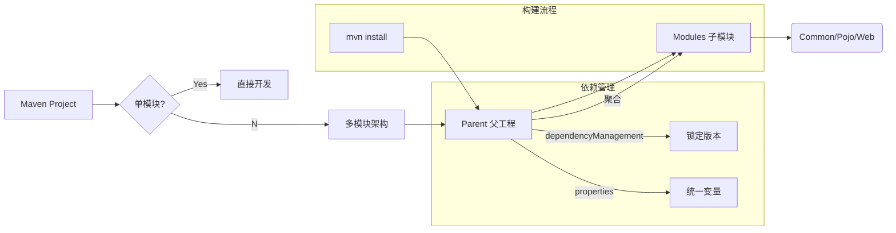

---
tags:
  - Java
  - Maven
  - Architecture
  - DevOps
  - 笔记
create_time: 2026-01-21
---

# 📦 Maven 高级进阶架构指南

> [!abstract] 核心目标
> 从“单体项目”向“企业级多模块架构”演进。
> 掌握 **分模块设计** (解耦)、**继承与聚合** (统一管理)、**私服** (资源共享)。

---

## 1. 分模块设计 (Modular Design)

### 1.1 为什么要拆分？
传统的单体项目（所有代码都在一个 `src/main/java` 下）存在以下问题：
* **复用性差**：如果另一个项目想用你的 `User` 实体类，必须拷贝代码。
* **维护困难**：类太多，结构混乱。

### 1.2 拆分策略
![[maven高级1.png]]
1.  **按层拆分**：`pojo` (实体), `mapper` (数据层), `service` (业务层), `web` (控制层)。
2.  **按功能拆分**：`order` (订单), `user` (用户), `product` (商品)。
3.  **混合模式 (推荐)**：先按功能分大模块，再在内部按层分。

**典型结构示例：**
![[maven高级2.jpg]]
- `tlias-parent` (父工程，只做管理)
- `tlias-pojo` (存放 Entity, DTO, VO)
- `tlias-utils` (存放工具类，如 JwtUtil, Result)
- `tlias-web-management` (主业务，依赖 pojo 和 utils)

---

## 2. 继承 (Inheritance)

### 2.1 概念
类似 Java 的类继承。**子工程** (Child) 可以继承 **父工程** (Parent) 的配置（依赖、插件、属性）。
* **作用**：统一管理依赖版本，防止冲突；减少重复配置。
* **核心配置**：
    * 父工程打包方式必须为：`<packaging>pom</packaging>`
    * 子工程声明父工程：`<parent>...</parent>`

### 2.2 版本锁定 (Dependency Management) ⭐️重点
**问题**：如果有 5 个子模块都用 `jwt`，版本不一致会报错。
**解决**：在父工程中使用 `<dependencyManagement>` 声明版本，**但不引入 jar 包**。子工程引入时**不需要写版本号**。

![[maven高级9.png]]

```xml
<dependencyManagement>
    <dependencies>
        <dependency>
            <groupId>io.jsonwebtoken</groupId>
            <artifactId>jjwt</artifactId>
            <version>0.9.1</version> </dependency>
    </dependencies>
</dependencyManagement>
```

```xml
<dependencies>
    <dependency>
        <groupId>io.jsonwebtoken</groupId>
        <artifactId>jjwt</artifactId>
        </dependency>
</dependencies>
```

### 2.3 自定义属性 (Properties)

为了方便管理版本号，通常在 `<properties>` 中定义变量。

![[maven高级10.png]]

```xml
<properties>
    <maven.compiler.source>17</maven.compiler.source>
    <lombok.version>1.18.30</lombok.version>
    <jjwt.version>0.9.1</jjwt.version>
</properties>

<version>${lombok.version}</version>
```

---

## 3. 聚合 (Aggregation)

### 3.1 概念

**继承**是子工程找爸爸（管理依赖），**聚合**是爸爸找儿子（管理构建）。
如果不使用聚合，安装项目需要一个个点 `install`。使用聚合后，只需在父工程点 `install`，它会自动识别依赖关系，按顺序构建所有子模块。

### 3.2 配置

![[maven高级11.png]]
在父工程的 `pom.xml` 中添加：

```xml
<modules>
    <module>tlias-pojo</module>
    <module>tlias-utils</module>
    <module>tlias-web-management</module>
</modules>
```

---

## 4. 私服 (Private Server - Nexus)

### 4.1 什么是私服？

架设在公司局域网内的仓库。

* **代理 (Proxy)**：代理中央仓库，加速下载。
* **宿主 (Hosted)**：存放公司内部开发的 jar 包（如你的 `common-utils`）。
* **组 (Group)**：虚拟仓库，包含以上两者。

![[maven高级14.png]]

### 4.2 上传 (Deploy) 到私服

**场景**：你写了一个 `aliyun-oss-starter`，想给同事用。
**配置步骤**：

1. **本地 `settings.xml**`：配置私服的账号密码 (servers)。![[maven高级16.png]]
2. **项目 `pom.xml**`：配置 `<distributionManagement>` 指定上传地址。

```xml
<distributionManagement>
    <repository>
        <id>maven-releases</id>
        <url>[http://192.168.1.100:8081/repository/maven-releases/](http://192.168.1.100:8081/repository/maven-releases/)</url>
    </repository>
    <snapshotRepository>
        <id>maven-snapshots</id>
        <url>[http://192.168.1.100:8081/repository/maven-snapshots/](http://192.168.1.100:8081/repository/maven-snapshots/)</url>
    </snapshotRepository>
</distributionManagement>
```

3. 执行 `mvn deploy`。![[maven高级17.png]]

### 4.3 从私服下载

**配置步骤**：
在本地 `settings.xml` 中配置 `<mirrors>` 和 `<profiles>`，将默认下载地址指向私服。![[maven高级18.png]]

---

## 5. 总结：工程构建生命周期


