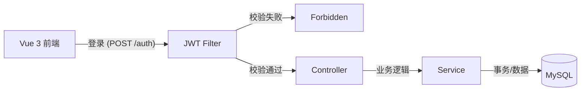

> [!info] 阶段元数据
> - **核心目标**: 从单机 MVP 进化为多用户全栈系统
> - **新增技术**: Vue 3, Element Plus, JWT, Axios 拦截器, PageHelper, Transaction (事务)
> - **状态**: ✅ 已完成核心业务闭环
> - **关联日志**: [[Stage log2]]

# 🚀 第二阶段：全栈交互与多用户架构

## 1. 架构演进 (Architecture Shift)
从第一阶段的“直接调用”进化为标准的 **前后端分离 (RESTful API)** 架构，引入了安全层。

## 2. 核心模块实现

### A. 前端工程化 (Vue 3 + Vite)

- **路由管理**: 使用 `vue-router` 实现页面跳转（Login -> Game -> Shop）。
    
- **UI 组件**: 引入 `Element Plus` 实现现代化界面（卡片、进度条、表格）。
    
- **网络层封装**:
    
    - 封装 `request.js` (Axios)。
        
    - **拦截器逻辑**:
        
        - 请求拦截: 自动携带 `Bearer Token`。
            
        - 响应拦截: 统一“脱壳”处理 (`res.data`)，统一处理 401/403 强制登出逻辑。
            

### B. 后端安全与数据隔离

- **JWT 认证**: 生成 Token 发给前端，后续请求解析 Token 获取 `userId`。
    
- **数据隔离**:
    
    - 改造 `TaskMapper`，所有查询增加 `WHERE user_id = #{userId}`。
        
    - 确保用户只能看到自己的任务和状态。
        

### C. 商业化闭环 (商店系统)

- **商品模型**: 引入 `ShopItem` 和 `Item` 实体。
    
- **事务一致性**: `ShopService` 中使用 `@Transactional`，确保“扣费”和“发货”要么同时成功，要么同时失败。
    
- **分页查询**: 引入 `PageHelper` 插件，优化大量数据的展示。
    