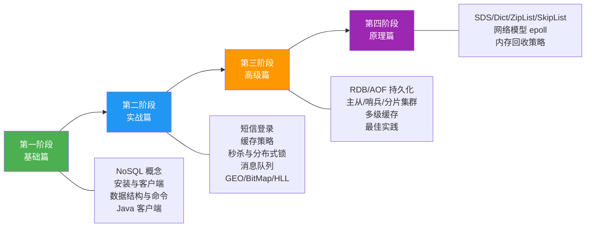
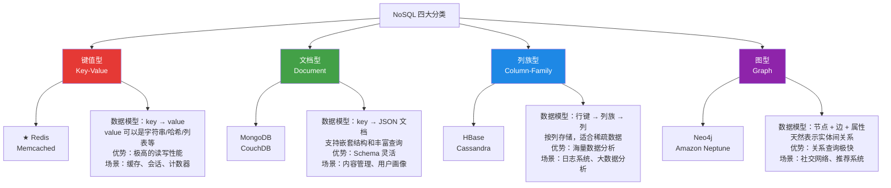
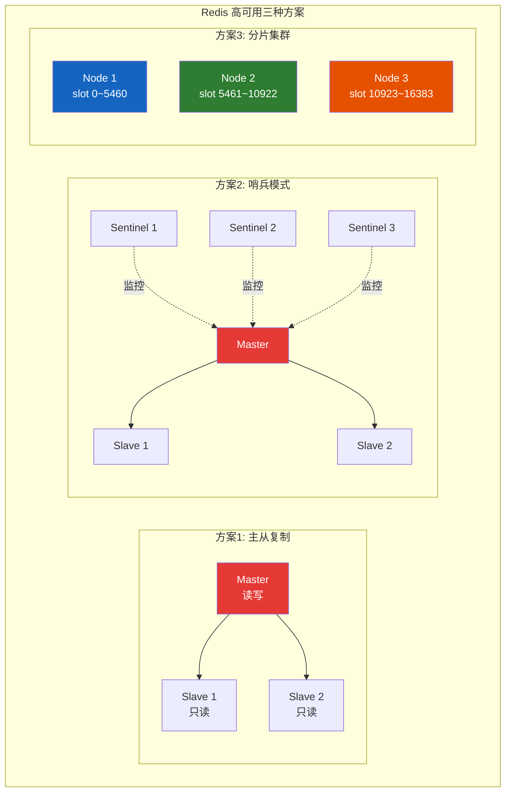
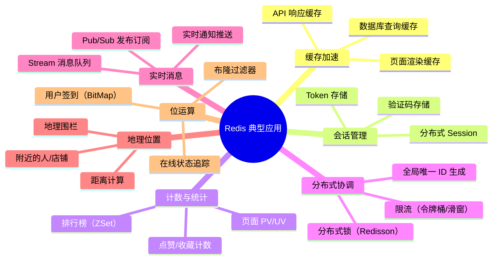
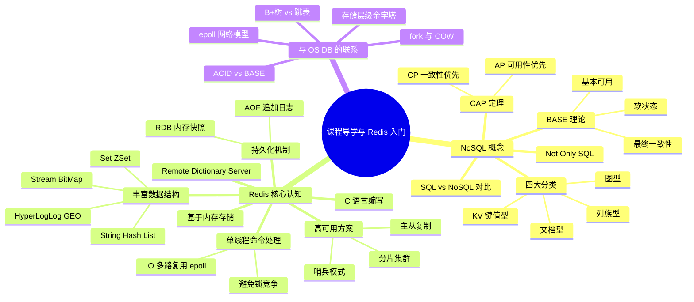

## 目录
- [[#一、课程导学]]
	- [[#Redis 的江湖地位]]
	- [[#课程学习路线总览]]
- [[#二、认识 NoSQL]]
	- [[#什么是 NoSQL]]
	- [[#SQL vs NoSQL 核心对比]]
	- [[#NoSQL 的四大分类]]
	- [[#CAP 定理与 BASE 理论]]
- [[#三、认识 Redis]]
	- [[#Redis 是什么]]
	- [[#Redis 的核心特性]]
	- [[#Redis 为什么这么快]]
	- [[#Redis 的典型应用场景]]
- [[#四、章节总结]]

---

## 一、课程导学

### Redis 的江湖地位

Redis（**Re**mote **Di**ctionary **S**erver，远程字典服务）是当今后端技术栈中**最重要的中间件之一**。在 DB-Engines 数据库排名中，Redis 长期占据 KV 数据库的**第一名**，也是整体排名中唯一进入 Top 10 的 NoSQL 数据库。

```
后端技术栈中 Redis 的定位：

┌─────────────────────────────────────────────────────┐
│                   客户端（Web / App）                  │
└────────────────────────┬────────────────────────────┘
                         │ HTTP / RPC
┌────────────────────────▼────────────────────────────┐
│               应用服务层（Spring Boot）                 │
│  ┌───────┐  ┌───────────┐  ┌──────────────────────┐ │
│  │ 业务   │  │ Session    │  │ 分布式锁 / 限流       │ │
│  │ 逻辑   │  │ 管理       │  │ (Redisson)           │ │
│  └───┬───┘  └─────┬─────┘  └──────────┬───────────┘ │
└──────┼────────────┼───────────────────┼─────────────┘
       │            │                   │
┌──────▼────────────▼───────────────────▼─────────────┐
│            ★ Redis（缓存 / 会话 / 消息队列）★           │
│                  内存级 KV 数据库                       │
└────────────────────────┬────────────────────────────┘
                         │ 缓存未命中 → 查数据库
┌────────────────────────▼────────────────────────────┐
│              MySQL / PostgreSQL（持久化存储）           │
└─────────────────────────────────────────────────────┘
```

> [!tip] 类比与经验
> 如果把后端系统比作一家餐厅：
> - **MySQL** 是厨房里的大冰柜（容量大、持久，但取东西慢）
> - **Redis** 是厨师面前的**备菜台**（容量有限、但随手可取，极快）
> - 高频使用的食材（热点数据）放在备菜台上，冷门食材放在大冰柜中
>
> 这就是 **缓存的本质思想**：用更快但更贵的存储层，拦截大部分读请求，减轻后端压力。

### 课程学习路线总览



> [!note] OS/DB 补充
> 第四阶段的原理篇会深入到 Redis 的网络模型（epoll、IO 多路复用）和底层数据结构（跳表、压缩列表）。如果你正在学 CMU 15-213，可以将 Redis 的 IO 模型作为**系统编程的绝佳实战案例**——Redis 把 `select → poll → epoll` 的演进用到了极致。

---

## 二、认识 NoSQL

### 什么是 NoSQL

NoSQL（**N**ot **O**nly **SQL**）是一类**非关系型**数据库的统称。它并不是要"消灭 SQL"，而是为了应对传统关系型数据库在**海量数据、高并发、灵活 Schema** 场景下的不足而诞生的技术流派。

> [!note] OS/DB 补充
> 从 CMU 15-445（数据库系统）的视角看，传统 RDBMS 有严格的 **ACID 事务保证**：
> - **A**tomicity（原子性）：事务中的操作要么全做，要么全不做
> - **C**onsistency（一致性）：事务完成后数据库从一个一致状态到另一个一致状态
> - **I**solation（隔离性）：并发事务之间互不干扰
> - **D**urability（持久性）：事务提交后数据不会丢失（WAL + fsync）
>
> 而 NoSQL 数据库为了追求 **高性能和高可用**，通常会放宽部分 ACID 约束，转而遵循 **BASE 理论**（后文详述）。这是一种**工程上的 Trade-off**：用一致性换取性能和可用性。

### SQL vs NoSQL 核心对比

| 维度 | SQL（关系型） | NoSQL（非关系型） |
|------|-------------|----------------|
| **数据结构** | 结构化（Structured）：固定 Schema，二维表 | 非结构化：KV、文档、列族、图 |
| **数据关联** | 通过外键（Foreign Key）+ JOIN 实现表间关联 | 一般不支持 JOIN（需在应用层处理） |
| **查询语言** | 统一的 SQL 标准 | 各家自有 API / 命令体系 |
| **事务特性** | ACID（强一致性） | BASE（最终一致性） |
| **存储方式** | 磁盘（B+树索引） | 内存 / 磁盘（取决于具体数据库） |
| **扩展方式** | 垂直扩展（Scale-up：加 CPU/RAM） | 水平扩展（Scale-out：加节点） |
| **典型代表** | MySQL, PostgreSQL, Oracle | Redis, MongoDB, Cassandra, Neo4j |

> [!tip] 类比与经验
> **SQL 数据库** 像一个严谨的**Excel 表格**：每一列有固定类型、每一行都必须遵守表结构，修改列结构需要 ALTER TABLE。
>
> **NoSQL 数据库** 像一个灵活的**JSON 文档集合**：每条记录的字段可以不同，随时可以加字段，不需要提前定义 Schema。
>
> ```
> SQL（关系型）的数据组织：
> 
> Table: users
> +----+--------+-----+-------------------+
> | id | name   | age | email             |    ← 固定 Schema
> +----+--------+-----+-------------------+
> | 1  | Alice  | 20  | alice@mail.com    |    每行都必须有这些字段
> | 2  | Bob    | 22  | bob@mail.com      |
> +----+--------+-----+-------------------+
> 
> NoSQL（文档型 / KV）的数据组织：
> 
> Collection: users
> { "id": 1, "name": "Alice", "age": 20, "email": "alice@mail.com" }
> { "id": 2, "name": "Bob", "hobbies": ["coding", "gaming"] }  ← 可以有不同字段
> ```

> [!warning] 避坑指南
> **不要陷入"SQL vs NoSQL 谁更好"的误区**。它们是**互补关系**，不是替代关系：
> - 需要复杂查询（多表 JOIN、聚合分析）→ 用 SQL
> - 需要高速读写、灵活 Schema、水平扩展 → 用 NoSQL
> - 真正的生产架构往往是 **MySQL + Redis 组合**：MySQL 做持久化存储，Redis 做缓存加速

### NoSQL 的四大分类



> [!note] OS/DB 补充
> 从 CMU 15-445 的存储模型分类来看：
> - **KV 存储**（如 Redis）底层可以类比为一个巨大的 **Hash Table**，O(1) 查找
> - **文档存储**（如 MongoDB）底层使用 **B-Tree / WiredTiger 引擎**，和 RDBMS 的索引思想一致
> - **列族存储**（如 HBase）使用 **LSM-Tree**（Log-Structured Merge Tree），写入极快（顺序写），适合写密集场景
> - **图存储**（如 Neo4j）使用 **邻接列表 + 原生图指针**，遍历关系的时间复杂度为 O(1)（不需要 JOIN）
>
> 这其实对应了数据结构课程中的四种核心结构：**哈希表、B 树、Merge Sort 思想、图的邻接表**。

### CAP 定理与 BASE 理论

在分布式系统中，数据库的设计必须面对一个根本性的约束——**CAP 定理**。

#### CAP 定理（布鲁尔定理）

```
                    ┌─────────────────┐
                    │   Consistency   │
                    │     一致性       │
                    │  所有节点在同一   │
                    │  时刻看到相同数据  │
                    └────────┬────────┘
                             │
                    不可能三者同时满足
                    （最多满足其中两个）
                             │
            ┌────────────────┼────────────────┐
            │                                 │
   ┌────────▼────────┐             ┌──────────▼──────────┐
   │  Availability   │             │   Partition          │
   │    可用性        │             │   Tolerance          │
   │  每个请求都能    │             │   分区容错性          │
   │  收到非错响应    │             │   网络分区时系统仍    │
   │                 │             │   能继续运作          │
   └─────────────────┘             └─────────────────────┘

分布式系统中，P（分区容错）几乎是**必选**的（网络不可能永远不出问题）
所以实际选择是：CP 或 AP

CP 系统（一致性优先）：ZooKeeper, etcd, HBase
  → 网络分区时，宁可拒绝服务也要保证数据一致

AP 系统（可用性优先）：Redis Cluster, Cassandra, DynamoDB
  → 网络分区时，允许返回旧数据也要保证服务可用
```

> [!question] 深度思考
> **Q：Redis 集群是 CP 还是 AP？**
>
> **A：Redis Cluster 是偏 AP 的设计**。
> 原因：Redis 的主从复制是**异步的**。当 master 写入数据后，会异步同步给 slave。如果 master 在同步前宕机，slave 被提升为新 master 后，那条数据就丢了。Redis 选择了**可用性和性能**，牺牲了严格的一致性。
>
> 这和 MySQL 的**半同步复制**（Semi-sync Replication）形成对比：MySQL 可以配置至少一个 slave 确认收到 binlog 后才返回成功，牺牲了一点延迟来换取更强的一致性保证。

#### BASE 理论

BASE 是 NoSQL 数据库的事务理念，是对 ACID 的弱化：

| 缩写 | 全称 | 含义 |
|------|------|------|
| **BA** | Basically Available | 基本可用：系统出故障时允许部分功能不可用，但核心功能仍可用 |
| **S** | Soft State | 软状态：允许中间状态存在（如数据同步中的延迟） |
| **E** | Eventually Consistent | 最终一致性：经过一段时间后，所有节点的数据终将一致 |

> [!tip] 类比与经验
> 用银行转账来类比 ACID 和 BASE：
> - **ACID**（MySQL 转账）：A 扣 100 和 B 加 100 在同一个事务中，要么都成功，要么都失败，中间状态**不可见**
> - **BASE**（Redis + 消息队列转账）：A 先扣 100 并发送消息，B 可能过几秒才收到消息加 100。中间有短暂的**软状态**（A 扣了但 B 还没加），但最终数据一致
>
> 在电商系统中，"订单已支付但库存还没扣减"就是典型的软状态，通过消息队列确保最终一致性。

---

## 三、认识 Redis

### Redis 是什么

Redis 是一个开源的、基于**内存**的、高性能的 **Key-Value 数据库**。由 Salvatore Sanfilippo（网名 antirez）于 2009 年发布。

- **全名**：Remote Dictionary Server（远程字典服务）
- **语言**：C 语言编写（极致性能）
- **协议**：RESP（Redis Serialization Protocol），基于 TCP
- **许可**：BSD License（2024 年后改为 SSPLv1 + RSALv2）
- **当前稳定版**：Redis 7.x

```
Redis 的核心定位：

┌───────────────────────────────────────────────┐
│                   Redis                        │
│                                               │
│  ┌─────────────┐  ┌─────────────┐             │
│  │ 数据结构服务  │  │ 缓存服务     │             │
│  │ String       │  │ 热点数据加速  │             │
│  │ Hash         │  │ 缓存穿透防护  │             │
│  │ List         │  │ 缓存雪崩防护  │             │
│  │ Set          │  └─────────────┘             │
│  │ ZSet         │                              │
│  └─────────────┘  ┌─────────────┐             │
│                   │ 消息队列     │             │
│  ┌─────────────┐  │ Pub/Sub      │             │
│  │ 分布式服务    │  │ Stream       │             │
│  │ 分布式锁      │  └─────────────┘             │
│  │ 分布式Session │                              │
│  │ 全局ID生成    │  ┌─────────────┐             │
│  └─────────────┘  │ 高级功能     │             │
│                   │ GEO 地理位置  │             │
│                   │ BitMap 位图   │             │
│                   │ HyperLogLog  │             │
│                   └─────────────┘             │
└───────────────────────────────────────────────┘
```

### Redis 的核心特性

#### 1. 基于内存存储，读写极快

- 数据存储在内存（RAM）中，读写速度比磁盘快 **10 万倍以上**
- 官方 Benchmark：单机 Redis 可达 **10 万+ QPS**（每秒查询数）

> [!note] OS/DB 补充
> 从 CMU 15-213 的存储层级体系来看：
>
> ```
> 存储层级金字塔（越往上越快、越贵、越小）：
> 
>          ┌──────────┐
>          │ CPU 寄存器 │  ~0.3 ns     ← 最快
>          ├──────────┤
>          │ L1 Cache  │  ~1 ns
>          ├──────────┤
>          │ L2 Cache  │  ~3 ns
>          ├──────────┤
>          │ L3 Cache  │  ~10 ns
>          ├──────────┤
>          │  主内存    │  ~100 ns     ← Redis 数据驻留在这里
>          │  (DRAM)   │
>          ├──────────┤
>          │  SSD 磁盘  │  ~100 μs     ← MySQL 数据在这里（有 Buffer Pool 加速）
>          ├──────────┤
>          │  HDD 磁盘  │  ~10 ms      ← 最慢，传统磁盘
>          └──────────┘
> 
> 内存访问 vs 磁盘访问的速度差距：
>   DRAM ~100 ns  vs  SSD ~100,000 ns  →  约 1000 倍
>   DRAM ~100 ns  vs  HDD ~10,000,000 ns → 约 100,000 倍
> ```
>
> Redis 之所以快，最根本的原因是**数据在主内存**，避免了磁盘 IO 的随机寻址延迟。
> 这和 MySQL 的 InnoDB **Buffer Pool** 思想一致：MySQL 也尽可能把热点数据页缓存在内存中，但 MySQL 的数据终究是**以磁盘为主、内存为辅**，而 Redis 是**以内存为主、磁盘为辅**（RDB/AOF 持久化只是备份手段）。

#### 2. 丰富的数据结构

Redis 不仅仅是一个简单的 KV 存储，它内置了多种高效的数据结构：

| 数据结构 | 底层实现 | 典型用途 |
|---------|---------|---------|
| **String** | SDS（Simple Dynamic String） | 缓存、计数器、分布式锁 |
| **Hash** | ZipList / HashTable | 对象存储（用户信息等） |
| **List** | QuickList（ZipList + LinkedList） | 消息队列、时间线 |
| **Set** | IntSet / HashTable | 标签系统、共同好友 |
| **Sorted Set** | ZipList / SkipList + HashTable | 排行榜、延迟队列 |
| **Stream** | Radix Tree + ListPack | 消息队列（类 Kafka） |
| **BitMap** | String 的位操作 | 用户签到、在线状态 |
| **HyperLogLog** | 概率算法（稀疏/密集表示） | UV 统计（去重计数） |
| **GEO** | Sorted Set（GeoHash 编码） | 附近的人、门店距离 |

> [!note] OS/DB 补充
> 如果你学过算法与数据结构，Redis 的底层实现会让你倍感亲切：
> - **SkipList（跳表）**：有序集合的核心，查找 O(log N)，插入 O(log N)，类似于平衡 BST 但实现更简单
> - **HashTable**：使用**链地址法**解决冲突，渐进式 rehash 避免一次性大量迁移
> - **ZipList（压缩列表）**：一段连续内存中存储多个元素，减少指针开销和内存碎片——这和 OS 中**紧凑分配（Compaction）** 的思想异曲同工
> - **SDS**：Redis 没有用 C 的原生 `char*`，而是自己实现了动态字符串，类似于 Java 的 `StringBuilder`，支持 O(1) 获取长度、二进制安全、自动扩容

#### 3. 单线程模型（核心命令处理）

Redis 的**命令处理**是单线程的。这听起来反直觉——为什么单线程能这么快？

```
Redis 的单线程 ≠ 整个 Redis 只有一个线程

┌─────────────────────────────────────────┐
│             Redis 进程                    │
│                                         │
│  ┌─────────────────────────────────┐    │
│  │    主线程（Main Thread）          │    │
│  │    负责：                        │    │
│  │    - 命令接收                    │    │
│  │    - 命令解析                    │    │
│  │    - 命令执行（读写内存数据）      │    │  ← "单线程" 指的是这部分
│  │    - 结果返回                    │    │
│  └─────────────────────────────────┘    │
│                                         │
│  ┌─────────────────────────────────┐    │
│  │    后台线程（Background Threads） │    │
│  │    - bio_close_file (关闭文件)    │    │
│  │    - bio_aof_fsync  (AOF刷盘)    │    │  ← 这些是多线程的
│  │    - bio_lazy_free  (惰性删除)    │    │
│  └─────────────────────────────────┘    │
│                                         │
│  ┌─────────────────────────────────┐    │
│  │    IO 线程（Redis 6.0+）         │    │
│  │    - 多线程处理网络 IO 读写       │    │  ← 6.0 新增
│  │    - 命令执行仍然是单线程         │    │
│  └─────────────────────────────────┘    │
└─────────────────────────────────────────┘
```

> [!question] 深度思考
> **Q：单线程为什么比多线程还快？**
>
> **A：因为瓶颈不在 CPU，而在网络 IO。**
>
> 核心原因有三点：
> 1. **纯内存操作**：Redis 的数据全在内存，CPU 消耗极低（一次内存读写 ~100ns，命令处理 ~μs 级）。CPU 不是瓶颈，所以多核并行执行命令**收益很小**。
> 2. **避免锁竞争**：多线程需要用互斥锁（Mutex）保护共享数据。加锁本身有开销（CAS 操作、内存屏障、可能的上下文切换）。单线程天然避免了这些代价。
> 3. **IO 多路复用**：单线程通过 `epoll`（Linux）/ `kqueue`（macOS）同时监听成千上万个 socket 连接，不需要为每个连接创建一个线程。
>
> 类比：一个**极其高效的柜员**（Redis 主线程）面前有一个智能叫号系统（epoll），100 个客户（连接）谁的单子准备好了就叫谁上来办理。柜员处理一个单子只需要 1 秒（内存操作快），99% 的时间花在等客户填单子（网络 IO 等待）上。所以一个柜员就够了，多开窗口反而增加协调成本。

> [!note] OS/DB 补充
> 从 CMU 15-213 的网络编程角度：
> - Redis 使用 **Reactor 模式**（事件驱动模型），核心是 `epoll_wait()` 系统调用
> - 这和 Nginx 的架构思想完全一致：**少量线程 + epoll + 非阻塞 IO = 高并发**
> - 与之对比，传统的 **Thread-per-Connection 模型**（如 Apache）为每个连接分配一个线程，在高并发场景下线程数爆炸、上下文切换代价极高
>
> ```
> Thread-per-Connection 模型（传统）：
> 连接1 → 线程1（大部分时间在 IO 等待中睡觉，浪费线程资源）
> 连接2 → 线程2
> ...
> 连接1000 → 线程1000（1000 个线程的上下文切换开销极大）
>
> IO 多路复用模型（Redis / Nginx）：
> 连接1 ─┐
> 连接2 ─┤
> ...    ├─→ epoll_wait() ─→ 单线程逐个处理就绪事件
> 连接1000┘
> ```
>
> 后续在「原理篇 - 网络模型」中会深入讲解 `select → poll → epoll` 的演进。

#### 4. 持久化机制

虽然 Redis 是内存数据库，但它提供了两种持久化方式确保数据不丢失：

| 持久化方式 | 原理 | 优势 | 劣势 |
|----------|------|------|------|
| **RDB**（Redis Database） | 定时生成内存快照（Snapshot），写入 `.rdb` 文件 | 文件紧凑、恢复速度快 | 两次快照间的数据可能丢失 |
| **AOF**（Append Only File） | 记录每条写命令（类似 MySQL binlog），追加到 `.aof` 文件 | 数据安全性高（最多丢 1 秒） | 文件大、恢复速度慢 |

> [!note] OS/DB 补充
> Redis 的 RDB 持久化使用了 OS 的 **`fork()` + Copy-on-Write（COW）** 机制：
> - Redis 调用 `fork()` 创建子进程
> - 子进程共享父进程的内存页面（不立即复制）
> - 子进程在后台遍历内存，将数据写入 RDB 文件
> - 只有当父进程修改了某个内存页时，OS 才会复制该页（COW）
>
> 这和 CMU 15-213 讲的 `fork()` 实现原理完全一致！COW 使得 fork 的代价从"复制全部内存"降低到"复制页表"，非常高效。
>
> ```
> fork() + Copy-on-Write 原理：
> 
> [fork() 之前]
> 父进程页表 → 物理页: [页A][页B][页C]
> 
> [fork() 之后，子进程创建]
> 父进程页表 → 物理页: [页A][页B][页C]  (共享，标记为只读)
> 子进程页表 ↗
> 
> [父进程修改了页B中的数据]
> 父进程页表 → 物理页: [页A][页B'][页C]   ← 页B' 是新复制的副本
> 子进程页表 → 物理页: [页A][页B] [页C]   ← 子进程仍然看到旧的页B
> ```
>
> 对比 MySQL 的持久化：
> - MySQL InnoDB 使用 **WAL（Write-Ahead Logging）+ redo log + 双写缓冲区**
> - Redis RDB 类似于 MySQL 的 **物理备份（mysqldump / xtrabackup）**
> - Redis AOF 类似于 MySQL 的 **binlog**（逻辑日志，记录操作而非数据）

#### 5. 主从复制与高可用

- **主从复制**：一主多从，读写分离
- **哨兵模式**（Sentinel）：自动故障转移
- **分片集群**（Cluster）：数据分布在多个节点，水平扩展



### Redis 为什么这么快

综合上面的分析，Redis 的高性能来自**多重因素叠加**：

```
Redis 性能公式 = 内存存储 + 高效数据结构 + 单线程无锁 + IO多路复用 + C语言实现

           ┌────────────────────────────────────────────────┐
           │             Redis 高性能架构拆解                 │
           │                                                │
           │  ┌──────────────┐    ┌──────────────────┐      │
           │  │ 1. 内存存储    │    │ 2. 高效数据结构    │      │
           │  │ ~100ns 访问   │    │ SkipList O(logN)  │      │
           │  │ vs 磁盘~10ms  │    │ HashTable O(1)    │      │
           │  └──────────────┘    └──────────────────┘      │
           │                                                │
           │  ┌──────────────┐    ┌──────────────────┐      │
           │  │ 3. 单线程无锁  │    │ 4. IO 多路复用    │      │
           │  │ 无上下文切换   │    │ epoll 事件驱动    │      │
           │  │ 无锁竞争开销   │    │ 非阻塞 IO        │      │
           │  └──────────────┘    └──────────────────┘      │
           │                                                │
           │  ┌──────────────┐    ┌──────────────────┐      │
           │  │ 5. C 语言编写  │    │ 6. 优化协议 RESP  │      │
           │  │ 接近硬件极限   │    │ 解析简单高效       │      │
           │  └──────────────┘    └──────────────────┘      │
           └────────────────────────────────────────────────┘
```

> [!warning] 避坑指南
> Redis 虽然快，但也有**慢操作陷阱**：
> - `KEYS *`：遍历所有 key，O(N) 复杂度，**生产环境禁止使用**！应使用 `SCAN` 命令增量扫描
> - `FLUSHALL`：清空所有数据，误操作后果严重
> - **BigKey**：单个 key 的 value 过大（如 10MB 的 String、100 万元素的 Hash），会阻塞主线程
> - `O(N) 命令`：如 `HGETALL`、`SMEMBERS`、`LRANGE 0 -1` 在元素很多时会很慢
>
> 原则：**Redis 的单线程模型意味着一个慢命令会阻塞所有后续命令**。就像高速公路单车道，一辆车抛锚就全部堵死。

### Redis 的典型应用场景



> [!tip] 类比与经验
> **一个电商系统中 Redis 的角色分配**：
>
> | 业务场景 | Redis 功能 | 数据结构 | 替代方案的问题 |
> |---------|----------|---------|-------------|
> | 商品详情缓存 | 缓存 | String / Hash | 每次查 MySQL，QPS 上不去 |
> | 用户登录态 | 分布式 Session | String (token→userInfo) | 单体 Session 集群不共享 |
> | 秒杀库存扣减 | 原子操作 | String (DECR) | MySQL 行锁太慢 |
> | 热搜排行榜 | 实时排名 | Sorted Set | MySQL ORDER BY 每次全表排序 |
> | 点赞 / 关注 | 集合操作 | Set | 判"是否已点赞" MySQL 需 SELECT |
> | 用户签到日历 | 位图 | BitMap | 每天一条记录太浪费空间 |

---

## 四、章节总结



> [!question] 深度思考
> **Q1：Redis 什么时候不适合使用？**
>
> A1：以下场景 Redis 不是最佳选择：
> - **海量数据持久化存储**：Redis 数据放内存，1TB 数据需要 1TB 内存，成本远高于磁盘
> - **复杂查询**（多条件筛选、JOIN、聚合统计）→ 用 MySQL / Elasticsearch
> - **强一致事务**（如银行转账）→ 用 MySQL + 分布式事务框架
> - **大文件/Blob 存储** → 用对象存储（OSS / S3）
>
> **Q2：Redis 和 Memcached 的区别是什么？**
>
> A2：
> 
> | 特性 | Redis | Memcached |
> |------|-------|-----------|
> | 数据结构 | 丰富（String/Hash/List/Set/ZSet...） | 仅 String |
> | 持久化 | 支持（RDB + AOF） | 不支持（纯内存） |
> | 集群方案 | 原生 Cluster | 客户端分片 |
> | 线程模型 | 单线程（6.0 后 IO 多线程） | 多线程 |
> | 内存管理 | 自主实现，支持 LRU/LFU 淘汰 | Slab 分配器 |
> | 适用场景 | 缓存 + 数据结构 + 消息队列 + 分布式锁 | 纯缓存 |
>
> **一句话总结**：Memcached 是一把"快刀"，Redis 是一个"瑞士军刀"。

---

> [!tip] 延伸阅读
> - 《Redis 设计与实现》（黄健宏）：从源码级别剖析 Redis 的数据结构和内部机制
> - 《Redis 实战（Redis in Action）》：丰富的实战案例（社交网络、任务队列等）
> - 《数据密集型应用系统设计（DERTA）》第 5~7 章：深入讲解分布式系统的复制、分区、一致性
> - 《操作系统导论（OSTEP）》第 39~40 章：文件系统 & IO 设备，帮助理解 Redis 持久化的底层原理
