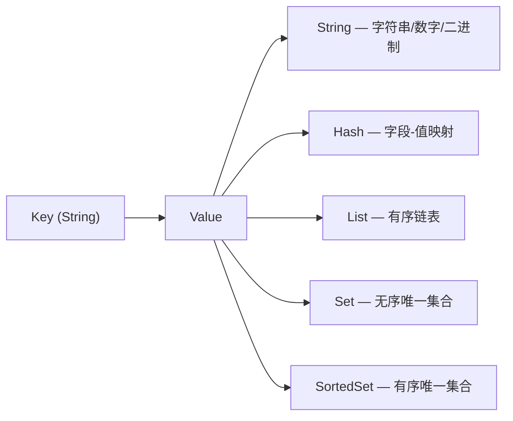
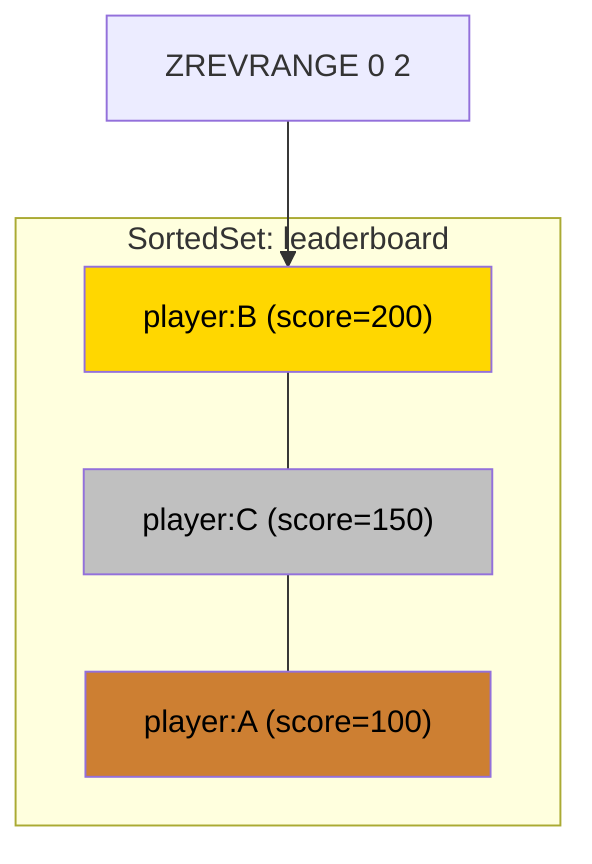
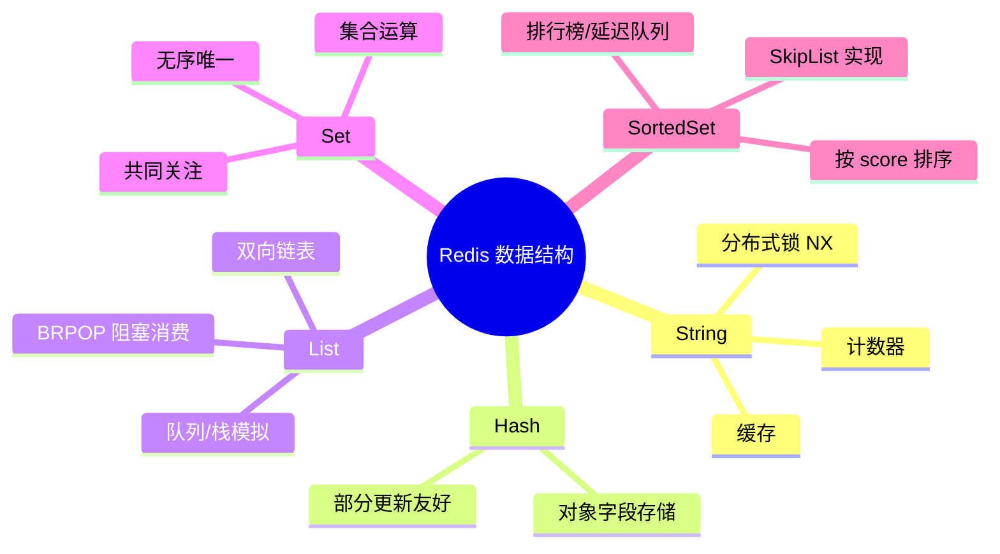
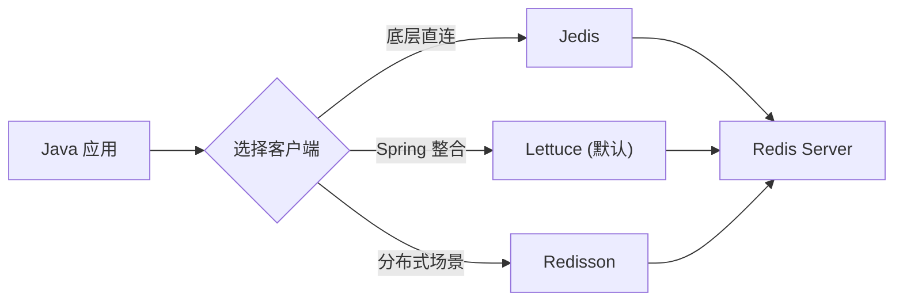
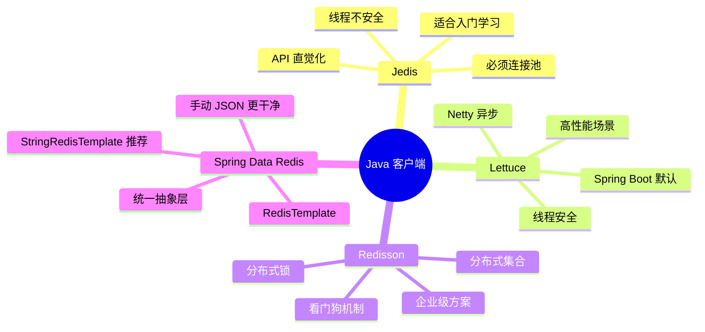

## 目录
- [[#第02章 安装与客户端使用]]
	- [[#Redis 安装与启动的三种方式]]
	- [[#Redis 命令行客户端（redis-cli）]]
	- [[#图形化客户端（RedisInsight / RESP）]]
- [[#第03章 Redis 数据结构与命令]]
	- [[#数据结构总览]]
	- [[#通用命令]]
	- [[#String 类型]]
	- [[#Key 的层级格式]]
	- [[#Hash 类型]]
	- [[#List 类型]]
	- [[#Set 类型]]
	- [[#SortedSet（ZSet）类型]]
	- [[#五大类型对比总结]]
- [[#第04章 Java 客户端开发]]
	- [[#Java 客户端对比]]
	- [[#Jedis 快速入门]]
	- [[#Jedis 连接池]]
	- [[#认识 Spring Data Redis]]
	- [[#RedisTemplate 快速入门]]
	- [[#RedisSerializer 序列化问题]]
	- [[#StringRedisTemplate]]
	- [[#RedisTemplate 操作 Hash 类型]]
	- [[#客户端选型总结]]

---

## 第02章 安装与客户端使用

### Redis 安装与启动的三种方式

Redis 官方仅提供 Linux 版本，生产环境推荐使用 Linux。

#### 1. 前台启动（不推荐）

```bash
# 直接运行 redis-server，终端关闭则进程终止
redis-server
```

#### 2. 指定配置文件启动

```bash
# 复制默认配置文件并修改
cp /etc/redis/redis.conf /etc/redis/redis-6379.conf

# 核心配置项
bind 0.0.0.0          # 允许远程连接（默认只监听 127.0.0.1）
daemonize yes          # 后台运行（守护进程）
requirepass yourpwd    # 设置访问密码
port 6379              # 端口号
dir ./                 # 工作目录（RDB/AOF 文件存放位置）
databases 16           # 数据库数量（默认16个，索引 0~15）

# 使用指定配置启动
redis-server /etc/redis/redis-6379.conf
```

#### 3. 注册为系统服务启动（推荐）

```bash
# systemd 管理，开机自启
systemctl start redis
systemctl enable redis
systemctl status redis
```

> [!note] OS 补充 —— 守护进程（Daemon）
> `daemonize yes` 让 Redis 以 **守护进程** 模式运行：
> - 脱离控制终端，在后台长期运行
> - 类似 OS 中的 `fork()` + `setsid()` + 关闭标准IO
> - 这与 MySQL 的 `mysqld`、Nginx 的 worker 进程是同一概念
>
> CS 术语：**Daemon Process** — 没有控制终端的后台服务进程

```
Redis 启动方式对比:

┌──────────────┬────────────────────┬───────────────┐
│   方式        │    生命周期         │   适用场景     │
├──────────────┼────────────────────┼───────────────┤
│ 前台启动      │ 终端关闭即停        │  临时调试      │
│ 配置文件启动   │ 手动管理           │  开发环境      │
│ 系统服务      │ 开机自启、自动恢复   │  生产环境      │
└──────────────┴────────────────────┴───────────────┘
```

### Redis 命令行客户端（redis-cli）

```bash
# 基本连接
redis-cli                           # 连接本地 6379
redis-cli -h 192.168.1.100 -p 6380  # 连接远程主机
redis-cli -h 192.168.1.100 -a pwd   # 带密码连接

# 进入后认证
127.0.0.1:6379> AUTH yourpassword
OK

# 选择数据库（默认 db0，共 16 个）
127.0.0.1:6379> SELECT 1
OK

# 测试连通性
127.0.0.1:6379> PING
PONG
```

> [!tip] 类比理解
> `redis-cli` 之于 Redis，就像 `mysql` 命令行之于 MySQL
> `SELECT 1` 切换到 1 号数据库，类似 MySQL 的 `USE database_name`
> 但 Redis 的多数据库（0~15）是**同一个实例**内的隔离，不如 MySQL 的数据库独立，生产中一般只用 db0

### 图形化客户端（RedisInsight / RESP）

常用的图形化工具：
- **RedisInsight**（官方，免费）— 内置分析工具、慢查询监控
- **RESP.app**（第三方）— 轻量级、跨平台
- **Another Redis Desktop Manager**（开源）— 功能齐全

图形化工具本质上就是封装了 `redis-cli` 的命令，提供可视化的 Key 浏览、数据编辑、性能监控等功能。

---

## 第03章 Redis 数据结构与命令

### 数据结构总览

Redis 是一个 **key-value** 存储，Key 永远是 String 类型，Value 有多种数据结构：



```
Redis 五大数据结构 vs 编程语言对照:

┌────────────┬──────────────────┬────────────────────────┐
│ Redis 类型  │  Java 对应        │  特点                  │
├────────────┼──────────────────┼────────────────────────┤
│ String     │ String / byte[]  │  最基础，可存字符串/数字  │
│ Hash       │ HashMap<F, V>    │  适合存对象的各个字段     │
│ List       │ LinkedList       │  双向链表，有序可重复     │
│ Set        │ HashSet          │  无序不重复              │
│ SortedSet  │ TreeSet          │  按 score 排序不重复     │
└────────────┴──────────────────┴────────────────────────┘
```

> [!note] DB 补充 —— Redis vs 关系型数据库
> MySQL 用 **B+ 树索引** 组织数据，适合范围查询和复杂 JOIN
> Redis 用 **哈希表** 做全局键空间（O(1) 查找），每种 Value 类型内部又有专门的编码结构
> 两者是互补关系：MySQL 持久化 + 复杂查询，Redis 高速缓存 + 简单数据模型

### 通用命令

这些命令对**所有数据类型**都适用：

```bash
# 查看/搜索 Key
KEYS pattern        # 查找匹配的 key（生产禁用！O(N) 全扫描）
KEYS *              # 列出所有 key
KEYS user:*         # 列出 user: 开头的 key

# 判断 Key 是否存在
EXISTS key          # 存在返回 1，否则返回 0
EXISTS k1 k2 k3     # 批量检查，返回存在的个数

# 删除 Key
DEL key [key ...]   # 同步删除，返回删除成功的个数
UNLINK key          # 异步删除（先从 keyspace 移除，后台线程回收内存）

# 设置过期时间
EXPIRE key seconds  # 给 key 设置 TTL（秒）
TTL key             # 查看剩余有效期（-1=永久，-2=已过期/不存在）

# 查看类型
TYPE key            # 返回 string / list / set / zset / hash
```

> [!warning] 避坑指南
> **生产环境严禁使用 `KEYS *`**！
> Redis 是单线程处理命令的，`KEYS *` 会遍历整个键空间，造成长时间阻塞
> 替代方案：使用 `SCAN cursor MATCH pattern COUNT count` 分批迭代
>
> 类比：`KEYS *` 相当于在 MySQL 上执行不带索引的 `SELECT * FROM huge_table` — 全表扫描阻塞

> [!tip] DEL vs UNLINK
> `DEL` 是同步删除：如果删除的是一个大 Hash（百万字段），会阻塞主线程
> `UNLINK` 是异步删除：先从键空间"断开链接"（O(1)），然后由后台线程慢慢释放内存
> 类比：`DEL` 像是当场拆房子（阻塞交通），`UNLINK` 像是先围起来，晚上再拆

### String 类型

String 是 Redis 最基础的类型，可以存储：字符串、整数、浮点数、二进制数据（最大 512MB）。

```bash
# 基本操作
SET key value                # 设置值
GET key                      # 获取值（不存在返回 nil）
MSET k1 v1 k2 v2            # 批量设置
MGET k1 k2                  # 批量获取

# 计数器操作
INCR key                     # +1（原子操作）
INCRBY key increment         # +N
DECR key                     # -1
DECRBY key decrement         # -N
INCRBYFLOAT key increment    # 浮点数加减

# 设置时附加选项
SET key value EX 30          # 设置值，30秒后过期
SET key value PX 30000       # 毫秒级过期
SET key value NX              # 仅当 key 不存在时才设置（分布式锁基础！）
SET key value XX              # 仅当 key 已存在时才更新
SETNX key value              # 等价于 SET key value NX
SETEX key seconds value      # 等价于 SET key value EX seconds
```

> [!question] 深度思考 —— 为什么 INCR 是原子的？
> Redis **单线程**处理所有命令（在一个事件循环中串行执行）
> 所以 `INCR` 不需要额外的锁机制，天然原子
> 对比 Java：`i++` 在多线程下不安全，需要 `AtomicInteger` 或 `synchronized`
> Redis 的单线程模型把并发问题在架构层面消灭了

```
String 底层编码选择:

              输入值
                │
        ┌───────┴───────┐
     是整数?          非整数
        │                │
   值 ≤ 2^63-1?      长度 ≤ 44?
        │                │
       int            embstr        raw
   (8字节直存)    (对象头+SDS一次分配)  (两次分配)
```

### Key 的层级格式

Redis 的 Key 没有 MySQL 那样的"表"概念，但可以通过 **冒号分隔** 模拟层级结构：

```bash
# 格式：业务名:数据名:ID
SET user:profile:1001 '{"name":"张三","age":25}'
SET user:profile:1002 '{"name":"李四","age":30}'
SET product:detail:2001 '{"name":"iPhone","price":9999}'

# 在图形化工具中会自动展示为树形结构：
# ├── user
# │   └── profile
# │       ├── 1001
# │       └── 1002
# └── product
#     └── detail
#         └── 2001
```

> [!tip] 类比理解
> Key 的层级格式类似于**文件系统路径**或 **Java 包名**
> `user:profile:1001` ≈ `/user/profile/1001` ≈ `com.user.profile.1001`
> 这种约定纯粹是**命名规范**，Redis 内部并不会因此建立目录结构

### Hash 类型

Hash 类似 Java 的 `HashMap<String, String>`，适合存储对象的各个字段：

```bash
# 基本操作
HSET key field value         # 设置单个字段
HGET key field               # 获取单个字段
HMSET key f1 v1 f2 v2       # 批量设置（Redis 4.0+ HSET 也支持多字段）
HMGET key f1 f2              # 批量获取
HGETALL key                  # 获取所有字段和值
HDEL key field               # 删除字段

# 其他操作
HKEYS key                    # 获取所有字段名
HVALS key                    # 获取所有字段值
HLEN key                     # 字段数量
HINCRBY key field increment  # 对整数字段做自增
HEXISTS key field            # 判断字段是否存在
HSETNX key field value       # 字段不存在时才设置
```

```
String JSON vs Hash 存储对象:

方案一: String 存 JSON
┌──────────────────┬──────────────────────────────────┐
│ Key              │ Value                            │
├──────────────────┼──────────────────────────────────┤
│ user:1001        │ {"name":"张三","age":25,"city":"北京"} │
└──────────────────┴──────────────────────────────────┘
✅ 读写整个对象简单    ❌ 修改单字段需要读出→改→写回

方案二: Hash 存字段
┌──────────────────┬───────────┬──────────┐
│ Key              │ Field     │ Value    │
├──────────────────┼───────────┼──────────┤
│ user:1001        │ name      │ 张三      │
│                  │ age       │ 25       │
│                  │ city      │ 北京      │
└──────────────────┴───────────┴──────────┘
✅ 可单独修改某字段    ✅ 省去序列化/反序列化开销
```

> [!tip] 选型建议
> - **频繁整体读写** → String + JSON（一次 GET/SET 搞定）
> - **频繁部分更新** → Hash（`HSET user:1001 age 26` 单字段原子更新）
> - Hash 在字段少（≤ 128）且值短（≤ 64B）时使用 **ZipList** 编码，极省内存

### List 类型

List 是一个**双向链表**，有序、可重复、支持两端操作：

```bash
# 压入元素
LPUSH key v1 v2 v3     # 左端压入（结果：v3 v2 v1）
RPUSH key v1 v2 v3     # 右端压入（结果：v1 v2 v3）

# 弹出元素
LPOP key               # 左端弹出
RPOP key               # 右端弹出
BLPOP key timeout      # 阻塞式左弹出（队列消费者常用）
BRPOP key timeout      # 阻塞式右弹出

# 查看元素
LRANGE key 0 -1        # 获取所有元素（0 到最后一个）
LINDEX key index       # 按索引获取
LLEN key               # 获取列表长度
```


| 组合方式 | 模拟的数据结构 | 场景 |
|---------|-------------|------|
| LPUSH + RPOP | **队列（Queue）** | 消息队列、任务分发 |
| LPUSH + LPOP | **栈（Stack）** | 撤销操作、浏览历史 |
| LPUSH + LRANGE | **有界列表** | 最新动态、Timeline |
| LPUSH + BRPOP | **阻塞队列** | 生产者-消费者模型 |

> [!note] OS 补充 —— 阻塞队列
> `BRPOP key 30` 表示："等待 key 中有元素可弹出，最多等 30 秒"
> 如果列表为空，客户端连接会**挂起**（blocking），类似 Java 的 `BlockingQueue.take()`
> 底层不是忙等（busy wait），而是 Redis 在事件循环中注册了一个"等待通知"
> 当其他客户端 `LPUSH` 了新元素，Redis 会唤醒等待中的消费者

### Set 类型

Set 是**无序、不重复**元素的集合，支持集合运算：

```bash
# 基本操作
SADD key member [member ...]   # 添加元素
SREM key member                # 移除元素
SISMEMBER key member           # 判断元素是否存在（O(1)）
SMEMBERS key                   # 获取所有元素
SCARD key                      # 集合大小

# 集合运算（面试常考）
SINTER key1 key2               # 交集
SDIFF key1 key2                # 差集（key1 有但 key2 没有）
SUNION key1 key2               # 并集
SINTERSTORE dest key1 key2     # 交集结果存入 dest
```

```
集合运算示意:

Set A (user:1001:follows)        Set B (user:1002:follows)
┌─────────────────────┐         ┌─────────────────────┐
│  张三  李四  王五     │         │  李四  王五  赵六     │
└─────────────────────┘         └─────────────────────┘

SINTER A B  → { 李四, 王五 }         ← 共同关注
SDIFF  A B  → { 张三 }              ← A关注但B没关注
SUNION A B  → { 张三,李四,王五,赵六 } ← 全部人
```

> [!tip] 经典应用
> - **共同关注** → `SINTER user:1001:follows user:1002:follows`
> - **可能认识的人** → `SDIFF user:1002:follows user:1001:follows`（B关注的但A还没关注的）
> - **抽奖** → `SRANDMEMBER key count` 随机抽取 / `SPOP key count` 抽取并移除
> - **标签系统** → 每个文章一个 Set 存标签，可以做交集/并集查询

### SortedSet（ZSet）类型

SortedSet 是**有序、不重复**的集合，每个元素关联一个 **score**（分数）用于排序：

```bash
# 添加元素
ZADD key score member [score member ...]
ZADD leaderboard 100 "player:A" 200 "player:B" 150 "player:C"

# 查询
ZSCORE key member              # 获取指定元素的 score
ZRANK key member               # 获取排名（升序，0 开始）
ZREVRANK key member            # 获取排名（降序）
ZCARD key                      # 集合大小

# 范围查询
ZRANGE key start stop          # 按排名范围查（升序）
ZREVRANGE key 0 9              # Top 10（降序前10）
ZRANGEBYSCORE key min max      # 按 score 范围查
ZCOUNT key min max             # 统计 score 范围内的元素数

# 修改
ZINCRBY key increment member   # 给元素的 score 加 N
ZREM key member                # 移除元素

# 集合运算
ZINTERSTORE dest numkeys key1 key2  # 交集（score 相加）
ZUNIONSTORE dest numkeys key1 key2  # 并集
```



> [!note] DB 补充 —— SortedSet 的底层结构
> SortedSet 底层使用 **跳表（SkipList）+ 哈希表** 双重结构：
> - **跳表**：支持按 score 的有序遍历和范围查询 → O(log N)
> - **哈希表**：支持按 member 精确查找 score → O(1)
>
> 对比 MySQL 的 B+ 树索引：
> - B+ 树也支持有序遍历和范围查询
> - 但跳表实现更简单、并发友好（局部锁），这是 Redis 选择跳表的原因
>
> CS 术语：**SkipList** — 通过多层链表实现 O(log N) 查找的概率性数据结构

> [!tip] 经典应用
> - **排行榜** → `ZADD` 更新分数 + `ZREVRANGE` 查 Top N
> - **延迟队列** → score 存时间戳，定时 `ZRANGEBYSCORE` 取到期任务
> - **滑动窗口限流** → score 存请求时间戳，统计窗口内请求数

### 五大类型对比总结

| 类型 | 有序 | 唯一 | 典型场景 | 时间复杂度（常用操作） |
|------|------|------|---------|---------------------|
| String | — | — | 缓存、计数器、分布式锁 | O(1) |
| Hash | — | 字段唯一 | 对象存储、购物车 | O(1) 单字段 |
| List | ✅ | ❌ | 消息队列、最新列表 | O(1) 两端、O(N) 中间 |
| Set | ❌ | ✅ | 标签、社交关系、抽奖 | O(1) 增删查 |
| SortedSet | ✅(score) | ✅ | 排行榜、延迟队列 | O(log N) |



---

## 第04章 Java 客户端开发

### Java 客户端对比

| 客户端 | 特点 | 推荐场景 |
|--------|------|---------|
| **Jedis** | API 与 Redis 命令一一对应，简单直观；线程不安全，需配合连接池 | 学习、小型项目 |
| **Lettuce** | 基于 Netty，支持异步/响应式；线程安全，单连接即可 | Spring Boot 默认 |
| **Redisson** | 提供分布式锁、集合、队列等高级抽象；像使用 Java 集合一样用 Redis | 分布式系统 |



### Jedis 快速入门

```java
// 1. 添加依赖（Maven）
// <dependency>
//     <groupId>redis.clients</groupId>
//     <artifactId>jedis</artifactId>
//     <version>4.3.1</version>
// </dependency>

// 2. 建立连接
Jedis jedis = new Jedis("127.0.0.1", 6379);
jedis.auth("password");  // 密码认证
jedis.select(0);         // 选择数据库

// 3. 操作 —— 方法名和 Redis 命令完全一致
jedis.set("name", "张三");
String name = jedis.get("name");     // "张三"

jedis.hset("user:1001", "name", "李四");
jedis.hset("user:1001", "age", "25");
Map<String, String> user = jedis.hgetAll("user:1001");

// 4. 释放连接
jedis.close();
```

> [!warning] 避坑指南
> Jedis 实例是 **线程不安全** 的！
> 每个线程必须使用自己的 Jedis 实例，千万不能多线程共享
> 原因：Jedis 底层维护了一个 Socket 连接，多线程并发读写同一个 Socket 会导致数据错乱
> 类比：两个人同时往一个电话里说话 → 对方听到的是混合声音

### Jedis 连接池

为了线程安全 + 复用连接，必须使用连接池：

```java
public class JedisConnectionFactory {
    private static final JedisPool jedisPool;

    static {
        JedisPoolConfig config = new JedisPoolConfig();
        config.setMaxTotal(8);       // 最大连接数
        config.setMaxIdle(8);        // 最大空闲连接
        config.setMinIdle(0);        // 最小空闲连接
        config.setMaxWaitMillis(1000); // 获取连接的最大等待时间

        jedisPool = new JedisPool(config, "127.0.0.1", 6379, 1000, "password");
    }

    public static Jedis getJedis() {
        return jedisPool.getResource();  // 从池中借一个连接
    }
}

// 使用
try (Jedis jedis = JedisConnectionFactory.getJedis()) {
    jedis.set("key", "value");
}  // try-with-resources 自动归还连接到池中
```

> [!note] OS/DB 补充 —— 连接池思想
> 连接池是一种经典的 **对象池（Object Pool）** 设计模式：
> - **MySQL** 有 HikariCP、Druid 连接池
> - **线程池** `ThreadPoolExecutor` 也是同样思想
> - 核心目的：避免频繁创建/销毁 TCP 连接的开销（三次握手 + 四次挥手）
>
> CS 术语：**Connection Pooling** — 预分配资源，按需借用/归还

### 认识 Spring Data Redis

Spring Data Redis 是 Spring 提供的 Redis 操作抽象层，屏蔽了底层客户端差异：

```
Spring Data Redis 架构:

┌──────────────────────────────────┐
│       你的业务代码                 │
├──────────────────────────────────┤
│     RedisTemplate / StringRedisTemplate │
├──────────────────────────────────┤
│     Spring Data Redis（抽象层）    │
├──────────┬───────────────────────┤
│  Jedis   │      Lettuce          │  ← 可切换底层实现
└──────────┴───────────────────────┘
         │
    Redis Server
```

```yaml
# Spring Boot application.yml 配置
spring:
  redis:
    host: 127.0.0.1
    port: 6379
    password: yourpassword
    lettuce:                    # 默认使用 Lettuce
      pool:
        max-active: 8
        max-idle: 8
        min-idle: 0
        max-wait: 100ms
```

### RedisTemplate 快速入门

```java
@Autowired
private RedisTemplate redisTemplate;

// RedisTemplate 按数据类型提供不同的 Operations 对象
redisTemplate.opsForValue()     // String 操作
redisTemplate.opsForHash()      // Hash 操作
redisTemplate.opsForList()      // List 操作
redisTemplate.opsForSet()       // Set 操作
redisTemplate.opsForZSet()      // SortedSet 操作

// 示例
redisTemplate.opsForValue().set("name", "张三");
Object name = redisTemplate.opsForValue().get("name");

// 通用命令
redisTemplate.delete("name");
redisTemplate.hasKey("name");
redisTemplate.expire("name", 30, TimeUnit.SECONDS);
```

> [!tip] API 命名规律
> RedisTemplate 的方法名不是直接映射 Redis 命令，而是更 Java 化：
> - `SET` → `opsForValue().set()`
> - `HSET` → `opsForHash().put()`
> - `LPUSH` → `opsForList().leftPush()`
> - `SADD` → `opsForSet().add()`
> - `ZADD` → `opsForZSet().add()`

### RedisSerializer 序列化问题

RedisTemplate 默认使用 `JdkSerializationRedisSerializer`，会导致存入 Redis 的数据是二进制乱码：

```
默认序列化的问题:

redis-cli 中看到:
127.0.0.1:6379> keys *
1) "\xac\xed\x00\x05t\x00\x04name"   ← 可读性极差！

原因: JDK 序列化 = Java 对象 → 二进制字节流
     不仅 value 被序列化，连 key 都变成了二进制
```

**解决方案**：自定义 `RedisSerializer`

```java
@Configuration
public class RedisConfig {

    @Bean
    public RedisTemplate<String, Object> redisTemplate(RedisConnectionFactory factory) {
        RedisTemplate<String, Object> template = new RedisTemplate<>();
        template.setConnectionFactory(factory);

        // Key 和 HashKey 使用 String 序列化
        template.setKeySerializer(RedisSerializer.string());
        template.setHashKeySerializer(RedisSerializer.string());

        // Value 和 HashValue 使用 JSON 序列化
        GenericJackson2JsonRedisSerializer jsonSerializer =
            new GenericJackson2JsonRedisSerializer();
        template.setValueSerializer(jsonSerializer);
        template.setHashValueSerializer(jsonSerializer);

        return template;
    }
}
```

```
自定义序列化后:

redis-cli 中看到:
127.0.0.1:6379> GET user:1001
"{\"@class\":\"com.example.User\",\"name\":\"张三\",\"age\":25}"
                  ↑
            JSON 中自动带上了类名（用于反序列化）
```

> [!warning] 避坑指南
> `GenericJackson2JsonRedisSerializer` 会在 JSON 中写入 `@class` 字段
> 这导致额外的内存占用，且如果类路径变了，反序列化会失败
> 生产环境推荐使用 `StringRedisTemplate` + 手动 JSON 序列化（见下节）

### StringRedisTemplate

`StringRedisTemplate` 是 `RedisTemplate<String, String>` 的子类，Key 和 Value 都用 String 序列化：

```java
@Autowired
private StringRedisTemplate stringRedisTemplate;

// 存储时手动序列化
ObjectMapper mapper = new ObjectMapper();
User user = new User("张三", 25);
String json = mapper.writeValueAsString(user);  // 手动转 JSON

stringRedisTemplate.opsForValue().set("user:1001", json);

// 读取时手动反序列化
String result = stringRedisTemplate.opsForValue().get("user:1001");
User u = mapper.readValue(result, User.class);
```

```
StringRedisTemplate vs RedisTemplate<String, Object>:

┌────────────────────────┬───────────────────┬──────────────────────┐
│                        │ RedisTemplate     │ StringRedisTemplate  │
│                        │ (自定义JSON序列化)  │ (手动JSON转换)        │
├────────────────────────┼───────────────────┼──────────────────────┤
│ Key 序列化              │ StringSerializer  │ StringSerializer     │
│ Value 序列化            │ JSON (自动)        │ String (手动)         │
│ 是否有 @class           │ ✅ 有，占内存      │ ❌ 没有，更干净       │
│ 使用便利性              │ 自动序列化/反序列化  │ 需要手动转换          │
│ 内存效率                │ 较低              │ 较高                 │
│ 推荐度                  │ ⭐⭐             │ ⭐⭐⭐⭐             │
└────────────────────────┴───────────────────┴──────────────────────┘
```

### RedisTemplate 操作 Hash 类型

```java
// 存储对象到 Hash
stringRedisTemplate.opsForHash().put("user:1001", "name", "张三");
stringRedisTemplate.opsForHash().put("user:1001", "age", "25");

// 批量操作
Map<String, String> map = new HashMap<>();
map.put("name", "李四");
map.put("age", "30");
stringRedisTemplate.opsForHash().putAll("user:1002", map);

// 获取
Object name = stringRedisTemplate.opsForHash().get("user:1001", "name");
Map<Object, Object> entries = stringRedisTemplate.opsForHash().entries("user:1001");

// 自增
stringRedisTemplate.opsForHash().increment("user:1001", "age", 1);  // age + 1
```

> [!tip] Hash vs String JSON 存对象
> 如果频繁需要读写对象的**单个字段**（如更新用户年龄），用 Hash 更优
> 如果总是**整体读写**（如缓存查询结果），用 String + JSON 更简单
> 在实际项目中，两种方案经常混合使用

### 客户端选型总结



---

## 基础篇小结

| 章节 | 核心要点 |
|------|---------|
| 安装与启动 | 三种方式（前台/配置文件/系统服务），生产用 systemd |
| redis-cli | `-h -p -a` 连接，`SELECT` 切库，`PING` 测试 |
| 通用命令 | `KEYS`(禁生产)、`DEL/UNLINK`、`EXPIRE/TTL`、`TYPE` |
| String | `SET/GET`、`INCR`(原子)、`NX`(分布式锁基础) |
| Hash | 字段级操作，适合存对象，底层 ZipList 省内存 |
| List | 双向链表，模拟队列/栈，`BRPOP` 阻塞消费 |
| Set | 无序唯一，集合运算（交并差），社交关系 |
| SortedSet | score 排序，跳表实现，排行榜/延迟队列 |
| Jedis | 线程不安全，必须连接池 |
| StringRedisTemplate | Spring 推荐方案，手动 JSON 最干净 |

> [!tip] 记忆口诀
> **五大类型**：字哈列集排（String Hash List Set ZSet）
> **序列化三连**：默认 JDK 乱码 → JSON 带 @class → String 手动最优
> **连接池三件套**：maxTotal（总数）、maxIdle（空闲上限）、maxWait（等待时长）

---
