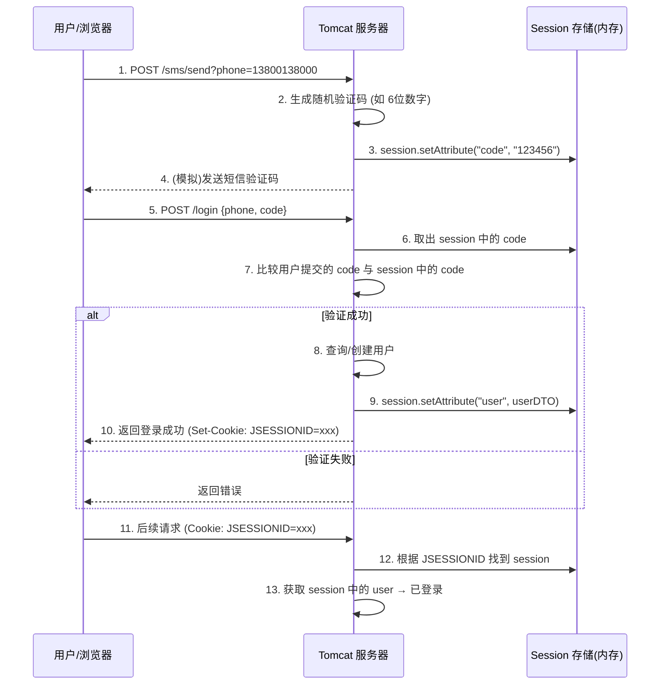
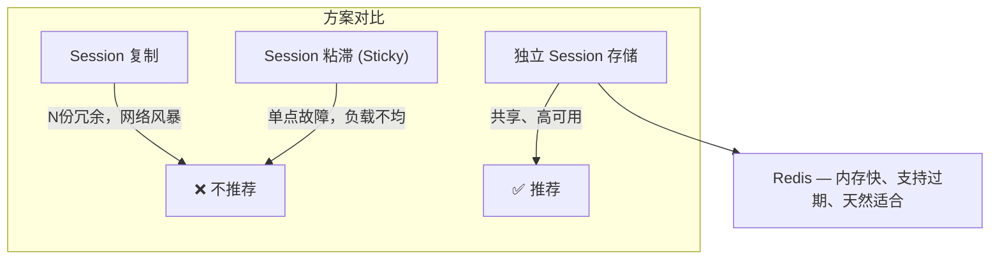
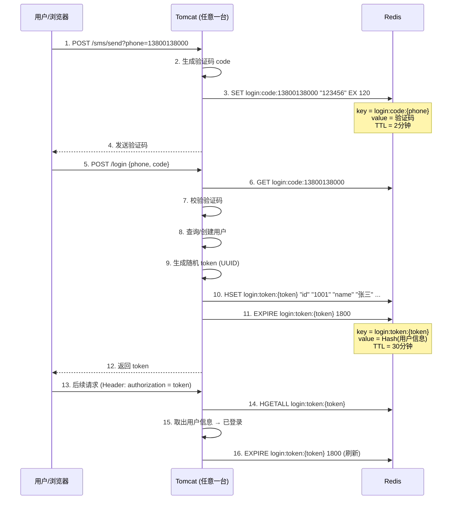
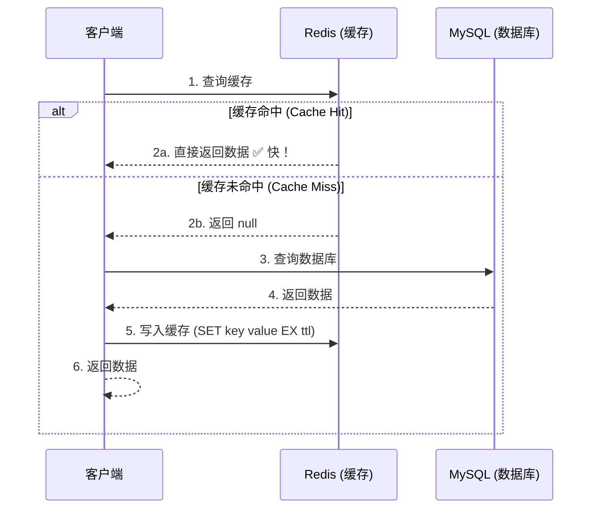
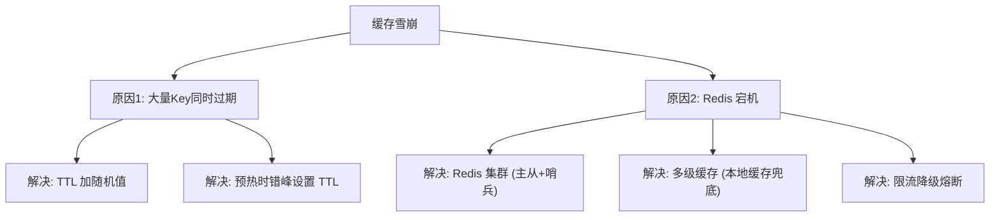
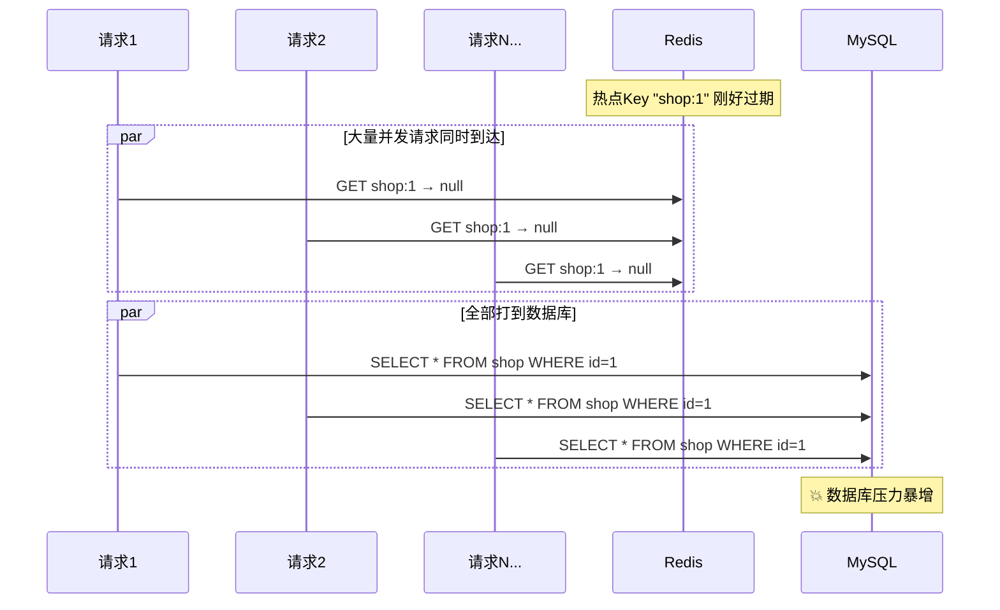
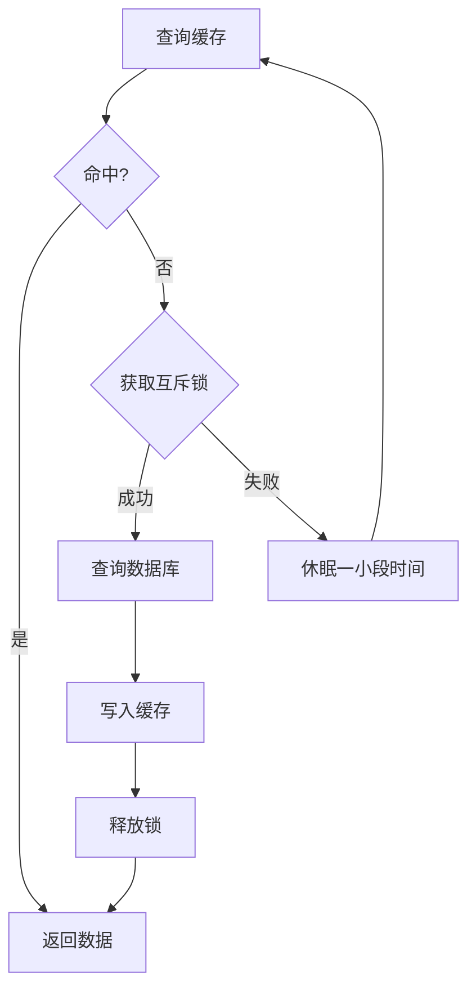
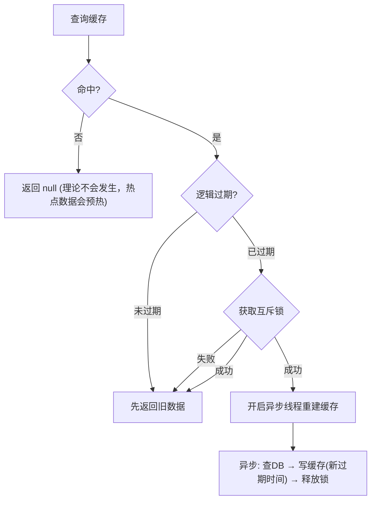

## 目录
- [[#第01章 短信登录业务]]
	- [[#基于 Session 的登录流程]]
	- [[#发送验证码实现]]
	- [[#验证码登录与注册实现]]
	- [[#登录校验拦截器]]
	- [[#Session 共享问题分析]]
	- [[#Redis 代替 Session 的方案设计]]
	- [[#基于 Redis 实现短信登录]]
	- [[#登录刷新问题与双拦截器]]
- [[#第02章 商户查询缓存]]
	- [[#缓存的本质]]
	- [[#添加商户缓存]]
	- [[#缓存更新策略]]
	- [[#缓存穿透（Cache Penetration）]]
	- [[#缓存雪崩（Cache Avalanche）]]
	- [[#缓存击穿（Cache Breakdown / Hotspot Invalid）]]
	- [[#互斥锁解决缓存击穿]]
	- [[#逻辑过期解决缓存击穿]]
	- [[#缓存三大问题对比总结]]

---

## 第01章 短信登录业务

### 基于 Session 的登录流程

传统 Web 应用使用 **HttpSession** 在服务端保存用户登录状态：



> [!note] OS/DB 补充 —— Session 机制
> HTTP 是 **无状态协议**（每次请求互相独立），Session 是服务端维护状态的方案：
> - 服务端：在内存中创建 `Map<SessionID, Map<String, Object>>` 结构
> - 客户端：浏览器通过 Cookie 携带 `JSESSIONID`，服务端据此查找对应 Session
> - 本质上是一种 **服务端有状态** 的设计
>
> 类比：Session 像是银行给你的排队号码牌 — 你拿号牌去任何柜台都能查到你的业务信息（但仅限这家银行）

### 发送验证码实现

```java
@PostMapping("/code")
public Result sendCode(@RequestParam String phone, HttpSession session) {
    // 1. 校验手机号格式
    if (RegexUtils.isPhoneInvalid(phone)) {
        return Result.fail("手机号格式错误");
    }
    // 2. 生成 6 位随机验证码
    String code = RandomUtil.randomNumbers(6);
    
    // 3. 保存到 Session
    session.setAttribute("code", code);
    
    // 4. 发送验证码（这里模拟，实际接入阿里云/腾讯云 SMS）
    log.info("发送验证码成功，验证码: {}", code);
    
    return Result.ok();
}
```

### 验证码登录与注册实现

```java
@PostMapping("/login")
public Result login(@RequestBody LoginFormDTO loginForm, HttpSession session) {
    String phone = loginForm.getPhone();
    
    // 1. 校验手机号
    if (RegexUtils.isPhoneInvalid(phone)) {
        return Result.fail("手机号格式错误");
    }
    
    // 2. 校验验证码
    String cacheCode = (String) session.getAttribute("code");
    String userCode = loginForm.getCode();
    if (cacheCode == null || !cacheCode.equals(userCode)) {
        return Result.fail("验证码错误");
    }
    
    // 3. 根据手机号查询用户（不存在则自动注册）
    User user = userService.query().eq("phone", phone).one();
    if (user == null) {
        user = createUserWithPhone(phone);  // 自动注册
    }
    
    // 4. 保存用户信息到 Session（注意只存 DTO，不存敏感信息）
    session.setAttribute("user", BeanUtil.copyProperties(user, UserDTO.class));
    
    return Result.ok();
}
```

> [!warning] 避坑指南 —— Session 中不要存完整 User
> Session 存储在服务端内存中，每个在线用户都占一份
> 如果存完整 `User` 对象（含密码、身份证号等），既浪费内存又有安全风险
> **正确做法**：只存 `UserDTO`（id + 昵称 + 头像等最小必要信息）

### 登录校验拦截器

使用 Spring MVC 拦截器统一做登录校验，避免每个 Controller 重复判断：

```java
public class LoginInterceptor implements HandlerInterceptor {
    
    @Override
    public boolean preHandle(HttpServletRequest request, 
                             HttpServletResponse response, Object handler) {
        // 1. 从 Session 获取用户
        HttpSession session = request.getSession();
        UserDTO user = (UserDTO) session.getAttribute("user");
        
        // 2. 未登录 → 拦截
        if (user == null) {
            response.setStatus(401);
            return false;
        }
        
        // 3. 已登录 → 保存到 ThreadLocal（方便后续业务代码获取）
        UserHolder.saveUser(user);
        return true;
    }
    
    @Override
    public void afterCompletion(HttpServletRequest request, 
                                HttpServletResponse response, Object handler, Exception ex) {
        // 请求结束，清理 ThreadLocal 防止内存泄漏
        UserHolder.removeUser();
    }
}
```

```
ThreadLocal 在请求链路中的角色:

请求进入                                                请求结束
   │                                                     │
   ▼                                                     ▼
拦截器 preHandle ──→ Controller ──→ Service ──→ 拦截器 afterCompletion
   │                    │              │                  │
   │ saveUser(dto)      │ getUser()    │ getUser()        │ removeUser()
   └───────────────── ThreadLocal<UserDTO> ───────────────┘
   
每个线程独立的存储空间，无需方法参数层层传递
```

> [!note] OS 补充 —— ThreadLocal
> `ThreadLocal` 利用 **线程局部存储（Thread-Local Storage, TLS）** 的思想：
> - 每个线程的 `Thread` 对象内部持有一个 `ThreadLocalMap`
> - `ThreadLocal.set(value)` 把值存到**当前线程自己的** Map 中
> - 不同线程之间互不影响，天然线程安全
>
> 必须在请求结束时 `remove()`，否则线程池复用线程时会读到上一个请求的用户信息（**内存泄漏 + 数据错乱**）

### Session 共享问题分析

单机环境 Session 没问题，但 **多台 Tomcat 集群** 时就崩了：

```
Session 共享问题示意:

                    Nginx (负载均衡)
                    ┌─────────┐
                    │ 轮询分发  │
                    └────┬────┘
               ┌─────────┼─────────┐
               ▼         ▼         ▼
          Tomcat-1   Tomcat-2   Tomcat-3
          ┌──────┐   ┌──────┐   ┌──────┐
          │Sess A│   │      │   │      │
          │用户X  │   │ 空!  │   │ 空!  │
          └──────┘   └──────┘   └──────┘
          
请求1 → Tomcat-1：登录成功，Session 存在 Tomcat-1 内存
请求2 → Tomcat-2：找不到 Session → 未登录！❌
```

**为什么不能用 Session 复制？**
- Tomcat 支持 Session 复制（组播同步），但节点越多，网络开销越大
- N 台机器 = 数据存 N 份 = 内存浪费 N 倍
- 不具备扩展性



> [!question] 深度思考 —— 为什么选 Redis 做 Session 存储？
> 1. **性能**：Session 读写频繁（每次请求都要校验），Redis 内存操作延迟 < 1ms
> 2. **过期机制**：Session 有有效期，Redis 的 `EXPIRE` 天然支持
> 3. **共享**：所有 Tomcat 连同一个 Redis，数据自然共享
> 4. **持久化**：Redis 支持 RDB/AOF，即使重启也不丢 Session（可选）
>
> 对比：也可以用 MySQL 存 Session，但每次请求都查数据库 → 磁盘 IO → 延迟高

### Redis 代替 Session 的方案设计



**关键设计决策**：

| 设计点 | Session 方案 | Redis 方案 |
|--------|-------------|-----------|
| 验证码存储 | `session.setAttribute("code", ...)` | `SET login:code:{phone} code EX 120` |
| 用户信息存储 | `session.setAttribute("user", ...)` | `HSET login:token:{token} field value` |
| 客户端凭证 | Cookie (`JSESSIONID`) | 自定义 Header (`authorization: token`) |
| 过期机制 | Tomcat Session 超时 | Redis `EXPIRE` |
| 共享性 | ❌ 单机私有 | ✅ 所有节点共享 |

> [!tip] 为什么用 Hash 存用户信息而不是 String JSON？
> 1. Hash 可以独立获取/修改单个字段（如只获取昵称）
> 2. 不需要序列化/反序列化整个对象
> 3. 内存效率更高（字段少时使用 ZipList 编码）
>
> 为什么用 UUID token 而不是 JSESSIONID？
> 因为手机 APP、小程序等客户端不支持 Cookie 机制，改用 Header 传 Token 更通用

### 基于 Redis 实现短信登录

#### 发送验证码（Redis 版）

```java
@PostMapping("/code")
public Result sendCode(@RequestParam String phone) {
    if (RegexUtils.isPhoneInvalid(phone)) {
        return Result.fail("手机号格式错误");
    }
    String code = RandomUtil.randomNumbers(6);
    
    // 存入 Redis，2 分钟过期
    stringRedisTemplate.opsForValue().set(
        LOGIN_CODE_KEY + phone,   // "login:code:13800138000"
        code,
        LOGIN_CODE_TTL, TimeUnit.MINUTES  // 2 分钟
    );
    
    log.info("验证码: {}", code);
    return Result.ok();
}
```

#### 登录验证（Redis 版）

```java
@PostMapping("/login")
public Result login(@RequestBody LoginFormDTO loginForm) {
    String phone = loginForm.getPhone();
    if (RegexUtils.isPhoneInvalid(phone)) {
        return Result.fail("手机号格式错误");
    }
    
    // 1. 从 Redis 获取验证码
    String cacheCode = stringRedisTemplate.opsForValue().get(LOGIN_CODE_KEY + phone);
    if (cacheCode == null || !cacheCode.equals(loginForm.getCode())) {
        return Result.fail("验证码错误");
    }
    
    // 2. 查询/创建用户
    User user = userService.query().eq("phone", phone).one();
    if (user == null) {
        user = createUserWithPhone(phone);
    }
    
    // 3. 生成 token，存入 Redis
    String token = UUID.randomUUID().toString(true);  // 无横线 UUID
    UserDTO userDTO = BeanUtil.copyProperties(user, UserDTO.class);
    
    // 将 UserDTO 转为 Map<String, String> 存入 Hash
    Map<String, Object> userMap = BeanUtil.beanToMap(userDTO, new HashMap<>(),
        CopyOptions.create()
            .setIgnoreNullValue(true)
            .setFieldValueEditor((name, value) -> value.toString())  // 全部转 String
    );
    
    String tokenKey = LOGIN_USER_KEY + token;  // "login:token:{uuid}"
    stringRedisTemplate.opsForHash().putAll(tokenKey, userMap);
    stringRedisTemplate.expire(tokenKey, LOGIN_USER_TTL, TimeUnit.MINUTES);  // 30 分钟
    
    // 4. 返回 token 给客户端
    return Result.ok(token);
}
```

> [!warning] 避坑指南 —— Map 值类型必须统一为 String
> `StringRedisTemplate` 要求 Hash 的 field 和 value 都是 String
> 但 `BeanUtil.beanToMap()` 会把 `Long id` 保留为 Long 类型 → 写入 Redis 时报 ClassCastException
> 必须用 `setFieldValueEditor` 强制把所有 value 转为 String

### 登录刷新问题与双拦截器

**问题**：如果只在 `LoginInterceptor` 中刷新 Token 过期时间，那些**不需要登录就能访问的路径**（如首页、商户列表）不会触发拦截器 → Token 不会续期 → 用户正在浏览但 Token 过期了。

**解决**：拆分为两个拦截器

```
双拦截器架构:

所有请求
    │
    ▼
┌──────────────────────────────────┐
│ 拦截器1: RefreshTokenInterceptor  │  order=0 (先执行)
│ 拦截路径: /**（所有请求）           │
│                                  │
│ · 尝试从 Header 获取 token        │
│ · 有 token → 查 Redis → 存 ThreadLocal → 刷新 TTL │
│ · 无 token → 直接放行（不拦截）    │
└──────────────┬───────────────────┘
               ▼
┌──────────────────────────────────┐
│ 拦截器2: LoginInterceptor         │  order=1 (后执行)
│ 拦截路径: 需要登录的路径            │
│                                  │
│ · 检查 ThreadLocal 中有没有用户    │
│ · 有 → 放行                      │
│ · 无 → 返回 401                  │
└──────────────────────────────────┘
```

```java
// 拦截器1：刷新 Token（拦截所有请求）
public class RefreshTokenInterceptor implements HandlerInterceptor {
    private StringRedisTemplate stringRedisTemplate;

    @Override
    public boolean preHandle(HttpServletRequest request, 
                             HttpServletResponse response, Object handler) {
        // 1. 获取 token
        String token = request.getHeader("authorization");
        if (StrUtil.isBlank(token)) {
            return true;  // 没有 token 也放行，交给下一个拦截器判断
        }
        
        // 2. 查询 Redis 中的用户
        String tokenKey = LOGIN_USER_KEY + token;
        Map<Object, Object> userMap = stringRedisTemplate.opsForHash().entries(tokenKey);
        if (userMap.isEmpty()) {
            return true;  // token 失效也放行
        }
        
        // 3. 存入 ThreadLocal
        UserDTO userDTO = BeanUtil.fillBeanWithMap(userMap, new UserDTO(), false);
        UserHolder.saveUser(userDTO);
        
        // 4. 刷新 TTL（核心：每次有请求就重置 30 分钟）
        stringRedisTemplate.expire(tokenKey, LOGIN_USER_TTL, TimeUnit.MINUTES);
        
        return true;
    }

    @Override
    public void afterCompletion(...) {
        UserHolder.removeUser();
    }
}
```

```java
// 拦截器2：登录校验（只拦截需要登录的路径）
public class LoginInterceptor implements HandlerInterceptor {
    @Override
    public boolean preHandle(HttpServletRequest request,
                             HttpServletResponse response, Object handler) {
        if (UserHolder.getUser() == null) {
            response.setStatus(401);
            return false;
        }
        return true;
    }
}
```

```java
// 注册拦截器
@Configuration
public class MvcConfig implements WebMvcConfigurer {
    @Override
    public void addInterceptors(InterceptorRegistry registry) {
        // 先执行：Token 刷新（所有路径）
        registry.addInterceptor(new RefreshTokenInterceptor(stringRedisTemplate))
                .addPathPatterns("/**")
                .order(0);
        // 后执行：登录校验（排除公开路径）
        registry.addInterceptor(new LoginInterceptor())
                .excludePathPatterns("/user/code", "/user/login", "/blog/hot", "/shop/**")
                .order(1);
    }
}
```

> [!tip] 类比理解
> 双拦截器 = 两道门：
> - **第一道门**（保安）：来的人都登记一下，有会员卡的刷一下续期，没卡的也进来逛
> - **第二道门**（VIP区入口）：只有登记过会员的才能进，其他人拦住
>
> 如果合并成一道门：没有会员卡的人连大厅都进不来 → 无法浏览公开内容 → 也无法触发续期

---

## 第02章 商户查询缓存

### 缓存的本质

**缓存（Cache）** = 数据交换的缓冲区，将**高频访问数据**存储在**更快的介质**中。

```
存储层次金字塔:

        ┌───────┐
        │  CPU   │  寄存器 ~0.3ns
        │ Cache  │  L1 ~1ns / L2 ~3ns / L3 ~10ns
        ├───────┤
        │ Redis  │  内存 ~100μs（含网络）
        ├───────┤
        │ MySQL  │  磁盘 ~10ms（机械盘）/ ~0.1ms（SSD）
        ├───────┤
        │  远程   │  API/远程存储 ~100ms+
        └───────┘
        ↑ 速度快、容量小、成本高
        ↓ 速度慢、容量大、成本低
```

> [!note] OS 补充 —— 缓存无处不在
> 缓存思想贯穿整个计算机体系：
> - **CPU** → L1/L2/L3 Cache 缓存主内存数据
> - **OS** → Page Cache 缓存磁盘文件
> - **浏览器** → HTTP 缓存（304 Not Modified）
> - **CDN** → 缓存静态资源到边缘节点
> - **应用层** → Redis 缓存数据库查询结果
>
> 核心原理都是 **局部性原理（Locality）**：最近访问的数据很可能再次被访问



### 添加商户缓存

```java
@Service
public class ShopServiceImpl implements IShopService {

    @Autowired
    private StringRedisTemplate stringRedisTemplate;

    @Override
    public Result queryById(Long id) {
        String key = CACHE_SHOP_KEY + id;  // "cache:shop:{id}"
        
        // 1. 查询 Redis
        String shopJson = stringRedisTemplate.opsForValue().get(key);
        
        // 2. 命中 → 直接返回
        if (StrUtil.isNotBlank(shopJson)) {
            Shop shop = JSONUtil.toBean(shopJson, Shop.class);
            return Result.ok(shop);
        }
        
        // 3. 未命中 → 查数据库
        Shop shop = getById(id);
        if (shop == null) {
            return Result.fail("商户不存在");
        }
        
        // 4. 写入 Redis 缓存
        stringRedisTemplate.opsForValue().set(key, JSONUtil.toJsonStr(shop),
                CACHE_SHOP_TTL, TimeUnit.MINUTES);  // 30 分钟过期
        
        return Result.ok(shop);
    }
}
```

### 缓存更新策略

缓存中的数据和数据库数据可能不一致，需要更新策略来保证**一致性**：

| 策略 | 说明 | 一致性 | 维护成本 |
|------|------|--------|---------|
| **内存淘汰** | 利用 Redis 的 `maxmemory-policy` 自动淘汰 | 最差 | 零 |
| **超时剔除** | 设置 TTL，过期后自动删除 | 较差 | 低 |
| **主动更新** | 修改数据库时同步更新/删除缓存 | 最好 | 高 |

生产中通常 **主动更新 + 超时剔除** 兜底组合使用。

> [!note] OS/DB 补充 —— Redis 的 Key 过期机制（TTL 如何实现）
>
> Redis 用 **两种策略结合** 处理过期 Key：
>
> ```
> 策略一：惰性删除（Lazy Expiration）
>
> 不主动删除，等到下次访问该 Key 时才检查是否过期：
>   GET key → 检查过期时间 → 已过期 → 删除 → 返回 nil
>
> 优点：CPU 友好（不主动扫描），缺点：过期 Key 如果没被访问永远占着内存
>
> 策略二：定期扫描（Active Expiration）
>
> 每隔 100ms 随机抽取 20 个设置了 TTL 的 Key，删除其中已过期的：
>   → 如果过期比例 > 25%，立即再抽 20 个继续删除
>   → 如果过期比例 ≤ 25%，等下一个 100ms 周期
>
> 优点：防止过期 Key 大量堆积，缺点：有 CPU 开销（但每次只抽少量 Key）
> ```
>
> **两种策略的互补性**：
> - 如果一个 Key 永远不被访问（惰性删除无法触发），定期扫描会最终清理它
> - 如果两次定期扫描之间有访问，惰性删除会即时触发
>
> 类比：公司的档案室清理 = 有人查询时顺手清理过期档案（惰性）+ 每季度专人扫描全部档案（定期）
>
> **内存淘汰策略**（当内存不够时）：
> ```
> maxmemory-policy 可选值:
>   noeviction     → 不淘汰，写入报错（默认，但不推荐）
>   allkeys-lru    → 全部 key 中淘汰最久未使用的 ← 通用缓存推荐
>   volatile-lru   → 只从有 TTL 的 key 中淘汰最久未使用的
>   allkeys-lfu    → 全部 key 中淘汰使用频率最低的（Redis 4.0+）
>   allkeys-random → 随机淘汰
>   volatile-ttl   → 优先淘汰剩余 TTL 最小的 key
> ```
>
> LRU（Least Recently Used）和 LFU（Least Frequently Used）都是操作系统页面置换算法中的经典算法，
> Redis 把它们引入到 Key 淘汰中，与 CMU 15-213 讲的虚拟内存管理策略是同一思想。

#### 主动更新的三种模式

```
模式一: Cache Aside Pattern（旁路缓存）← 最常用
┌────────┐     ┌────────┐     ┌────────┐
│ 应用程序 │────→│ 缓存    │     │ 数据库  │
│        │────→│        │     │        │
│ (调用者) │────→│ Redis  │────→│ MySQL  │
└────────┘     └────────┘     └────────┘
应用程序自己负责 缓存 + DB 的读写逻辑

模式二: Read/Write Through（读写穿透）
┌────────┐     ┌──────────────────────┐
│ 应用程序 │────→│ 缓存服务（中间层）      │
│        │     │ 自动同步数据库          │
└────────┘     └──────────────────────┘
缓存服务封装了 DB 操作，对调用者透明

模式三: Write Behind（异步写回）
┌────────┐     ┌────────┐ ···异步··· ┌────────┐
│ 应用程序 │────→│ 缓存    │ ─ ─ ─ ─ →│ 数据库  │
└────────┘     └────────┘           └────────┘
只写缓存，异步批量写回 DB（性能最高但可能丢数据）
```

> [!note] OS 补充 —— Write Behind 对应 OS 概念
> Write Behind 与 OS 中 **Page Cache 的 dirty page 回写** 是同一思想：
> - 应用写文件 → 只写到 Page Cache（内存）→ OS 定期 `fsync` 刷回磁盘
> - 优点：写入极快（只写内存），批量刷盘减少 IO
> - 缺点：掉电丢数据（和 Redis 这里的风险一模一样）

> [!question] 深度思考 —— 三种模式分别适合什么场景？
>
> | 模式 | 读流程 | 写流程 | 一致性 | 典型场景 |
> |------|--------|--------|--------|---------|
> | Cache Aside | 查缓存 → miss → 查DB → 回填 | 更新DB → 删缓存 | 最终一致 | 大多数业务（商品、用户信息） |
> | Read/Write Through | 查缓存（缓存层代理DB） | 写缓存（缓存层同步写DB） | 强一致 | 需要透明缓存的场景 |
> | Write Behind | 查缓存 → miss → 查DB → 回填 | 只写缓存 → 异步刷DB | 弱一致 | 高频写入（计数器、日志聚合） |
>
> **为什么 Cache Aside 最常用？**
>
> 1. **灵活可控**：应用程序掌握缓存逻辑，可以针对不同业务定制 TTL、key 策略
> 2. **降低依赖**：缓存中间层（如果有）不需要了解业务逻辑
> 3. **可以部分缓存**：可以选择只缓存某些 key，不必全量缓存
>
> Read/Write Through 需要一个独立的"缓存服务"封装 DB 操作，实现复杂。
> Write Behind 的异步写入难以保证 DB 不丢数据，只适合**允许少量数据丢失**的场景（如点击计数、日志聚合）。

#### Cache Aside 的两个核心问题

**问题1：更新缓存 vs 删除缓存？**

```
更新缓存的问题（无效写入）:

线程A: 更新DB → 更新缓存 (值=1)
线程B: 更新DB → 更新缓存 (值=2)  
线程C: 更新DB → 更新缓存 (值=3)

如果中间没人查询，1 和 2 的缓存更新就是浪费
→ 删除缓存更好：只有下次查询时才重建缓存（懒加载）
```

**问题2：先操作 DB 还是先操作缓存？**

```
方案A: 先删缓存 → 再更新DB（有问题 ❌）

    线程1 (写)              线程2 (读)            缓存         DB
        │                      │                [旧值]     [旧值]
   1. 删除缓存 ────────→  缓存 miss               ∅
        │              2. 查DB ──────→                     [旧值]
        │              3. 写缓存 ───→              [旧值]       
   4. 更新DB ─────────────────────→                        [新值]
        │                      │                [旧值] ≠ [新值] ← 不一致！

方案B: 先更新DB → 再删缓存（推荐 ✅）

    线程1 (写)              线程2 (读)            缓存         DB
        │                      │                [旧值]     [旧值]
   1. 更新DB ─────────────────────→                        [新值]
   2. 删除缓存 ────────→                           ∅
        │              3. 查DB ──────→                     [新值]
        │              4. 写缓存 ───→              [新值]
        │                      │                [新值] == [新值] ✅
```

> [!warning] 方案B 也不是 100% 安全
> 极端情况：线程2 先查 DB（得到旧值）→ 线程1 更新 DB 并删缓存 → 线程2 把旧值写回缓存
> 但这个窗口极小（需要 DB 查询 比 DB 更新 + 删缓存 更慢），概率可忽略
> **TTL 兜底**可以保证即使出现不一致，也会在过期后自愈

#### 商户更新时删除缓存

```java
@Override
@Transactional  // 数据库+缓存操作在同一个事务中？（见下方说明）
public Result update(Shop shop) {
    Long id = shop.getId();
    if (id == null) {
        return Result.fail("商户ID不能为空");
    }
    // 1. 先更新数据库
    updateById(shop);
    // 2. 再删除缓存
    stringRedisTemplate.delete(CACHE_SHOP_KEY + id);
    
    return Result.ok();
}
```

> [!question] @Transactional 能保证 DB + Redis 的原子性吗？
> **不能**。`@Transactional` 只管 MySQL 的事务。
> 如果删除缓存成功但 DB 提交失败（事务回滚），缓存已经删了 → 下次查询会回源到 DB → 获取的是旧值（回滚前的值）→ 最终一致
> 如果 DB 提交成功但删除缓存失败 → 缓存中是旧值 → 需要 **TTL 兜底** 或 **重试机制**
>
> 真正的强一致需要分布式事务（如 TCC、Saga），但对缓存场景来说**最终一致**就够了

### 缓存穿透（Cache Penetration）

**定义**：请求的数据在**缓存和数据库中都不存在**，每次请求都会打到数据库。

```
缓存穿透示意:

恶意请求: GET /shop/999999999（不存在的 ID）
    │
    ▼
  Redis: GET cache:shop:999999999 → null (miss)
    │
    ▼
  MySQL: SELECT * FROM shop WHERE id = 999999999 → 空结果
    │
    ▼
  不写缓存（因为数据不存在）→ 下次还是穿透 → 无限循环！
```

#### 解决方案一：缓存空对象

```java
// 查询商户（防穿透版）
public Result queryById(Long id) {
    String key = CACHE_SHOP_KEY + id;
    String shopJson = stringRedisTemplate.opsForValue().get(key);
    
    // 命中且非空 → 返回数据
    if (StrUtil.isNotBlank(shopJson)) {
        return Result.ok(JSONUtil.toBean(shopJson, Shop.class));
    }
    // 命中但是空字符串 → 是之前缓存的空对象 → 穿透拦截
    if (shopJson != null) {  // shopJson == "" (空字符串)
        return Result.fail("商户不存在");
    }
    
    // 未命中 → 查数据库
    Shop shop = getById(id);
    if (shop == null) {
        // 缓存空值，短 TTL 防止长期占用
        stringRedisTemplate.opsForValue().set(key, "", 
            CACHE_NULL_TTL, TimeUnit.MINUTES);  // 2 分钟
        return Result.fail("商户不存在");
    }
    
    stringRedisTemplate.opsForValue().set(key, JSONUtil.toJsonStr(shop),
            CACHE_SHOP_TTL, TimeUnit.MINUTES);
    return Result.ok(shop);
}
```

```
缓存空对象后的查询流程:

请求 ID=999999999
  │
  ▼
Redis: GET cache:shop:999999999
  │
  ├─→ 值为 "" (空字符串) → 返回"商户不存在" ✅ 不打DB
  ├─→ 值为 JSON → 返回商户数据 ✅
  └─→ 值为 null (key不存在) → 查DB → 结果写缓存
```

#### 解决方案二：布隆过滤器

```
布隆过滤器原理:

预先将所有合法的商户 ID 加入布隆过滤器

请求 ID=999999999
    │
    ▼
┌──────────────────────────────────────┐
│ 布隆过滤器 (Bloom Filter)             │
│                                      │
│  ID 经过 k 个哈希函数 → 映射到 bit 数组  │
│  [0][1][0][1][1][0][0][1][0]...      │
│                                      │
│  如果任意一位为 0 → 一定不存在 → 直接拦截 │
│  如果全部为 1 → 可能存在 → 放行查数据库   │
└──────────────────────────────────────┘
```

| 方案 | 优点 | 缺点 |
|------|------|------|
| 缓存空对象 | 实现简单 | 额外内存占用（大量空值）；短暂不一致窗口 |
| 布隆过滤器 | 内存占用极小 | 实现复杂；存在误判（假阳性）；不能删除元素 |

> [!note] 数据结构补充 —— 布隆过滤器
> 布隆过滤器（Bloom Filter）是一种**概率性数据结构**：
> - 判断为"不存在" → **一定不存在**（零漏报）
> - 判断为"存在" → **可能不存在**（有误判率，可通过增大位数组和哈希函数数量降低）
> - 空间效率极高：10亿数据只需 ~1.2GB（1% 误判率）
>
> Redis 提供了 `BF.ADD` 和 `BF.EXISTS` 命令（需加载 RedisBloom 模块）

> [!note] 深度补充 —— 布隆过滤器工作原理图解
>
> ```
> 布隆过滤器插入元素 "ID:1001" 的过程:
>
> bit数组（初始全0）:
> [0][0][0][0][0][0][0][0][0][0]
>  0   1   2   3   4   5   6   7   8   9
>
> 三个哈希函数计算位置:
>   hash1("ID:1001") % 10 = 2  → 置1
>   hash2("ID:1001") % 10 = 5  → 置1
>   hash3("ID:1001") % 10 = 8  → 置1
>
> 插入后:
> [0][0][1][0][0][1][0][0][1][0]
>  0   1   2   3   4   5   6   7   8   9
>
> 查询 "ID:9999" 是否存在:
>   hash1("ID:9999") % 10 = 2  → 位为1（但是1001写的！）
>   hash2("ID:9999") % 10 = 3  → 位为0 ← 任意一位为0 → 一定不存在！
> → 正确拦截！
>
> 假阳性（误判）示例:
> 假设又插入了 "ID:2002"，它的哈希恰好也落在 {2,5,8}
> 此时查询另一个不存在的 "ID:3003" 如果哈希值也落在 {2,5,8}
> → 三位全为1 → 误判为"存在" → 放行到数据库 → 查询空结果
> ```
>
> **误判率公式**（近似）：
> `p ≈ (1 - e^(-k*n/m))^k`
> - k = 哈希函数个数
> - n = 已插入元素数量
> - m = bit 数组大小
>
> 工程选参：误判率 1% 时，每个元素约需 **9.6 bit**，哈希函数 **7 个** 最优。
>
> **为什么布隆过滤器不能删除元素？**
> 因为多个元素可能共享同一个 bit 位（如上面的 "ID:1001" 和 "ID:2002"）。
> 如果把某个 bit 清 0，可能影响其他元素的判断。
> **解决方案**：Counting Bloom Filter（每个 bit 改为计数器），但内存占用增大。

### 缓存雪崩（Cache Avalanche）

**定义**：同一时间段内**大量缓存同时过期**，或者 **Redis 宕机**，导致大量请求直接打到数据库，DB 被压垮。

```
缓存雪崩示意:

正常:    请求 → [Redis ✅ 大量命中] → 少量漏到 DB → DB 正常
                                     
雪崩:    请求 → [Redis ❌ 大量 miss] → 全部涌向 DB → DB 崩溃 💥
                │
                ├── 原因1: 大量 key 同时过期（如缓存预热时用了相同 TTL）
                └── 原因2: Redis 服务宕机
```



**解决方案**：

```java
// 方案1: TTL 加随机偏移，避免同时过期
int ttl = CACHE_SHOP_TTL + RandomUtil.randomInt(1, 10);  // 30 + 随机(1~10) 分钟
stringRedisTemplate.opsForValue().set(key, json, ttl, TimeUnit.MINUTES);

// 方案2: 多级缓存（本地 Caffeine + Redis）
// 即使 Redis 挂了，本地缓存还能顶一会儿
```

> [!note] DB 补充 —— 多级缓存架构详解
>
> 生产中防止缓存雪崩的终极方案是**多级缓存**：
>
> ```
> 多级缓存架构:
>
> 请求
>   │
>   ▼
> ┌─────────────────────────────────────┐
> │  L1: 本地缓存（JVM 堆内存）           │  访问时间: ~0.1ms
> │  Caffeine / Guava Cache              │  容量: 几百MB（受JVM限制）
> │  特点: 极快，但进程内独享，集群不共享  │
> └───────────────┬─────────────────────┘
>                 │ Miss
>                 ▼
> ┌─────────────────────────────────────┐
> │  L2: 分布式缓存（Redis）              │  访问时间: ~1ms（含网络）
> │  所有实例共享，可水平扩展              │  容量: 几十GB
> │  特点: 共享、持久化、支持复杂数据结构  │
> └───────────────┬─────────────────────┘
>                 │ Miss
>                 ▼
> ┌─────────────────────────────────────┐
> │  L3: 数据库（MySQL）                  │  访问时间: ~10ms+
> │  终极数据来源，持久化                  │
> └─────────────────────────────────────┘
> ```
>
> **Caffeine（本地缓存）的优势**：
> - 纯 JVM 内存访问，不需要网络序列化/反序列化，速度比 Redis 快 10 倍
> - 不受网络抖动影响
> - 即使 Redis 集群宕机，本地缓存还能撑一段时间（降级）
>
> **Caffeine 基本用法**：
> ```java
> Cache<String, Shop> localCache = Caffeine.newBuilder()
>     .maximumSize(1000)           // 最多 1000 个条目
>     .expireAfterWrite(5, MINUTES) // 写入后 5 分钟过期
>     .build();
>
> // 先查本地缓存，Miss 则查 Redis，再 Miss 则查 DB
> Shop shop = localCache.getIfPresent(key);
> if (shop == null) {
>     shop = redisCache.get(key);  // 查 Redis
>     if (shop != null) {
>         localCache.put(key, shop);  // 回填本地缓存
>     }
> }
> ```
>
> **注意**：本地缓存在集群中数据会不一致（每台机器各自一份），需要通过 **Canal + MQ** 或 **Redis Pub/Sub** 在更新 DB 时通知所有节点清除本地缓存。

> [!tip] 类比理解
> 缓存雪崩 = 高速公路上所有车同时停下来加油
> 加油站（数据库）一下子涌入几千辆车 → 排队到瘫痪
> 解决：让每辆车的油箱大小稍有差异（随机 TTL）→ 错峰加油

### 缓存击穿（Cache Breakdown / Hotspot Invalid）

**定义**：某个 **热点 Key**（高并发访问）突然过期，大量并发请求同时穿透到数据库。

```
缓存击穿 vs 穿透 vs 雪崩 的区别:

穿透: 数据根本不存在（DB也没有）→ 每次都穿透
击穿: 热点数据存在但缓存过期了 → 瞬间大量请求穿透到DB
雪崩: 大量数据同时过期 → 大面积穿透

击穿 = "一根针扎破一个气球"（单个热点Key）
雪崩 = "很多针同时扎很多气球"（大量Key）
```



### 互斥锁解决缓存击穿

思路：缓存未命中时，先获取**互斥锁**，只让一个线程去查 DB 并重建缓存，其他线程等待重试。



```java
// 基于 Redis SETNX 实现互斥锁
private boolean tryLock(String key) {
    Boolean success = stringRedisTemplate.opsForValue()
        .setIfAbsent(key, "1", 10, TimeUnit.SECONDS);  // SETNX + TTL 兜底
    return BooleanUtil.isTrue(success);
}

private void unlock(String key) {
    stringRedisTemplate.delete(key);
}

// 互斥锁解决缓存击穿
public Shop queryWithMutex(Long id) {
    String key = CACHE_SHOP_KEY + id;
    
    // 1. 查缓存
    String shopJson = stringRedisTemplate.opsForValue().get(key);
    if (StrUtil.isNotBlank(shopJson)) {
        return JSONUtil.toBean(shopJson, Shop.class);
    }
    if (shopJson != null) {  // 空值穿透拦截
        return null;
    }
    
    // 2. 缓存未命中 → 尝试获取互斥锁
    String lockKey = LOCK_SHOP_KEY + id;  // "lock:shop:{id}"
    Shop shop = null;
    try {
        boolean isLock = tryLock(lockKey);
        if (!isLock) {
            // 获取锁失败 → 休眠后重试（递归或循环）
            Thread.sleep(50);
            return queryWithMutex(id);  // 重试
        }
        
        // 3. 获取锁成功 → 再次检查缓存（DoubleCheck）
        shopJson = stringRedisTemplate.opsForValue().get(key);
        if (StrUtil.isNotBlank(shopJson)) {
            return JSONUtil.toBean(shopJson, Shop.class);
        }
        
        // 4. 查数据库
        shop = getById(id);
        if (shop == null) {
            stringRedisTemplate.opsForValue().set(key, "", 
                CACHE_NULL_TTL, TimeUnit.MINUTES);
            return null;
        }
        
        // 5. 写缓存
        stringRedisTemplate.opsForValue().set(key, JSONUtil.toJsonStr(shop),
                CACHE_SHOP_TTL, TimeUnit.MINUTES);
    } catch (InterruptedException e) {
        throw new RuntimeException(e);
    } finally {
        // 6. 释放锁
        unlock(lockKey);
    }
    
    return shop;
}
```

> [!warning] 避坑指南
> 1. **锁必须设置 TTL**：`SETNX` 如果没有 TTL，程序异常退出后锁永远不会释放 → 死锁
> 2. **DoubleCheck 必须有**：获取锁后要再查一次缓存，因为可能前一个线程已经重建好了
> 3. **递归重试有栈溢出风险**：生产中建议改为循环 + 最大重试次数

### 逻辑过期解决缓存击穿

思路：**不设 Redis TTL**（Key 永不过期），而是在 Value 中存一个**逻辑过期时间**。发现过期后，异步重建缓存，当前线程返回旧数据。

```java
// 逻辑过期 DTO
@Data
public class RedisData {
    private LocalDateTime expireTime;  // 逻辑过期时间
    private Object data;              // 实际数据
}
```

```
逻辑过期存储结构:

Redis Key: cache:shop:1
Redis Value (无 TTL，永不过期):
{
    "expireTime": "2026-04-01T02:00:00",
    "data": {
        "id": 1,
        "name": "茶百道",
        "address": "xxx"
    }
}
```



```java
private static final ExecutorService CACHE_REBUILD_EXECUTOR = 
    Executors.newFixedThreadPool(10);

public Shop queryWithLogicalExpire(Long id) {
    String key = CACHE_SHOP_KEY + id;
    
    // 1. 查缓存
    String shopJson = stringRedisTemplate.opsForValue().get(key);
    if (StrUtil.isBlank(shopJson)) {
        return null;  // 热点 key 一定会预热，不存在说明不是热点
    }
    
    // 2. 反序列化
    RedisData redisData = JSONUtil.toBean(shopJson, RedisData.class);
    Shop shop = JSONUtil.toBean((JSONObject) redisData.getData(), Shop.class);
    LocalDateTime expireTime = redisData.getExpireTime();
    
    // 3. 未过期 → 直接返回
    if (expireTime.isAfter(LocalDateTime.now())) {
        return shop;
    }
    
    // 4. 已过期 → 尝试获取锁，异步重建
    String lockKey = LOCK_SHOP_KEY + id;
    boolean isLock = tryLock(lockKey);
    if (isLock) {
        // 开启异步线程
        CACHE_REBUILD_EXECUTOR.submit(() -> {
            try {
                // 重建缓存
                Shop freshShop = getById(id);
                RedisData data = new RedisData();
                data.setData(freshShop);
                data.setExpireTime(LocalDateTime.now().plusMinutes(30));
                stringRedisTemplate.opsForValue().set(key, JSONUtil.toJsonStr(data));
            } finally {
                unlock(lockKey);
            }
        });
    }
    
    // 5. 无论是否拿到锁，都先返回旧数据
    return shop;
}
```

### 缓存三大问题对比总结

| 维度 | 穿透 (Penetration) | 雪崩 (Avalanche) | 击穿 (Breakdown) |
|------|--------------------|--------------------|-------------------|
| **问题本质** | 查不存在的数据 | 大量Key同时失效 | 热点Key突然失效 |
| **影响范围** | 单个Key | 大量Key | 单个热点Key |
| **攻击者可利用** | ✅ 恶意构造ID | ❌ 一般自然发生 | ❌ 一般自然发生 |
| **主要方案** | 缓存空对象 / 布隆过滤器 | TTL随机化 / 集群 | 互斥锁 / 逻辑过期 |

#### 互斥锁 vs 逻辑过期

| 维度 | 互斥锁 | 逻辑过期 |
|------|--------|---------|
| **一致性** | ✅ 强一致（等到新数据才返回） | ❌ 短暂不一致（先返回旧数据） |
| **可用性** | ❌ 锁竞争时线程等待 | ✅ 永远有数据返回 |
| **实现复杂度** | 低 | 中（需要异步线程 + 预热） |
| **适用场景** | 一致性要求高（如库存、余额） | 可用性要求高（如热点文章、商户详情） |
| **本质** | **CP 倾向** | **AP 倾向** |

> [!note] 分布式系统补充 —— CAP 定理映射
> 互斥锁方案偏向 **CP**（Consistency + Partition tolerance）：宁可让线程等，也要拿最新数据
> 逻辑过期方案偏向 **AP**（Availability + Partition tolerance）：宁可返回旧数据，也不能让请求阻塞
>
> 这和分布式系统中 CAP 定理的取舍是一样的思想 — **没有完美方案，只有 trade-off**

```mermaid
mindmap
  root((实战篇 01-02))
    短信登录
      Session 方案
        Cookie + JSESSIONID
        单机可用
      Session 共享问题
        集群下 Session 不共享
        复制/粘滞都有缺陷
      Redis 方案
        验证码: String + TTL
        用户信息: Hash + Token
        双拦截器刷新 TTL
    商户缓存
      缓存读写流程
        Cache Aside Pattern
        先更新DB 再删缓存
      穿透
        数据不存在
        缓存空对象 / 布隆过滤器
      雪崩
        大量Key同时过期
        TTL随机化 / 集群
      击穿
        热点Key过期
        互斥锁(CP) / 逻辑过期(AP)
```

---

## 小结

| 知识点 | 核心要点 |
|--------|---------|
| Session 登录 | Cookie + JSESSIONID，单机有效，集群失效 |
| Redis 替代 Session | 验证码 `String`、用户信息 `Hash`、UUID Token |
| 双拦截器 | 拦截器1 刷新Token（全路径）+ 拦截器2 登录校验（指定路径） |
| Cache Aside | 读→先查缓存→miss查DB→回填；写→先更新DB→再删缓存 |
| 缓存穿透 | 查不存在的数据 → 缓存空值（简单）/ 布隆过滤器（高效） |
| 缓存雪崩 | 大量Key同时过期 → TTL加随机偏移 + 集群 + 多级缓存 |
| 缓存击穿 | 热点Key过期 → 互斥锁（强一致）/ 逻辑过期（高可用） |

> [!tip] 记忆口诀
> **登录三步走**：Session 单机 → 集群问题 → Redis 替代（Token + Hash + 双拦截器）
> **缓存三兄弟**：穿透（查不到）→ 空值挡；雪崩（一起倒）→ 随机扛；击穿（热点炸）→ 锁/过期防
> **更新一原则**：先 DB 后缓存，删比更好，TTL 兜底

---
