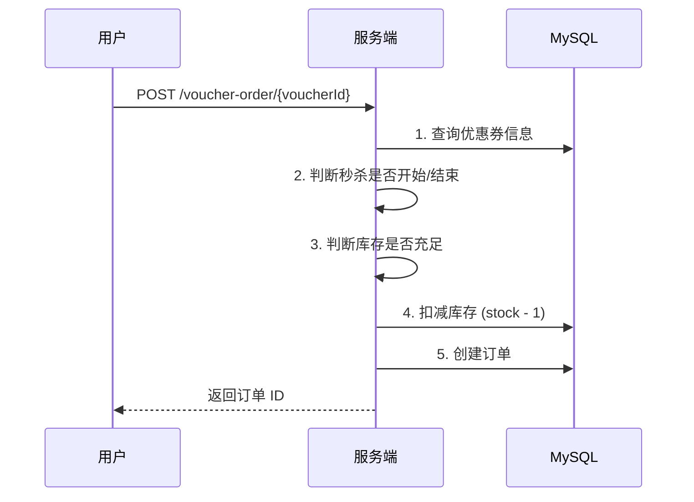
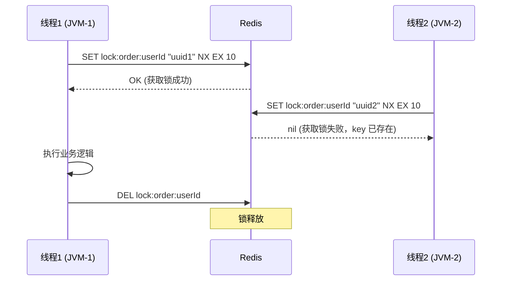
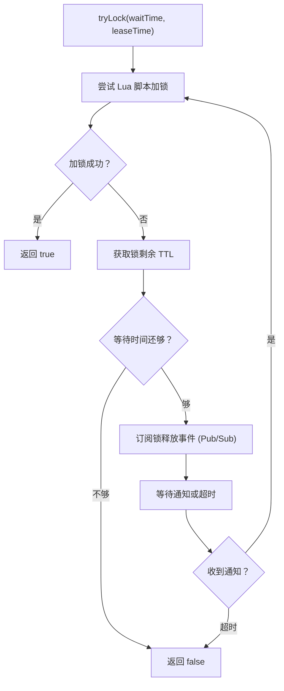
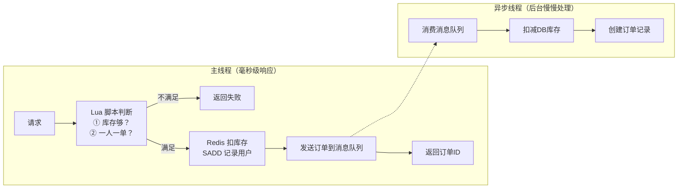
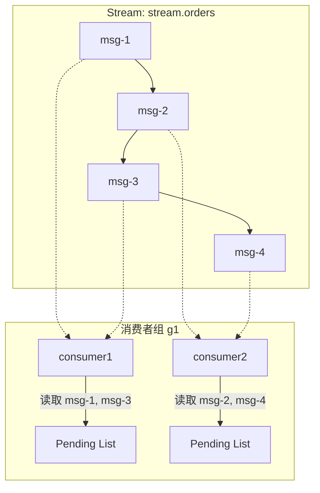
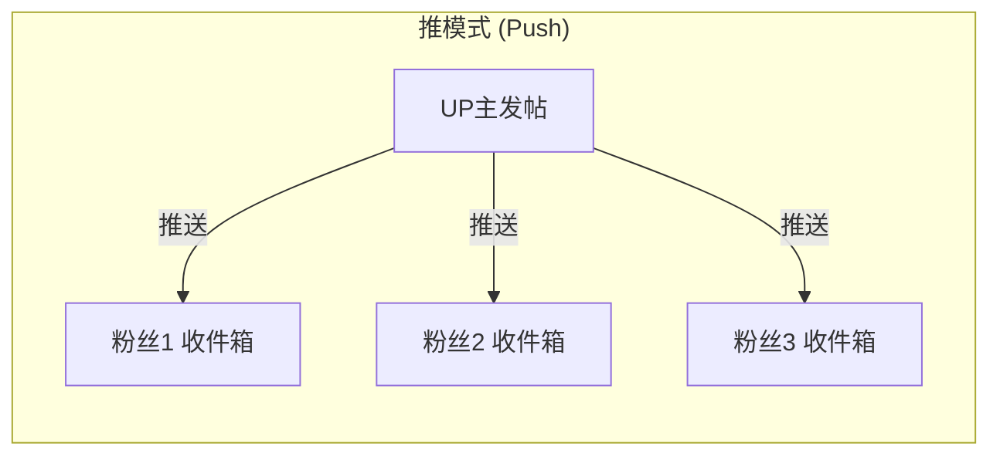
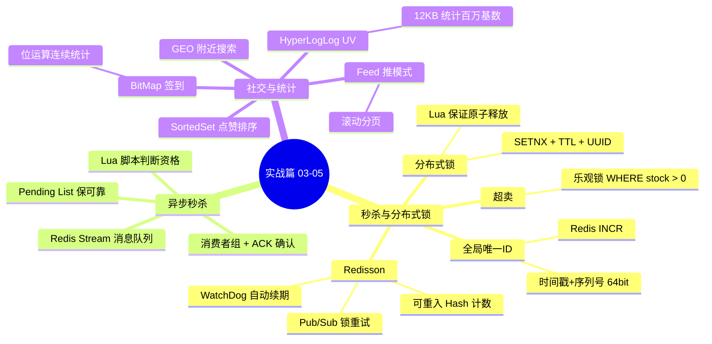

## 目录
- [[#第03章 优惠券秒杀与分布式锁]]
	- [[#全局唯一 ID 生成器]]
	- [[#秒杀下单基本实现]]
	- [[#超卖问题与乐观锁]]
	- [[#一人一单与集群并发问题]]
	- [[#分布式锁基本原理]]
	- [[#Redis 分布式锁实现]]
	- [[#Redis 分布式锁的缺陷]]
	- [[#Redisson 分布式锁]]
	- [[#Redisson 锁重试与 WatchDog 机制]]
- [[#第04章 消息队列与异步秒杀]]
	- [[#异步秒杀优化思路]]
	- [[#Redis 消息队列方案对比]]
	- [[#基于 List 的消息队列]]
	- [[#基于 PubSub 的消息队列]]
	- [[#基于 Stream 的消息队列]]
	- [[#Stream 消费者组模式]]
- [[#第05章 社交、地理位置与统计功能]]
	- [[#点赞功能（SortedSet 实现）]]
	- [[#Feed 流方案分析]]
	- [[#GEO 地理位置]]
	- [[#BitMap 用户签到]]
	- [[#HyperLogLog UV 统计]]
	- [[#高级数据结构对比总结]]

---

## 第03章 优惠券秒杀与分布式锁

### 全局唯一 ID 生成器

秒杀优惠券生成的订单需要全局唯一 ID。为什么不用数据库自增？

```
数据库自增的问题:

1. ID 规律太明显 → 用户可以猜出订单量（商业机密）
2. 单表自增 → 分库分表后 ID 冲突
3. 数据量大时自增空间不够
```

**Redis 全局 ID 生成器设计**：

```
64 位 ID 结构:

┌──────┬────────────────────────┬──────────────────────┐
│ 符号位 │   时间戳 (31 bit)       │   序列号 (32 bit)     │
│ 0     │   秒级，约可用 69 年     │   每秒最多 2^32 个     │
└──────┴────────────────────────┴──────────────────────┘
  1 bit        31 bit                   32 bit

时间戳 = 当前秒 - 起始秒（如 2022-01-01 00:00:00）
序列号 = Redis INCR 自增（按天为 key，方便统计）
```

```java
@Component
public class RedisIdWorker {
    // 起始时间戳: 2022-01-01 00:00:00
    private static final long BEGIN_TIMESTAMP = 1640995200L;
    private static final int COUNT_BITS = 32;

    @Autowired
    private StringRedisTemplate stringRedisTemplate;

    public long nextId(String keyPrefix) {
        // 1. 生成时间戳
        LocalDateTime now = LocalDateTime.now();
        long nowSecond = now.toEpochSecond(ZoneOffset.UTC);
        long timestamp = nowSecond - BEGIN_TIMESTAMP;

        // 2. 生成序列号（按天分 key，避免单 key 超过 2^32）
        String date = now.format(DateTimeFormatter.ofPattern("yyyy:MM:dd"));
        long count = stringRedisTemplate.opsForValue()
                .increment("icr:" + keyPrefix + ":" + date);  // INCR 原子自增

        // 3. 拼接：时间戳左移32位 | 序列号
        return timestamp << COUNT_BITS | count;
    }
}
```

> [!note] 对比其他 ID 方案
> | 方案 | 优点 | 缺点 |
> |------|------|------|
> | DB 自增 | 简单 | 单点瓶颈、规律可猜、分库分表冲突 |
> | UUID | 无需中心节点 | 无序（B+树页分裂）、太长（36字符） |
> | **Redis INCR** | 有序递增、高性能 | 依赖 Redis |
> | Snowflake | 有序、不依赖外部 | 时钟回拨问题 |
>
> Redis INCR 方案是 Snowflake 思想的简化版，按天分 key 还方便统计每日订单量

> [!note] DB 补充 —— 为什么 UUID 会导致 B+树性能下降？
>
> **UUID 是无序随机字符串**，用作 MySQL 主键时会造成严重性能问题：
>
> ```
> B+树的有序插入（自增ID）:
>
> 当前叶节点: [1][2][3][4][5] → 插入 6 → [1][2][3][4][5][6]
>             顺序插入，总是追加到末尾，非常高效
>
> B+树的随机插入（UUID）:
>
> 当前叶节点: [id_A][id_C][id_E] → 插入 id_B → [id_A][id_B][id_C][id_E]
>             随机插入，需要移动数据，且可能触发"页分裂"
>
> 页分裂过程:
>   叶节点满了: [id_A][id_B][id_C][id_D][id_E]（16KB 页满）
>   → 插入 id_BB → 找到正确位置 → 页空间不够 → 分裂为两个页
>   → 上层非叶节点也需要更新 → 可能级联分裂
>   → 大量随机 IO + 数据碎片
> ```
>
> 这就是为什么 MySQL 强烈推荐使用**自增整数**作主键，而不是 UUID。
> Snowflake/Redis INCR 方案生成的 64 位整数是**时间有序**的，在 B+树中表现接近自增，没有页分裂问题。

> [!note] 补充 —— Snowflake 算法结构与时钟回拨问题
>
> ```
> 雪花算法（Twitter Snowflake）64 位 ID 结构:
>
> ┌──────┬────────────────────────────┬───────────┬───────────────┐
> │ 符号位 │      时间戳 (41 bit)        │ 机器ID (10 bit)│  序列号 (12 bit) │
> │  0   │  毫秒级，可用约 69 年       │ 最多1024台│  每毫秒 4096 个  │
> └──────┴────────────────────────────┴───────────┴───────────────┘
>
> Redis 方案（本项目）vs Snowflake 对比:
>
> ┌──────┬────────────────────────────┬──────────────────────────┐
> │ 符号位 │      时间戳 (31 bit)        │      序列号 (32 bit)      │
> │  0   │  秒级，可用约 69 年         │  每秒最多 42 亿个（Redis） │
> └──────┴────────────────────────────┴──────────────────────────┘
>
> 最大区别：Redis 方案序列号由 Redis INCR 保证唯一，Snowflake 序列号由机器内存自增保证唯一
> ```
>
> **时钟回拨问题**：如果服务器时钟被 NTP 校正为更早的时间，Snowflake 会生成重复 ID！
>
> 解决方案：
> 1. 检测到时钟回拨 → 等待到上一个时间戳（适合回拨小于 5ms）
> 2. 记录最后生成 ID 的时间戳，拒绝回拨期间的请求并报警（适合大回拨）
> 3. 使用 Redis INCR 代替（Redis 不依赖本地时钟，天然避免此问题）

### 秒杀下单基本实现



```java
@Override
public Result seckillVoucher(Long voucherId) {
    // 1. 查询优惠券
    SeckillVoucher voucher = seckillVoucherService.getById(voucherId);
    // 2. 判断时间
    if (voucher.getBeginTime().isAfter(LocalDateTime.now())) {
        return Result.fail("秒杀尚未开始");
    }
    if (voucher.getEndTime().isBefore(LocalDateTime.now())) {
        return Result.fail("秒杀已经结束");
    }
    // 3. 判断库存
    if (voucher.getStock() < 1) {
        return Result.fail("库存不足");
    }
    // 4. 扣减库存
    boolean success = seckillVoucherService.update()
            .setSql("stock = stock - 1")
            .eq("voucher_id", voucherId)
            .update();
    if (!success) {
        return Result.fail("库存不足");
    }
    // 5. 创建订单
    VoucherOrder order = new VoucherOrder();
    order.setId(redisIdWorker.nextId("order"));
    order.setUserId(UserHolder.getUser().getId());
    order.setVoucherId(voucherId);
    save(order);
    return Result.ok(order.getId());
}
```

### 超卖问题与乐观锁

上面的代码有**超卖**风险：

```
超卖问题时间线:

库存 stock = 1（只剩最后一件）

线程A: 查询 stock=1 ✅ 有货
线程B: 查询 stock=1 ✅ 有货     ← 并发读到同一个值
线程A: UPDATE stock=0 → 成功
线程B: UPDATE stock=-1 → 成功   ← 超卖了！stock 变成 -1
```

**解决：乐观锁（CAS 思想）**

```java
// 方案一：CAS 精确匹配版（成功率低）
boolean success = seckillVoucherService.update()
        .setSql("stock = stock - 1")
        .eq("voucher_id", voucherId)
        .eq("stock", voucher.getStock())  // WHERE stock = 查询时的值
        .update();
// 问题：stock=100 时 100 个线程同时读到 100，只有 1 个能成功，99 个失败
// 明明有库存却买不了 → 成功率太低

// 方案二：CAS 范围判断版（推荐）
boolean success = seckillVoucherService.update()
        .setSql("stock = stock - 1")
        .eq("voucher_id", voucherId)
        .gt("stock", 0)  // WHERE stock > 0 即可 ← 变化点
        .update();
// 只要库存大于 0 就允许扣减 → 成功率大幅提升
```

> [!tip] 类比 —— CAS 思想贯穿 JUC 与 Redis
> 上面的 `WHERE stock > 0` 和 JUC 中 AtomicInteger 的 CAS 自旋是同一思想：
> - JUC CAS：`compareAndSet(expected, newValue)` → CPU 级原子操作
> - MySQL 乐观锁：`UPDATE ... WHERE stock > 0` → 行锁 + 版本判断
> - 区别：MySQL 乐观锁不需要自旋重试（`stock > 0` 这个条件足够宽松）

### 一人一单与集群并发问题

秒杀还需要限制**一个用户只能下一单**。单机用 `synchronized` 可以解决：

```java
// 单机方案：对用户 ID 加锁
Long userId = UserHolder.getUser().getId();
synchronized (userId.toString().intern()) {  // intern() 保证同一用户 ID 用同一个锁对象
    // 查询订单是否已存在
    int count = query().eq("user_id", userId).eq("voucher_id", voucherId).count();
    if (count > 0) {
        return Result.fail("你已经购买过了");
    }
    // 扣库存、创建订单...
}
```

**但集群环境下失效了**：

```
集群下 synchronized 失效:

         Nginx (负载均衡)
              │
     ┌────────┼────────┐
     ▼        ▼        ▼
  JVM-1     JVM-2     JVM-3
  ┌─────┐  ┌─────┐  ┌─────┐
  │锁监视器│  │锁监视器│  │锁监视器│  ← 每个 JVM 有自己独立的锁
  └─────┘  └─────┘  └─────┘

用户 A 的请求1 → JVM-1 → 获取锁成功 ✅
用户 A 的请求2 → JVM-2 → 获取锁成功 ✅ ← 不同 JVM 的锁互不影响！
→ 同一用户下了两单 ❌
```

> [!warning] 核心问题
> `synchronized` 是 **JVM 级别** 的锁，只对同一个 JVM 进程内的线程有效
> 集群 = 多个 JVM 进程 → 需要 **跨进程** 的分布式锁

### 分布式锁基本原理

**分布式锁**：多个进程（JVM）可见且互斥的锁。

```
分布式锁必须满足的条件:

┌──────────────────────────────────────────────────┐
│  ① 互斥性：同一时刻只有一个线程能持有锁              │
│  ② 高可用：锁服务不能单点故障                       │
│  ③ 高性能：加锁/解锁操作要快                        │
│  ④ 安全性：锁超时要自动释放（防死锁）；锁只能被持有者释放 │
└──────────────────────────────────────────────────┘
```

| 实现方式 | 互斥机制 | 优点 | 缺点 |
|---------|---------|------|------|
| **MySQL** | `SELECT ... FOR UPDATE` 行锁 | 强一致（ACID） | 性能低（磁盘 IO） |
| **Redis** | `SETNX` | 高性能 | 不可重入（默认）、主从切换可能丢锁 |
| **ZooKeeper** | 临时顺序节点 + Watch | 强一致、可重入 | 性能中等 |

> [!note] DB 补充 —— MySQL 分布式锁的实现原理
>
> MySQL 的 `SELECT ... FOR UPDATE` 使用 InnoDB 的**行锁（Row Lock）**：
>
> ```sql
> -- 获取分布式锁（锁定某一行或插入一行）
> BEGIN;
> SELECT id FROM distributed_lock
>   WHERE lock_name = 'order:1001' FOR UPDATE;
> -- 如果这行被其他事务锁住，当前事务会阻塞等待
>
> -- 释放锁
> COMMIT;  -- 事务提交，行锁自动释放
> ```
>
> **MySQL 锁的问题**：
> - 行锁需要磁盘 IO（读取数据页）
> - 锁等待时，线程阻塞（等待队列）
> - 超时后会抛出 `LockWaitTimeout` 异常，需要应用层处理重试
> - 数据库宕机 → 锁全部消失（但这也意味着不会死锁）
>
> **ZooKeeper 分布式锁原理**：
>
> ```
> ZooKeeper 临时顺序节点实现公平锁:
>
> 节点: /lock/order:1001/
>   ├─ node-0000000001  ← 线程A（持有锁，序号最小）
>   ├─ node-0000000002  ← 线程B（监听 node-1）
>   └─ node-0000000003  ← 线程C（监听 node-2）
>
> 线程A 释放锁（删除 node-1）
>   → ZooKeeper Watch 通知线程B
>   → 线程B 发现自己序号最小 → 获取锁 ✅
>
> 特点：天然公平（FIFO顺序），不会饥饿
> ZooKeeper 的 CP 模型保证：写入临时节点是强一致的
> ```
>
> **三种方案对比总结**：
> ```
> 性能排名: Redis > ZooKeeper >> MySQL
> 一致性排名: ZooKeeper ≥ MySQL > Redis（主从异步复制下）
> 功能完整性: ZooKeeper ≈ Redisson > 裸Redis > MySQL
> 推荐: 一般业务用 Redisson（Redis），强一致性要求用 ZooKeeper（如分布式选主）
> ```

### Redis 分布式锁实现



```java
public class SimpleRedisLock implements ILock {
    private StringRedisTemplate stringRedisTemplate;
    private String name;  // 业务名称
    
    // 用 UUID 区分不同 JVM 的线程（防止误删别人的锁）
    private static final String ID_PREFIX = UUID.randomUUID().toString(true) + "-";
    
    @Override
    public boolean tryLock(long timeoutSec) {
        String threadId = ID_PREFIX + Thread.currentThread().getId();
        Boolean success = stringRedisTemplate.opsForValue()
                .setIfAbsent("lock:" + name, threadId, timeoutSec, TimeUnit.SECONDS);
        return Boolean.TRUE.equals(success);
    }
    
    @Override
    public void unlock() {
        String threadId = ID_PREFIX + Thread.currentThread().getId();
        String currentId = stringRedisTemplate.opsForValue().get("lock:" + name);
        // 只有锁的持有者才能释放
        if (threadId.equals(currentId)) {
            stringRedisTemplate.delete("lock:" + name);
        }
    }
}
```

> [!warning] 避坑指南 —— 为什么需要 UUID + 线程ID？
> 如果只存一个固定值（如 "1"），会出现**误删别人锁**的情况：
> ```
> 线程1: 获取锁 → 业务执行太慢 → 锁超时自动释放
> 线程2: 获取锁成功（线程1的锁已过期）→ 正在执行
> 线程1: 业务终于执行完 → DEL 锁 → 删掉了线程2的锁！❌
> 线程3: 获取锁成功 → 线程2和线程3同时执行 → 并发问题 💥
> ```
> **UUID（区分JVM）+ ThreadId（区分线程）** = 唯一标识锁的持有者

### Redis 分布式锁的缺陷

即使加了 UUID 校验，`unlock()` 中的 **判断 + 删除** 不是原子操作：

```
非原子操作的时序问题:

线程1:
  1. GET lock → "uuid1-1"  (是自己的锁 ✅)
  2. 准备 DEL...
  ← 发生 Full GC / 网络延迟 / 线程调度 →
  ← 此时锁 TTL 到期，自动释放 →
  
线程2:
  3. SET lock "uuid2-1" NX → 成功
  
线程1 (恢复):
  4. DEL lock → 删掉了线程2的锁！❌
```

**解决**：用 **Lua 脚本** 保证判断 + 删除的原子性：

```lua
-- unlock.lua
-- KEYS[1] = 锁的 key
-- ARGV[1] = 当前线程标识
if (redis.call('GET', KEYS[1]) == ARGV[1]) then
    return redis.call('DEL', KEYS[1])
end
return 0
```

```java
// Java 调用 Lua 脚本
private static final DefaultRedisScript<Long> UNLOCK_SCRIPT;
static {
    UNLOCK_SCRIPT = new DefaultRedisScript<>();
    UNLOCK_SCRIPT.setLocation(new ClassPathResource("unlock.lua"));
    UNLOCK_SCRIPT.setResultType(Long.class);
}

@Override
public void unlock() {
    stringRedisTemplate.execute(
        UNLOCK_SCRIPT,
        Collections.singletonList("lock:" + name),  // KEYS
        ID_PREFIX + Thread.currentThread().getId()   // ARGV
    );
}
```

> [!note] 为什么 Lua 脚本是原子的？
> Redis 是单线程执行命令的。一个 Lua 脚本在执行期间，不会被其他命令打断
> Lua 脚本 = Redis 的事务替代品（比 `MULTI/EXEC` 更灵活，支持条件判断）
> 类比：Lua 脚本就像数据库的 **存储过程**，在服务端原子执行

**即使用了 Lua，自实现的 Redis 锁仍有局限**：

```
自实现 Redis 锁的缺陷清单:

❌ 不可重入：同一线程不能多次获取同一把锁（递归调用会死锁）
❌ 不可重试：获取锁失败直接返回，没有等待重试机制
❌ 超时释放风险：业务执行时间 > 锁 TTL → 锁提前释放
❌ 主从一致性：主节点加锁后宕机，从节点晋升但没有锁数据
```

### Redisson 分布式锁

**Redisson** 是一个功能完善的 Redis 分布式工具包，完美解决了上面所有问题：

```java
// 1. 配置
@Configuration
public class RedissonConfig {
    @Bean
    public RedissonClient redissonClient() {
        Config config = new Config();
        config.useSingleServer()
              .setAddress("redis://127.0.0.1:6379")
              .setPassword("password");
        return Redisson.create(config);
    }
}

// 2. 使用 Redisson 分布式锁
@Autowired
private RedissonClient redissonClient;

public Result seckillVoucher(Long voucherId) {
    // ...省略校验逻辑...
    
    Long userId = UserHolder.getUser().getId();
    RLock lock = redissonClient.getLock("lock:order:" + userId);
    
    // tryLock(等待时间, 锁超时时间, 时间单位)
    // waitTime=-1 表示不等待，获取失败立刻返回
    boolean isLock = lock.tryLock();
    if (!isLock) {
        return Result.fail("不允许重复下单");
    }
    try {
        // 业务逻辑...
        return createVoucherOrder(voucherId);
    } finally {
        lock.unlock();
    }
}
```

### Redisson 锁重试与 WatchDog 机制

#### 可重试锁（基于 Pub/Sub）



> [!tip] 为什么用 Pub/Sub 而不是 Sleep 轮询？
> Sleep 轮询浪费 CPU（忙等），而 Pub/Sub 是**事件驱动**：
> - 获取锁失败后 → 订阅 `redisson_lock__channel:{lockName}` 频道
> - 前一个持锁者释放锁时 → 发布一条消息到该频道
> - 等待者收到消息 → 立即重试
> 类比：轮询 = 不停打电话问"好了没？"；Pub/Sub = 留个电话号码，好了叫我

#### WatchDog 自动续期

**问题**：如果业务执行时间超过 锁的 TTL 怎么办？锁提前释放 → 并发问题。

```
WatchDog（看门狗）机制:

加锁成功后，如果没有指定 leaseTime:
  → Redisson 启动一个后台定时任务（WatchDog）
  → 每隔 TTL/3 时间（默认 10 秒）自动续期
  → 只要持有锁的线程还活着，锁就不会过期

Timeline:
t=0s   : 获取锁，TTL=30s
t=10s  : WatchDog 续期 → TTL 重置为 30s
t=20s  : WatchDog 续期 → TTL 重置为 30s
t=25s  : 业务执行完毕 → unlock() → 取消 WatchDog
```

```
Redisson 锁的 Redis 数据结构 (Hash):

Key: lock:order:1001
Type: Hash

┌───────────────┬─────────┐
│ Field          │ Value   │
├───────────────┼─────────┤
│ uuid:threadId │   1     │ ← 重入计数
└───────────────┴─────────┘

首次加锁:   HINCRBY lock:order:1001 "uuid:1" 1  → 重入次数=1
重入加锁:   HINCRBY lock:order:1001 "uuid:1" 1  → 重入次数=2
首次解锁:   HINCRBY lock:order:1001 "uuid:1" -1 → 重入次数=1
再次解锁:   HINCRBY lock:order:1001 "uuid:1" -1 → 重入次数=0 → DEL
```

> [!note] OS 补充 —— 可重入锁
> 可重入锁（Reentrant Lock）允许同一线程多次获取同一把锁而不死锁：
> - Java 的 `synchronized` 和 `ReentrantLock` 都是可重入的
> - 通过**计数器**实现：加锁 +1，解锁 -1，计数归 0 时真正释放
> - Redisson 用 Hash 的 field （UUID:ThreadID）+ value（重入次数）模拟了这个语义

> [!warning] WatchDog 注意事项
> 1. **只有不指定 leaseTime 时** WatchDog 才生效
>    - `lock.tryLock()` → ✅ WatchDog 启动
>    - `lock.tryLock(1, 10, SECONDS)` → ❌ 明确指定了 10 秒，不启动 WatchDog
> 2. 如果持锁线程宕机，WatchDog 也随之消亡 → 锁在 TTL 后自动释放 → 不会死锁

> [!question] 深度思考 —— Redis 主从架构下分布式锁的脑裂问题？
>
> **Q：如果 Redis Master 加锁后宕机，Slave 升为 Master，锁数据丢了怎么办？**
>
> **A：这是 Redis 分布式锁的固有缺陷，Redisson 提供了 RedLock 算法解决此问题。**
>
> ```
> 主从切换导致锁丢失:
>
> t=0: 线程A 在 Master 上加锁成功: SET lock:order "uuid-A" NX EX 30
> t=1: Master → Slave 异步复制还未完成 → Master 宕机！
> t=2: Slave 升为新 Master（未同步 lock 数据）
> t=3: 线程B 在新 Master 上加锁: SET lock:order "uuid-B" NX → 成功！
>      线程A 和线程B 同时持有"同一把锁" → 并发问题 💥
> ```
>
> **Redisson MultiLock（红锁简化版）**：
> ```java
> // 在 N 个独立的 Redis 实例上同时加锁
> // 只有超过半数（N/2 + 1）加锁成功，才认为获取锁成功
>
> RLock lock1 = redissonClient1.getLock("order:1001");
> RLock lock2 = redissonClient2.getLock("order:1001");
> RLock lock3 = redissonClient3.getLock("order:1001");
>
> RedissonMultiLock multiLock = new RedissonMultiLock(lock1, lock2, lock3);
> multiLock.lock();
> // 即使某个 Redis 节点宕机，其他节点的锁仍然有效
> ```
>
> **RedLock 的争议**：
> - Martin Kleppmann（《DDIA》作者）认为 RedLock 在系统时钟不精准或 GC 暂停时仍不安全
> - antirez（Redis 作者）反驳：RedLock 对于大多数应用场景已经足够安全
> - **工程结论**：对强一致性要求极高的场景（金融交易），用 ZooKeeper；一般业务用 Redisson 够了

---

## 第04章 消息队列与异步秒杀

### 异步秒杀优化思路

之前的秒杀流程是**同步的**：判断资格 → 扣库存 → 创建订单，全部在一个线程中完成，耗时长。

```
同步秒杀的性能瓶颈:

用户请求 ─→ [判断资格] ─→ [扣减库存(DB)] ─→ [创建订单(DB)] ─→ 返回
              快(ms)         慢(10ms+)         慢(10ms+)
              
总耗时 ≈ 20ms+，高并发时 DB 成为瓶颈
```

**优化思路：判断资格交给 Redis（快），下单操作异步处理（慢）**



```lua
-- seckill.lua: 在 Redis 中判断秒杀资格
-- KEYS: 无
-- ARGV[1] = voucherId, ARGV[2] = userId, ARGV[3] = orderId

local voucherId = ARGV[1]
local userId = ARGV[2]
local orderId = ARGV[3]

local stockKey = 'seckill:stock:' .. voucherId   -- 库存 key
local orderKey = 'seckill:order:' .. voucherId    -- 已下单用户集合 key

-- 1. 判断库存
if (tonumber(redis.call('GET', stockKey)) <= 0) then
    return 1  -- 库存不足
end
-- 2. 判断一人一单
if (redis.call('SISMEMBER', orderKey, userId) == 1) then
    return 2  -- 重复下单
end
-- 3. 资格通过 → 扣库存、记录用户
redis.call('INCRBY', stockKey, -1)
redis.call('SADD', orderKey, userId)
-- 4. 发送到 Stream 消息队列
redis.call('XADD', 'stream.orders', '*', 
    'userId', userId, 'voucherId', voucherId, 'id', orderId)
return 0  -- 成功
```

> [!tip] 为什么把判断逻辑放到 Lua 脚本？
> 判断库存 + 判断一人一单 + 扣库存 这三步必须**原子执行**
> 如果分开执行，并发时会出现：线程A判断库存够 → 线程B判断库存够 → 都扣减 → 超卖
> Lua 脚本在 Redis 单线程中一次性执行完，天然原子

### Redis 消息队列方案对比

| 方案 | 实现方式 | 持久化 | 消息确认 | 适用场景 |
|------|---------|--------|---------|---------|
| **List** | LPUSH + BRPOP | ✅ | ❌ 弹出即丢 | 最简单的队列 |
| **PubSub** | PUBLISH + SUBSCRIBE | ❌ | ❌ | 广播通知 |
| **Stream** | XADD + XREADGROUP | ✅ | ✅ XACK | 生产级消息队列 |

### 基于 List 的消息队列

```bash
# 生产者
LPUSH queue:orders '{"userId":1001,"voucherId":1}'

# 消费者（阻塞等待）
BRPOP queue:orders 0     # 0 = 永久阻塞直到有消息
```

```
List 队列的缺陷:

✅ 持久化（Redis RDB/AOF）
✅ 有序
❌ 没有消息确认：BRPOP 弹出消息后如果消费失败，消息就丢了
❌ 只能单消费者：一条消息只能被一个消费者 BRPOP
❌ 没有消息回溯：消费过的消息无法重新读取
```

### 基于 PubSub 的消息队列

```bash
# 消费者先订阅
SUBSCRIBE channel:orders

# 生产者发布
PUBLISH channel:orders '{"userId":1001,"voucherId":1}'
```

```
PubSub 的缺陷:

✅ 支持多消费者（广播模式）
❌ 不持久化：消息发布时如果没有订阅者，消息直接丢弃
❌ 没有消息堆积能力：消费者离线期间的消息全部丢失
❌ 消息缓冲区有上限：消费太慢会被强制断开
```

### 基于 Stream 的消息队列

Stream 是 Redis 5.0 引入的数据类型，专门为消息队列设计：

```bash
# 发送消息（* 表示自动生成消息 ID）
XADD stream.orders * userId 1001 voucherId 1
# 返回: "1680000000000-0"  (时间戳-序号)

# 读取消息（单消费者模式）
XREAD COUNT 1 BLOCK 2000 STREAMS stream.orders $
# COUNT 1: 每次读 1 条
# BLOCK 2000: 阻塞 2 秒等待
# $: 只读最新消息（0 = 从头读）
```

```
Stream 内部结构:

stream.orders:
┌─────────────────────┬───────────────────┬──────────────────┐
│ ID: 1680000000000-0 │ ID: 1680000000001-0 │ ID: 1680000000002-0 │
│ userId: 1001        │ userId: 1002        │ userId: 1003        │
│ voucherId: 1        │ voucherId: 2        │ voucherId: 1        │
└─────────────────────┴───────────────────┴──────────────────┘
                        ↑
                     消息持久化，可回溯
```

### Stream 消费者组模式

消费者组（Consumer Group）是 Stream 的核心能力，类似 Kafka 的消费者组：

```bash
# 创建消费者组
XGROUP CREATE stream.orders g1 0
# g1: 组名
# 0: 从队列头开始消费（$ = 从最新消息开始）

# 消费者读取消息（组内每条消息只会被一个消费者处理）
XREADGROUP GROUP g1 consumer1 COUNT 1 BLOCK 2000 STREAMS stream.orders >
# >: 读取未被消费的新消息

# 确认消息（处理成功后必须 ACK）
XACK stream.orders g1 1680000000000-0
```



**Pending List（待确认列表）** 是消息可靠性的关键：

```
消息确认机制（ACK）:

1. 消费者读取消息 → 消息进入该消费者的 Pending List
2. 消费者处理成功 → XACK → 消息从 Pending List 移除
3. 消费者处理失败/宕机 → 消息留在 Pending List
4. 可以用 XPENDING 查看未确认消息 → 重新处理

这就是"至少一次投递（At Least Once Delivery）"的保证
```

```java
// Java 中基于 Stream 消费者组的异步秒杀处理
while (true) {
    try {
        // 1. 读取新消息 XREADGROUP GROUP g1 c1 COUNT 1 BLOCK 2000 STREAMS stream.orders >
        List<MapRecord<String, Object, Object>> records = stringRedisTemplate.opsForStream()
            .read(Consumer.from("g1", "c1"),
                  StreamReadOptions.empty().count(1).block(Duration.ofSeconds(2)),
                  StreamOffset.create("stream.orders", ReadOffset.lastConsumed()));
        
        if (records == null || records.isEmpty()) {
            continue;  // 没有消息，继续等待
        }
        
        // 2. 解析并处理消息
        MapRecord<String, Object, Object> record = records.get(0);
        Map<Object, Object> values = record.getValue();
        VoucherOrder order = BeanUtil.fillBeanWithMap(values, new VoucherOrder(), true);
        handleVoucherOrder(order);  // 扣减DB库存 + 创建订单
        
        // 3. ACK 确认
        stringRedisTemplate.opsForStream()
            .acknowledge("stream.orders", "g1", record.getId());
            
    } catch (Exception e) {
        // 4. 异常处理：从 Pending List 读取未确认消息重新处理
        handlePendingMessages();
    }
}
```

> [!question] Stream vs Kafka/RabbitMQ？
> Redis Stream 适合**轻量级**消息队列场景：
> - 消息量不是特别大（百万级/天）
> - 不需要复杂的路由规则
> - 已经在用 Redis，不想引入新的中间件
>
> 如果需要极高吞吐 + 消息回放 + 多分区 → Kafka
> 如果需要复杂路由 + 死信队列 + 延迟消息 → RabbitMQ

> [!note] DB 补充 —— 消息投递语义（三个级别）
>
> 消息队列系统有三种投递语义，对应不同的可靠性需求：
>
> ```
> ┌───────────────────────────────────────────────────────────────────┐
> │  At Most Once（最多一次）                                          │
> │  消息可能丢失，但不会重复                                           │
> │  实现：发完即忘，不等确认                                           │
> │  场景：日志收集（偶尔丢一条可接受）                                  │
> ├───────────────────────────────────────────────────────────────────┤
> │  At Least Once（至少一次）← Redis Stream + XACK 实现的级别         │
> │  消息不会丢失，但可能重复                                           │
> │  实现：消费者确认（ACK）后才删除，未确认则重试                        │
> │  场景：订单处理（重复处理比丢消息危害小，消费者做幂等）               │
> ├───────────────────────────────────────────────────────────────────┤
> │  Exactly Once（精确一次）← 最难实现                                │
> │  消息既不丢失也不重复                                               │
> │  实现：分布式事务 / 幂等 ID + 去重表                                │
> │  场景：金融转账（Kafka 事务 Producer 支持）                         │
> └───────────────────────────────────────────────────────────────────┘
> ```
>
> **Redis Stream 实现 Exactly Once 的思路**：
> 消费者处理消息时，先在 DB 中检查该订单 ID 是否已存在（幂等校验）：
> ```java
> void handleVoucherOrder(VoucherOrder order) {
>     // 幂等校验：订单 ID 已存在则跳过
>     if (voucherOrderService.getById(order.getId()) != null) {
>         log.warn("重复消费，订单已存在: {}", order.getId());
>         return;
>     }
>     // 正常扣库存 + 创建订单...
> }
> ```
>
> 这样即使消息被重复投递，也不会产生重复订单。这是分布式系统中**幂等设计**的标准做法。

---

## 第05章 社交、地理位置与统计功能

### 点赞功能（SortedSet 实现）

**需求**：用户可以给文章点赞/取消点赞，按点赞时间排序显示，每人只能点一次。

```
为什么用 SortedSet 而不是 Set？

Set:  SADD / SREM / SISMEMBER → 可以实现点赞/取消/判重
                                 ❌ 但无法按点赞时间排序

SortedSet: score = 点赞时间戳 → ✅ 有序 + 唯一
```

```java
// 点赞 / 取消点赞
@Override
public Result likeBlog(Long id) {
    Long userId = UserHolder.getUser().getId();
    String key = BLOG_LIKED_KEY + id;  // "blog:liked:{blogId}"
    
    // 1. 判断是否已点赞
    Double score = stringRedisTemplate.opsForZSet().score(key, userId.toString());
    
    if (score == null) {
        // 2. 未点赞 → 数据库点赞数+1 + Redis ZADD
        boolean success = update().setSql("liked = liked + 1").eq("id", id).update();
        if (success) {
            stringRedisTemplate.opsForZSet()
                .add(key, userId.toString(), System.currentTimeMillis());
        }
    } else {
        // 3. 已点赞 → 取消：数据库-1 + Redis ZREM
        boolean success = update().setSql("liked = liked - 1").eq("id", id).update();
        if (success) {
            stringRedisTemplate.opsForZSet().remove(key, userId.toString());
        }
    }
    return Result.ok();
}

// 查询点赞 Top5 用户（按时间排序）
@Override
public Result queryBlogLikes(Long id) {
    String key = BLOG_LIKED_KEY + id;
    // ZRANGE key 0 4 → 取 score 最小（最早点赞）的 5 个
    Set<String> top5 = stringRedisTemplate.opsForZSet().range(key, 0, 4);
    // 转换为用户信息列表...
    return Result.ok(userDTOList);
}
```

### Feed 流方案分析

**Feed 流**：关注的人发布内容后，自动推送到你的主页，类似朋友圈/微博。

```
Feed 流的两种模式:

┌─────────────────────────────────────────────────────┐
│  Timeline 模式（按时间排序）                          │
│                                                     │
│  ① 拉模式 (Pull / 读扩散)                           │
│     发布者: 写入自己的发件箱                           │  
│     读取者: 主动从所有关注人的发件箱拉取 + 排序          │
│     ✅ 写简单  ❌ 读复杂（多路归并排序）                 │
│     适合：粉丝多的大V（如微博）                        │
│                                                     │
│  ② 推模式 (Push / 写扩散)                            │
│     发布者: 直接推送到每个粉丝的收件箱                  │
│     读取者: 直接读自己的收件箱（已排好序）               │
│     ✅ 读简单  ❌ 写放大（粉丝多时推送量巨大）           │
│     适合：粉丝少的普通用户                             │
│                                                     │
│  ③ 推拉结合                                         │
│     普通用户用推模式，大V用拉模式                      │
│     微博、Twitter 的真实实现方式                      │
└─────────────────────────────────────────────────────┘
```



**项目中使用推模式**：发布 Blog 时推送到粉丝的 SortedSet 收件箱（score = 时间戳）：

```java
// 发布 Blog 时推送到粉丝收件箱
@Override
public Result saveBlog(Blog blog) {
    Long userId = UserHolder.getUser().getId();
    blog.setUserId(userId);
    save(blog);  // 保存到 DB
    
    // 查询所有粉丝
    List<Follow> follows = followService.query().eq("follow_user_id", userId).list();
    for (Follow follow : follows) {
        Long fansId = follow.getUserId();
        String key = FEED_KEY + fansId;  // "feed:{fansId}"
        // ZADD feed:{fansId} {timestamp} {blogId}
        stringRedisTemplate.opsForZSet()
            .add(key, blog.getId().toString(), System.currentTimeMillis());
    }
    return Result.ok(blog.getId());
}
```

> [!tip] Feed 流的分页问题 —— 滚动分页
> 传统分页（LIMIT offset, count）在 Feed 流中会出问题：
> 新数据不断插入 → 页码偏移 → 读到重复内容
>
> 解决：**滚动分页（Scroll Pagination）**
> 用上一页最后一条的 score（时间戳）作为下一页的起点：
> `ZREVRANGEBYSCORE key maxScore minScore LIMIT offset count`
> 其中 maxScore = 上一页最小的 score，offset = 与该 score 相同的元素数量

### GEO 地理位置

GEO 是 Redis 3.2+ 的功能，底层基于 **SortedSet**，score 存储的是 **GeoHash** 编码值。

```bash
# 添加地理位置
GEOADD shop:geo 116.397128 39.916527 "shop:1"    # 天安门
GEOADD shop:geo 116.403875 39.915405 "shop:2"    # 王府井

# 计算两点距离
GEODIST shop:geo "shop:1" "shop:2" km
# 返回: "0.5956"  (约 0.6 公里)

# 搜索附近（6.2+ 新命令）
GEOSEARCH shop:geo FROMLONLAT 116.397128 39.916527 BYRADIUS 5 km 
    ASC COUNT 10
# 返回半径 5km 内最近的 10 家店，按距离升序

# 旧命令（6.2 之前）
GEORADIUS shop:geo 116.397128 39.916527 5 km ASC COUNT 10 WITHDIST
```

```
GeoHash 编码原理（简化版）:

经度: -180 ~ +180 → 二进制分割
纬度:  -90 ~  +90 → 二进制分割
交织合并 → 一维整数 → 作为 SortedSet 的 score

优点: 将二维坐标映射为一维值，可以用 SortedSet 做范围查询
      地理位置接近的点，GeoHash 值也接近（大部分情况）
```

> [!note] OS/DB 补充 —— GeoHash 空间索引详解
>
> ```
> GeoHash 二进制分割过程（以经度为例）:
>
> 初始范围: [-180, +180]
> 目标经度: 116.397 (北京)
>
> 第1次: 中点=0, 116.397 > 0 → 取右半部分 [0, 180] → bit=1
> 第2次: 中点=90, 116.397 > 90 → 取右半部分 [90, 180] → bit=1
> 第3次: 中点=135, 116.397 < 135 → 取左半部分 [90, 135] → bit=0
> 第4次: 中点=112.5, 116.397 > 112.5 → 取右半部分 [112.5,135] → bit=1
> ...
>
> 经度二进制: 1 1 0 1 ...
> 纬度二进制: 1 0 1 1 ...（纬度 39.916 的计算）
>
> 交织合并（经纬交替）:
> 经: 1  1  0  1  ...
> 纬: 1  0  1  1  ...
> 合: 11 10 01 11 ...  → 最终的 GeoHash 整数
> ```
>
> **GeoHash 的空间局部性**：
> - GeoHash 值相近的两个点，在地理上也相近（大概率）
> - 这使得 `GEOSEARCH` 的实现只需要在 SortedSet 中做一次**范围查询**（O(log N + K)）
> - 而不是暴力计算所有点的距离（O(N)）
>
> **边界问题**（GeoHash 的缺陷）：
> ```
> 想象地图被分成格子，GeoHash 是格子编号
>
> [格子A | 格子B]      A 和 B 相邻但 GeoHash 值可能差很多
> ───────────────      因为它们跨越了二进制分割的边界
> [格子C | 格子D]
>
> 解决：GEOSEARCH 会同时搜索中心格子及其8个相邻格子（共9个格子）
> ```
>
> GeoHash 是经典的 **空间填充曲线（Z-order Curve / Morton Curve）** 思想，
> 将多维数据降维为一维索引，是空间数据库（PostGIS、Google S2）的核心技术之一。

```java
// Spring Data Redis 操作 GEO
// 将商户坐标批量导入 Redis
List<Shop> shops = shopService.list();
// 按 typeId 分组
Map<Long, List<Shop>> map = shops.stream()
    .collect(Collectors.groupingBy(Shop::getTypeId));
    
for (Map.Entry<Long, List<Shop>> entry : map.entrySet()) {
    String key = SHOP_GEO_KEY + entry.getKey();  // "shop:geo:{typeId}"
    List<RedisGeoCommands.GeoLocation<String>> locations = new ArrayList<>();
    for (Shop shop : entry.getValue()) {
        locations.add(new RedisGeoCommands.GeoLocation<>(
            shop.getId().toString(),
            new Point(shop.getX(), shop.getY())
        ));
    }
    stringRedisTemplate.opsForGeo().add(key, locations);  // 批量写入
}

// 查询附近商铺
GeoResults<RedisGeoCommands.GeoLocation<String>> results = stringRedisTemplate.opsForGeo()
    .search(key,
        GeoReference.fromCoordinate(x, y),             // 中心点
        new Distance(5, Metrics.KILOMETERS),           // 半径 5km
        RedisGeoCommands.GeoSearchCommandArgs.newArgs()
            .includeDistance().limit(end));             // 返回距离 + 限制数量
```

### BitMap 用户签到

**BitMap** 不是独立的数据类型，而是 String 类型的**位操作**。每一位表示一个布尔值（签到/未签到）。

```bash
# 签到（设置指定位为 1）
SETBIT sign:1001:202604 0 1    # 用户1001，2026年4月，第1天签到
SETBIT sign:1001:202604 1 1    # 第2天签到
SETBIT sign:1001:202604 2 0    # 第3天未签到

# 查看指定日期是否签到
GETBIT sign:1001:202604 0      # → 1 (已签到)

# 统计签到天数
BITCOUNT sign:1001:202604      # → 2 (本月签到了2天)

# 获取本月签到数据（前 N 位）
BITFIELD sign:1001:202604 GET u7 0  # 获取前7位的无符号整数
```

```
BitMap 内存计算:

一个用户一个月的签到数据:
  31 天 = 31 bit = 4 bytes

一个用户一年的签到数据:
  365 bit ≈ 46 bytes

100万用户一年的签到数据:
  46 × 1,000,000 ≈ 44 MB

对比传统方案（每条签到一行 MySQL 记录）:
  100万用户 × 365天 = 3.65亿行 × ~50字节/行 ≈ 17 GB
```

```java
// 签到功能
@Override
public Result sign() {
    Long userId = UserHolder.getUser().getId();
    LocalDateTime now = LocalDateTime.now();
    String keySuffix = now.format(DateTimeFormatter.ofPattern(":yyyyMM"));
    String key = USER_SIGN_KEY + userId + keySuffix;  // "sign:1001:202604"
    int dayOfMonth = now.getDayOfMonth();  // 今天是本月第几天（1-based）
    
    // SETBIT key offset 1（offset 从 0 开始，所以要 -1）
    stringRedisTemplate.opsForValue().setBit(key, dayOfMonth - 1, true);
    return Result.ok();
}

// 统计本月连续签到天数（从今天往前数连续 1 的个数）
@Override
public Result signCount() {
    // ...获取 key 和今天日期...
    // BITFIELD key GET uN 0（获取前 N 位作为无符号整数）
    List<Long> results = stringRedisTemplate.opsForValue()
        .bitField(key, BitFieldSubCommands.create()
            .get(BitFieldSubCommands.BitFieldType.unsigned(dayOfMonth))
            .valueAt(0));
    
    long num = results.get(0);
    int count = 0;
    while ((num & 1) != 0) {  // 最低位为 1 → 连续签到
        count++;
        num >>>= 1;           // 无符号右移，检查上一天
    }
    return Result.ok(count);
}
```

> [!note] OS 补充 —— 位运算
> 判断连续签到用的是**位运算**：
> - `num & 1`：取最低位（== 1 表示签到了）
> - `num >>>= 1`：无符号右移一位（看前一天）
> - 循环直到遇到 0（中断连续签到）
>
> 这与 OS 中用位图管理内存页/磁盘块是完全相同的思想

### HyperLogLog UV 统计

**UV（Unique Visitor）** = 独立访客数。需要去重统计。

```
UV 统计方案对比:

方案1: MySQL COUNT(DISTINCT)
  → 每次查询全表扫描，百万级数据秒级延迟

方案2: Redis Set
  → SADD + SCARD 精确统计
  → 100万用户 × 每个ID ~20字节 ≈ 20MB / 每个页面
  → 1000个页面 = 20GB → 内存炸裂

方案3: HyperLogLog
  → 不精确（标准误差 0.81%）
  → 但每个 key 固定占用 12 KB！
  → 1000个页面 = 12 MB → 轻松搞定
```

```bash
# 添加元素（自动去重）
PFADD page:uv:20260401 "user:1001" "user:1002" "user:1003"
PFADD page:uv:20260401 "user:1001"   # 重复添加，不影响

# 统计基数（去重后的数量）
PFCOUNT page:uv:20260401             # → 3

# 合并多个 HyperLogLog（如合并多天统计周UV）
PFMERGE page:uv:week page:uv:20260401 page:uv:20260402
PFCOUNT page:uv:week
```

> [!note] 数据结构补充 —— HyperLogLog 原理
> HLL 基于**概率统计**和**调和平均数**：
> - 将元素 Hash 后观察二进制前导零的最大长度
> - 前导零越多 → 估算的基数越大（概率论：投硬币连续正面越多次，说明尝试次数越多）
> - 用 16384 个桶取调和平均值 → 控制误差在 0.81%
>
> 核心 trade-off：用极小的内存（12KB）换取一个近似值
> 适合对精确度要求不高但数据量巨大的场景（UV、DAU 统计）

> [!note] 深度补充 —— HyperLogLog 工作原理图解
>
> **核心直觉：前导零越多，说明哈希空间被访问的越充分，基数越大。**
>
> ```
> 概率论直觉:
>
> 投一枚硬币，连续正面 k 次的概率 = (1/2)^k
> 如果观察到了连续 k 次正面，我们估计投了约 2^k 次
>
> HyperLogLog 的逻辑:
> 将元素 Hash → 64 位二进制串
> 观察从最高位开始的连续 0 的个数（即前导零数量 k）
> 估算基数 ≈ 2^k
>
> 例:
>   Hash("user:1001") = 0000_1101_..._...(共64位) → 前导零 = 4 → 估算已见过 2^4 = 16 个不同元素
>   Hash("user:2002") = 0100_1010_..._...(共64位) → 前导零 = 1 → 仅这一个样本估算太不准
>
> 优化1: 多个桶（寄存器）平均
>   HLL 用哈希值的低 14 位（2^14 = 16384）确定桶号
>   用剩余位计算前导零 → 每个桶独立估算 → 取调和平均值 → 误差降到 0.81%
>
> 优化2: 稀疏 vs 密集表示
>   元素少时: 稀疏表示（只记录非零桶），占用内存远小于 12KB
>   元素多时: 密集表示（16384 个桶，每桶 6 bit），固定 12KB
> ```
>
> **HLL 与概率数据结构的对比**：
>
> | 结构 | 能判断元素是否存在 | 能估算基数 | 误判率 | 内存 |
> |------|-----------------|---------|--------|------|
> | Set | ✅ 精确 | ✅ 精确 | 0% | O(N) |
> | 布隆过滤器 | ✅ 近似（有假阳性）| ❌ | ~1% | O(N/10) |
> | HyperLogLog | ❌ | ✅ 近似 | 0.81% | O(1) = 12KB |
>
> 选型口诀：**"查存在"用 Set 或 Bloom Filter，"数基数"用 HyperLogLog**。

```java
// UV 统计示例
@Test
void testHyperLogLog() {
    String[] values = new String[1000];
    int j = 0;
    for (int i = 0; i < 1000000; i++) {
        j = i % 1000;
        values[j] = "user_" + i;
        if (j == 999) {
            // 每 1000 个批量写入
            stringRedisTemplate.opsForHyperLogLog().add("hl2", values);
        }
    }
    // 统计
    Long count = stringRedisTemplate.opsForHyperLogLog().size("hl2");
    System.out.println("count = " + count);  
    // 实际 1000000，结果大约 997593 ~ 1003127（误差 < 1%）
}
```

### 高级数据结构对比总结

| 数据结构 | 底层实现 | 典型命令 | 经典场景 | 内存效率 |
|---------|---------|---------|---------|---------|
| **GEO** | SortedSet (GeoHash) | GEOADD / GEOSEARCH | 附近商铺、打车 | 中等 |
| **BitMap** | String (位操作) | SETBIT / BITCOUNT | 签到、布隆过滤器 | 极高 |
| **HyperLogLog** | 概率算法 (16384桶) | PFADD / PFCOUNT | UV / DAU 统计 | 极高 (固定12KB) |



---

## 小结

| 知识点 | 核心要点 |
|--------|---------|
| 全局唯一 ID | 时间戳(31bit) + Redis INCR序列号(32bit)，按天分 key |
| 超卖问题 | MySQL 乐观锁 `WHERE stock > 0`，CAS 思想 |
| 分布式锁 | SETNX + TTL + UUID 标识持有者 + Lua 原子释放 |
| Redisson | 可重入(Hash计数) + WatchDog(自动续期) + Pub/Sub(锁重试) |
| 异步秒杀 | Lua 判断资格 → Stream 消息队列 → 异步消费下单 |
| Stream 消费者组 | XREADGROUP + XACK + Pending List = 至少一次投递 |
| 点赞 | SortedSet（score=时间戳），支持排序 + 去重 |
| Feed 流 | 推模式 + SortedSet 收件箱 + 滚动分页 |
| GEO | GeoHash → SortedSet，GEOSEARCH 半径搜索 |
| BitMap | 位操作签到，31天 = 4字节，位运算统计连续签到 |
| HyperLogLog | 12KB 固定内存，0.81% 误差，百万级 UV 统计 |

> [!tip] 记忆口诀
> **秒杀三连**：唯一ID（Redis INCR）→ 防超卖（乐观锁）→ 防重复（分布式锁）
> **锁的进化**：synchronized（单机）→ SETNX（分布式基础）→ Redisson（生产方案）
> **三种特殊结构**：GEO（经纬度→分数）、BitMap（布尔→位）、HLL（基数→概率）

---
