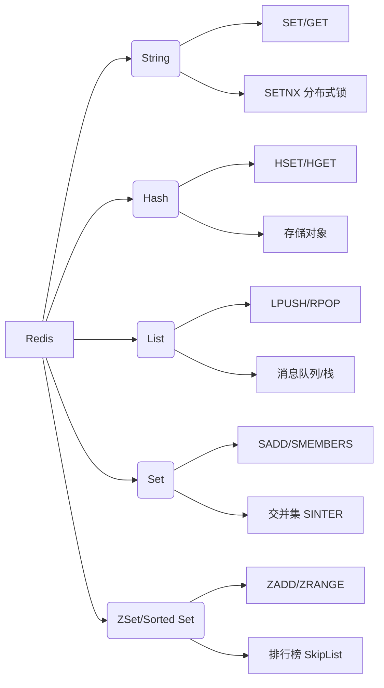

# ⚡ Redis 入门与实战架构指南

> [!abstract] 核心目标
> 掌握 Redis 的 **5 大基本数据类型** 及其应用场景。
> 理解常用命令的操作逻辑，并从 **数据结构 (ACM)** 视角透视其底层实现原理。

---

## 1. 数据类型概览 (Data Types)

Redis 是一种基于内存的 Key-Value 数据库。它的 Value 支持多种丰富的数据结构。

![[Redis学习1.png]]

### 1.1 类型映射表

对于 Java/ACM 选手，可以这样类比：

|**Redis 类型**|**类似 Java 结构**|**特点**|**典型应用**|
|---|---|---|---|
|**String**|`String` / `AtomicInteger`|最基本类型，二进制安全|缓存、计数器、分布式锁|
|**Hash**|`HashMap<String, String>`|键值对集合，适合存储对象|存储对象（如 User）|
|**List**|`LinkedList`|双向链表，有序，允许重复|消息队列、时间线|
|**Set**|`HashSet`|无序，唯一，支持集合运算|标签、共同好友|
|**ZSet**|`TreeSet` + `HashMap`|**有序**，唯一，带权重(Score)|排行榜|

---

## 2. 常用操作命令详解

> [!warning] ⚠ 注意事项
> - Redis 命令**不区分大小写** (如 `SET` 和 `set` 一样)，但 Key 是区分大小写的。
> - Redis 索引通常从 `0` 开始。
> - [ACM 提示] 大部分基础命令复杂度为 $O(1)$，但在处理集合范围查询时要注意 $O(N)$ 或 $O(\log N)$ 的风险。

### 2.1 String (字符串)

![[Redis学习2.png]]

Redis 中最简单的数据类型，Value 最多可以容纳 512MB。

**常用命令：**
- `SET key value`：设置指定 key 的值。

- `GET key`：获取指定 key 的值。

- `SETEX key seconds value`：设置值并指定**过期时间（秒）**。
    - _场景_：验证码缓存 (例如 60秒过期)。

- `SETNX key value`：**只有在 key 不存在时**设置 key 的值。
    - _场景_：**分布式锁**的基石 (Lock primitive)。如果不使用 `Redisson` 等库，手写简单的锁往往基于此命令。

> [!tip] ACM 视角：底层原理
> **SDS (Simple Dynamic String)**：
> Redis 没有直接用 C 语言的字符串 (`char*`)，而是自己封装了 SDS。
> - **$O(1)$ 获取长度**：SDS 头部存了 `len` 属性。 
> - **杜绝缓冲区溢出**：修改前会检查空间。
> - **空间预分配**：减少内存重分配次数。

### 2.2 Hash (哈希)

![[Redis学习3.png]]

一个 string 类型的 field 和 value 的映射表，特别适合用于存储对象。

**常用命令：**
- `HSET key field value`：将哈希表 key 中的字段 field 的值设为 value。
- `HGET key field`：获取存储在哈希表中指定字段的值。
- `HDEL key field`：删除存储在哈希表中的指定字段。
- `HKEYS key`：获取哈希表中所有字段 (Fields)。
- `HVALS key`：获取哈希表中所有值 (Values)。

**应用场景示例：**

存储一个 ID 为 1001 的用户对象：

```Bash
HSET user:1001 name "Justin" age 25
```

对比 `String` 存储 JSON 字符串，`Hash` 的优势在于可以**单独修改**某个字段 (如只改 age)，而不需要序列化/反序列化整个对象。

### 2.3 List (列表)

![[Redis学习4.png]]

简单的字符串列表，按照插入顺序排序。

**常用命令：**
- `LPUSH key value1 [value2]`：将值插入到列表**头部** (Left Push)。
- `LRANGE key start stop`：获取列表指定范围内的元素。
    - **技巧**：`0` 代表 head，`-1` 代表 tail。`LRANGE mylist 0 -1` 查看所有。
- `RPOP key`：移除并获取列表**最后一个**元素 (Right Pop)。
- `LLEN key`：获取列表长度。

**数据结构模式：**

- `LPUSH` + `RPOP` = **Queue (队列)** (先进先出)
- `LPUSH` + `LPOP` = **Stack (栈)** (先进后出)

> [!tip] ACM 视角：底层原理
> 
> **QuickList (快速列表)**：
> 早期版本使用 `LinkedList` 或 `ZipList`。现代 Redis (3.2+) 使用 `QuickList`。
> 它是一个**双向链表**，但链表的每个节点是一个 **ZipList (压缩列表)**。
> - 既保留了链表的插入删除优势，又利用 ZipList 内存连续的特性减少碎片，提高缓存命中率。

### 2.4 Set (集合)

![[Redis学习5.png]]

String 类型的无序集合，成员是**唯一**的。

**常用命令：**
- `SADD key member1 [member2]`：添加成员。
- `SMEMBERS key`：返回集合中所有成员。
- `SCARD key`：获取成员数 (Size)。
- `SINTER key1 [key2]`：返回给定集合的**交集**。
- `SUNION key1 [key2]`：返回给定集合的**并集**。
- `SREM key member`：删除指定成员。

**应用场景：**
- **计算公共元素**：`SINTER` 计算两个人的“共同好友”。
- **抽奖**：`SRANDMEMBER` 随机获取元素。

### 2.5 Sorted Set / Zset (有序集合)

![[Redis学习6.png]]

不允许重复成员，但每个元素都会关联一个 `double` 类型的 **分数 (Score)**。Redis 通过分数来为集合中的成员进行从小到大的排序。

**常用命令：**
- `ZADD key score1 member1`：添加成员及其分数。
- `ZRANGE key start stop [WITHSCORES]`：通过索引区间返回成员 (默认升序)。
- `ZINCRBY key increment member`：给指定成员的分数加上增量。
- `ZREM key member`：移除成员。

**应用场景：**

- **排行榜**：游戏积分榜、热搜话题。
- **带权重的消息队列**：优先级高的任务排在前面。

> [!example] ACM 重点：跳表 (SkipList)
> 
> **ZSet 的底层实现**通常是 **Dict (字典)** + **SkipList (跳表)**。
> - **为什么不用平衡树 (AVL/Red-Black Tree)?**
>     
>     - 跳表实现简单，范围查询 (`ZRANGE`) 效率极高。
>         
>     - 插入/删除只需要修改局部指针，不需要复杂的旋转操作。
>         
>     - 平均查找复杂度为 $O(\log N)$，空间复杂度 $O(N)$。
>         
> - 这是面试和算法题中非常经典的数据结构。

---

## 3. 通用命令 (Generic Commands)

![[Redis学习7.png]]

不管是什么数据类型，都可以使用的命令。

- `KEYS pattern`：查找所有符合给定模式的 key。
    - **⚠️ 危险**：在生产环境（数据量大时）**严禁使用** `KEYS *`，因为 Redis 是单线程的，这会导致线程阻塞 (O(N))，卡死服务。建议用 `SCAN` 代替。

- `EXISTS key`：检查 key 是否存在。
- `TYPE key`：返回 key 所储存的值的类型。
- `DEL key`：删除 key。

---

## 4. 总结：命令速查脑图



---

## 5.扩展
- `prefix:index:value`
	- 存储这样的值时，`Redis`会生成一个树型接口属性

> [!warning] 注意
> 在可视化界面中的结构，可能会导致你认为这是由`Trie`树实现的树型结构
> 但是`Redis`底层就是一个全局的`HashMap`