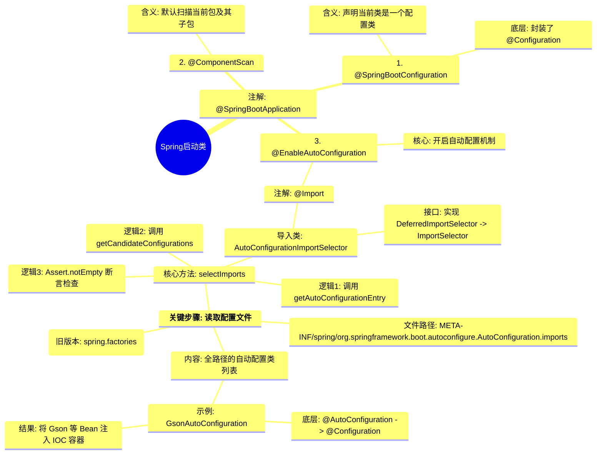
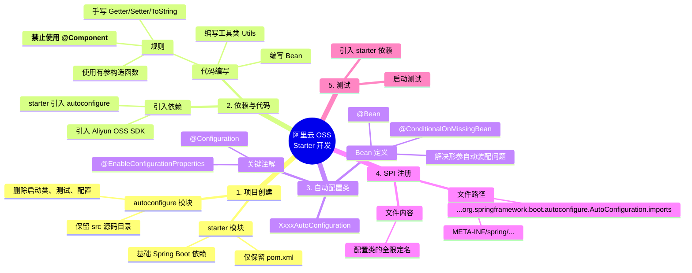

---
tags:
  - Spring
  - SpringBoot
  - Java
  - 后端开发
  - 源码分析
created: 2026-01-21
---

# Spring 原理篇

## 目录
- [[#配置优先级]]
    - [[#配置文件]]
    - [[#Java系统属性 ＆ 命令行参数]]
- [[#Bean管理]]
	- [[#Bean作用域]]
	- [[#第三方的Bean]]
- [[#SpringBoot 原理]]
	- [[#实现方案]]
	- [[#源码跟踪]]
	- [[#自定义 starter]]

---

## 配置优先级

### 配置文件
- 一般分为三种配置文件的类型：
    - `application.properties`
    - `application.yml`
    - `application.yaml`

```properties
server.port=8081
```

```yml
server:
  port: 8082
```

```yaml
server:
  port: 8083
```

* **配置文件优先级**：`properties` > `yml` > `yaml`
* 在实际开发中，一般使用 `yml` 文件，因为 `yml` 文件更易读。

### Java系统属性 ＆ 命令行参数

* **Java系统属性**：通过 `-D` 参数设置
`-Dserver.port=9000`
* **命令行参数**：通过 `--` 参数设置
`--server.port=10010`
* **可以通过 IDEA 的设置进行配置：**
* **Java系统属性**：
* `Run/Debug Configurations` -> `VM Options` -> `-Dserver.port=9000`

* **命令行参数**：
* `Run/Debug Configurations` -> `Program arguments` -> `--server.port=10010`

* **最新版的 IDEA 配置方式**：
* 可以通过当前的启动项进行配置，先点击 `Edit Configurations`
* 然后确认选择了是当前项目需要进行修改的启动项，然后点击 `Modify options`
* 然后勾选 `Add VM options` 和 `Program arguments` 即可

> [!SUMMARY] 优先级总结
> **命令行参数** > **Java系统属性** > **配置文件**

---

## Bean管理

### Bean作用域

* Spring支持五种作用域，后三种在web环境生效：利用 `@Scope` 注释来实现
* **singleton**（默认）：创建单个实例
* **prototype**：每次使用都会创建一个新的示例
* **request**：Web 请求范围内
* **session**：Web 会话范围内
* **application**：Web 应用范围内


#### 1. 单例 (Singleton)

* 无需设置 `Scope` 就自带的默认属性
* 默认在项目启动的时候创建
* **适用于无状态的Bean**：意思是这个Bean里面不会保存数据，这时候使用单例就不会因为多线程共享数据导致线程安全问题，比如 `Controller`

#### 2. 多例 (Prototype)

* 被使用的时候就创建一次，用完就销毁
* **适用于有状态的Bean**：比如在一个数据处理的Bean中，有两个成员函数，用于暂时存放单次处理的数据列表和错误数据统计，若是所有人都使用同一个对象（单例），则这两个成员变量则不是统计单次了，而是统计全部请求

```java
@Component
public class DataProcessor {
    private List<EmpModel> dataList = new ArrayList<EmpModel>();  // 暂存数据
    private Integer errCount = 0;  // 错误次数统计
    
    @Autowired
    private EmpMapper empMapper;
    // ....
}
```

> [!TIP] PS
> 大部分的 Bean 其实都只需要用 **单例** 即可。

### 第三方的Bean

* 第三方提供的Bean一般是一个 `jar包`，我们无法在其内容上进行修改，所以无法直接加入注解。
* 我们可以使用 `@Bean` 注解来进行管理。

```java
@SpringBootApplication
public class SpringbootWebConfigApplication {
	@Bean   // 将该方法返回值交给 IOC 容器管理，成为IOC容器的Bean对象
	public AliyunOSSOperator aliyunOSSOperator(AliyunOSSProperties ossProperties) {
		return new AliyunOSSOperator(ossProperties);
	}
}
```

> [!NOTE] 注意事项
> 1. **依赖注入**：第三方bean需要依赖其他bean对象，直接在bean定义方法中设置形参即可，容器会根据类型自动配装。
> 2. **名称定义**：通过 `@Bean` 注解的 `name` 和 `value` 属性可以声明bean的名称，如果不指定，**默认bean的名称就是方法名**。
> 
> 

* **推荐方法：** - 不建议使用启动类来管理第三方Bean对象
* 可以通过 `@Configuration` 注解来声明一个配置类，通过这个配置类来管理第三方的Bean


```java
 @Configuration
 public class OSSConfig {
 	@Bean
 	public AliyunOSSOperator aliyunOSSOperator
		 	(AliyunOSSproperties ossProperties) {
 		return new AliyunOSSOperator(ossProperties);
 	}
 }
```

---

## SpringBoot 原理

### 起步依赖

* 相当于 **依赖传递**
* `SpringBoot` 在 `SpringFramework` 是 Spring 官方给出配置了基本东西的框架

### 自动配置

* `SpringBoot` 的自动配置就是当 `Spring项目` 启动后，一些 `配置类`、`bean对象` 就自动存入 IOC 容器中，不需要我们手动去声明
* **例子：** 假设我们引入了谷歌的 `Gson` 依赖

```java
@SpringBootTest
class SpringbootWebTests {
	@Autowired private Gson gson;
	@Test
	public void TestJson() {
		System.out.println(gson.toJson(Result.success("Hello gson")));
	}
}
```

* 在这里 `SpringBoot` 会帮我们自动配置 `Gson`

#### 实现方案

##### 环境准备

* 首先准备好一个我们自己写好的简单依赖 `itheima-utils`
* 导入到 Maven 依赖的配置文件中
* 在 `itheima-utils/src/java/com/example` 包下准备好所需要使用的测试文件

##### 实现方案-1：@ComponentScan

* 通过 `@Component` + `@Configuration` 两个注解来实现
* 在第三方工具包中的工具类有 `@Componenet` 注解
* 同时在原本项目中的启动类上加上 `@ConfigurationScan` 注解，并配置其 `basePackages` 属性

```java
@ComponentScan(basePackages = {"com.example", "com.itheima"})
@SpringBootApplication
public class SpringbootWebConfigApplication {
	public static void main(String[] args) {
		SpringApplication.run(SpringbootWebConfigApplication.class, args);
	}
}
```

> [!WARNING] 缺点
> 使用繁琐，性能低。

##### 实现方法-2：@Import
使用 `@Import` 导入：

1. **导入 `普通类**`
```java
@Import(TokenParser.class)  // 导入普通类
@SpringBootApplication
public class SpringbootWebConfigApplication {
	public static void main(String[] args) {
		SpringApplication.run(SpringbootWebConfigApplication.class, args);
	}
}
```


2. **导入 `配置类**`
```java
// HeaderConfig.java
@Configuration
public class HeaderConfig {
	@Bean
	public HeaderParser headerParser() {
		return new HeaderParser();
	}

	@Bean
	public HeaderGenerator headerGenerator() {
		return new HeaderGenerator();
	}
}
```


```java
@Import(HeaderConfig.class)  // 导入配置类
@SpringBootApplication
public class SpringbootWebConfigApplication {
	public static void main(String[] args) {
		SpringApplication.run(SpringbootWebConfigApplication.class, args);
	}
}
```


3. **导入 `ImportSelector` 接口的 `实现类**`
```java
// MyImportSelector
@Configuration
public class MyImportSelector implements ImportSelector {
	public String selectImports(AnnotationMetadata importingClassMetadata) {
		return new String[]{"com.example.HeaderConfig", "com.example.TokenParser"};
	}
}
```


```java
@Import(MyImportSelector.class)  // 导入 ImportSelector 接口的实现类
@SpringBootApplication
public class SpringbootWebConfigApplication {
	public static void main(String[] args) {
		SpringApplication.run(SpringbootWebConfigApplication.class, args);
	}
}
```


4. **使用 `自定义注解` 封装 `@Import**`
*开发第三方工具包的开发人员所定义的 `自定义注解类` - `@EnableXxxx*`
```java
// EnableHeaderConfig
@Retention(RetentionPolicy.RUNTIME)
@Target(ElementType.TYPE)
@Import(MyImportSelector.class)
public @interface EnableHeaderConfig {
}
```


```java
@EnableHeaderConfig  // 导入第三方开发人员写好的注解
@SpringBootApplication
public class SpringbootWebConfigApplication {
	public static void main(String[] args) {
		SpringApplication.run(SpringbootWebConfigApplication.class, args);
	}
}
```

#### 源码跟踪

##### 源码路线

* 追踪 **核心代码** 即可
* **追踪路线：** [[Spring自动配置.canvas|查看导图白板]] 
1. **启动类**（所有项目的入口）-- `SpringbootWebConfigApplication.java`
2. 进入其注释 `@SpringBootApplication` 之中，前面四个注解是原注解（不用管），关注下面三个注解：
	1. `@SpringBootConfiguration`：进入之后发现其封装了一个 `@Configuratin` 注解，这样不难得出，其实 `SpringbootWebConfigApplication.java` 是属于一个配置类。
	2. `@EnableAutoConfiguration`（**核心注解**）：开启自动配置的开关，里面封装了 `@Import` 注解，里面又导入了 `AutoConfigurationImportSelector.class`。
		* 进入这个类里面，其实现了几个接口，其中有 `DeferredImportSelector` 接口（继承自 `ImportSelector`）。
		* 最后我们要返回去这个类中查看 `selectImports` 的实现方法，重点关注 **返回值** -> *进入第 3 点*
	3. `@ComponentScan`：这个是扫描范围的控制，解释了为什么启动类会默认扫描当前包及其子包。


4. 上接2-2。接下来继续进入到 `getAutoConfiguration` 这个 **方法** 中，发现其返回值是构造了一个 `new AutoConfigurationEntry(configurations, exclusions)`，参数对应分别是 `需求` 和 `排除`。
	* 接下来进入到获取 `configuration` 的方法 `getCandidateConfigurations` 之中。
	* 会在这个方法之中发现一个 **断言**：`Assert.notEmpty(configuration, "...")`。
	* 字符串中的内容 **提示** 去找 `META-INF/spring/org.springframework.boot.autoconfigure.AutoConfiguration.imports` 这个文件。

4. 然后利用 IDEA 中定位到当前类的 jar 包的功能，直接定位刚刚断言所在的类所在的地方，然后在这个 jar 包下寻找主要目标。
5. 找到这个文件并打开之后，发现里面有非常多的配置类，然后可以找一个配置类去查看，例如找 `Gson` 之前这个自动配置的，找到 `GsonAutoConfiguration`。
6. 找到 `GsonAutoConfiguration` 这个类之后，发现其上面有 `@AutoConfiguration` 注解，进入其中，其又封装了 `@Configuration` 这个注解，所以其是一个配置类，里面配置了之前使用的自动配置的 `Gson`。

> [!INFO] 版本差异
> 在低版本（2.7.0以前）的 SpringBoot 中，自动配置类是定义在 `spring.factories` 文件中。

###### 导图一：思维图



###### 导图二：流程图

```mermaid
graph TD
    %% 节点样式定义
    classDef core fill:#f96,stroke:#333,stroke-width:2px,color:white;
    classDef file fill:#ff9,stroke:#333,stroke-width:1px;

    Start[SpringbootWebConfigApplication] --> Annotation{@SpringBootApplication}
    
    Annotation --> Config[@SpringBootConfiguration]
    Annotation --> Scan[@ComponentScan]
    Annotation --> Enable[@EnableAutoConfiguration]:::core
    
    Config -.->|本质| ConfigImpl(配置类 Configuration)
    Scan -.->|作用| ScanImpl(扫描当前包及子包)
    
    Enable --> Import[@Import]
    Import --> Selector[AutoConfigurationImportSelector]
    Selector --> Method[selectImports 方法]
    
    Method --> Step1[getAutoConfigurationEntry]
    Step1 --> Step2[getCandidateConfigurations]
    
    Step2 --> LoadFile(读取配置文件):::file
    
    LoadFile -- 查找 --> FilePath["META-INF/spring/.../AutoConfiguration.imports"]:::file
    
    FilePath --> ConfigList[获取配置类列表]
    ConfigList --> Example[例如: GsonAutoConfiguration]
    Example --> Result((注册Bean到IOC容器))

    %% 备注部分
    subgraph 补充说明
    Note1[旧版本 < 2.7.0 读取 spring.factories]
    end
    LoadFile -.-> Note1

```

##### `@Conditional` 注解

* **作用：** 按照一定的条件进行判断，满足条件才会注册到 IOC 容器中
* **位置：** 方法、类
* **方法：** 针对于当前这个方法声明的bean
* **类：** 针对于这个类中所有的方法声明的bean


* `@Conditional` 本身属于一个父注解，派生出大量的子注解：（下面是常见的三个）

1. **`@ConditionalOnClass`**：判断环境中是否 **有** 对应字节码文件
```java
@Configuration
public class HeaderConfig {
	@Bean
	@ConditionalOnClass(name = "io.jsonwebtoken.Jwts") // 这里使用的是全类名
	public HeaderParser headerParser() {
		return new HeaderParser();
	}
}
```


2. **`@ConditionalOnMissingBean`**：判断环境中 **没有** 对应的bean（类型 or 名称）
```java
@Configuration
public class HeaderConfig {
	@Bean
	@ConditionalOnMissingBean   // 如果项目IOC中没有这个bean，则会创建这个bean
	public HeaderParser headerParser() {
		return new HeaderParser();
	}
}
```


3. **`@ConditionalOnProperty`**：判断配置文件中 **有** 对应属性和值
```java
@Configuration
public class HeaderConfig {
	@Bean
	@ConditionalOnProperty(name="myname", havingValue="Jacolp")
	// 判断 myname 这个值是否等于 Jacolp，等于就创建这个bean
	public HeaderParser headerParser() {
		return new HeaderParser();
	}
}
```


```yml
# application.yml
myname: Jacolp
```

> [!NOTE] 结论
> 所以在 **自动配置** 文件中列表内所有的 bean 不一定会全都注册到 IOC 容器。

---

### 自定义 starter

* **场景：** 在实际开发中，经常会定义一些公共组件，提供给各个项目团队使用。而在 SpringBoot 项目中，一般会将这些公共组件封装为 `SpringBoot` 的 `starter`（包含了起步依赖和自动配置的功能）。
* 不管是 `spring boot` 官方还是非官方都有这两个模块：
* `org.springframework.boot:spring-boot-autoconfigure:3.2.6` -- 自动配置功能
* `org.springframework.boot:spring-boot-starter:3.2.6` -- 依赖管理功能

#### 课程跟做

* **需求：** 自定义 `aliyun-oss-spring-boot-starter`，完成阿里云OSS操作工具类 `AliyunOSSOperator` 的自动配置
* **目标：** 引入起步依赖之后，要想使用阿里云OSS，注入 `AliyunOSSOperator` 直接使用即可
* **步骤：**
1. 创建 `aliyun-oss-spring-boot-starter` 模块
2. 创建 `aliyun-oss-spring-boot-autoconfigure` 模块，在 `starter` 中引入该模块
3. 在 `aliyun-oss-spring-boot-autoconfigure` 模块中的定义自动配置功能
4. 定义自动配置文件 `META-INF/spring/xxxx`


* **操作流程：** [[自定义 starter 流程图.canvas|白板流程导图]]

1. 在 IDEA 中创建一个 springboot 项目，名字为 `aliyun-oss-spring-boot-starter`，语言选择 `Java`，项目类型 `Maven`，组织名为 `com.aliyun.oss`，模块名与名字一样，包名保留 `com.aliyun.oss` 即可，点击下一步。
2. 不用选择任何依赖，若是 `springboot` 的版本不能和原本项目一致，可以后续通过 `pom.xml` 文件进行修改；创建成功之后，仅需要保留 `pom.xml` 文件即可，其余都可以删除，`pom.xml` 中仅需要保留最基础的 spring boot 起步依赖（就只有一个）。
3. 创建另一个 springboot 项目 -- `aliyun-oss-spring-boot-autoconfigure`，其余操作同上，但是需要保留 `src` 这个文件，但是不需要它的启动类、配置文件、测试文件夹。
4. 在 `starter` 中引入 `autoconfigure`，同时引入阿里云OSS的所有依赖，并将所有写好的工具类以及 bean 都放入到 `src.java.mian.java.com.aliyun.oss` 包下；同时尽量自己手写 `getter` 和 `setter`，以及重写 `toString()` 方法；**切记不要使用 `@Componenet**`，这时候也导致 `@Autowired` 不能使用，需要重写 `有参构造` 方法。
5. 接下来声明一个配置类 `XxxxAutoConfiguration`，并加上 `@Configuration` 注释，开始定义需要的 bean 对象；会发现由于在之前地方删掉了 `@Componenet` 注解导致这个时候无法使用自动装配出现了形参上的错误，这个时候可以使用 `@EnableConfigurationProperties` 放到这个类上面。
```java
@EnableConfigurationProperties(AliyunOSSProperties.class)
@Configuration
public class AliyunOSSAutoConfiguration {
    @Bean
    @ConditionalOnMissingBean
    public AliyunOSSOperator aliyunOSSOperator(AliyunOSSProperties properties) {
         // ... implementation
         return new AliyunOSSOperator(properties);
    }
}
```

6. 接下来在 `src.main.java.resources` 包下创建以下路径内容 `META-INF/spring/org.springframework.boot.autoconfigure.AutoConfiguration.imports` 文件，将自定义配置类 `XxxxAutoConfiguration` 的全类名放到里面去。
7. 接下来在项目中引入 `starter` 依赖，就可以开始测试自定义写的 `starter` 了。

#### 流程思维导图

