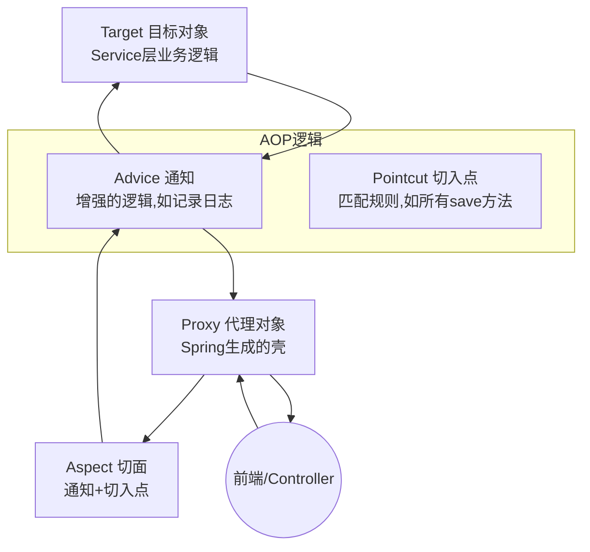
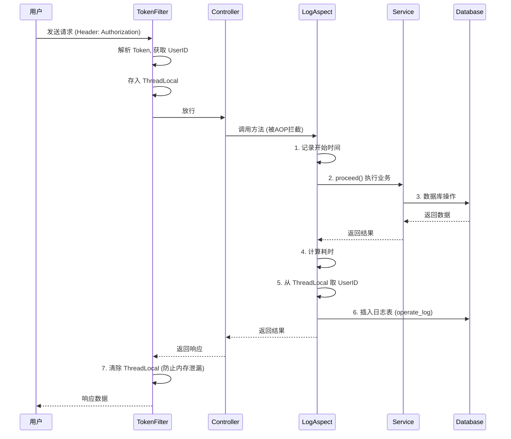

---
tags:
  - Java
  - SpringBoot
  - AOP
  - 笔记
  - 复习
create_time: 2026-01-20
---

# ⚔️ Spring AOP 核心知识体系

> [!abstract] 前言
> **AOP (Aspect Oriented Programming)**：面向切面编程。
> 它的核心思想是将那些与业务无关，却为业务模块所共同调用的逻辑（例如：**事务处理、日志管理、权限控制**）封装起来，减少重复代码，降低模块间的耦合度。

---

## 1. AOP 核心概念 (The Core)

AOP 的术语比较抽象，结合下图理解：


> [!info] 细节
> 通过这个图，可以了解到
> 

| 术语 | 英文 | 解释 | 比喻 |
| --- | --- | --- | --- |
| **连接点** | JoinPoint | 可以被增强的方法 | 菜单上所有的菜 |
| **切入点** | Pointcut | 实际被增强的方法（匹配条件） | 实际上点的菜 |
| **通知** | Advice | 具体的增强逻辑（共性功能） | 饭前洗手/饭后买单 |
| **切面** | Aspect | 通知 + 切入点 | 包含“洗手规则”和“洗手动作”的说明书 |
| **目标对象** | Target | 被代理的对象 | 原始的业务代码 |

---

## 2. AOP 快速入门

### 2.1 引入依赖

```xml
<dependency>
    <groupId>org.springframework.boot</groupId>
    <artifactId>spring-boot-starter-aop</artifactId>
</dependency>
```

### 2.2 编写切面类

> [!code] 示例：统计方法耗时
> ```java
> @Slf4j
> @Aspect // 1. 标识当前是一个 AOP 类
> @Component // 2. 交给 Spring 管理
> public class RecordTimeAspect { 
> // 对 com.example.service 包下所有方法进行拦截
> @Around("execution(* com.example.service.impl.*.*(..))")
> public Object recordTime(ProceedingJoinPoint joinPoint) throws Throwable { 
>     long beginTime = System.currentTimeMillis();
>     
>     // 执行原始目标方法
>     Object result = joinPoint.proceed();
>     
>     long endTime = System.currentTimeMillis();
>     log.info("方法：{}，耗时：{} ms", joinPoint.getSignature(), endTime - beginTime);
>     
>     return result; // 必须返回结果
> }
> ```


---

## 3. 通知类型 (Advice Types)

| 注解 | 类型 | 执行时机 | 备注 |
| --- | --- | --- | --- |
| **`@Around`** | **环绕通知** | **目标方法前后** | **最常用，功能最强**。必须手动调用 `pjp.proceed()`，且必须返回 `Object`。 |
| `@Before` | 前置通知 | 目标方法前 | 无法阻止目标方法执行（除非抛异常）。 |
| `@After` | 后置通知 | 目标方法后 | 无论是否异常都会执行（类似 `finally`）。 |
| `@AfterReturning` | 返回后通知 | 目标方法成功后 | 有异常则不执行。 |
| `@AfterThrowing` | 异常后通知 | 抛出异常后 | 适合做异常监控。 |

---

## 4. 切入点表达式 (Pointcut Expressions)

### 4.1 execution (根据方法签名匹配)

语法：`execution(访问修饰符? 返回值 包名.类名.?方法名(方法参数) throws 异常?)`

> [!tip] 通配符说明
> * `*` : 匹配任意一个符号（任意返回值、任意类名、任意方法名）。
> * `..` : 匹配多个连续符号（任意层级的包、任意个数的参数）。

**常用写法速查：**

| 表达式 | 含义 |
| --- | --- |
| `execution(* com.jacolp.service.*.*(..))` | 匹配 `service` 包下所有类的所有方法 |
| `execution(* com.jacolp..*.*(..))` | 匹配 `jacolp` 包及其**子包**下所有方法 |
| `execution(* delete*(..))` | 匹配所有以 `delete` 开头的方法 |

### 4.2 @annotation (根据注解匹配) ✨ 推荐

相比 `execution`，注解匹配更灵活。只要方法上加了特定注解，就触发 AOP。

**步骤：**

1. 定义注解 `@Log`。
2. 表达式写为 `@annotation(com.example.anno.Log)`。

#### 4.3 @annotation扩展示例
```Java
@Target(ElementType.TYPE)  // 作用于类、接口、枚举
@Retention(RetentionPolicy.RUNTIME) // 运行时保留，允许AOP反射获取
public @interface LoggableClass{
	/**
	 * 可选：为被标记的对象定一个统一的前缀描述 
	 */
	String prefix() default "";
	
	/**
	 * 可选：是否启用日志记录（可做开关控制）
	 */
	boolean enabled() default true;
}
```
> [!info] 若是设置了参数，以下是切面类使用参数的参考代码
```Java
@Around("@annotation(...LoggableClass)")
public Object logOperation(ProceedingJoinPoint joinPoint) throws Throwable {
	LoggableClass logClass = joinPoint.getTarget()
		.getClass().getAnnotation(MethodLog.class);  //需要先获取这个类
		
	...
	
	// 若是未开启日志直接返回结果即可
	if(!logClass.enabled()) return joinPoint.proceed();
}
```

> [!warning] 首先示例中的是通过反射API来获取注解类，这种是先获取类再反射，需要在类上添加注解才可以，如果注解添加到方法上，会出现`null`异常，要换成下面这种反射方式
> ```Java
> // 先获取方法 然后获取注解  
MethodLog methodLogAnnotation = ((MethodSignature)joinPoint.getSignature())
>		.getMethod().getAnnotation(MethodLog.class);
> ```
---

## 5. 获取连接点信息 (JoinPoint)

在通知方法中，我们可以拿到目标方法的详细信息。

> [!code] 获取方法信息
> ```java
> @Before("...")
> public void before(JoinPoint joinPoint) { // 非环绕通知用 JoinPoint
>     // 1. 获取目标类名
>     String className = joinPoint.getTarget().getClass().getName();
>     // 2. 获取方法签名
>     String methodName = joinPoint.getSignature().getName();
>     // 3. 获取参数
>     Object[] args = joinPoint.getArgs();
> }
> 
> ```

> [!warning] 注意
> 对于 `@Around` 环绕通知，参数必须是 **`ProceedingJoinPoint`** (它是 `JoinPoint` 的子接口)，因为它多了一个 **`proceed()`** 方法用于放行。

---

## 6. 实战案例：操作日志 + ThreadLocal

### 6.1 场景描述

记录用户的增删改操作，需要记录：**操作人 (Who)**、**操作时间 (When)**、**执行方法 (What)**、**耗时 (Time)**。

### 6.2 核心流程图



> [!info] 其实这整一个过程都在一个线程内完成的，多个玩家发起请求时，每个玩家的一次请求都会开启一个独立的线程。

### 6.3 关键代码片段 (回顾)

**ThreadLocal 工具类：**
- 用于存储当前线程的局部变量
- 相当于一个`Map<Thead, ?>`的哈希表，通过线程来获取变量
```java
public class CurrentHolder {
    private static final ThreadLocal<Integer> CURRENT_LOCAL = new ThreadLocal<>();
    // set, get, remove 方法...
}
```
> [!warning] 同一个线程可以设置多个`ThreadLocalMap`来存放多个局部变量值

> [!error] `ThreadLocal`用完之后**一定一定**要清除，否则会导致内存泄露问题！

**Filter 中的操作：**

```java
// 在拦截器中解析 Token 后
Integer empId = JwtUtils.parse(token);
CurrentHolder.setCurrentId(empId); // 存入当前线程
// ... doFilter ...
CurrentHolder.remove(); // 务必清除

```

**Aspect 中的操作：**

```java
@Around("@annotation(Log)")
public Object log(ProceedingJoinPoint pjp) {
    // ... 执行业务 ...
    // 获取当前操作人
    Integer userId = CurrentHolder.getCurrentId(); 
    // ... 存库 ...
}

```

---

## 💡 导师注脚 (Mentor's Note)

### 针对 task-system 项目的特别说明

在你之前的笔记中，你手动实现了 `TokenFilter` 和 `CurrentHolder (ThreadLocal)`。
但在我们现在的 **`task-system`** 项目中，我们引入了 **Spring Security**。

**Spring Security 内部其实已经帮你做好了 ThreadLocal 的管理！**

1. **ThreadLocal 在哪？**
Spring Security 使用 `SecurityContextHolder` 来存放用户信息，它的底层默认就是 `ThreadLocal`。
2. **Filter 在哪？**
你写的 `JwtAuthenticationFilter` 其实就是笔记中 `TokenFilter` 的升级版。
3. **如何获取当前用户？**
你不需要再用 `CurrentHolder.get()` 了，而是使用我们封装好的工具类：
```java
// 在 LogAspect 切面中，直接这样拿用户：
String username = SecurityUtil.getCurrentUsername(); 
```


**总结**：AOP 的写法（切面、通知、注解）完全不变，唯一变的是“获取当前登录用户”的方式，变得更简单标准了。