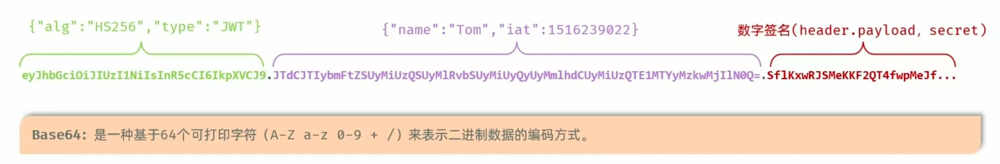
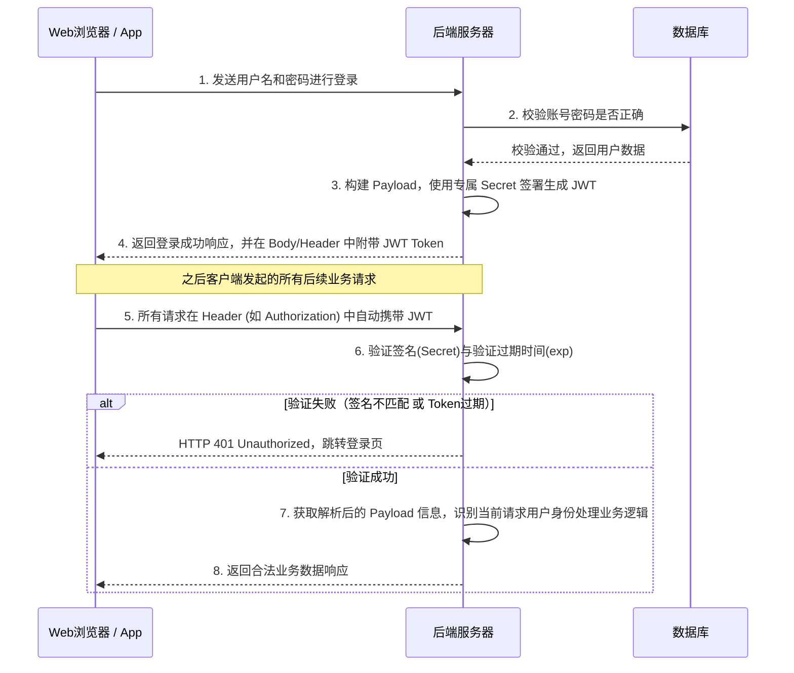

## 目录
- [[#认证机制演进：从 Session 到 JWT]]
	- [[#传统 Session 的痛点]]
	- [[#JWT 的核心设计思想]]
- [[#JWT (JSON Web Token) 深入原理解析]]
	- [[#JWT 的三段式结构]]
	- [[#Base64Url 编码与补位]]
- [[#JWT 的生成与解析实战]]
	- [[#引入依赖]]
	- [[#生成 JWT 令牌]]
	- [[#解析 JWT 令牌]]
- [[#JWT 的安全性与最佳实践]]
	- [[#常见异常与处理]]
	- [[#JWT 的认证流程]]
	- [[#双 Token 刷新机制]]
- [[#总结对比：Session vs JWT]]

---

## 认证机制演进：从 Session 到 JWT

### 传统 Session 的痛点

在传统的 Web 开发中，通常使用 **Session-Cookie** 机制来维持用户状态：
1. 服务端验证账号密码后，生成一个 `sessionId` 存入服务器内存（或 Redis）。
2. 通过 `Set-Cookie` 将 `sessionId` 发送给浏览器。
3. 浏览器随后的请求会自动带上 Cookie，服务端通过 `sessionId` 查询内存中的会话数据。

> [!failure] 为什么分布式系统中 Session 机制显得捉襟见肘？
> - **内存开销**：随着用户量激增，服务端需要存储海量的 Session，造成巨大内存压力。
> - **扩展性差**：在集群部署下，Session 共享需要额外的中间件（如 Redis）支持，增加了系统复杂度和网络开销。
> - **跨域问题**：Cookie 原生不支持跨域，前后端分离架构下配置复杂。

### JWT 的核心设计思想

**JWT (JSON Web Token)**，官网：[jwt.io](https://jwt.io/)，是一种开放标准（RFC 7519）。
其核心思想是：**状态无产出（Stateless）**。服务端不再保存用户的状态数据，而是将所有需要的认证信息经过数字签名后，直接发放给客户端。

> 类比：传统 Session 就像是**健身房的前台记录本**（只认会员卡号，详情查本子）；而 JWT 就像是**带有防伪水印的身份证**，上面直接写着你的名字和有效期，门卫（服务端）只需验证水印（数字签名）的真伪，而不需要去查档案室（数据库）。
> CS 术语：JWT 是一种 **无状态认证（Stateless Authentication）** 方案。

---

## JWT (JSON Web Token) 深入原理解析

### JWT 的三段式结构

一个典型的 JWT 字符串看起来就像是由 `.` 分隔的三个 Base64 字符串：`xxxxx.yyyyy.zzzzz`。

#### 第一部分：Header（头部）
描述 JWT 的元数据，通常包含两部分信息：令牌的类型（`typ`）和使用的签名算法（`alg`，如 HMAC SHA256 或 RSA）。
```json
{
  "alg": "HS256",
  "typ": "JWT"
}
```

#### 第二部分：Payload（有效载荷 / 载荷）
存放实际需要传递的数据（Claims）。包含三种声明：
1. **Registered claims（注册声明）**：预定义的标准字段，如 `iss`（签发者）、`exp`（过期时间）、`sub`（主题）、`aud`（受众）等。
2. **Public claims（公共声明）**：可以自定义，但为了避免冲突，建议在 IANA 注册。
3. **Private claims（私有声明）**：通信双方自定义的字段（如 `id`, `username`, `role`）。

> [!warning] Payload 安全警告！
> Header 和 Payload 部分仅仅是经过了 **Base64Url 编码**，并**没有被加密**！
> 任何拿到 JWT 的人都可以轻松解码看到 Payload 的内容。**绝对不要**在 Payload 中放入敏感信息（如密码、银行卡号）。

#### 第三部分：Signature（签名）
这是 JWT 能够防篡改的核心！它将编码后的 Header、编码后的 Payload，以及一个**只有服务端知道的 Secret（密钥）**，通过 Header 中指定的算法计算得出。

```javascript
// 签名计算伪代码
HMACSHA256(
  base64UrlEncode(header) + "." +
  base64UrlEncode(payload),
  secret
)
```

> [!tip] 签名如何防止篡改？
> 如果黑客修改了 Payload 中的 `id`（比如从 1 改成 2）然后重新 Base64 编码，虽然可以成功修改中间的那段字符串。但是，黑客不知道服务端的 `secret`，无法重新计算出正确的第三段 Signature。当服务端收到被篡改的 JWT 时，用自己的 `secret` 再次计算签名，发现与传入的签名对不上，就会直接拒绝该请求，防伪验证失败。

### Base64Url 编码与补位

在 JWT 中，我们通常看到的是去除了等号 `=` 的 Base64Url 编码格式。

> [!info] 编码常识：Base64 补位符号 `=`
> 在标准的 Base64 编码中，如果原始数据的字节数不能被 3 整除，编码后会在末尾补上 `=` 号进行对齐。
> JWT 为了在 URL 中安全传输（因为 `=` 在 URL 中会被转义转码），采用的是 Base64Url 编码，会去掉末尾的补位 `=` 号，并将标准 Base64 中的 `+` 替换为 `-`，`/` 替换为 `_`。



---

## JWT 的生成与解析实战

### 引入依赖

在 Java 项目中，常用的 JWT 处理库是 `jjwt`：
```xml
<dependency>
    <groupId>io.jsonwebtoken</groupId>
    <artifactId>jjwt</artifactId>
    <version>0.9.1</version>
</dependency>
```

### 生成 JWT 令牌

利用官方提供的 `Jwts` 工具类的建造者模式来生成：

```java
@Test
public void testGenJwt() {
    Map<String, Object> claims = new HashMap<>();
    // 往 jwt 令牌中加入自定义信息（将放入 Payload 的私有声明中）
    claims.put("id", 10);
    claims.put("username", "admin");

    // 服务端的密钥，极其重要，千万不能泄露（这里为了演示硬编码，实际应放在配置文件中）
    String secretKey = "SVRIRULNQQ=="; 
    
    String jwt = Jwts.builder()
        // 1. 设置加密算法和密钥 (Header & Signature)
        .signWith(SignatureAlgorithm.HS256, secretKey)
        // 2. 设置自定义有效载荷 (Payload)
        .setClaims(claims)
        // 3. 设置令牌签发时间和过期时间 (例如 12 小时后过期)
        .setExpiration(new Date(System.currentTimeMillis() + 12L * 3600 * 1000))
        // 4. Compact 拼接三部分生成最终的 Token 字符串
        .compact();
        
    System.out.println("生成的 JWT: " + jwt);
}
```

### 解析 JWT 令牌

服务端收到客户端请求带上来的 JWT 后，使用相同的密钥来进行解析并验证：

```java
@Test
public void testParseJWT() {
    String jwt = "eyJhbGciOiJIUzI1NiJ9.eyJpZCI6MTAsInVzZXJuYW1lIjoiY...省略...";
    String secretKey = "SVRIRULNQQ==";

    try {
        // Claims 本质上下方解析出来的内容封装，核心就是一个包含了各种声明的 Map
        Claims claims = Jwts.parser()
            .setSigningKey(secretKey)    // 必须传入当时签发时使用的解密密钥
            .parseClaimsJws(jwt)         // 此步骤除了结构和算法，还会自动进行防篡改和过期时间的验证
            .getBody();                  // 核心：获取并转换为 Payload 内容载荷
            
        System.out.println("解析成功，用户信息: " + claims);
    } catch (Exception e) {
        System.out.println("解析失败：" + e.getMessage());
    }
}
```

---

## JWT 的安全性与最佳实践

### 常见异常与处理

在解析 JWT 时（调用 `parseClaimsJws`），如果令牌不合法，JJWT 库会抛出相应的运行时异常。实际开发中推荐在全局异常处理器中进行统一捕获：

| 异常类型 | 触发原因 | 应对策略 |
|---------|----------|----------|
| `MalformedJwtException` | 令牌结构错误或长度不符导致解析失败 | 直接视为非法请求，可能由于请求头被截断导致 |
| `SignatureException` | **签名防伪校验失败**，Token 可能被篡改，计算得不到相同签名 | 拦截并告警，拒绝访问 |
| `ExpiredJwtException` | 令牌的过期时间（`exp` 声明）早于系统当前时间 | 提示前端页面 "登录已失效，请重新登录" 或触发无感刷新逻辑 |

### JWT 的认证流程



### 双 Token 刷新机制

> [!tip] 生产环境最佳实践：Access Token + Refresh Token
> 因为 JWT 在设计之初就是无状态的。一旦它签发给客户端，要在服务端主动注销某个 Token 是**极难且违背初衷**的（只能维护黑名单/白名单缓存在 Redis 中，又回到了类似 Session 的逻辑）。
> 
> 针对这个问题，目前主流的最佳实践是采用**双 Token**模式：
> 1. **Access Token（访问令牌）**：生命周期非常短（比如 30 分钟），用于每次请求的强校验，由于生命周期短，被盗用的风险大大降低。
> 2. **Refresh Token（刷新令牌）**：生命周期长（比如 7 天），当 Access Token 过期时，客户端拿着 Refresh Token 秘密请求服务端签发两张新的 Token，让用户获得“无感刷新体验”。只有 Refresh Token 也过期时，用户才需要再次输入账号密码。

---

## 总结对比：Session vs JWT

| 核心特性 | Session 机制的实现 | JWT 机制的实现 |
|------|-------------|----------|
| **状态存储** | **有状态 (Stateful)**，服务器必须在内存或 Redis 中持久化记录每个 sessionId 及其映射关系 | **无状态 (Stateless)**，服务端仅进行计算签署校验，所有状态以数字签名的自包含形式存在于客户端所携带的 JWT 中 |
| **可扩展性** | 在集群环境下拓展存在困难，需要复杂的额外组件实现 Session 共享机制 | **极强**，无状态天然适应微服务与分布式，各节点只要共有同一个签署校验密钥就可以单独平行校验身份 |
| **应对跨域** | 局限性大，Cookie 不支持跨源发送，跨域配置非常复杂 | 全面脱离 Cookie 之后，将 JWT 塞入定制 Header 中，不再受制跨源同源策略阻挡 |
| **注销与吊销** | 极易实现，服务端直接 `session.invalidate()` | 难以做到单次彻底阻绝（未过期时）。如果非要做彻底注销必须额外配合比如 Redis 黑名单机制 |