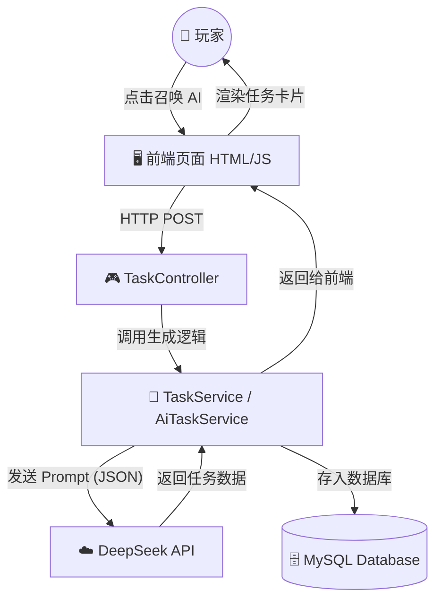

> [!NAV] 🧭 笔记导航站 (Quick Nav)
>
> 🗺️ **顶层设计**
> [[#1. 项目愿景|🔭 项目愿景 (Vision)]] · [[#2. 架构全景图 (Whiteboard)|🏗️ 架构全景图]]
>
> ⚙️ **核心技术实现**
> [[#A. 数据库设计 (Schema)|💾 数据库设计]] · [[#B. 后端逻辑 (Java)|🧠 Java后端逻辑]] · [[#C. AI 大脑接入 (The Brain)|🤖 DeepSeek 接入]]
>
> 🛠️ **实战避坑 (高频引用)**
> [[#4. 踩坑与修复记录 (Troubleshooting)|🚑 报错与修复速查表]]
> 	- **JUnit 报错** 
> 	- **MyBatis 驼峰命名**
> 	- **前端报错**：@CrossOrigin("*")
> 	- **SpringBoot启动报错**
>
> 🚀 **下一步**
> [[#5. 待办清单 (Phase 2)|📅 第二阶段待办]]
> [[#6. 核心代码仓库 (Code Repository)]]]

### 📂 Obsidian 笔记：第一阶段复盘 (MVP)

---
Project: LifeGame (个人RPG系统)
Status: ✅ Phase 1 Completed
Tech Stack: Java 17, Spring Boot 3.3.4, MyBatis, MySQL, DeepSeek V3
Date: 2025-12-24
Tags: #Java #SpringBoot #AI #FullStack #复盘 #第一阶段
---

# 🧬 第一阶段：系统核心原型 (MVP)

## 1. 项目愿景
构建一个将现实生活数字化的 RPG 系统。
* **核心逻辑**：通过 AI 根据我当前的属性（精神/肉体），生成现实中的锻炼任务（如深蹲、冥想）。
* **当前目标**：跑通“前端 -> 后端 -> AI -> 数据库”的全链路闭环。
* **物理挂钩**：针对 173cm/57kg 的体格，最终向 100cm 垂直弹跳进发。

---

## 2. 架构全景图 (Whiteboard)

> [!TIP] 架构说明
> 这是一个标准的 Spring Boot 分层架构，外挂了 AI 大脑。



---

## 3. 核心模块实现

### A. 数据库设计 (Schema)

- **`player_stats`**: 存储玩家核心数据（等级、精神值、肉体值、经验池）。
    
- **`task`**: 存储任务数据（标题、描述、奖励数值、状态）。
    

> [!NOTE] 关键字段
> 
> total_exp 用于计算升级门槛；status (0/1) 标记任务是否完成。

### B. 后端逻辑 (Java)

- **实体映射 (Entity)**: 使用 Lombok (`@Data`) 简化 Getter/Setter。
    
- **数据访问 (Mapper)**:
    
    - 配置 `map-underscore-to-camel-case: true` 解决 `total_exp` -> `totalExp` 读取为 0 的 Bug。
        
    - 使用 MyBatis 注解 `@Select`, `@Insert`, `@Update`。
        
- **业务逻辑 (Service)**:
    
    - `@Transactional`: 保证（加经验 + 改任务状态）原子性，要么全成，要么全败。
        
    - **升级算法**: `if (currentExp >= totalExp)` -> 触发升级 -> 提升下一级门槛。
        

### C. AI 大脑接入 (The Brain)

- **模型**: DeepSeek-V3 (兼容 OpenAI 格式)。
    
- **Prompt 策略**: 强制要求 AI 返回 **纯 JSON** 格式，不要 Markdown 标记。
    
- **技术实现**: 使用 Java 11 原生 `HttpClient`，无需引入额外 SDK。
    

Java

```java
// 核心 Prompt 结构
String prompt = "玩家状态：等级" + level + "...请生成一个任务，返回格式：{\"title\":...}";
// 强制 JSON 模式
requestJson.putObject("response_format").put("type", "json_object");
```

---

## 4. 踩坑与修复记录 (Troubleshooting)

|**问题现象**|**根本原因**|**解决方案**|
|---|---|---|
|**JUnit 报错** `NoSuchMethodError`|依赖版本冲突，缺少启动器|引入 `junit-platform-launcher` 并统一使用 `spring-boot-starter-test`|
|**MyBatis 读取数据为 0**|数据库下划线字段未映射到 Java 驼峰字段|`application.yml` 添加 `map-underscore-to-camel-case: true`|
|**前端报错** `CORS error`|浏览器安全策略拦截跨域请求|Controller 类添加 `@CrossOrigin("*")`|
|**启动报错** `UnresolvedAddressException`|YAML 配置文件 URL 缩进错误|修正 YAML 缩进，确保 `deepseek` 下属属性对齐|
|**AI 报错** `Insufficient Balance`|API Key 创建后未充值|充值额度（或使用硅基流动免费额度）|

---

## 5. 待办清单 (Phase 2)

- [ ] **用户系统**: 引入 Spring Security + JWT，实现多用户登录。
    
- [ ] **UI 重构**: 从原生 HTML 迁移到 Vue 3 + Element Plus。
    
- [ ] **智能记忆**: 让 AI 记住我做过深蹲，下次自动增加难度（Prompt 携带历史 Log）。
    
- [ ] **部署**: 将项目部署到云服务器。


## 6. 核心代码仓库 (Code Repository)

> [!CODE] ⚡ 代码快速传送门
> 
> 📦 **实体类 (Entity)**
> [[#PlayerStatus.java|👤 玩家状态 (PlayerStatus)]]
> 
> 🛠️ **数据层 (Mapper)**
> [[#TaskMapper.java|📝 任务接口 (TaskMapper)]]
> 
> 🧠 **业务层 (Service)**
> [[#TaskServiceImpl.java|⚙️ 任务逻辑 (TaskService)]] · [[#AiTaskService.java|🤖 AI 生成 (AiTaskService)]]
> 
> ⚙️ **全局配置**
> [[#application.yml|🔧 配置文件 (YAML)]]
>
> 💾 **数据库控制台**
> [[#Database Console]]

---

### PlayerStatus.java
*玩家核心属性实体*
```java
package com.jacolp.task_system.entity;  
  
import com.fasterxml.jackson.annotation.JsonFormat;  
import lombok.AllArgsConstructor;  
import lombok.Data;  
import lombok.NoArgsConstructor;  
  
import java.util.Date;  
  
@Data  
@NoArgsConstructor  
@AllArgsConstructor  
public class PlayerStatus {  
    private Long id;  
    private int spirit;  
    private int body;  
    private long currentExp;  
    private long totalExp;  
    private int level;  
  
    @JsonFormat(pattern = "yyyy-MM-dd HH:mm:ss", timezone = "GMT+8")  
    Date updateTime;  
}

```

### TaskMapper.java

*MyBatis 数据库操作接口*

```java
package com.jacolp.task_system.mapper;  
  
import com.jacolp.task_system.entity.Task;  
import org.apache.ibatis.annotations.*;  
  
@Mapper  
public interface TaskMapper {  
    @Insert("insert into task (title, description, exp_reward, reward_type, reward) " +  
            "value (#{title}, #{description}, #{expReward}, #{rewardType}, #{reward})")  
    boolean insertTask(Task task);  
  
    @Update("update task set status=#{status} where id = #{id}")  
    boolean updateTaskStatus(Task task);  
  
    @Select("select * from task where id=#{id}")  
    Task selectById(long id);  
  
    @Insert("INSERT INTO task (title, description, exp_reward, reward_type, reward, status, create_time) " +  
            "VALUES (#{title}, #{description}, #{expReward}, #{rewardType}, #{reward}, #{status}, NOW())")  
    @Options(useGeneratedKeys = true, keyProperty = "id")  
    int insert(Task task);  
}

```

### TaskServiceImpl.java

*核心业务逻辑：经验结算与升级*

```java
package com.jacolp.task_system.service.impl;  
// ... imports ...
  
@Service  
public class TaskServiceImpl implements TaskService {  
    static final int EXP_INCREASE_Factor = 5;   
    static final int TASK_STATUS_COMPLETE = 1;  
  
    @Autowired  
    private TaskMapper taskMapper;  
    @Autowired  
    private PlayerStatusMapper playerStatusMapper;  
  
    @Override  
    @Transactional  
    public Boolean completeTask(Long playerId, Long taskId) {  
        Task task = taskMapper.selectById(taskId);  
        if (task == null || task.getStatus() == TASK_STATUS_COMPLETE) return false;  
  
        PlayerStatus status = playerStatusMapper.selectById(playerId);  
        
        // 结算经验与属性
        status.setCurrentExp(status.getCurrentExp() + task.getExpReward());  
        checkLevelUp(status);   
  
        switch (task.getRewardType()) {  
            case 0: status.setSpirit(status.getSpirit() + task.getReward()); break;  
            case 1: status.setBody(status.getBody() + task.getReward()); break;  
        }  
  
        task.setStatus(TASK_STATUS_COMPLETE);  
        taskMapper.updateTaskStatus(task);  
        playerStatusMapper.updateStatus(status);  
        return true;  
    }  
  
    private static void checkLevelUp(PlayerStatus status) {  
        if(status.getCurrentExp() >= status.getTotalExp()) {  
            status.setLevel(status.getLevel() + 1);  
            status.setCurrentExp(status.getCurrentExp() - status.getTotalExp());  
            status.setTotalExp(status.getTotalExp() * EXP_INCREASE_Factor);  
        }  
    }  
}

```

### AiTaskService.java

*AI 接口调用服务*

```java
package com.jacolp.task_system.service;  
// ... imports ...
  
@Service  
public class AiTaskService {  
  
    @Value("${ai.deepseek.api-key}")  
    private String apiKey;  
    // ... 其他 Value 注入
  
    public Task generateTask(PlayerStatus player) {  
        try {  
            // 构造 Prompt
            String prompt = String.format("...", player.getLevel(), ...);  
  
            // 发送请求 (HttpClient) ...
            // 解析 JSON ...
            return objectMapper.readValue(content, Task.class);  
        } catch (Exception e) {  
            return null;  
        }  
    }  
}

```

### application.yml

*全局配置文件*

```yaml
spring:  
  datasource:  
    url: jdbc:mysql://localhost:3306/task-system  
mybatis:  
  configuration:  
    map-underscore-to-camel-case: true  
ai:  
  deepseek:  
    api-key: sk-xxxxxx  
    api-url: [https://api.deepseek.com/chat/completions](https://api.deepseek.com/chat/completions)  
    model: deepseek-chat

```

### Database Console

*数据库控制台*

```sql
create table player_status (  
    id bigint primary key auto_increment comment 'id',  
    spirit int default 1 comment '精神属性',  
    body int default 1 comment '肉体属性',  
    current_exp bigint default 0 comment '当前经验',  
    total_exp bigint default 0 comment '总经验',  
    level int default 1 comment '等级',  
    update_time datetime default current_timestamp on update  current_timestamp comment '更新时间'  
) ENGINE = InnoDB comment '玩家状态';  
  
INSERT INTO `player_status` (id, spirit, body, current_exp, total_exp, level) VALUES (1, 1, 1, 0, 0, 1);  
  
create table task (  
    id bigint primary key auto_increment comment 'id',  
    title varchar(100) not null comment '任务标题',  
    description text comment '任务描述',  
    exp_reward bigint default 0 comment '经验奖励',  
    reward_type int default 0 comment '奖励类型: 0-精神，1-肉体',  
    reward int default 0 comment '属性点奖励数值',  
    status int default 0 comment '任务状态: 0-未完成，1-已完成',  
    create_time datetime default current_timestamp comment '创建时间'  
) engine = InnoDB comment '任务列表';  
  
INSERT INTO task (id, title, exp_reward, reward_type, reward, status)  
VALUES (1, '深蹲测试', 50, 1, 5, 0);
```