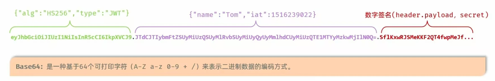

# 令牌校验

## 目录
- [JWT令牌](#jwt令牌)

### JWT令牌
* 全称：JSON Web Token ([https://jwt.io/](https://jwt.io/))
* 定义了以中国简洁的、自包含的格式，用于在通信双方以 json 数据格式安全的传输信息
* 组成：
    - 一：Header（头），记录令牌类型，签名算法等。例如：{"alg":"HS256","type":"JWT"}
    - 二：Payload（有效载荷），携带一些自定义信息、默认信息等。例如：{"id":1,"username":"Tom"}
    - 三：Signature（签名），防止 Token 被篡改、确保安全性。将 header、plyload **融入**，并**加入**指定秘钥，通过**指定签名算法**计算而来


> 在 Base64 编码中，有时候会在编号的末尾看见“=”，这是一个**补位**符号。


### 生成与解析
* 引入 jjwt 依赖
    ```xml
    <dependency>
        <groupId>io.jsonwebtoken</groupId>
        <artifactId>jjwt</artifactId>
        <version>0.9.1</version>
    </dependency>
    ```

* 调用官方提供的工具类 Jwts 来**生成**或**解析** jwt 令牌
    - **生成** JWT 令牌示例 Java 代码
    ```java
    @Test
    public void testGenJwt() {
        Map<String, Object> claims = new HashMap<>();
        //这个往 jwt 令牌中加入自定义信息
        claims.put("id", 10);   
        claims.put("username", "admin");

        String jwt = Jwts.builder().
            signWith(SignatureAlgorithm.HS256, "SVRIRULNQQ=="   ). //指定加密算法，秘钥
            setClaims(claims).  //设置自定义信息
            setExpiration(new Date(System.currentTimeMillis() + 12*3600*1000)). //设置令牌过期时间
            compact();  // 生成令牌
        System.out.println(jwt);
    }
    ```

    - **解析** JWT 令牌示例 Java 代码
    ```java
    @Test
    public void testParseJWT() throws Exception { 
        String jwt = "eyJhbGciOiJIUzI1NiJ9....";
        // Claims 本质是 Map
        Claims claims = Jwts.parser().
                setSigningKey("SVRIRULNQQ==").  // 指定解析秘钥
                parseClaimsJws(jwt).    // 解析令牌
                getBody();  // 获取令牌内容
        System.out.println(claims);
    }
    ```

> 两种报错：
> 1. 令牌被篡改之后进行解析会报错：MalformedJwtException
> 2. 令牌过期之后进行解析会报错：ExpiredJwtException