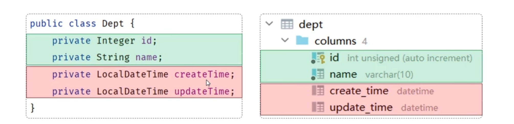

# 接口开发示例

## 目录
- [分层莲藕](#分层莲藕)  
- [数据封装](#数据封装)
- [Controller接收参数](#controller接收参数)
  - 请求地址
  - JSON响应
  - 路径参数
- [RequestMapping](#requestmapping)

### 分层莲藕
* Controller: 负责处理HTTP请求，调用Service层进行业务逻辑处理，并返回响应。
* Service: 封装业务逻辑，调用DAO层进行数据访问。
* Mapper/DAO: 负责与数据库进行交互，执行SQL语句。

### 数据封装
* **功能实现**：
    <details>
    <summary>Controller</summary>

    ```java
    @RestController
    public class DeptController {
        @Autowired
        private DeptService deptService;

        @GetMapping("/depts")
        public Result findAll() {
            List<Dept> depts = deptService.findAll();
            return Result.success(depts);
        }
    }
    ```

    </details>

    <details>
    <summary>Service</summary>

    ```java
    @Service
    public class DeptServiceImpl implements DeptService {
        @Autowired
        private DeptMapper deptMapper;

        @Override
        public List<Dept> findAll() {
            return deptMapper.findAll();
        }
    }
    ```

    </details>

    <details>
    <summary>Mapper</summary>

    ```java
    @Mapper
    public interface DeptMapper {
        @Select("SELECT * FROM dept order by update_time desc")
        List<Dept> findAll();
    }
    ```

    </details>

<br>

* **实体类属性名** 和 数据库表查询返回的字段名一致，**mybatis**会**自动**封装
* 如果 **实体类属性名** 和 数据库表查询返回的字段名不一致，**不能自动**封装



* **解决方法**：
    * **手动结果映射**：通过 @Result 以及 @Results 及进行手动映射

    <details>
    <summary>Mapper</summary>

    ```java
    @Results({
        @Result(column = "create_time", property = "createTime"),
        @Result(column = "update_time", property = "updateTime")
    })
    @Select("SELECT * FROM dept order by update_time desc")
    public List<Dept> findAll();
    ```

    </details>

    <br>

    * **起别名**： 在SQL语句中，对不一样的列名起别名，别名和实体类属性名一样

    <details>
    <summary>Mapper</summary>

    ```java
    @Select("select id, name, create_time createTime, update_time updateTime from dept order by update_time desc")
    public List<Dept> findAll();
    ```

    </details>

    <br>

    * **开启驼峰命名（推荐）**： 如果字段名与属性名符合驼峰命名规则，mybatis会自动通过驼峰命名规则映射

    <details>
    <summary>application.yml</summary>

    ```yml
    mybatis:
      configuration:
        map-underscore-to-camel-case: true
    ```

    </details>

<br>

### Controller接收参数
* **请求地址**：DELETE ___ /depts?id=1
  * **方式一**： 通过原始的 HttpServletRequest 接收参数
  ```java
  @DeleteMapping("/depts")
  public Result delete(HttpServletRequest request) {
      String idStr = request.getParameter("id");  //繁琐
      int id = Integer.parseInt(idStr);           //手动类型转换
      deptService.deleteById(id);
      return Result.success();
  }
  ```
  
  * **方式二**： 通过 Spring 提供的 @RequestParam 接收参数
  ```java
  @DeleteMapping("/depts")
  public Result delete(@RequestParam("id") Integer id) {
      deptService.deleteById(id);
      return Result.success();
  }
  ```
  > 一旦添加了 @RequestParam 注解，该参数必须传递，因为默认 required 属性为 true
  
  * **方式三（推荐）**： 如果请求参数名与形参变量名相同，直接定义方法形参即可接收（省略@RequestParam注解）
  ```java
  @DeleteMapping("/depts")
  public Result delete(Integer id) {
      deptService.deleteById(id);
      return Result.success();
  }
  ```

* **JSON响应**：
  * **规则**： JSON 数据的**键名**与方法形参**对象的属性名**相同，并需要使用 @RequestBody 注解标识
  * **请求体**： {"name": "教研部"}
  ```java
  @PostMapping("/depts")
  public Result add(@RequestBody Dept dept) {
      System.out.println("add dept : " + dept);
      deptService.add(dept);
      return Result.success();
  }
  ```
> 使用场景主要在 POST、PUT 请求中，在请求体传递请求参数

* **路径参数**： 通过请求 URL 直接传递参数，使用{...}来标识该路径参数，需要使用 @PathVariable 注解接收
  * 请求URL： /depts/1
  ```java
  @DeleteMapping("/depts/{id}")
  public Result getInfo(@PathVariable("id") Integer id) {
      System.out.println("getInfo id : " + id);
      deptService.getInfo(id);
      return Result.success(dept);
  }
  ```

### RequestMapping
* **用法**： 将请求映射到指定的处理类上
* **规范**： **完整**请求路径 = **类**上 **@RequestMapping** 的 value 属性 + **方法**上 **@RequestMapping** 的 value 属性
```java
/* 
在刚刚编写的接口中，请求路径 “/depts” 均为前缀
可以将这个前缀放在 Controller 类的 @RequestMapping 中
*/
@RequestMapping("/depts")
@RestController
public class DeptController {
    @Autowired
    private DeptService deptService;

    @GetMapping
    public List<Dept> list() {
        ...
    }

    @DeleteMapping
    public Result delete(Integer id) {
        ...
    }

    @PostMapping
    public Result add(@RequestBody Dept dept) {
        ...
    }

    @GetMapping("/{id}")
    public Result getInfo(@PathVariable("id") Integer id) {
        ...
    }
}
```