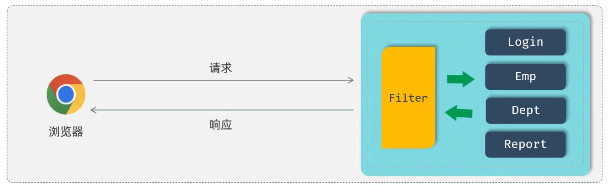
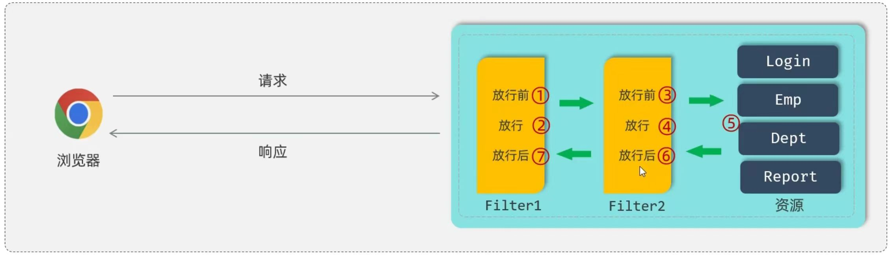
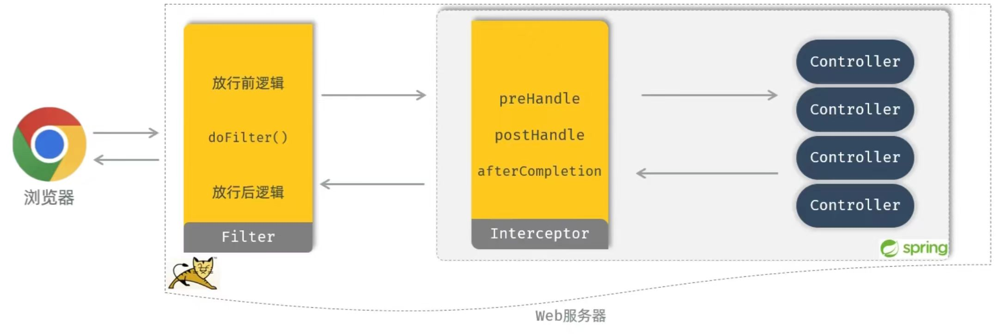

# 过滤与拦截
## 目录
- [过滤器](#过滤器filter)
    - [Filter 快速入门](#filter-快速入门)
    - [Filter 执行流程](#filter-执行流程)
    - [Filter 拦截路径](#filter-拦截路径)
    - [过滤器链](#过滤器链)
- [拦截器](#拦截器interceptor)
    - [Interceptor 快速入门](#interceptor-快速入门)
    - [Interceptor 拦截路径](#interceptor-拦截路径)
    - [Interceptor 执行流程](#interceptor-执行流程)
- [Filter 与 Interceptor 区别](#二者区别)

### 过滤器（Filter）
* **概念**：**Filter 过滤器**，是 JavaWeb 三大组件（Servlet、Filter、Listener）之一。
> 基于 Servlet，可以开发动态 Web 资源；Listener 是监听器， 这两个现在开发基本不用
* 过滤器可以把对资源的请求**拦截**下来，从而实现一些特殊的功能。
* 过滤器一般完成一些**通用**的操作，比如：登录校验、统一编码处理、敏感字符处理等。




#### Filter 快速入门
1. 定义 Filter：定义一个类，实现 Filter 接口，并实现其所有方法
2. 配置 Filter：Filter 类上加 @WebFilter 注解，配置拦截路径，引导类上加 @ServletComponentScan 开启 Servlet 组件支持

<details>
<summary><b>· 定义过滤器</b></summary>

```java
@WebFilter(urlPatterns = "/*")  // 拦截所有请求
public class DemoFilter implements Filter {
    //初始化方法，web服务器启动，创建Filter示例时调用，只调用一次
    public void init(FilterConfig filterConfig) throws ServletException {
        System.out.println("DemoFilter init...");
    }

    //拦截到请求时，调用该方法，可以调用多次
    public void doFilter(ServletRequest servletRequest, ServletResponse servletResponse, FilterChain chain) throws Exception {
        System.out.println("拦截到了请求...");
        // 拦截之后 需要放行 ↓
        chain.doFilter(servletRequest, servletResponse);
    }

    //销毁方法，web服务器关闭时调用，只调用一次
    public void destroy() {
        System.out.println("DemoFilter destroy...");
    }
}
```

</details>

> 过滤器存放在 com.exmple.filter 包下

<details>
<summary><b>· 配置过滤器</b></summary>

```java
@ServletComponentScan   //在引导类上加入此注解 开启过滤器支持
@SpringBootApplication
public class DemoApplication { }
```

</details>

---

#### Filter 执行流程
* 我们改造一下 doFilter 方法
```java
public void doFilter(ServletRequest request, ServletResponse response, FilterChain chain) throws Exception { 
    System.out.println("拦截请求... 执行前...");
    //放行
    chain.doFilter(request, response);
    System.out.println("拦截请求... 执行后...");
}
```

* 控制台输出：
```text
拦截请求... 执行前...
拦截请求... 执行后...
```

* **问题**：
    1. 问：放行后访问对应资源，资源访问完成后，还会返回到 Filter 中吗？<br>答：会
    2. 问：如果回到 Filter 中，是重新执行还是执行放行后的逻辑呢？<br>答：执行放行后的逻辑

---

#### Filter 拦截路径
* Filter 可以根据需求，配置不同的拦截资源路径：
* **@WebFilter(urlPatterns = "/*")**

| 拦截路径 | urlPatterns值 | 含义 |
| --- | --- | --- |
| 拦截具体路径 | /login | 只有访问 /login 路径时，才会被拦截 |
| 拦截目录 | /user/* | 只有访问 /user 目录下的所有资源时，才会被拦截 |
| 拦截所有 | /* | 所有资源都会被拦截 |

---

#### 过滤器链
* 介绍：一个 web 应用中，可以配置多个过滤器，这多个过滤器就形成了一个**过滤器链**。
* 顺序：注解配置的 Filter，优先级是按照过滤器类名（字符串）的自然排序。


---

### 拦截器（Interceptor）
* 概念：是一种动态拦截方法调用的机制，类似于过滤器。Spring 框架中共提的，主要用来动态拦截控制器方法的执行。
* 作用：拦截请求，在指定的方法调用前后，根据业务需要执行预先设定的代码。

#### Interceptor 快速入门
1. 定义拦截器，实现 HandlerInterceptor 接口，并实现其所有方法
2. 注册拦截器

<details>
<summary><b>· 定义拦截器</b></summary>

```java
@Component  // 由于拦截器是 Spring 提供的，所以交给 SpringIOC 容器来进行管理
public class DemoInterceptor implements HandlerInterceptor { 
    /**
     * 拦截到请求之后就会执行这个方法
     * 在目标资源方法执行之前执行，返回true：放行，返回false：不放行
     */
    @Override
    public boolean preHandle(HttpServletRequest request, HttpServletResponse response, Object handler) throws Exception { 
        return true;
    }

    /**
     * 在拦截请求方法后执行，返回true之后，就会调用资源的方法
     * 资源的方法执行完成之后，就会返回来执行这个方法
     * 目标资源方法执行后执行
     */
    @Override
    public void postHandle(HttpServletRequest request, HttpServletResponse response, Object handler, ModelAndView modelAndView) throws Exception { 
        System.out.println("preHandle...");
    }

    /**
     * 在早期开发的时候，前后端是不会进行分离开发的
     * 所以现在只需要了解这个方法即可
     * 视图渲染完毕后执行，最后执行
     */
    @Override
    public void afterCompletion(HttpServletRequest request, HttpServletResponse response, Object handler, Exception ex) throws Exception { 
        System.out.println("afterCompletion...");
    }
}
```

</details>

> 将 Interceptor 放入 com.example.interceptor 包下

<details>
<summary><b>· 注册拦截器</b></summary>

```java
@Configuration
public class WebConfig implements WebMvcConfigurer { 
    @Autowired
    private DemoInterceptor demoInterceptor;

    @Override
    public void addInterceptors(InterceptorRegistry registry) { 
        registry.addInterceptor(demoInterceptor).addPathPatterns("/**");    // 拦截所有
    }
}
```

</details>

> 将 WebConfig 放入 com.example.config 包下

---

#### Interceptor 拦截路径
* 拦截器可以根据需求，配置不同的拦截路径
    ```java
    @Override
    public void addInterceptors(InterceptorRegistry registry) {
        registry.addInterceptor(demoInterceptor).
            addPathPatterns("/**").     // 表示需要拦截哪些资源
            excludePathPatterns("/login");  //表示不需要拦截的资源
    }
    ```

| 拦截路径 | 含义 | 举例 |
| :----: | :----: | :----: |
| /* | 一级路径 | 能匹配 /depts，/emps，/login，**不能匹配 /depts/1** |
| /** | 任意路径 | **能**匹配 /depts，/depts/1，/depts/1/2 |
| /depts/* | /depts 下的一级路径 | 能匹配 /depts/1，**不能匹配 /depts/1/2，/depts** |
| /depts/** | /depts 下任意路径 | 能匹配 /depts，/depts/1，/depts/1/2，**不能匹配 /emps/1** |


---

#### Interceptor 执行流程
* **PS**：这次研究的是 **Interceptor** 和 **Filter** 同时存在的时候，执行的流程是怎样的。

> **理解**：Filter 是底层架构里的（父类），Interceptor是Spring框架里的（子类），框架是基于底层开发的，就相当于子类继承父类，子类的范围在父类之内。

<details>
<summary><b>· 演示代码 & 控制台输出</b></summary>

```java
public class DemoFilter implements Filter { 
    @Override
    public void doFilter(ServletRequest request, ServletResponse response, FilterChain chain) throws Exception { 
        System.out.println("拦截请求，放行前");
        chain.doFilter(request, response);
        System.out.println("拦截请求，放行后");
    }
}
```

```java
public class DemoInterceptor implements HandlerInterceptor {
    @Override
    public boolean preHandle(HttpServletRequest request, HttpServletResponse response, Object handler) throws Exception { 
        System.out.println("preHandle...");
        return true;
    }

    @Override
    public void postHandle(HttpServletRequest request, HttpServletResponse response, Object handler, ModelAndView modelAndView) throws Exception { 
        System.out.println("postHandle...");
    }

    @Override
    public void afterCompletion(HttpServletRequest request, HttpServletResponse response, Object handler, Exception ex) throws Exception { 
        System.out.println("afterCompletion...");
    }
}
```

```text
拦截请求，放行前
preHandle...
（执行资源的日志输出）
postHandle...
afterCompletion...
拦截请求，放行后
```

</details>

---

### 二者区别
1. **接口规范不同**：过滤器需要实现 Filter 接口，而拦截器需要实现 HandlerInterceptor 接口。
2. **拦截范围不同**：过滤器 Filter 会拦截所有的资源，而 Interceptor 只会拦截 Spring 环境中的资源。