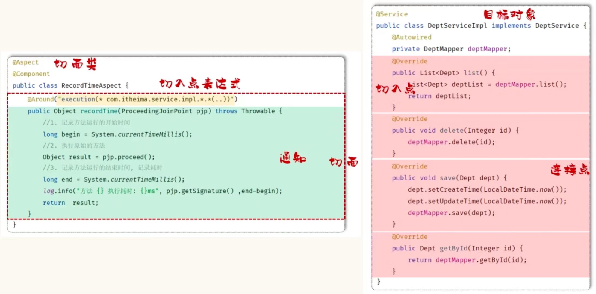
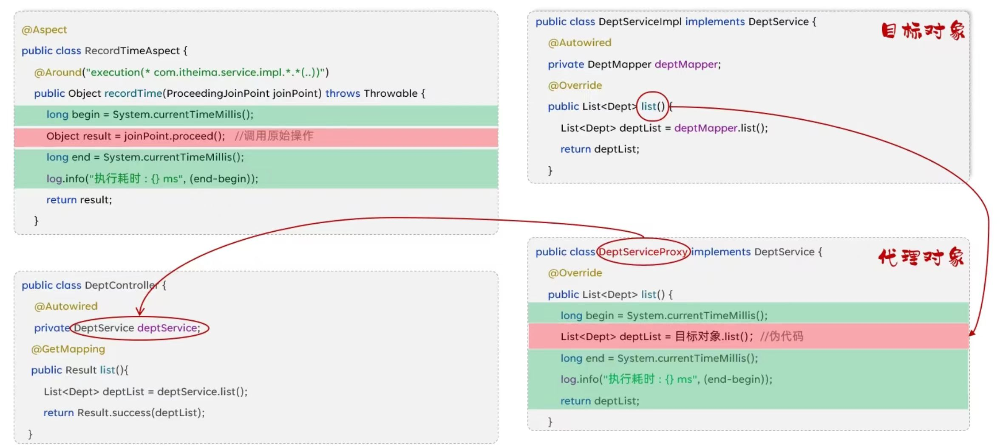

# SpringAOP
## 目录
- 前言
    - [什么是 AOP](#什么是-aop)
- [AOP 基础](#aop-基础)
    - [AOP 快速入门](#aop-快速入门)
    - [AOP 核心概念](#aop-核心概念)
- [AOP 进阶](#aop-进阶)
    - [通知类型](#通知类型)
    - [通知顺序](#通知顺序)
    - 切入点表达式
        - [execution](#切入点表达式---exeution)
        - [annotation](#切入点表达式---annotation)
    - [连接点](#连接点)
- [AOP 案例](#aop-案例)

---

## 前言
### 什么是 AOP
- **AOP**：Aspect Oriented Programming（**面向切面编程**、**面向方面编程**），可简单理解为就是面向特定方法编程
- 场景：案例中部分业务方法运行较慢，定位执行耗时较长的方法，此时需要统计每一个业务方法的执行耗时

<details>
<summary><b>· 简单示例</b></summary>

```java
@Slf4j
@Aspect // 标识当前是一个 AOP 类
@Component
public class RecordTimeAspect { 
    // 对 com.example.service 包下 所有类或者接口 的 所有方法 进行编程
    @Around("execution(* com.example.service.*.*(..))")
    public Object recordTime(ProceedingJoinPoint pjp) throws Throwable {
        long beginTime = System.currentTimeMillis();
        Object result = pjp.proceed();
        long endTime = System.currentTimeMillis();
        log.info("执行耗时：{} ms", endTime - beginTime);
        return result;
    }
}
```

</details>

- **优势**
    - 减少重复代码
    - 代码无入侵
    - 提高开发效率
    - 维护方便
> AOP是一种思想，而在Spring框架中对这种思想的实现，那我们要学习的就是Spring AOP

---

## AOP 基础
### AOP 快速入门
- 需求：统计所有业务层方法的执行耗时

<details>
<summary><b>1. 引入依赖</b></summary>

```xml
<dependency>
    <groupId>org.springframework.boot</groupId>
    <artifactId>spring-boot-starter-aop</artifactId>
</dependency>
```

</details>

<details>
<summary><b>2. 编写 AOP 程序</b></summary>

```java
@Slf4j
@Aspect
@Component
public class RecordTimeAspect { 
    @Around("execution(* com.example.service.impl.*.*(..))")
    public Object recordTime(ProceedingJoinPoint joinPoint) throws Throwable { 
        long beginTime = System.currentTimeMillis();
        Object result = joinPoint.proceed();
        long endTime = System.currentTimeMillis();
        log.info("方法：{}，耗时：{} ms", joinPoint.getSignature(), endTime - beginTime);
        return result;
    }
}
```

</details>

### AOP 核心概念
* **连接点**：JoinPoint，可以被 AOP 控制的**方法**（暗含方法执行时的相关信息）
* **通知**：Advice，指那些重复的逻辑，也就是**共性功能**（最终体现为一个**方法**）
* **切入点**：Pointcut，匹配连接点的条件，通知仅会在切入点方法执行时被占用
* **切面**：Aspect，描述**通知**与**切入点**的对应**关系**（通知 + 切入点）
* **目标对象**：Target，通知所应用的对象

> 切入点一定是连接点，连接点不一定是切入点

<br>

### AOP 执行流程
- **AOP** 是基于 **动态代理** 来实现的
1. AOP 会为目标对象**创建**代理对象
2. 代理对象会交给 SpringIOC 容器管理
3. 在 Controller 层注入的时候，会将**代理对象**注入到 Controller 中
4. 当 Controller 层执行方法的时候，执行的是**代理对象的方法**


<br>

- **代码跳转流程**
1. 请求进入 Controller 层，Controller 层会调用**动态代理对象**的方法
2. 此时会**跳转进入**到 **AOP** 的方法当中，直到`Object result = pjp.proceed();`执行
3. 这时候就会进入 **ServiceImpl 实现的方法**逻辑当中
4. 然后跳**转回 AOP 的方法**，执行完`return result;`
5. 最后回到 Controller 层，返回结果给前端

---

## AOP 进阶
### 通知类型
1. **@Around**：环绕通知，此注解标注的通知方法在**目标**方法**前**、**后**都被**执行**
2. **@Before**：前置通知，此注解标注的通知方法在**目标**方法**前**被**执行**
3. **@After**：后置通知，此注解标注的通知方法在**目标**方法**后**被**执行**，**无论是否有异常都会执行**
4. **@AfterReturning**：返回后通知，此注解标注的通知方法在**目标**方法**后**被执行，**有异常不会执行**
5. **@AfterThrowing**：异常后通知，此注解标注的通知方法**发生异常后执行**
> @Around 环绕通知需要自己调用 ProceedingJoinPoint.proceed() 来让目标方法执行
> @Around 环绕通知方法的返回值，必须指定为 Object，来接收目标方法的返回值
> @Around 相对来说会比较重要

<details>
<summary><b>· 通知类型示例</b></summary>

```java
@Slf5j
@Aspect
@Component
public class MyAspect { 
    // 前置通知 - 运行目标方法前运行
    @Before("execution(* com.example.service.impl.*.*(..))")
    public void before() {
        log.info("before...");
    }

    // 环绕通知 - 运行目标方法前、后运行
    @Around("execution(* com.example.service.impl.*.*(..))")
    public Object around(ProceedingJoinPoint joinPoint) throws Throwable { 
        log.info("around... before...");
        Object proceed = joinPoint.proceed();
        log.info("around... after...");
        return result;
    }

    // 后置通知 - 运行目标方法后运行
    @After("execution(* com.example.service.impl.*.*(..))")
    public void after() {
        log.info("after...");
    }

    //返回后通知 - 运行目标方法后运行，出现异常不运行
    @AfterReturning("execution(* com.example.service.impl.*.*(..))")
    public void afterReturning() {
        log.info("afterReturning...");
    }

    //异常通知 - 运行目标方法出现异常时运行
    @AfterThrowing("execution(* com.example.service.impl.*.*(..))")
    public void afterThrowing() {
        log.info("afterThrowing...");
    }
}
```

</details>


<details>
<summary><b>· 控制台输出（正常执行）</b></summary>

```text
around... before...
before...
目标资源运行...
afterReturning...
after...
around... after...
```

</details>

<details>
<summary><b>· 控制台输出（异常）</b></summary>

```text
around... before...
before...
目标资源运行...
afterThrowing...
after...
```

</details>


### PointCut
* 该注解的作用是将**公共的切点表达式**抽取出来，需要用到时**引用**该切点表达式即可
* **@Pointcut** 注解标注的方法**权限修饰符**：
    * **public**：在其他外部的切面类中可以引用该表达式
    * **private**：仅能在当前切面类中引用该表达式
```java
@Pointcut("execution(* com.example.service.impl.*.*(..))")
public void pt() {}

@Around("pt()")
public Object around(ProceedingJoinPoint joinPoint) throws Throwable { }
```

### 通知顺序
* 当有多个切面的切入点都匹配到了目标方法，目标方法运行时，多个通知方法都会被执行
* **执行顺序**：
  * 不同类中，**默认**按照**切面类的类名字母排序**：
    * 目标方法**前**：字母排名靠**前**的**先执行**
    * 目标方法**后**：字母排名靠**后**的**先执行**

<details>
<summary><b>· 示例代码</b></summary>

```java
@Slf4j
@Aspect
@Component
public class MyAspect2 { 
    @Before("execution(* com.example.service.impl.*.*(..)")
    public void before() {
        log.info("MyAspect2 before");
    }

    @After("execution(* com.example.service.impl.*.*(..)")
    public void after() {
        log.info("MyAspect2 after");
    }
}
```

```java
@Slf4j
@Aspect
@Component
public class MyAspect3 { 
    @Before("execution(* com.example.service.impl.*.*(..)")
    public void before() {
        log.info("MyAspect3 before");
    }

    @After("execution(* com.example.service.impl.*.*(..)")
    public void after() {
        log.info("MyAspect3 after");
    }
}
```

```java
@Slf4j
@Aspect
@Component
public class MyAspect4 { 
    @Before("execution(* com.example.service.impl.*.*(..)")
    public void before() {
        log.info("MyAspect4 before");
    }

    @After("execution(* com.example.service.impl.*.*(..)")
    public void after() {
        log.info("MyAspect4 after");
    }
}
```

</details>

<details>
<summary><b>· 控制台输出</b></summary>

```text
MyAspect2 before
MyAspect3 before
MyAspect4 before
目标资源执行...
MyAspect4 after
MyAspect3 after
MyAspect2 after
```

</details>

<br>

* 用**注解控制**执行顺序（**推荐**）
  * **@Order**
    * 目标方法**前**：**数字小**的**先**执行
    * 目标方法**后**：**数字小**的**后**执行
```java
@Slf4j
@Order(5)
@Aspect
@Component
public class RecordTimeAspect { }
```

### 切入点表达式
* 介绍：描述切入点方法的一种表达式
* 作用：用来决定项目中的哪些方法需要加入通知
* 常见形式：
  1. **execution(...)**：根据方法的签名来匹配
    ```java
    @Before("execution(public void com.example.service.impl.DeptServiceImpl.delete(java.lang.Integer))")
    public void before(JoinPoint joinPoint) { }
    ```
  2. **@annotation(...)**：根据方法的注解来匹配
    ```java
    @Before("@annotation(com.example.anno.Log)")
    public void before() { }
    ```

#### 切入点表达式 - exeution
* execution 主要根据方法的返回值、包名、类名、方法名、方法参数等信息来匹配，语法为：
    ```bath
    execution(访问修饰符? 返回值 包名.类名.?方法名（方法参数） throws 异常?)
    ```
    * 其中带"?"的表示可以省略
    1. 访问修饰符：可省略（比如：public、protected）
    2. 包名.类名： 可省略 <b>（不建议省略）</b>
    3. throws 异常： 可省略（注意是方法上声明抛出的异常，不是实际抛出的异常）

    * 可以使用通配符描述切入点
    1. \* ：单个独立的任意符号，可以通配任意返回值、包名、类名、方法名、任意类型的一个参数，也可以通配包、类、方法名的一部分
        ```text
        execution(* com.*.service.*.update*(*))
        ```
    2. .. ：多个连续的任意符号，可以通配任意层级的包，或任意类型、任意个数的参数
        ```text
        execution(* com.example..DeptService.*(..))
        ```

<details>
<summary><b>· execution示例</b></summary>

```java
@Slf4j
@Aspect
@Component
public class DemoAspect { 
    //前置通知 - 示例1
    @Before("execution(public void com.example.service.impl.DeptServiceImpl.detele(java.lang.Integer))")
    public void before() {
        log.info("DemoAspect -> before ...");
    }

    //前置通知 - 示例2
    @Before("execution(void com.example.service.impl.DeptServiceImpl.detele(java.lang.Integer))")
    public void before() {
        log.info("DemoAspect -> before ...");
    }

    //前置通知 - 示例3
    @Before("execution(void detele(java.lang.Integer))")    // 包名、类名都省略 但是强烈不推荐省略
    public void before() {
        log.info("DemoAspect -> before ...");
    }

    //前置通知 - 示例4
    @Before("execution(* com.example.service.impl.DeptServiceImpl.detele(java.lang.Integer))")
    public void before() {
        log.info("DemoAspect -> before ...");
    }

    //前置通知 - 示例5 （匹配前缀为"del"的方法）
    @Before("execution(* com.example.service.impl.*.del*(java.lang.Integer)")
    public void before() {
        log.info("DemoAspect -> before ...");
    }

    //前置通知 - 示例6 （com下所有层级下 service.impl 包下 DeptServiceImpl 类下的 delete 方法）
    @Before("execution(* com..service.impl.DeptServiceImpl.detele(java.lang.Integer))")
    public void before() {
        log.info("DemoAspect -> before ...");
    }

    //前置通知 - 示例7 （匹配所有形参）
    @Before("execution(* com.example.service.impl.DeptServiceImpl.detele(..))")
    public void before() {
        log.info("DemoAspect -> before ...");
    }
}
```

</details>

<details>
<summary><b>· execution 练习</b></summary>

* 需求：匹配 list 与 delete 方法
```java
@Slf4j
@Aspect
@Component
public class DemoAspect {
    @Before("execution(* com.example.service.impl.DeptServiceImpl.list(..)) ||" +
     "execution(* com.example.service.impl.DeptServiceImpl.delete(..))")
    public void before() {
        log.info("DemoAspect -> before ...");
    }
}
```
> 可以使用逻辑运算符来进行复杂的匹配

</details>


#### 切入点表达式 - @annotation
* annotation：根据方法上的注解来进行匹配
* 需要在 com.example.anno 包下创建注解类

<details>
<summary><b>· annotation 示例</b></summary>

```java
@Slf4j
@Aspect
@Component
public class DemoAspect { 
    @Around("@annotation(com.example.anno.LogOperation)")   // 这里加入的是 LogOperation 注解类的全类名
    public Object logAround(ProceedingJoinPoint joinPoint) throws Throwable { 
        long startTime = System.currentTimeMillis();
        Object result = joinPoint.proceed();
        long endTime = System.currentTimeMillis();
        log.info("耗时：{}", endTime - startTime);
    }
}
```

```java
@Target(ElementType.METHOD) // 注解作用在方法上
@Retention(RetentionPolicy.RUNTIME) // 运行时生效
public @interface LogOperation {}
```

```java
@Slf4j
@Component
public class DeptController { 
    @LogOperation
    @DeleteMapping("/{id}")
    public String delete(@PathVariable Integer id) { 
        log.info("根据 id 删除部门：{}", id);
        deptService.
    }
}
```

</details>


### 连接点
* 在 Spring 中用 **JoinPoint** 抽象了连接点，用它可以获得方法执行时的相关信息，如目标类名、方法名、方法参数等。
    * 对于 @Around 通知，获取连接点的信息只能使用 ProceedingJoinPoint
    * 对于其他四种通知，获取连接点信息只能使用 JoinPoint，他是 ProceedingJoinPoint 的父类型

<details>
<summary><b>· 示例</b></summary>

```java
// (@Around) 环绕通知示例
@Around("execution(* com.example.service.DeptService.*(..))")
public Object around(ProceedingJoinPoint joinPoint) throws Throwable { 
    String className = joinPoint.getTarget().getClass().getName();  // 获取目标类名
    Signature signature = joinPoint.getSignature(); // 获取目标方法签名
    String methodName = signature.getName();    // 获取目标方法名
    Object[] args = joinPoint.getArgs();    // 获取目标方法运行参数
    Object res = joinPoint.proceed();   // 执行原始方法，获取返回值（环绕通知）
    return res;
}

// (@Before) 前置通知示例
@Before("execution(* com.example.service.DeptService.*(..))")
public void before(JoinPoint joinPoint) {
    String className = joinPoint.getTarget().getClass().getName();  // 获取目标类名
    Signature signature = joinPoint.getSignature(); // 获取目标方法签名
    String methodName = signature.getName();    // 获取目标方法名
    Object[] args = joinPoint.getArgs();    // 获取目标方法运行参数
}
```

</details>


## AOP 案例
