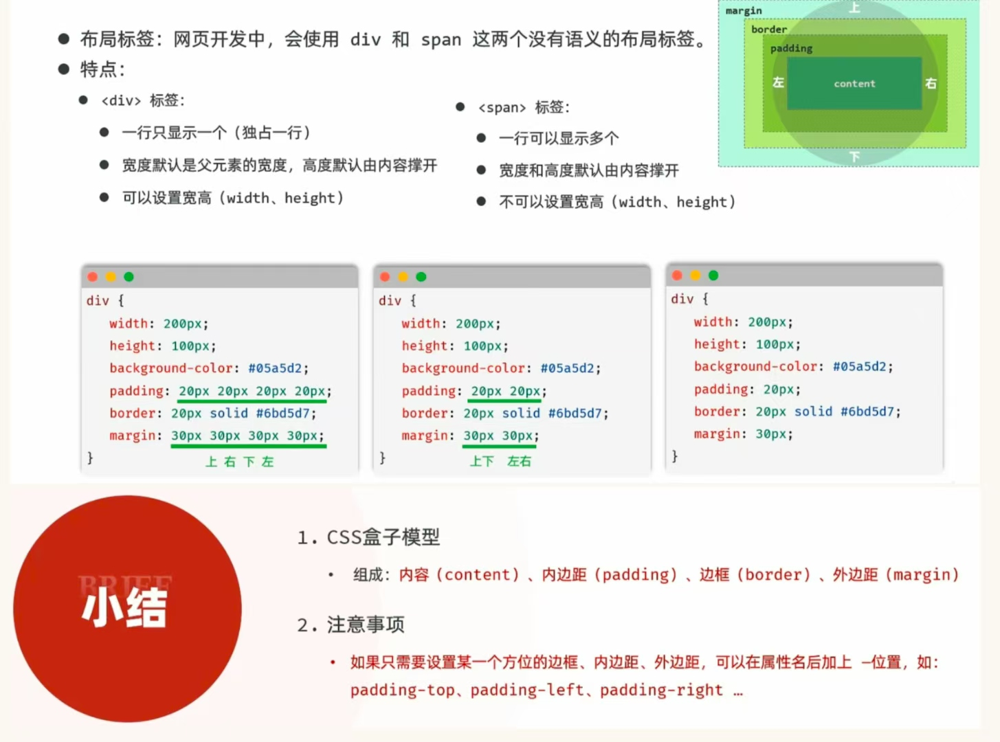

# HTML & CSS
## 目录
- [Web标准（网页标准）](#web标准网页标准)
  - [什么是HTML](#什么是html)
  - [什么是CSS](#什么是css)
  - [HTML快速入门](#html-快速入门)
  - [HTML标签特点](#html-标签的特点)

### Web标准（网页标准）
* 由三个部分组成：
    1. HTML ： 负责网页的结构（页面元素和内容）
    2. CSS ： 负责网页的表现（页面元素的外观、位置等页面样式，如：颜色、大小等）
    3. JavaScript ： 负责网页的交互（交互效果）
##### 什么是HTML
* HTML (HyperText Markup Language) ： 超文本标记语言
    * 超文本：超越了文本的限制，比普通文本更强大。除了文字信息，还可以定义照片、音频、视频等内容
    * 标记语言：由标签“<标签名>”构成的语言
    * 入门级HTML程序：
    ```html
    <h1>HTML 入门程序</h1>
    
    ```
##### 什么是CSS
* CSS (Cascading Style Sheets) ： 层叠样式表，用于控制页面的样式（表现）。
```html
<!-- 这个是加入了CSS的HTML程序 -->>
<h1 style="color: red;">HTML 入门程序</h1>

```
##### HTML 快速入门
1. 新建文本文件，后缀名改为 .html
2. 编写HTML的基本骨架，定义标题
3. 在\<body>中填写内容
* 在\<head>标签内是**网页头部**：用来存放给浏览器的信息，如：CSS样式<br>在\<body>中标签内是**网页主体**：用来存放给用户看的信息，如：文字、图片、视频
```html
<html>
    <head>
        <title>HTML 快速入门</title>
    </head>
    <body>
        <h1>Hello HTML</h1>
        
    </body>
</html>
```
##### HTML 标签的特点
* html标签不区分大小写，**建议小写**
* html标签的属性值使用单引号/**双引号**都可以
* html语法结构松散，但是**建议规范书写**

### HTML + CSS
##### 标题样式
* CSS引入方式：
    * 行内样式：写在标签的 style 属性中（配合JavaScript使用）
    ```html
    <span style="color: grey;">2024年5月1日</span>
    ```
    * 内部样式：写在 style 标签中（可以写在页面任何位置，但通常约定写在head白标签中）
    ```html
    <style>
        span{
            color: grey;
        }
    </style>
    ```
    * 外部样式：写在一个单独的.css文件中（需要通过 link 标签在页面中引入）
    ```css
    span {
        color: grey;
    }
    ```
    ```html
    <link rel="stylesheet" href="style.css">
    ```
##### 颜色表示形式：
| 表示方式         | 属性值            | 说明                                 | 示例                        |
|:---------------:|:-----------------:|:-----------------------------------:|:---------------------------:|
| 关键字          | 颜色英文单词      | red、green、blue                    | red、green、blue            |
| rgb表示法       | rgb(r,g,b)       | 红绿蓝三原色，取值：0-255           | rgb(255,0,0)、rgb(0,255,0)  |
| rgba表示法      | rgba(r,g,b,a)    | 透明度，取值：0-1                   | rgba(255,0,0,0.5)、rgba(0,255,0,0.5) |
| 十六进制表示法  | #RRGGBB          | #开头，将数字转换成十六进制表示      | #FF0000、#00FF00            |

##### CSS选择器
| 选择器         | 写法                            | 示例                    | 示例说明                                         |
|:--------------:|:-------------------------------:|:-----------------------:|:-----------------------------------------------:|
| **元素选择器** | 元素名称{...}                   | h1{...}                | 选择页面上所有\<h1>标签                         |
| **类选择器**   | .class属性值{...}              | .cls{...}              | 选择页面上所有class="class"的标签              |
| **ID选择器**   | #id属性值{...}                 | #hid{...}              | 选择页面上所有id="hid"的标签                    |
| 分组选择器     | 选择器1,选择器2{...}           | h1,h2{...}             | 选择页面上所有\<h1>和\<h2>标签                 |
| 属性选择器     | 元素名称[属性]{...}            | input[type]{...}       | 选择页面上有type属性的\<input>标签             |
| 属性选择器     | 元素名称[属性名="值"]{...}     | input[type="text"]{...}| 选择页面上有type属性值为text的\<input>标签      |
| 后代选择器     | 元素1 元素2 {...}              | form input {...}       | 选择\<form>标签内的所有\<input>标签            |

* 常见三类选择器：
  * 元素选择器、类选择器、ID选择器
  * 优先级：id > 类 > 元素

#### 盒子模型


