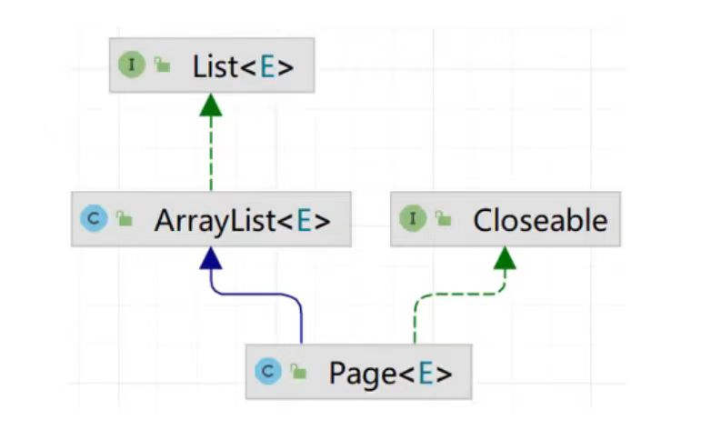

# 分页查询
## 目录
- [实体类准备](#实体类准备)
- [原始实现](#原始实现)
    - [SQL 语句分析](#sql-语句分析)
    - [逻辑实现](#逻辑实现)
- [PageHelper](#pagehelper)
    - [引入依赖](#引入依赖)
    - [定义mapper接口](#定义-mapper-接口查询方法)
    - [逻辑层](#逻辑层)
    - [实现机制](#pagehelper-实现机制)
    - [不会二次执行](#不会二次执行)
- [分页条件查询](#分页条件查询)
    - [条件变化](#条件变化)

### 实体类准备
```java
@Data
@AllArgsConstructor
@NoArgsConstructor
public class PageResult<T> {
    private Long total; // 总记录数
    private List<T> rows;   // 当前页数据
}
```

---

### 原始实现
#### SQL 语句分析
```sql
-- 查询索引从 0 开始的 10 条数据（第一页）
select * from emp limit 0,10;

-- 查询索引从 10 开始的 10 条数据（第二页）
select * from emp limit 10,10;
```
- **分析**：根据上面的例子，我们的出一条公式
> **公式**：select * from emp limit (当前页码 - 1) * 每页条数, 每页条数;

#### 逻辑实现

<details>
<summary><b>· Controller</b></summary>

```java
@Slf4j
@RestController
@RequestMapping("/emp")
public class EmpController { 
    @GetMapping
    public Result page(@RequestParam(defaultValue = "1")Integer page,
                        @RequestParam(defaultValue = "10") Integer pageSize) {
        log.info("分页请求参数：{}, {}", page, pageSize);
        PageResult<Emp> pageResult = empService.page(page, pageSize);
        return Result.success(pageResult);
    }
}
```

</details>

<details>
<summary><b>· Service</b></summary>

```java
public interface EmpService {
    public PageResult<Emp> page(Integer page, Integer pageSize);
}
```

```java
@Service
public class EmpServiceImpl implements EmpService { 
    @Override
    public PageResult<Emp> page(Integer page, Integer pageSize) { 
        //1. 获取总记录数
        Long count = empMapper.count();
        //2. 获取每一页的数据列表
        Integer start = (page - 1) * pageSize;
        List<Emp> items = empMapper.list(start, pageSize);
        //3. 封装分页结果
        return new PageResult<>(count, items);
    }
}
```

</details>

<details>
<summary><b>· Mapper</b></summary>

```java
@Mapper
public interface EmpMapper {
    @Select("select count(*) from emp e left join dept d on e.dept_id = d.id") 
    public Long count();

    @Select("select * from emp e left join dept d on e.dept_id = d.id limit #{start}, #{pageSize}")
    public List<Emp> list(Integer start, Integer pageSize);
}
```

</details>

---

### PageHelper
* PageHelper 是第三方提供的在 MyBatis 框架中用来实现分页的插件，用来**简化分页操作**，**提高开发效率**

##### 引入依赖
```xml
<dependency>
    <groupId>com.github.pagehelper</groupId>
    <artifactId>pagehelper-spring-boot-starter</artifactId>
    <version>1.4.7</version>
</dependency>
```

##### 定义 mapper 接口查询方法
- 在这个 mapper 接口中，无需考虑分页的逻辑
    ```java
    public interface EmpMapper {
        @Select("select * from emp e left join dept d on e.dept_id = d.id order by e.updated_time desc") 
        public PageResult<Emp> list();
    }
    ```

##### 逻辑层
```java
public class EmpServiceImpl implements EmpService {
    @Autowired
    private EmpMapper empMapper;

    @Override
    public PageResult<Emp> list(Integer page, Integer pageSize) {
        //1. 设置分页参数
        PageHelper.startPage(page, pageSize);
        //2. 调用 Mapper 接口方法
        List<Emp> list = empMapper.list();
        //3. 解析并封装结果
        Page<Emp> p = (Page<Emp>) list; // Page 本质就是 List 的子类
        return new PageResult<Emp>(p.getTotal(), p.getResult());
    }
}
```



#### PageHelper 实现机制
1. PageHelper 会拦截 Mapper 的方法要执行的 SQL 语句
2. 会执行一次 `selsect count(0) from emp e left join dept d on e.dept_id = d.id`语句
3. 然后再执行 `select * from emp e left join dept d on e.dept_id = d.id order by e.update_time desc limit ?, ?`的预编译
4. 传入对应的参数值，然后进行查询
5. 最后封装到 Page 对象中，并将结果返回
> 由于 PageHelper 拦截机制，Mapper 接口中所编写的 SQL 语句不能加入";"

#### 不会二次执行
- 若是我们直接加入第二次的分页查询操作，则不会执行第二次的分页查询操作
- PageHelper 只会对紧跟在其后的第一条 SQL 语句进行分页处理

<details>
<summary><b>· 示例代码</b></summary>

```java
public class EmpServiceImpl implements EmpService {
    @Autowired
    private EmpMapper empMapper;

    @Override
    public PageResult<Emp> list(Integer page, Integer pageSize) {
        //1. 设置分页参数
        PageHelper.startPage(page, pageSize);
        //2. 调用 Mapper 接口方法
        List<Emp> list = empMapper.list();
        List<Emp> list2 = empMapper.list(); // 这一条语句并不会执行分页操作
        //3. 解析并封装结果
        Page<Emp> p = (Page<Emp>) list; // Page 本质就是 List 的子类
        return new PageResult<Emp>(p.getTotal(), p.getResult());
    }
}
```

</details>

---

### 分页条件查询
* **请求参数**：`/emps?name=张&gender=1&begin=2007-09-01&end=2022-09-01&page=1&pageSize=10`

<details>
<summary><b>· 单参数 Controller</b></summary>

```java
@GetMapping
public Result page(@RequestParam(defaultValue = "1")Integer page,
                @RequestParam(defaultValue = "10")Integer pageSize,
                String name, Integer gender,
                @DateTimeFormat(pattern = "yyyy-MM-dd") LocalData begin,
                @DateTimeFormat(pattern = "yyyy-MM-dd") LocalData end) {
    log.info("分页条件查询，参数：page={}, pageSize={}, name={}, gender={}, begin={}, end={}", page, pageSize, name, gender, begin, end);
    ...
}
```

</details>

<br>

> 如果 Controller 方法的参数较多，且未来可能继续增加，这会使得方法的签名变得复杂难以维护，此时可以考虑将多个请求参数封装为一个对象

<details>
<summary><b>· 实体类</b></summary>

```java
@Data
public class EmpQueryParam {
    private Integer page;   // 当前页码
    private Integer pageSize;   // 每页记录数
    private String name;    // 员工姓名
    private Integer gender; // 员工性别
    @DateTimeFormat(pattern = "yyyy-MM-dd")
    private LocalDate begin;    // 开始日期
    @DateTimeFormat(pattern = "yyyy-MM-dd")
    private LocalDate end;  // 结束日期
}
```

</details>

<details>
<summary><b>· EmpController</b></summary>

```java
@GetMapping
public Result page(EmpQueryParam empQueryParam) {
    log.info("分页查询员工信息，参数：{}", empQueryParam);
    PageResult<Emp> pageResult = empService.page(empQueryParam);
    return Result.success(pageResult);
}
```

</details>

<br>

#### 条件变化
* 由于每次查询的条件并非都是一样的，可能条件数量也会发生变化，这个时候我们就要使用 **动态SQL** 了。
* **动态SQL学习**：[动态SQL学习笔记](../MyBatis/动态SQL语句.md)
* 我们将 EmpMapper 中的方法改成使用 XML 映射文件来实现
```xml
<mapper namespace="com.example.mapper.EmpMapper">
    <select id="list" resultType="com.example.pojo.Emp">
        SELECT e.*, d.name AS deptName
        FROM emp e LEFT JOIN dept d ON e.dept_id = d.id
        <where>
            <if test="name != null and name != ''">
                AND e.name LIKE CONCAT('%', #{name}, '%')
            </if>
            <if test="gender != null">
                AND e.gender = #{gender}
            </if>
            <if test="begin != null">
                AND e.entry_date >= #{begin, jdbcType=DATE}
            </if>
            <if test="end != null">
                AND e.entry_date <![CDATA[ <= ]]> #{end, jdbcType=DATE}
            </if>
        </where>
        ORDER BY e.update_time DESC
    </select>
</mapper>
```