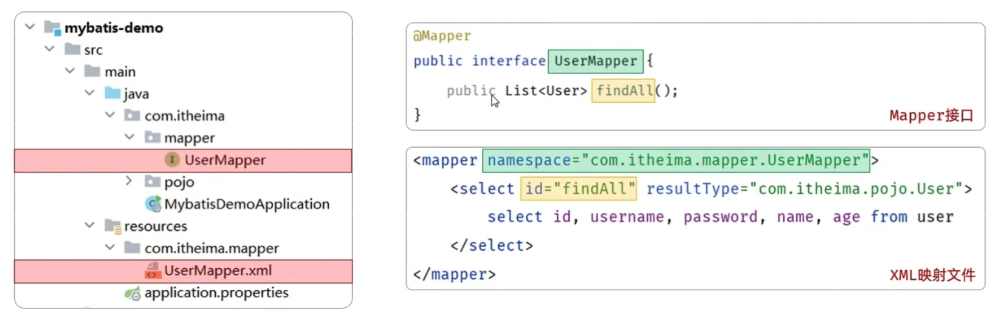

# 增删改查 & XML映射表

---

## 目录
[增删改查](#增删改查)
[删除用户](#删除用户)
[新增用户](#新增用户)
[修改用户](#修改用户)
[查询用户](#查询用户)
[XML映射](#xml映射)

---

### 增删改查
* **前置：** 
    * **写法**：
    ```java
    @Delete("delete from user where id = #{id}")
    public void deleteById(Integer id);
    ```
    * **参数**：

| 符号 | 说明 | 场景 | 优缺点 |
|:------:|:------:|:---:|:---:|
| #{...} | 占位符 执行时，会将#{...}替换为？，生成预编译SQL | 参数值传递 | 安全、性能高（推荐） |
| ${...} | 拼接符 直接将参数拼接在SQL语句中，存在SQL注入问题 | 表名、字段动态设置时使用 | 不安全、性能低 | 

<br>

#### 删除用户
* **需求**： 根据ID删除用户
* **SQL**： delete from user where id = 5
* **Mapper接口**：
```java
@Delete("delete from user where id = #{id}")
public int deleteUserById(Integer id);
```

#### 新增用户
* **需求**： 添加一个用户
* **SQL**：insert into user(username,password,name,age) values('zhouyu', '123456', '周瑜', 20);
* **Mapper接口**：
```java
@Insert("insert into user(username,password,name,age) values(#{username}, #{password}, #{name}, #{age})")
public void update(User user);
```
> 注意：
> 1. values()中的 #{} 的参数名称 要和实体类的属性名称一致
> 2. 实体类必须具有属性的 getter 和 setter 方法

<br>

#### 修改用户
* **需求**： 根据ID更新用户信息
* **SQL**：update user set username='zhouyu', password = '123456', name = '周瑜', age = 20 where id = 1;
* **Mapper接口**：
```java
@Update("update user set username=#{username}, password = #{password}, name = #{name}, age = #{age} where id = #{id}")
public void update(User user);
```

<br>

#### 查询用户
* **需求**： 根据用户名和密码查询用户信息
* **SQL**：select * from user where username = 'zhouyu' and password = '123456';
* **Mapper接口**：
```java
@Select("select * from user where username = #{username} and password = #{password}")
public User findByUsernameAndPassword(@Param("username") String username, 
                                    @Param("password") String password);
```
> @Param 注解的作用是为接口的方法形参起名字
* **说明**：基于官方股价创建的springboot项目中，接口编译时会保留方法形参名，@Param注解可省略

<details>
<summary>Mapper接口（官方骨架版本代码）</summary>

```java
@Select("select * from user where username = #{username} and password = #{password}")
public User findByUsernameAndPassword(String username, String password);
```

</details>

<br>

### XML映射
* **配置**：
    * 在 MyBatis 中，既可以通过注解配置SQL语句，也可以通过XML配置文件配置SQL语句
    * **默认规则**：
        1. XML 映射文件的名称和 Mapper 接口名称一致，并且将 XML 映射文件和 Mapper 接口放在相同包下（同包同名）
        2. XML 映射文件的 namespace 属性为 Mapper 接口全限定名一致
        3. XML 映射文件中 sql 语句的 id 和 Mapper 接口中的方法名保持一致，并且返回类型一致

[官方说明](https://mybatis.net.cn/getting-started.html)


* **辅助**：
1. 配置 XML 映射文件的位置：
```properties
# application.properties
# MyBatis配置文件位置
mybatis.mapper-locations=...（文件位置）
```

2. MybatisX 是一个 MyBatis 插件，用于在 IDEA 中开发 MyBatis 项目。
   * **安装**：在 IDEA 中打开插件市场，搜索 MybatisX 并安装
   * **功能**：提供 XML 映射文件的自动补全、跳转、重构等功能