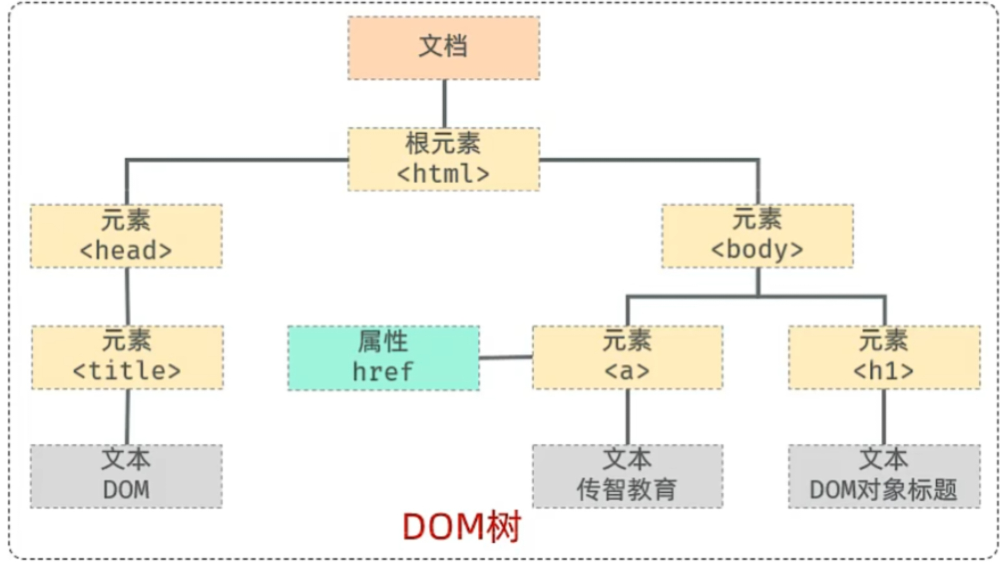

# JavaScript 基础笔记
## 目录 {#menu}

- [JS引入方式](#js引入方式)
- [变量与常量](#变量与常量)
- [函数](#函数)
- [输出语句](#输出语句)
- [自定义对象](#自定义对象)
- [JSON](#json)
- [DOM](#dom)
- [事件监听](#事件监听)
- [常见事件](#常见事件)
- [优化问题小结](#优化问题小结)

### JS引入方式 {#JS引入方式}
* **内部脚本**：将JS代码直接定义在HTML页面中
```html
<!-- 可在HTML任意位置放置 -->
<script>
  console.log("内部脚本示例");
</script>
```
* **外部脚本**：将JS代码定义在外部JS文件中，然后引入
```html
<!-- 推荐放在<body>底部，改善显示速度 -->
<body>
  <!-- 页面内容 -->
  <script src="external.js"></script>
</body>
```

### 变量与常量
* **特点**：JS是弱类型语言，变量可存放不同类型值
* 声明方式：
  ```javascript
  let variable = "变量"; // 声明变量
  const CONSTANT = "常量"; // 声明常量，值不可变
  ```
* **注意**：
  - 早期使用`var`声明变量（不推荐）
  - 常量一旦声明，值不可改变
  - 使用 typeof 可以获取数据类型
  ```javascript
  let a = 20;
  alert(typeof a); //获取数据类型
  ```
  - null 用 typeof 会获取到 object

### 函数
 * **介绍**：函数（function）是被设计用来执行特定任务的代码块，方便程序的封装复用
 * **定义格式**：
    ```javascript
     // 第一种方式
     function add(a, b) {
       return a + b;
     }
     
     // 第二种方式
     let add = function(a, b) {
       return a + b;
     }
     
     // 第三种方式
     let add = (a, b) => {
       return a + b;
     }
     ```
  * **调用**:
    ```javascript
    let result = add(1, 2);
    alert(result);
    ```


### 输出语句
```javascript
window.alert("弹出警告框"); // 使用频次高
console.log("写入控制台");  // 使用频次高，调试必备
document.write("向body输出内容"); // 直接修改HTML内容
```

### 自定义对象
* **定义格式**：
```javascript
let user = {
  name: 'Tom',
  age: 20,
  gender: '男',
  sing: function() {
    alert(this.name + '唱着最炫的民族风');
  }
};

// ES6简写形式
let user = {
  name: 'Tom',
  age: 20,
  sing() {
    alert(`${this.name}唱着最炫的民族风`);
  }
};
```

* **调用方式**：
```javascript
console.log(user.name); // 访问属性
user.sing();           // 调用方法
```

* **重要注意**：
  - 对象方法中避免使用箭头函数（会丢失`this`绑定）
  ```javascript
  // 错误示例（箭头函数中的this不指向对象）
  let user = {
    name: 'Tom',
    sing: () => {
      alert(this.name); // this指向全局对象，非user
    }
  };
  ```

### JSON {#json}
* **概念**：JavaScript Object Notation，轻量级数据交换格式
* **特点**：
  - 所有key必须使用双引号包裹
  - 语法简单，层次结构鲜明
* **核心方法**：
```javascript
// JSON字符串 → JS对象
let jsObj = JSON.parse('{"name":"Tom","age":20}');

// JS对象 → JSON字符串
let jsonStr = JSON.stringify({name: "Tom", age: 20});
```

### DOM {#dom}
* **概念**：Document Object Model，文档对象模型
* **组成部分**：
  - Document：整个文档对象 <span style="color: #FFD5AD">■■■</span>
  - Element：元素对象 <span style="color: #FFECB7">■■■</span>
  - Attribute：属性对象 <span style="color: #7dfbc4ff">■■■</span>
  - Text：文本对象 <span style="color: #c4c4c4">■■■</span>
  - Comment：注释对象 <span style="color: #ffb3ff">■■■</span>



* **操作思想**：将网页元素当作对象处理
* **操作步骤**：
  1. 获取DOM元素对象
  2. 操作对象属性或方法
* **获取DOM对象**：
```javascript
// 获取匹配的第一个元素
let element = document.querySelector('#id .class');

// 获取所有匹配元素（伪数组）（有长度，有索引）
// 注意：获得的是 NodeList 节点集合
let elements = document.querySelectorAll('div');
```

### 事件监听
* **三要素**：
  - 事件源：触发事件的DOM元素
  - 事件类型：如click, mouseover等
  - 处理函数：事件触发时执行的函数

* **语法**：
```javascript
// 推荐方式（可绑定多个事件）
element.addEventListener('click', () => {
  alert('事件触发');
});

// 早期方式（会被覆盖）
element.onclick = function() {
  alert('旧式事件');
};
```

### 常见事件
| 事件类型 | 描述 |
|---------|------|
| `click` | 鼠标点击 |
| `mouseover` | 鼠标移入 |
| `mouseout` | 鼠标移出 |
| `keydown` | 键盘按下 |
| `load` | 页面加载完成 |
| `submit` | 表单提交 |

### 优化问题小结 {#优化问题小结}
1. **变量声明**：优先使用`const`，需要改变时使用`let`，避免使用`var`
2. **对象方法**：避免在对象方法中使用箭头函数（防止`this`丢失）
3. **事件监听**：使用`addEventListener`替代`on`方式（支持多个事件绑定）
4. **DOM操作**：批量操作时使用`documentFragment`减少重排重绘
5. **JSON处理**：大JSON数据使用流式处理或分批处理
6. **性能优化**：事件委托代替大量单个事件绑定
```javascript
// 事件委托示例
document.querySelector('#parent').addEventListener('click', (e) => {
  if(e.target.matches('.child')) {
    // 处理子元素点击
  }
});
```